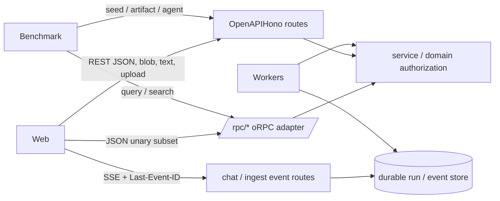
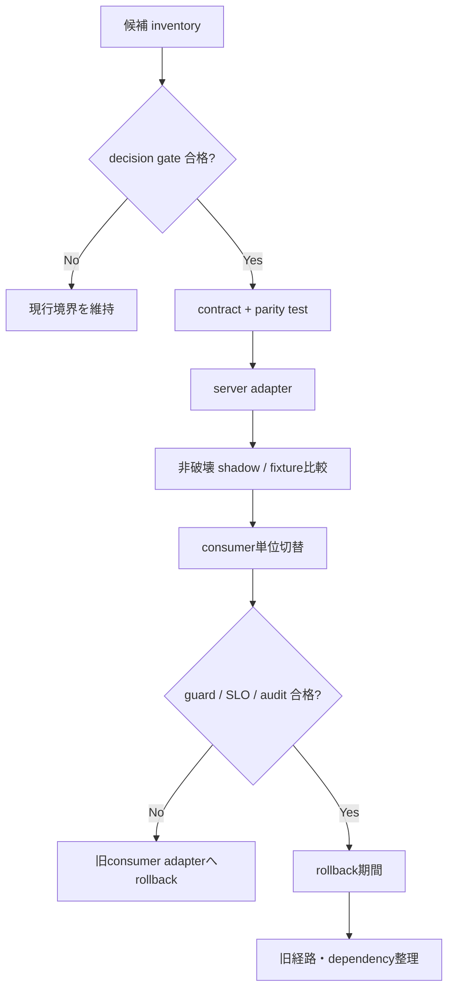

# ADR-0006: API transport は境界別に REST/OpenAPI・oRPC・SSE を併存させる

- ファイル: `docs/2_アーキテクチャ_ARC/21_重要決定_ADR/ARC_ADR_006.md`
- 種別: `ARC_ADR`
- 作成日: 2026-07-16
- 状態: Accepted
- 対象base: `origin/main` (`e12abb07`)
- 関連: Issue #359 Phase 3c、`FR-055`、`TC-003`、`ARC_ADR_005`

## コンテキスト

MemoRAG の API transport は単一方式ではない。base時点で、API providerはOpenAPIHonoによる95 operation、`/rpc/*` のoRPC 5 procedure、chat runとdocument ingest runのSSEを同じapplicationで提供する。Webは19 production moduleから汎用REST helperを参照し、chatのJSON unary 2操作だけoRPC clientを使う。benchmarkはquery/searchをoRPCで呼ぶ一方、文書seed、agent run、artifactなどはREST `fetch` を使う。

この併存は単なる重複ではなく、公開互換、型付き内部client、streaming、binary/text、worker eventに異なる制約がある。一方、どの境界を正規とし、どの条件で移行またはrollbackするかがarchitecture decisionとして固定されていないため、全面oRPC化、oRPC撤去、二重schema拡大のいずれも局所判断で進み得る。

### 事実・推定・衝突・未確定

| 区分 | 内容 | 根拠 |
| --- | --- | --- |
| `confirmed` | 公開HTTP contractのruntime sourceは `GET /openapi.json` であり、generated Markdown freshnessとauthorization/lifecycle metadataをCIで検査する。 | `apps/api/src/app.ts`、`apps/api/src/openapi-runtime-source.test.ts`、`apps/api/src/validate-openapi-docs.ts` |
| `confirmed` | oRPC contractはhealth、chat、chat-runs、benchmark query/searchの5 procedureであり、対応するREST/OpenAPI operationとのdriftだけを検査する。 | `packages/contract/src/router.ts`、`apps/api/src/openapi-contract-drift.ts` |
| `confirmed` | Web REST helperはBearer token、JSON/text/blob、DELETE body、status付き `HttpError` を扱う。chat unaryはoRPC、chat event streamは認証headerと `Last-Event-ID` を付けたSSE `fetch` を使う。 | `apps/web/src/shared/api/http.ts`、`apps/web/src/shared/api/orpc.ts`、`apps/web/src/features/chat/api/chatApi.ts` |
| `confirmed` | APIのRESTと `/rpc/*` はglobal CORS/auth middlewareを通るが、feature permissionとerror表現はroute handlerとoRPC adapterで別にmapする。 | `apps/api/src/app.ts`、`apps/api/src/orpc/router.ts` |
| `confirmed` | chat/document ingestのSSE、presigned upload、blob/text download、worker handlerはJSON unary RPCだけでは表せない独立境界を持つ。 | `apps/api/src/routes/chat-routes.ts`、`apps/api/src/routes/document-routes.ts`、`apps/web/src/features/documents/api/documentsApi.ts`、`infra/scripts/bundle-lambdas.mjs` |
| `confirmed` | benchmark release auditはruntime sourceからdataset固有分岐を検出し、benchmark自身とbenchmark routeを除外する。transport移行でもこの分離を維持する必要がある。 | `benchmark/release-audit.ts`、`benchmark/release-audit.test.ts` |
| `inferred` | oRPCは全公開APIの置換ではなく、schema共有効果が高いchat/benchmark unary経路へ限定導入された。 | contract範囲、Web/benchmark consumer、REST route数の差からの推定 |
| `conflict` | oRPC拡大はcompile-time client型を増やせるが、公開OpenAPI互換、SSE/blob/text、error/auth parity、bundle依存、二重schemaの移行コストを増やす。 | 上記実装境界の比較 |
| `open_question` | oRPC streamingの採用可否、OpenAPIからのclient生成との比較、全面移行の費用対効果、外部consumerの移行期限は未計測である。 | benchmark・bundle・consumer計測が未実施 |

### 現行境界 inventory

| 境界 | 現行transport / contract | 認証・error | testability / 運用 |
| --- | --- | --- | --- |
| 公開JSON REST | OpenAPIHono route + Zod/OpenAPI。base時点95 operation | global auth後にroute permission/resource check。HTTP statusとJSON error | `app.request`、runtime OpenAPI、generated freshness、authorization/lifecycle metadata |
| 選択済みJSON unary | `/rpc/*` + `@memorag-mvp/contract`。5 procedure | global auth後にprocedure permission。`ORPCError` codeへmap | typed Web/benchmark client、REST/oRPC drift test、fetch mock adapter |
| chat / ingest event | `text/event-stream`、runId、event id、`Last-Event-ID` | 接続前HTTP error、接続後error/timeout event | frame parser、reconnect、heartbeat、final/error、stream timeout test |
| binary / text / upload | REST `fetch`、blob/text、presigned URL、raw file body | bearerまたはpresigned boundary。HTTP status/text | fetch mock、content type/header、upload/download contract |
| worker / failure marker | Lambda eventとdurable run/event/artifact contract | invocation roleとservice/resource authorization | entrypoint別unit test、failure marker、runId追跡 |
| benchmark | query/searchはoRPC、seed/artifact/agentはREST | benchmark permissionとpre-fetch authorization | API client mock、release audit、artifact/promotion gate |

## 決定

「境界別併存」を採用する。transportを1種類へ統一せず、次の責任境界を正規とする。

1. **公開HTTP contractはREST/OpenAPIを正規とする。** 既存path、method、status、header、body、authorization/lifecycle metadataはruntime OpenAPIと互換policyで管理する。
2. **oRPCは選択済みJSON unary clientの型付きadapterとして維持する。** 新規procedureは自動追加しない。REST/OpenAPI operationと同じservice、permission、input/output semanticsへmapでき、型共有の便益が移行・bundle・二重schema costを上回る場合だけdecision gateを通す。
3. **SSE、blob/text、presigned upload、raw file bodyはREST/fetch境界に維持する。** oRPCで包むことを目的にprotocol semanticsを変更しない。
4. **worker eventはHTTP transport contractと分離する。** worker entrypointへoRPC server/clientを持ち込まず、runId、durable state/event、failure marker、artifact contractを正規とする。
5. **authとdomain error taxonomyはtransportより内側で共通化し、wire表現はadapterごとに明示mapする。** RESTのHTTP status/JSON error、oRPCのerror code、SSEのpre-stream HTTP error/post-stream eventを同値検証する。UIがtransport固有errorを業務状態として直接解釈しない。
6. **二重公開を増やす場合は一時的なmigration状態として扱う。** REST/oRPC両方を恒久に追加するのではなく、owner、期限、telemetry、rollback、removal gateを持たせる。

### 選択肢

| 選択肢 | 型安全 | streaming / binary | 公開互換・OpenAPI | bundle / 運用 | 判定 |
| --- | --- | --- | --- | --- | --- |
| chat以外REST | oRPC範囲をchatに縮小し、benchmark query/searchをRESTへ戻す | RESTで一貫する | 良好 | dependency縮小余地はあるがbenchmark typed contractを失い、撤去migrationの実益が未計測 | 不採用。撤去を正当化するdataがない |
| oRPC維持（全面拡張を含む） | client型は最大化できる | SSE/blob/text/DELETE body等に別escape hatchが残る | OpenAPIとの二重sourceと互換管理が拡大 | API/Web/benchmark/contract bundleとtest matrixが拡大 | 不採用。全境界を1方式にできず、費用対効果が未確定 |
| 境界別併存 | JSON unary subsetで型安全を得る | protocol固有境界をそのまま保つ | REST/OpenAPIを公開正規に維持 | dependencyを必要entrypointへ限定し、段階移行・rollback可能 | 採用 |

## Migration policy

本ADRは直ちに移行を実装しない。将来の1 operation移行は次の順序で行う。

1. **候補化:** consumer、payload、streaming/binary要件、permission、error、latency、bundle delta、OpenAPI互換をinventory化する。
2. **contract先行:** schema ownershipを1か所に定め、REST/OpenAPIとoRPCのmethod/path/input/output対応testを先に追加する。二重手書きschemaを無期限に許可しない。
3. **server adapter:** 同じserviceとresource authorizationを呼び、transportごとのerror mappingを固定する。route/procedureへbusiness logicを複製しない。
4. **shadow/dual検証:** production dataを二重mutationしない。read-onlyまたはtest fixtureでresponse、permission、error、latencyを比較する。mutationはconsumer単位の切替で二重送信を禁止する。
5. **consumer切替:** feature flagまたはclient adapter単位で切り替え、旧経路をrollback可能な期間だけ保持する。
6. **観測・検証:** auth denial、resource boundary、status/error parity、contract drift、SSE非影響、bundle size、latency、benchmark release auditを確認する。
7. **旧経路整理:** external consumerとrollback期間を確認し、OpenAPI lifecycle metadata、generated docs、test、dependencyを同一PRまたは明示された後続PRで整理する。

### Decision gate

新規oRPC procedureまたはRESTへの戻しは、最低限次を満たす場合だけ実施する。

- request/responseがJSON unaryであり、SSE、streaming body、blob/text、presigned/raw uploadを必要としない。
- REST/OpenAPI公開互換を維持するか、lifecycle metadataとconsumer移行計画を持つ。
- auth、feature/resource permission、tenant、RAG quality/visibility guardが現行と同等である。
- validation/business/permission/not-found/infrastructure errorのwire mappingとUI behaviorをtestできる。
- API main Lambda、Web、benchmark、contractのbundle sizeとcold start影響を計測し、worker entrypointへ不要依存を波及させない。
- typed clientが削減する重複・不整合が、二重schema・adapter・test matrixのcostを上回る根拠がある。
- benchmark経路では `release-audit`、artifact/promotion gate、normal runtimeとの分離を維持する。

### Rollback

- rollback単位はoperation consumerまたはfeature adapterとし、repository全体のtransport一括revertを前提にしない。
- mutationは常に単一transportへ送信し、dual writeしない。切替失敗時は旧adapterへ戻す。
- schema/data migrationをtransport切替へ混在させない。必要な場合は別decisionとrollbackを用意する。
- rollback期間中も旧REST pathのauth、CORS、OpenAPI lifecycle metadata、error contractを維持する。
- SSE/run/worker contractはJSON unaryの切替から独立してrollbackできる状態を保つ。

## Guard と検証

| Guard | 必須検証 |
| --- | --- |
| 公開contract | runtime OpenAPI、generated freshness、lifecycle/authorization metadata、REST/oRPC mapping |
| 認証・認可 | public/protected、JWT、feature permission、resource/tenant境界、debug/benchmark権限のparity |
| error | 400/401/403/404/409/5xx相当、validation details、sanitize、UI状態のparity |
| streaming | SSE event id、`Last-Event-ID`、heartbeat、timeout、final/error、CORS header |
| RAG安全 | grounding/citation/refusal、FR-089の全guard、trace redactionをtransport変更で迂回しない |
| benchmark | query/search identity、pre-fetch authorization、artifact contract、release audit、dataset固有分岐なし |
| bundle | entrypoint別size/cold start、workerへのoRPC依存非波及、Web chunk差分 |
| testability | REST `app.request`、oRPC typed client、fetch mock、SSE parser、contract driftを境界別に保持 |

## 影響

### Positive

- 公開REST/OpenAPI互換を保ちながら、chat/benchmarkのJSON unaryでは既存の型付きclientを維持できる。
- SSE、binary/text、upload、workerを不自然なRPC wrapperへ押し込めない。
- operation単位の移行とrollbackができ、認可・error・bundle差分を小さく検証できる。
- transport統一を目的化せず、schema driftと依存costをdecision gateで管理できる。

### Negative

- REST/OpenAPIとoRPCのadapter・test・error mappingを併存管理する必要がある。
- 選択済み5 procedureではcontractとOpenAPIの対応gateを継続保守する必要がある。
- WebのREST `HttpError`、oRPC error、SSE error eventの表現差は残り、domain error taxonomyの共通化が後続課題となる。
- 「どのtransportを使うか」はpayloadだけで自動決定できず、decision gateの記録が必要になる。

## Scope boundary

本ADRは方針だけを定義し、挙動、公開contract、route、schema、client、UI、worker、bundle、generated docsを変更しない。特に次を変更対象外とする。

- benchmark pathと `benchmark/release-audit.ts`
- `FR-089` guard profile実装・要件、およびCORS/CloudFrontの `TC-003` / `ARC_ADR_005`
- WebのoRPC mock response shim、chat UI、その他production UI
- PR #338 changed paths（chat orchestration、chat UI/API、contract chat schema、`DES_API_001.md`、generated OpenAPI/Web inventory等）
- `docs/generated/` の履歴または一括再生成

## 見直し条件

次のいずれかが発生した場合、本ADRを再評価する。

- oRPCまたはOpenAPI client generationでSSE/binaryを含む一貫したcontract sourceを実証できた。
- bundle/cold start/latency計測でoRPC dependencyが明確な運用問題になった。
- external consumerがREST/OpenAPI互換の廃止を許容し、移行期限とversioning policyが合意された。
- error/auth parityの共通adapterが実装され、二重schema/test costが有意に下がった。
- current 5 procedureのtyped client便益がなくなった、または適用候補がdecision gateを継続的に満たすようになった。

未確定の全面移行時期、oRPC streaming採用、external consumer期限は、この見直し条件を満たすまで `open_question` のままとする。

## 参照

- `apps/api/src/app.ts`
- `apps/api/src/routes/api-routes.ts`
- `apps/api/src/routes/chat-routes.ts`
- `apps/api/src/routes/document-routes.ts`
- `apps/api/src/orpc/router.ts`
- `apps/api/src/openapi-contract-drift.ts`
- `apps/web/src/shared/api/http.ts`
- `apps/web/src/shared/api/orpc.ts`
- `apps/web/src/features/chat/api/chatApi.ts`
- `benchmark/api-client.ts`
- `benchmark/release-audit.ts`
- `packages/contract/src/router.ts`
- `infra/scripts/bundle-lambdas.mjs`
- `docs/3_設計_DES/41_API_API/DES_API_001.md`
- `docs/2_アーキテクチャ_ARC/21_重要決定_ADR/ARC_ADR_005.md`
