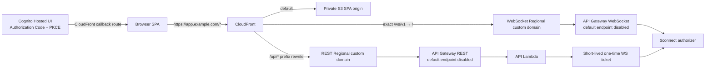

# TC-003 単一入口移行と CORS 設定契約

- ファイル: `docs/3_設計_DES/01_高レベル設計_HLD/DES_HLD_002.md`
- 種別: `DES_HLD`
- 作成日: 2026-07-16
- 状態: Accepted
- 対応要求: `TC-003`
- 対応 ADR: `ARC_ADR_005`

## 対象範囲

本設計は、現在の SPA / REST API / WebSocket の分離入口から、CloudFront same-origin 単一入口へ安全に移行する順序と、移行期間中の CORS 設定契約を定義する。

REST用CloudFront behavior、SPA REST same-origin設定、Hosted UI + PKCE、WebSocket ticket / exact behavior、default endpoint無効化とcustom originは段階2から6でsource/CDKへ実装する。ただし実AWS/browserのREST/101疎通、default endpoint 403、DNS/certificate、security header、観測性の全AC evidenceは未完了であり、本設計更新だけで `TC-003` 全体をVerified扱いにしない。

## 目標構成



- Browser が保持する production origin は CloudFront public origin 1件だけとする。
- SPA は REST を `/api/*`、WebSocket をexact `/ws/v1` の相対 path で呼び出す。
- REST / WebSocket の execute-api origin は Browser 設定へ公開しない。
- CloudFront から origin への転送、API 認証、application authorization は別責務とし、CORS を認証・認可の代替にしない。

## CORS 設定の唯一の正本

### Deployed stack

CDK context `corsAllowedOrigins` を deployed stack の唯一の入力とする。入力は shared contract で検証し、次の3箇所へ同じ exact origin を設定する。

1. API Lambda `CORS_ALLOWED_ORIGINS`
2. API Gateway preflight response
3. API Gateway default 4xx / 5xx GatewayResponse

API Gateway は request の `Origin` を反射せず、検証済み exact origin のみを静的に返す。deployed stack は `dev` / `preview` / `staging` でも exact origin 1件を要求し、wildcard と複数 origin を許可しない。

production の exact 1 origin は CloudFront 単一入口を根拠とし、HTTPSだけを許可する。`deploymentEnvironment=prod` または `production` では unset、blank、wildcard、HTTP、malformed、path/query/credential付き URL、複数 origin、localhost / loopback を synth 前に拒否する。

`corsAllowedOrigins` に `distributionDomainName` token を自動注入しない。後続で CloudFront `/api/*` origin が REST API/Lambda に依存したとき、Lambda environment から distribution への逆依存を作ると CloudFormation dependency cycle になり得るためである。production deploy は custom domain または確定済み CloudFront public origin を context へ明示する。

### Local / test runtime

`NODE_ENV` が production 以外の standalone API は、暗黙 default を持たない。

| 設定 | 結果 |
| --- | --- |
| unset / blank | CORS allow origin なし |
| exact `http(s)` origin 1件 | 許可 |
| exact `http(s)` origin 複数件 | 許可 |
| `*` の単独明示 | local/test用途として許可 |
| `*` と exact origin の混在 | 拒否 |
| malformed origin | 拒否 |

Taskfile の local API は `http://localhost:5173` を明示する。test が暗黙 wildcardを注入して production validation を通過させる構成にはしない。

## 移行順

| 順序 | 実装単位 | 安全条件 | rollback / blocker |
| ---: | --- | --- | --- |
| 1 | CORS fail-closed と shared contract | production exact origin 1件、wildcard 0、API/IaC negative test | 先行変更で実装済み。単独では `TC-003` 全体未達 |
| 2 | CloudFront `api` / `api/*` behavior と prefix rewrite | cache disabled、viewer `Host` 非転送、認証 header 転送、API errorをSPAへrewriteしない | 先行変更で実装済み。direct REST origin はまだ emergency rollback用 |
| 3 | SPA REST 接続先を `/api` 相対baseへ変更 | production bundle/configから execute-api / stage URLを除去し、production overrideもsame-originへfail closed | 本変更。CloudFront API behaviorのCI成功後に切替 |
| 4 | Hosted UI + Authorization Code + PKCE | callbackをCloudFront SPA routeへ限定 | signup方針とは別PR。既存認可を迂回しない |
| 5 | 短命・単回 WebSocket ticketとexact `/ws/v1` behavior | Bearer認証済み発行、60秒TTL、user/tenant/session binding、query credential 0 | ticket検証とconnection保存を同時に導入。実AWS upgradeはpreview gate |
| 6 | default endpoint無効化、custom origin、最終検証 | REST/WS `DisableExecuteApiEndpoint=true`、別Regional domain/root mapping、Route 53 alias、CloudFront origin同時切替 | source/CDK実装済み。実AWSのDNS/certificate/REST/101/default endpoint 403はpreview gate |

順序6までのsource/CDK contractを実装する。実AWS preview gate、security header、失敗メトリクス等の未検証ACを残すため、`TC-003` 全体を完了扱いにしない。

## 段階2 REST behavior 実装契約

CloudFront DistributionはREST API Gatewayを `RestApiOrigin` として持ち、次のordered behaviorをdefault S3 behaviorより先に評価する。

| Viewer path pattern | Prefix rewrite | Origin path | Method / cache | Origin request |
| --- | --- | --- | --- | --- |
| `api` | `/api` → `/` | REST API deployment stage `prod` | all methods / `CachingDisabled` | `AllViewerExceptHostHeader` |
| `api/*` | `/api/...` → `/...` | REST API deployment stage `prod` | all methods / `CachingDisabled` | `AllViewerExceptHostHeader` |

AWS managed `AllViewerExceptHostHeader` はviewerの `Host` をAPI Gatewayへ転送せず、API Gateway origin domainの `Host` を使う。`Authorization`、`Last-Event-ID` を含むviewer header、cookie、全query stringはoriginへ転送する。CloudFront cache keyへ認証情報を入れて応答を共有するのではなく、`CachingDisabled` で認証付きresponseを保存しない。

prefix rewriteはviewer-request CloudFront Functionで行う。`/api` exact behaviorを別に持つのは、`api/*` に一致しないAPI root requestがdefault SPA behaviorへ落ちることを防ぐためである。Functionは `/api` または `/api/` prefixだけを変換し、他URIを変更しない。

### SPA fallback と API error の分離

Distribution-level 403/404 custom error responseは設定しない。これはorigin種別を区別せず、APIの認証・認可失敗やresource not foundを `/index.html`、HTTP 200へ変換するためである。

SPA client route fallbackはdefault S3 behaviorのviewer-request Functionだけに関連付ける。最終path segmentに拡張子がないURIを `/index.html` へrewriteし、`/assets/missing.js` のような拡張子付きstatic assetはrewriteしない。このためmissing static assetはS3 originの403/404を保持し、SPA HTMLを成功responseとして返さない。拡張子なしstatic objectを将来配信する場合は専用behaviorまたは明示除外を追加する。

API behaviorsはAPI prefix Functionだけを持ち、SPA Functionを持たない。したがってAPI Gatewayの401/403/404/5xx status/bodyはCloudFrontでSPA HTMLまたは200へ変換されない。CORS、Cognito authorizer、application permission、resource/tenant境界はこのrouting層とは別責務として維持する。

### 段階2完了時点の境界

- 段階2完了時点ではSPA `config.json` の `apiBaseUrl` はexecute-api stage URLを保持していた。段階3で相対 `/api` へ切り替える。
- `/ws/*` behavior、WebSocket ticket、Hosted UI + PKCE、direct origin制限は後続段階とする。
- CDK assertionはsynthesized policyとrewriteを検証するが、実AWSでの認証、SSE、large payload、error body/statusの疎通を代替しない。段階3をproductionへdeployする前にpreview環境で確認する。

## 段階3 SPA REST runtime config 実装契約

CloudFrontへdeployするSPA `config.json`は次のbrowser runtime設定を持つ。

```json
{
  "apiBaseUrl": "/api",
  "authMode": "cognito"
}
```

`apiBaseUrl`へCloudFront domainまたはexecute-api domainを埋め込まず、browser current originを基準に`/api/...`を呼び出す。deployed config生成はpure helperへ集約し、JSONに`execute-api`、`amazonaws.com/{stage}`、旧API domainが含まれないことをunit assertionする。

### environment別解決順

| Runtime | 解決順 | Fail-safe |
| --- | --- | --- |
| production build | canonical `/api` | VITE/fileのexecute-api、localhost、任意cross-origin absolute、non-string、blank、malformedを採用せず`/api`へ戻す |
| dev / test | valid `VITE_API_BASE_URL` → valid file `apiBaseUrl` → `http://localhost:8787` | invalid値をURLとして組み立てず次候補へ進む |

productionのVITE/file overrideをsame-originへ制限するのは、buildまたはruntime configの誤設定でdirect browser originを再導入しないためである。dev/testのabsolute overrideはローカルAPI・preview検証用途に限定する。

relative baseとrequest pathは共通helperで結合し、base末尾slashとpath先頭slashを1つに正規化する。HTTP、oRPC、chat SSEの全経路が同じhelperを使い、`/api//documents`または`/apidocuments`を生成しない。

### browser外consumerの境界

段階3時点では次のexecute-api URLをbrowser runtime leakではないinternal/operation用として維持した。

- Lambdaの`BENCHMARK_TARGET_API_BASE_URL`
- benchmark state machineからCodeBuildへ渡すinternal `API_BASE_URL`
- CloudFormation `ApiUrl` / `OpenApiUrl` outputs

段階6ではproductionのLambda `BENCHMARK_TARGET_API_BASE_URL`をREST custom domainへ、`ApiUrl` / `OpenApiUrl`をCloudFront `/api/`へ切り替える。non-productionのinternal targetだけはlocal integration/rollback用にdefault endpointを維持する。いずれもSPA `config.json`へ再利用しないことをCDK assertionで固定する。

### 段階3の未実装境界

- `/ws/*` behavior、WebSocket ticket、Hosted UI + PKCE、security response headers、direct execute-api restrictionは後続段階とする。
- 実AWSのCloudFront→API Gateway疎通はunit/CDK testで代替しない。preview環境で認証、SSE、large payload、401/403/404/5xx status/bodyを確認する。

## 段階4 Hosted UI + Authorization Code + PKCE 実装契約

production SPAのprimary signin/logout経路をCognito Hosted UIへ固定する。deployed `config.json`は既存Cognito識別子に加えて次を配布する。

```json
{
  "cognitoHostedUiBaseUrl": "https://<prefix>.auth.<region>.amazoncognito.com",
  "cognitoRedirectUri": "https://<public-origin>/auth/callback",
  "cognitoLogoutUri": "https://<public-origin>/"
}
```

public originはTC-003 CORS single sourceと同じ検証済みexact originから生成する。production callback/logoutにwildcard、localhost、execute-api URL、別origin、追加path/query/hashを許可しない。Hosted UI baseはstackが作成したCognito managed domainと同じregionのHTTPS URLに限定する。

Cognito app clientは次のcontractを持つ。

- `AllowedOAuthFlows = [code]`。implicit grantは無効。
- `AllowedOAuthScopes = openid email profile`。
- `GenerateSecret = false`。browser config、authorization request、token requestへclient secretを配布しない。
- callbackはexact `<public-origin>/auth/callback`、logoutはexact `<public-origin>/`。
- 既存benchmark/API audience互換のためclient IDとpassword/SRP auth flowは段階4では維持する。ただしproduction browserのUI/runtimeはdirect password flowを選択せず、Hosted UI設定不正時はunavailableへfail closedにする。

### Authorization request

SPAはrequestごとにWeb Cryptoでstate 32 byte、nonce 32 byte、code verifier 64 byteを生成する。code challengeは`BASE64URL(SHA-256(verifier))`とし、`code_challenge_method=S256`、`response_type=code`を固定する。plain/no challenge、implicit token response、password、client secretへfallbackしない。

transient recordはstate、nonce、verifier、5分expiryだけを`sessionStorage`へ保存する。新しいrequestは旧recordを置換する。callback処理はrecordを読んだ直後にstorageから削除し、state不一致、期限切れ、provider error、token exchange失敗、JWT検証失敗を含む全結果で再利用を拒否する。

### Callback / token検証

callbackは次の順でfail closedに処理する。

1. transient recordをone-time consumeする。
2. transient expiry、exact callback origin/pathを検証する。
3. `state`が単一かつ保存値と一致することを検証する。duplicate、欠損、不一致を拒否する。
4. provider errorとcodeの矛盾を拒否し、単一authorization codeだけを受理する。
5. `/oauth2/token`へauthorization code、client ID、exact redirect URI、code verifierをform送信する。client secretは送らない。
6. ID tokenをCognito JWKSでRS256署名検証し、issuer、audience=app client ID、`token_use=id`、nonce、expiry、emailを検証する。
7. access tokenも同じissuer/JWKSで署名検証し、`token_use=access`、`client_id` binding、expiryを検証する。
8. 両tokenの短い方のexpiryでsessionを作成し、callback queryをhistoryから除去する。

API requestへID tokenを付ける既存contract、API Gateway/API middlewareのJWT・active status・permission・tenant/resource boundary、RAG safetyは変更しない。browserのgroup claimは表示/不要取得抑制にだけ使い、最終認可は引き続きAPI側で行う。

### UI / environment境界

- productionはHosted UI buttonだけをsignin actionとして表示し、email/password、remember、self sign-up actionを表示しない。
- Hosted UI config欠損・malformed・cross-origin callbackの場合は設定errorを表示し、credentials formへfallbackしない。
- Cognito/Hosted UI browser設定はsame-origin `/config.json`を唯一の入力とし、`VITE_COGNITO_*` build-time overrideを持たない。悪意あるbuild環境値をproduction bundleへ埋め込まない。
- explicit local authとlegacy credential flowはnon-production dev/test境界だけに残す。
- logoutはlocal session/transientをclearしてからHosted UI `/logout`へ移動し、exact logout URIへ戻す。
- FR025 self sign-up、WebSocket ticket、direct execute-api restrictionは本段階の完了条件へ含めない。

### 検証境界

CDK assertionはOAuth flow、scope、secret、callback/logoutのsynthesized contractを検証する。Web unit testはS256 request、state/nonce/expiry、one-time consume、token request、issuer/audience/client binding claim contract、production primary/fail-closed、logout URLを検証する。これらは実AWS Hosted UI、managed login cookie、MFA、redirect、JWKS CORS、logoutを代替しないため、stacked deploy後のpreview browser検証を別gateとして残す。

## 段階5 WebSocket single-entry / ticket 実装契約

### 公開pathとorigin rewrite

browserの公開WebSocket URLはsame-origin `wss://<public-origin>/ws/v1` exact pathとする。CloudFront ordered behaviorは`ws/v1`だけに一致し、`/ws/v1/*`、`/ws/*`、default SPA behaviorへ範囲を広げない。段階5時点ではviewer-request Functionが `/ws/v1` をdefault endpointのstage path `/prod`へrewriteする。段階6ではcustom domain root mappingへ切り替えるためrewrite先を `/` に変更する。URI rewriteは選択済みoriginを変えないというCloudFront Function制約を前提にする。

origin request policyはcookie/query stringを転送せず、次のrequest headerだけを許可する。

- `Sec-WebSocket-Key`
- `Sec-WebSocket-Version`
- `Sec-WebSocket-Protocol`
- `Sec-WebSocket-Extensions`

viewer `Host`は転送せず、段階6ではWebSocket専用API Gateway custom origin domainの`Host`を使用する。cacheは無効、viewer protocolはHTTPS only、handshakeはGET/HTTP/1.1としてCloudFrontからoriginへ中継する。SPA runtime configへdefault/custom origin URLを配布しない。

### Credential transport

CloudFront standard access logはoriginへ転送するか否かに関係なく完全なquery stringを記録する。そのため長期JWTだけでなく短命ticketもquery/path/cookieへ置かない。browserはWebSocket constructorのsubprotocol配列として次の2値だけを提示する。

1. 固定application protocol `memorag.v1`
2. `memorag-ticket.<256-bit base64url>` 形式のopaque ticket protocol

API Gateway `$connect` REQUEST authorizerは`route.request.header.Sec-WebSocket-Protocol`をidentity sourceとする。WebSocket authorizerではHTTP API専用のresult cache設定を使用せず、接続ごとにticketを評価する。`$connect` integrationは両protocolのshapeを再確認し、成功responseの`Sec-WebSocket-Protocol`には固定値`memorag.v1`だけを返す。unsupported/malformed protocol、credential query、integration failureはconnection successへfallbackしない。

### Ticket issuance / consume

`POST /websocket/tickets`は既存public allowlistへ追加せず、ID token、active identity、authoritative tenantを検証した`authenticated` routeとする。発行時はCognito ID tokenの`origin_jti`、`jti`、`iat`、`exp`を必須にし、session/token bindingが欠損または不正なら発行しない。responseは`Cache-Control: no-store`を返し、opaque ticket、固定protocol、expiryだけを含む。

ticket raw valueは256-bit random、TTLは60秒で、session token expiryを超えない。DynamoDB recordにはraw valueを保存せずSHA-256 hashをpartition keyとして、次を保存する。

- non-secret `ticketId` correlation ID
- `issued | consumed | revoked` state
- `userId`、authoritative username、`tenantId`
- Cognito `origin_jti` session ID、`jti` token ID、token issued/expiry
- ticket issued/expiry、DynamoDB TTL

`$connect` authorizerはhash keyを`state = issued AND ticket expiry > now AND token expiry > now`のconditional updateで`consumed`へatomicに遷移する。同じticketの同時利用/replayは最大1接続だけがconsumeに成功する。ticketをconsumeした後のidentity provider障害でもticketをissuedへ戻さず、接続をdenyして新規発行を要求する。

consume後はauthoritative identity providerを再読込し、user/username/tenant一致、active status、application account-revocation registry、administrative-principal transfer fence、Cognito session invalidation epochを検証する。ticket内token issued time以前または同時刻にsession invalidationが進んでいればdenyする。missing、malformed、expired、replayed、revoked、mismatch、provider/store failureは内部情報を返さないgeneric 401/403へfail closedにする。

### Connection lifecycle / logging

`$connect` integrationはauthorizer contextだけから`connectionId`、user/tenant/session/token/ticket correlation、connect time、token expiry/TTLをconnection tableへ保存する。raw ticket、JWT、email、group、業務payloadは保存しない。重複connection IDのputは拒否する。

`$disconnect`はconnection ID exact keyをidempotent deleteする。disconnect eventはbest-effortであるため、token expiry TTLでもstale recordを回収する。disconnect後のreconnectは新しいticketを必要とし、consumed ticketを再利用できない。`$default`は段階5で業務messageを受理せずgeneric 400とし、payload成功へfallbackしない。

Lambdaはraw event/header/query/ticket/JWTを出力せず、allowlistしたrequest ID、connection ID、ticket correlation ID、route、outcome、reason codeだけをJSON logへ出す。API Gateway WebSocket execution logとdata traceは無効化する。access logはrequest ID、event type、route、status、connection IDだけを含め、query/header/authorizer contextを含めない。

Lambda authorizerは`$connect`でのみ実行され、既接続socketへ後続revocationを遡及適用しない。段階5はserver push/業務messageを対象外とし、将来の送信経路は送信直前のauthoritative connection/session再認可を設計・実装するまで追加しない。

### Error / preview gate

自動testはexpiry、concurrent consume、replay、revocation、binding mismatch、provider failure、malformed protocol、query credential、connect/disconnect/default、redacted log、exact behavior/stage rewriteを検証する。ただしCDK assertionはCloudFront/API Gatewayの実upgrade、101 response、subprotocol echo、idle timeout、best-effort disconnectを代替しない。stacked deploy後のpreviewで次を確認する。

1. same-origin `/ws/v1`が101を返し、selected protocolが`memorag.v1`になる。
2. expired/replayed/revoked ticketが401/403となり、secretがCloudFront/API Gateway/Lambda logへ出ない。
3. network disconnect/idle timeout後に旧ticketでreconnectできず、新ticketでのみ接続できる。
4. malformed upgrade、unsupported protocol、integration errorがconnection successへfallbackしない。

段階5時点ではAPI Gateway WebSocket execute-api endpointを段階6までrollback境界として残した。段階6はcustom domain/DNS/mapping/CloudFront originと同時にdefault endpointを閉じ、片側だけを無効化した状態を作らない。

## 段階6 default endpoint 無効化 / custom origin 契約

### Production configuration

`deploymentEnvironment=prod` または `production` は次のCDK contextをすべて必須とする。

| Context | 契約 |
| --- | --- |
| `restApiOriginDomainName` | lowercase FQDN。hosted zone配下のREST専用subdomain |
| `webSocketApiOriginDomainName` | lowercase FQDN。RESTとは異なるWebSocket専用subdomain |
| `apiGatewayOriginCertificateArn` | stackと同じregionのACM certificate ARN。両domainをcoverすることはdeploy前提 |
| `apiGatewayOriginHostedZoneId` | alias recordを作成するRoute 53 hosted zone ID |
| `apiGatewayOriginHostedZoneName` | 両domainが属するlowercase public hosted zone名 |

unset、blank、uppercase/trailing dot、malformed/execute-api domain、同一REST/WS domain、zone外domain、不正hosted zone ID、別region/malformed certificate ARNはsynth前に拒否する。WebSocket custom domainはREST/HTTP APIと共有できないAWS制約に従い、必ず別domainとする。

### Atomic topology change

- REST `AWS::ApiGateway::RestApi.DisableExecuteApiEndpoint=true` とWebSocket `AWS::ApiGatewayV2::Api.DisableExecuteApiEndpoint=true`を同じproduction templateに置く。
- REST Regional custom domainはdeployment stage `prod`をroot base-path mappingする。
- WebSocket Regional custom domainはstage `prod`をroot API mappingする。
- Route 53 A aliasは各custom domainを対応するAPI Gateway regional domain/hosted zoneへ向ける。
- CloudFront `api` / `api/*` originはREST custom domain、exact `ws/v1` originはWebSocket custom domainへ切り替える。
- REST prefix rewriteは `/api` → `/`、`/api/...` → `/...`を維持する。WebSocket rewriteは `/ws/v1` → `/`とする。
- production templateからCDKのdefault REST endpoint outputを除去し、`ApiUrl` / `OpenApiUrl`はCloudFront `/api/`だけを返す。
- Lambda benchmark targetはREST custom domainを使う。CloudFront domainをLambda environmentへ参照させず、Distribution→REST→Lambda→Distributionのdependency cycleを作らない。

non-productionはcustom origin inputsを要求せず、default endpointと既存originをrollback/local integration境界として維持する。productionの一部入力欠落時にnon-productionへsilent fallbackしない。

### Security / preview boundary

default endpoint無効化は `execute-api` bypassを403へするが、Regional custom domainをCloudFrontだけが到達可能なprivate originへ変えるものではない。origin cloakingを追加する場合はWAF/custom header等の対応可否、secret lifecycle、WebSocket対応を別のthreat analysisで確定する。

CDK assertionとsnapshotはdisable flag、domain/mapping、Route 53 alias、CloudFront origin、output、negative contextを検証する。実AWSでは次をpreview gateとして実施し、自動testで代替しない。

1. REST/WS default execute-api endpointが403となる。
2. Route 53 aliasとcertificate validation後、CloudFront `/api`が既存status/bodyを保持する。
3. CloudFront `/ws/v1`が101と`memorag.v1` protocol echoを返す。
4. custom domain direct到達性と追加origin cloaking要否を脅威モデルに照らして記録する。

## 責務分担

| コンポーネント | 責務 | 非責務 |
| --- | --- | --- |
| shared CORS contract | origin syntax、environment rule、件数、wildcard、loopbackを検証 | 認証・認可、runtime response生成 |
| CDK | CORS single source、CloudFront REST/exact WebSocket behavior、default endpoint無効化、custom domain/mapping/DNS、SPA fallback分離、deployed SPA `/api` configを構成 | request Originの反射、application permission判定 |
| API middleware | 許可済みoriginへだけCORS headerを付与 | CORSによるJWT/permission代替 |
| API auth / authorization | JWT、active status、feature/resource/tenant境界を維持 | Browser originを本人性の根拠にすること |
| CloudFront | SPA/REST/WebSocketのsame-origin path routing、WS upgrade/subprotocol headerの最小転送 | application permission判定、secret queryの安全な保存 |
| WebSocket ticket API/store | 60秒、single-use、hash-at-rest、user/tenant/session binding | 長期JWTのquery露出、既接続socketの継続認可 |
| `$connect` authorizer/integration | atomic consume、authoritative再認可、connection binding、protocol echo | 業務message、server push |

## Security invariant

- Public endpoint は既存 `/health` と `/openapi.json` の allowlistから増やさない。
- OPTIONS bypass は preflight に限定し、protected routeの認証を迂回させない。
- route-level permission、resource ownership、tenant boundary、RAG grounding/citation/security guardを変更しない。
- CORS拒否はBrowserのcross-origin読取制御であり、APIの401/403、JWT、permission、ownershipを代替しない。
- API Gateway default error responseは内部origin、token、権限外resource名を返さない。
- WebSocket secretはquery/path/cookie/log/persistent recordへ平文で置かない。
- `$connect`のidentity/provider/store failureは接続許可へfallbackしない。
- server pushは送信直前のauthoritative再認可なしに追加しない。

## 検証対応

| 設計項目 | 自動検証 |
| --- | --- |
| shared syntax/environment contract | `packages/contract/src/cors.test.ts` |
| API startup fail-closed | `apps/api/src/contract/api-hardening.test.ts` |
| public/preflight/auth boundary | `apps/api/src/security/access-control-policy.test.ts` |
| CDK synth-time fail-closed / single source | `infra/test/memorag-mvp-stack.test.ts` |
| generated IaC state | CDK snapshot、`docs/generated/infra-*` freshness check |
| CloudFront REST behavior / prefix / cache / forwarding | `infra/test/memorag-mvp-stack.test.ts` のbehavior・managed policy・Function assertion |
| API error / SPA fallback分離 | global custom error不存在、default/API Function分離、missing asset保持のnegative assertion |
| deployed SPA config非漏洩 / public・internal consumer分離 | `infra/test/memorag-mvp-stack.test.ts` のconfig helper、CloudFront output、production REST custom-domain target、execute-api非包含assertion |
| production fail-closed / dev override / URL join | `apps/web/src/shared/api/runtimeConfig.test.ts` とWeb API tests |
| Hosted UI OAuth client / exact redirect / secretなし | `infra/test/memorag-mvp-stack.test.ts` |
| PKCE S256 / callback / one-time transient / JWT claim contract | `apps/web/src/features/auth/api/hostedUiAuth.test.ts` とLoginPage tests |
| WS ticket entropy/TTL/binding/concurrent consume/replay/revocation | `apps/api/src/websocket-ticket-service.test.ts`、`apps/api/src/websocket-authorizer.test.ts` |
| WS connect/disconnect/default/redaction | `apps/api/src/websocket-connection-handler.test.ts` |
| exact `/ws/v1`、stage rewrite、header allowlist、query/cookie none、access log | `infra/test/memorag-mvp-stack.test.ts` |
| WS実upgrade/subprotocol/idle reconnect | preview browser/E2E gate（unit/CDKでは代替しない） |
| production default endpoint/custom origin fail-closed | `infra/test/memorag-mvp-stack.test.ts` のdisable flag、distinct domain/mapping/DNS/CloudFront/output/negative context assertion |
| default endpoint 403 / custom domain REST・101 | preview AWS/browser gate（unit/CDKでは代替しない） |

## 関連文書

- `docs/1_要求_REQ/11_製品要求_PRODUCT/11_非機能要求_NON_FUNCTIONAL/01_技術制約_TECHNICAL_CONSTRAINT/REQ_TECHNICAL_CONSTRAINT_003.md`
- `docs/2_アーキテクチャ_ARC/21_重要決定_ADR/ARC_ADR_005.md`
- `docs/3_設計_DES/41_API_API/DES_API_001.md`
- `tasks/todo/20260522-2120-cloudfront-single-entry-implementation.md`
