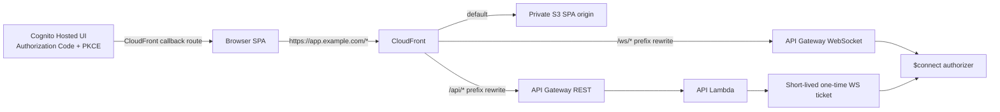

# TC-003 単一入口移行と CORS 設定契約

- ファイル: `docs/3_設計_DES/01_高レベル設計_HLD/DES_HLD_002.md`
- 種別: `DES_HLD`
- 作成日: 2026-07-16
- 状態: Accepted
- 対応要求: `TC-003`
- 対応 ADR: `ARC_ADR_005`

## 対象範囲

本設計は、現在の SPA / REST API / WebSocket の分離入口から、CloudFront same-origin 単一入口へ安全に移行する順序と、移行期間中の CORS 設定契約を定義する。

本設計だけでは `TC-003` 全体を実装済みにしない。CloudFront behavior、Hosted UI + PKCE、WebSocket ticket、SPA direct origin 除去、signup は個別の後続実装で検証する。

## 目標構成

- Browser が保持する production origin は CloudFront public origin 1件だけとする。
- SPA は REST を `/api/*`、WebSocket を `/ws/*` の相対 path で呼び出す。
- REST / WebSocket の execute-api origin は Browser 設定へ公開しない。
- CloudFront から origin への転送、API 認証、application authorization は別責務とし、CORS を認証・認可の代替にしない。

## CORS 設定の唯一の正本

### Deployed stack

CDK context `corsAllowedOrigins` を deployed stack の唯一の入力とする。入力は shared contract で検証し、次の3箇所へ同じ exact origin を設定する。

1. API Lambda `CORS_ALLOWED_ORIGINS`
2. API Gateway preflight response
3. API Gateway default 4xx / 5xx GatewayResponse

API Gateway は request の `Origin` を反射せず、検証済み exact origin のみを静的に返す。deployed stack は `dev` / `preview` / `staging` でも exact origin 1件を要求し、wildcard と複数 origin を許可しない。

production の exact 1 origin は CloudFront 単一入口を根拠とし、HTTPSだけを許可する。`deploymentEnvironment=prod` または `production` では unset、blank、wildcard、HTTP、malformed、path/query/credential付き URL、複数 origin、localhost / loopback を synth 前に拒否する。

`corsAllowedOrigins` に `distributionDomainName` token を自動注入しない。後続で CloudFront `/api/*` origin が REST API/Lambda に依存したとき、Lambda environment から distribution への逆依存を作ると CloudFormation dependency cycle になり得るためである。production deploy は custom domain または確定済み CloudFront public origin を context へ明示する。

### Local / test runtime

`NODE_ENV` が production 以外の standalone API は、暗黙 default を持たない。

| 設定 | 結果 |
| --- | --- |
| unset / blank | CORS allow origin なし |
| exact `http(s)` origin 1件 | 許可 |
| exact `http(s)` origin 複数件 | 許可 |
| `*` の単独明示 | local/test用途として許可 |
| `*` と exact origin の混在 | 拒否 |
| malformed origin | 拒否 |

Taskfile の local API は `http://localhost:5173` を明示する。test が暗黙 wildcardを注入して production validation を通過させる構成にはしない。

## 移行順

| 順序 | 実装単位 | 安全条件 | rollback / blocker |
| ---: | --- | --- | --- |
| 1 | CORS fail-closed と shared contract | production exact origin 1件、wildcard 0、API/IaC negative test | 本変更。CloudFront behavior 未実装のため `TC-003` 全体は未達のまま |
| 2 | CloudFront `/api/*` behavior と prefix rewrite | cache disabled、viewer `Host` 非転送、認証 header 転送 | direct REST origin はまだ emergency rollback用。SPA切替前に到達性を検証 |
| 3 | SPA REST 接続先を `/api/*` 相対 pathへ変更 | production bundleから execute-api / stage URLを除去 | CloudFront API behavior成功後のみ切替 |
| 4 | Hosted UI + Authorization Code + PKCE | callbackをCloudFront SPA routeへ限定 | signup方針とは別PR。既存認可を迂回しない |
| 5 | 短命・単回 WebSocket ticketと `/ws/*` behavior | Bearer認証済み発行、TTL 30–120秒、tenant/user binding | ticket検証とconnection保存を同時に導入 |
| 6 | direct origin制限と最終検証 | SPA設定からdirect origin 0、CORS wildcard 0、401/403/5xx/WS失敗を観測 | 全経路確認後にのみ緊急direct経路を閉じる |

順序2以降は後続 PR であり、本設計更新と順序1の実装だけで完了扱いにしない。

## 責務分担

| コンポーネント | 責務 | 非責務 |
| --- | --- | --- |
| shared CORS contract | origin syntax、environment rule、件数、wildcard、loopbackを検証 | 認証・認可、runtime response生成 |
| CDK | single sourceを検証しLambda/API Gatewayへ配布 | request Originの反射、CloudFront API behaviorの先行実装 |
| API middleware | 許可済みoriginへだけCORS headerを付与 | CORSによるJWT/permission代替 |
| API auth / authorization | JWT、active status、feature/resource/tenant境界を維持 | Browser originを本人性の根拠にすること |
| CloudFront（後続） | SPA/REST/WSの単一入口、path routing、security headers | application permission判定 |
| WebSocket ticket（後続） | 短命・単回・user/tenant binding | 長期JWTのquery露出 |

## Security invariant

- Public endpoint は既存 `/health` と `/openapi.json` の allowlistから増やさない。
- OPTIONS bypass は preflight に限定し、protected routeの認証を迂回させない。
- route-level permission、resource ownership、tenant boundary、RAG grounding/citation/security guardを変更しない。
- CORS拒否はBrowserのcross-origin読取制御であり、APIの401/403、JWT、permission、ownershipを代替しない。
- API Gateway default error responseは内部origin、token、権限外resource名を返さない。

## 検証対応

| 設計項目 | 自動検証 |
| --- | --- |
| shared syntax/environment contract | `packages/contract/src/cors.test.ts` |
| API startup fail-closed | `apps/api/src/contract/api-hardening.test.ts` |
| public/preflight/auth boundary | `apps/api/src/security/access-control-policy.test.ts` |
| CDK synth-time fail-closed / single source | `infra/test/memorag-mvp-stack.test.ts` |
| generated IaC state | CDK snapshot、`docs/generated/infra-*` freshness check |
| 後続 CloudFront / PKCE / WS / SPA | 後続 PR の assertion、integration、browser/E2E、実環境確認 |

## 関連文書

- `docs/1_要求_REQ/11_製品要求_PRODUCT/11_非機能要求_NON_FUNCTIONAL/01_技術制約_TECHNICAL_CONSTRAINT/REQ_TECHNICAL_CONSTRAINT_003.md`
- `docs/2_アーキテクチャ_ARC/21_重要決定_ADR/ARC_ADR_005.md`
- `docs/3_設計_DES/41_API_API/DES_API_001.md`
- `tasks/todo/20260522-2120-cloudfront-single-entry-implementation.md`
