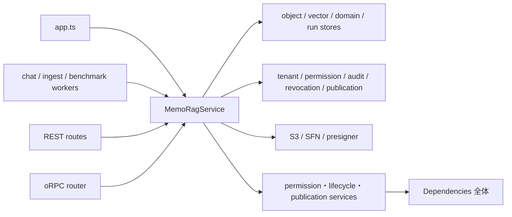

# MemoRagService facade contract と依存分割境界

- ファイル: `docs/3_設計_DES/11_詳細設計_DLD/DES_DLD_012.md`
- 種別: `DES_DLD`
- 作成日: 2026-07-17
- 状態: Draft
- 基準: `origin/main` (`8a427a24`)
- 関連: Issue #359 Phase 4a

## 何を書く場所か

`MemoRagService` を同名 facade のまま段階分割するため、current main の公開 TypeScript contract、consumer、composition root、private/store/AWS/policy 依存と既存 characterization test を固定する。ここでは実装挙動を変更せず、Phase 4b 以降が変更してよい境界と、変更時に明示レビューが必要な contract を定義する。

## 対象と非対象

### 対象

- `apps/api/src/rag/memorag-service.ts`
- route / worker / oRPC の facade consumer
- `MemoRagService` の constructor site
- `Dependencies`、直接 AWS SDK、認可・tenant・audit・compensation policy 依存
- tenant / permission / idempotency / audit / compensation / artifact / error status の既存 test

### 非対象

- facade の公開メソッド名、引数、返却型、error status の変更
- HTTP / oRPC contract、認可、tenant partition、永続化 key/schema の変更
- サブサービス抽出そのもの
- generated docs の再生成

## ベースライン

| 項目 | current main |
|---|---:|
| `memorag-service.ts` | 6,358 行 |
| `memorag-service.test.ts` | 3,840 行 |
| 公開 method | 101 |
| `Dependencies` key | 31 |
| production constructor site | 6 |
| test constructor expression | 52 |
| 明示的な `Pick<MemoRagService, ...>` production consumer | 1 |

公開 method 名と compiler が解決した signature の正本は `apps/api/src/rag/__snapshots__/memorag-service-public-contract.snapshot.json` とする。`memorag-service-contract.test.ts` は `keyof MemoRagService` の method union が snapshot の method 名と完全一致することに加え、TypeScript checker が解決した引数・optionality・返却型を snapshot と比較する。

## 現行 dependency graph

現状は route の `ApiRouteContext.service` と oRPC の `OrpcContext.service` が facade 全体を型依存として持つ。明示的に narrow な production consumer は `benchmark-run-authorization-worker.ts` の `Pick<MemoRagService, "reauthorizeBenchmarkRunExecution">` だけである。Phase 4b 以降は route module または抽出 domain 単位で `Pick` / port を定義し、必要な method だけを受け取る。

## Consumer inventory

| consumer | facade method |
|---|---|
| `chat-run-worker.ts` | `executeChatRun` |
| `chat-run-mark-failed.ts` | `markChatRunFailed` |
| `document-ingest-run-worker.ts` | `executeDocumentIngestRun` |
| `document-ingest-run-mark-failed.ts` | `markDocumentIngestRunFailed` |
| `benchmark-run-authorization-worker.ts` | `reauthorizeBenchmarkRunExecution` |
| `orpc/router.ts` | `chat`, `search`, `startChatRun` |
| `admin-routes.ts` | user/role/audit/alias/usage/cost/export の 22 method |
| `benchmark-routes.ts` | query/search/suite/run/artifact/log の 9 method |
| `benchmark-seed.ts` | `assertDocumentWritable`, `getBenchmarkDocumentManifest`, `getDocumentManifest` |
| `chat-routes.ts` | `chat`, `startChatRun`, `search`, `listChatToolInvocations` |
| `conversation-history-routes.ts` | save/list/delete の 3 method |
| `debug-routes.ts` | list/get/replay/download の 4 method |
| `document-routes.ts` | ingest/document/folder/share/governance/reindex の 27 method |
| `favorite-routes.ts` | save/list/delete の 3 method |
| `question-routes.ts` | create/list/get/answer/resolve/improvement の 7 method |
| `resource-group-routes.ts` | membership get/replace の 2 method |

`memorag-service-contract.test.ts` は上表を source から抽出し、method の追加・削除・consumer 移動を差分として検出する。表にない public method は worker内部、test、または将来 consumer 用であり、「未使用だから削除可能」とは判断しない。

## Constructor inventory

production の constructor site は次の 6 箇所である。

- `apps/api/src/app.ts`
- `apps/api/src/benchmark-run-authorization-worker.ts`
- `apps/api/src/chat-run-worker.ts`
- `apps/api/src/chat-run-mark-failed.ts`
- `apps/api/src/document-ingest-run-worker.ts`
- `apps/api/src/document-ingest-run-mark-failed.ts`

test は 11 ファイル、52 expression で直接 facade を生成する。特に `chat-orchestration/graph.test.ts` の 35 箇所と `search/hybrid-search.test.ts` の 6 箇所は、抽出後も facade contract を通す integration characterization として維持する。constructor site のファイル別件数は contract test に固定し、composition root の増加を無審査で許可しない。

## Private / store / AWS / policy dependency

### Private field と port 群

facade が broad dependency を保持する private field は `constructor(private readonly deps: Dependencies)` の 1 つである。抽出済み domain service は別の private field として保持する。`Dependencies` 31 key は次の群に分かれる。

| 群 | dependency |
|---|---|
| object/vector/model | `objectStore`, `benchmarkArtifactStore`, `memoryVectorStore`, `evidenceVectorStore`, `textModel` |
| usage | `usageEventStore`, `usageAccountingMode`, `usagePricingCatalog` |
| user resource | `questionStore`, `conversationHistoryStore`, `favoriteStore` |
| execution run | `benchmarkRunStore`, `chatRunStore`, `chatRunEventStore`, `documentIngestRunStore`, `documentIngestRunEventStore` |
| document/group policy store | `documentGroupStore`, `folderPolicyStore`, `userGroupStore`, `groupMembershipStore` |
| external gateway | `codeBuildLogReader`, `asyncAgentProviders`, `userDirectory`, `verifiedIdentityProvider` |
| security/audit | `accountRevocationRegistry`, `administrativePrincipalTransferFence`, `resourceUserPrincipalDirectory`, `securityAuditOutbox`, `securityAuditReconciliationOutbox` |
| local/migration seam | `localTestIngestAdmissionContext`, `legacyGlobalDocumentArtifacts` |

Phase 4j 後の service source から `this.deps.<key>` として直接読まれる key は 23。`questionStore` は `QuestionService`、`asyncAgentProviders` は `AgentProviderCatalogService`、`codeBuildLogReader` は `BenchmarkRunQueryService`、`benchmarkArtifactStore` は `BenchmarkArtifactRevocationCleanupDriverFactory` の narrow port として constructor で渡され、facade 内では直接読まない。`benchmarkRunStore` は query / cancellation / artifact download / reauthorization / cleanup driver factory へ渡す一方、create orchestration では facade が直接読むため direct read key に残る。facade 内の `this.deps.benchmarkRunStore` occurrence は Phase 4i の4から3へ減る。残る `folderPolicyStore`、`administrativePrincipalTransferFence`、`securityAuditReconciliationOutbox`、`legacyGlobalDocumentArtifacts` は `Dependencies` 全体を受け取る helper/service 側で間接利用される。この区別は「直接参照がないので削除可能」という誤判定を避けるために必要である。

### 直接 AWS 依存

facade は port 経由だけではなく、次の AWS module を直接 import する。

- `@aws-sdk/client-s3`: async agent / artifact object の取得・保存
- `@aws-sdk/s3-request-presigner`: debug / benchmark / admin artifact download URL
- `@aws-sdk/client-sfn`: chat / ingest execution start（benchmark cancellation の stop mapping は `benchmark-execution-stopper.ts`、benchmark start mapping は `benchmark-execution-starter.ts` へ移管）

Phase 4b 以降では domain-specific gateway に隠蔽する候補だが、command、status、key、URL expiry の挙動を変えずに別 PR で抽出する。

### 主要 policy 依存

source-backed inventory は次を policy dependency として扱う。

- authorization: role permission、current worker authorization、resource operation authorization
- tenant: `tenantPartitionId`, `tenantStorageKey`, tenant artifact helper
- document/folder: permission service、lifecycle coordinator
- audit/revocation: security audit outbox、account revocation、cleanup coordinator/repair outbox
- publication: staged publication、reindex compensation repair、source governance approval
- RAG: runtime policy、quality policy、trace sanitizer、derived-record security

contract test は 24 の policy import path と 3 の AWS import path を固定する。単なる file move でも boundary の更新として snapshot と本書を同時に見直す。

## `Dependencies` 全体を渡している既存境界

既存 code には `Dependencies` 全体を受け取る constructor が残る。

| receiver | 現行 site 数 |
|---|---:|
| `StagedPublicationCoordinator` | 8 |
| `DocumentPermissionService` | 7 |
| `FolderPermissionService` | 7 |
| `AdministrativePrincipalTransferService` | 4 |
| `DocumentLifecycleMutationCoordinator` | 2 |
| `FolderLifecycleMutationCoordinator` | 1 |

さらに manifest/vector/search helper へ `this.deps` を渡す function call が 13 種類ある。Phase 4a の test はこの既存集合と件数を上限として固定する。後続抽出では減少を許可するが、新しい subservice へ `Dependencies` 全体を渡す追加は禁止する。各 constructor は実際に使う store / gateway / authorizer の narrow port だけを受け取る。

## Characterization matrix

| 保持する性質 | current main の主な根拠 |
|---|---|
| tenant partition / non-enumeration | `rag/tenant-artifact-partition.test.ts`; `routes/benchmark-tenant-boundary.test.ts`; `memorag-service.test.ts` の managed-user tenant partition |
| permission / current identity | `memorag-service.test.ts` の document group full permission・current worker boundary; `security/account-lifecycle-current-identity.test.ts` |
| idempotency / replay | stable run の ingest usage 1回記録; document ingest replay evidence; alias optimistic concurrency |
| audit | document share common security audit; alias audit; admin export success/failure audit; account lifecycle denied/failed audit |
| compensation / reconciliation | FR-066 ingest cleanup; FR-090 reindex/chat/ingest/async-agent; benchmark artifact cleanup intent |
| artifact key / redaction | tenant artifact partition; debug/benchmark attachment metadata; async-agent sanitized artifact; trace sanitizer |
| error status | provider failed/timeout/not-configured; permission revoked; worker failure/cancel/rejected; cross-tenant non-enumeration |
| RAG trust | `chat-orchestration/graph.test.ts` と既存 API suite。Phase 4a は retrieval/refusal/citation code を変更しない |

Phase 4b 以降は対象 domain の unit test を新 service へ追加した後、上記 facade/integration characterization も同時に通す。二重実行期間を設け、facade 側 test を先に削除しない。

## Narrow port 候補と抽出順

| 候補 domain | 最小 port 候補 | 先に固定する追加観点 |
|---|---|---|
| favorites / history | `FavoriteStore`, `ConversationHistoryStore`, visibility resolver | owner/tenant、inaccessible target、sort |
| human question | `QuestionStore`, default assignee group, display-name resolver | requester/assignee、diagnostics sanitation、answer/resolve lifecycle |
| benchmark | `BenchmarkRunStore`, artifact store, log reader, execution/auth gateway | non-enumeration、artifact prefix、revocation cleanup |
| async agent | run artifact store, provider registry, selection authorizer | owner、secret redaction、writeback permission |
| document group/governance | group/policy/membership stores、principal directory、audit/cleanup ports | inherited permission、version、audit、revocation |
| ingest/reindex/publication | object/vector/model ports、publication ledger、worker authorizer | idempotency、fence、compensation、current authorization |
| chat/debug | run/event store、RAG orchestrator、trace/artifact ports | refusal/citation、final event、trace redaction |
| admin/account | user directory、identity/revocation/fence、audit/usage ports | deny-first、tenant ledger、compensation |

最初の抽出候補は store-centric で AWS client と cross-domain policy が少ない favorites/history とする。benchmark は既に worker `Pick` があるが、artifact/auth/revocation が結合しているため characterization を揃えてから抽出する。

## Phase 4b: favorite domain の抽出境界

Issue #359 Phase 4b では、上記最初の候補から conversation history 公開メソッドを除外し、favorite の save / list / delete と visibility projection だけを `FavoriteService` へ抽出する。conversation history は open PR #387 に公開 contract 差分があるため、同じ変更単位に含めない。

`FavoriteService` が受け取る port は次に限定する。

| port | 用途 |
|---|---|
| `FavoriteStore` の save / list / delete | owner partition 内の favorite 永続化 |
| `ConversationHistoryStore` の list | chat session target の owner visibility 解決 |
| owner key resolver | authoritative tenant と user から既存 storage partition key を生成 |
| accessible document query | 既存 `listDocuments` の認可済み結果から target と表示名を解決 |
| accessible folder query | 既存 `listDocumentGroups` の認可済み結果から target と canonical path / 表示名を解決 |

subservice へ `Dependencies` 全体、AWS client、RAG policy は渡さない。document / folder query は新しい認可経路を作らず、facade の既存認可済み list method を callback port として注入する。これは domain 間依存を完全に除去する最終形ではなく、公開挙動を変えずに composition と domain 実装を分離する互換 seam である。

保持する contract:

- `MemoRagService` の `saveFavorite` / `listFavorites` / `deleteFavorite` の method 名、引数、返却型を変更しない。
- favorite / conversation history store へ同じ tenant-partitioned owner key を渡す。
- save 時に resolver 未実装 target を永続化前に拒否する。
- chat session は owner history、document / folder は current accessible list に存在する場合だけ `accessible: true` にする。
- inaccessible target は label / note を開示せず、安全な固定ラベルと最小識別情報だけを返す。
- `ownerUserId` / `targetKey` は response projection から除外する。
- list の store read、document visibility、folder visibility の評価順序を従来どおり維持する。

`favorite-service.test.ts` は narrow-port source guard と上記 projection 境界を domain unit test として固定する。既存 facade test、route permission、tenant partition test、Phase 4a public signature snapshot は二重実行期間として残す。conversation history の抽出、専用 document/folder query service への置換、既存巨大 facade test section の削除は後続 PR で判断する。

## Phase 4c: human question domain の抽出境界

Issue #359 Phase 4c では、human question の作成、担当者/依頼者/admin 一覧、取得、回答、解決を `QuestionService` へ抽出する。question route にある requester/assignee/admin authorization、requester response redaction、HTTP status mapping は route layer の責務として維持し、subservice は認可済み caller から呼ばれる前提を変えない。

`QuestionService` が受け取る port / value は次に限定する。

| port / value | 用途 |
|---|---|
| `QuestionStore` の create/list/get/answer/resolve | question lifecycle の既存永続化 |
| default assignee group ID | explicit assignee がない create の既定担当 queue |
| user display-name resolver | requester / responder name の email → user ID → `未設定` fallback |

subservice へ `Dependencies` 全体、global config object、AWS client、RAG/usage policy は渡さない。default assignee group は facade composition 時に原始値として渡し、domain は global config を直接 import しない。support diagnostics は `support_sanitized` tier へ固定し、許可済み cause/action、trim/deduplicate、最大件数を従来どおり適用する。

保持する contract:

- `MemoRagService` の question 7 public method の名前、引数、返却型を変更しない。
- create 時の requester user ID、trim 済み requester name/department、default/explicit assignee 選択を維持する。
- `messageId` / `ragRunId` 等を変更せず store へ渡し、store の idempotent create 契約を維持する。
- diagnostics は raw prompt/chunk text を追加せず、既存 sanitized field だけを正規化する。
- answer 時の explicit responder name と user display-name fallback を維持する。
- assigned/requested/admin list、get、answer、resolve は同じ store method と引数へ委譲する。
- route の requester/assignee/admin permission、non-enumeration、requester response redaction は変更しない。

`question-service.test.ts` は narrow-port source guard、requester/default assignment/diagnostics canonicalization、idempotency key forwarding、read boundary、answer/resolve、display-name fallback を domain unit test として固定する。既存 question route test、facade test、Phase 4a public signature snapshot は二重実行期間として残す。route authorization の再配置、alias search-improvement lifecycle、conversation history は後続の独立判断とする。

## Phase 4d: async agent provider catalog の抽出境界

Issue #359 Phase 4d では、async agent provider の一覧、管理設定 projection、作成時の provider definition 検索、実行時の adapter 解決を `AgentProviderCatalogService` へ抽出する。run store、selection authorization、artifact persistence、secret redaction、writeback、実行結果の status/compensation は facade の責務として維持し、provider lifecycle 全体を同じ変更単位へ含めない。

`AgentProviderCatalogService` が受け取る port は次に限定する。

| port | 用途 |
|---|---|
| optional provider registry の `list` | runtime provider 一覧、設定 projection、作成時の provider availability 解決 |
| optional provider registry の `get` | 実行時の provider adapter 解決 |

subservice へ `Dependencies` 全体、global config object、AWS client、run/artifact store、authorization policy は渡さない。registry が構成されていない場合も架空 provider や demo fallback を返さず、一覧は空、definition / adapter lookup は `undefined` とする。

保持する contract:

- `MemoRagService` の `listAgentRuntimeProviders` / `listAgentProviderSettings` の method 名、引数、返却型を変更しない。
- runtime provider の registry 順序、display name、availability、reason、configured model ID を変更しない。
- credential mode は `disabled` を `disabled`、`not_configured` を `not_configured`、その他を従来どおり `environment` へ投影する。
- create は registry の `list().find(...)` と同じ definition lookup を使い、未登録時を `provider_unavailable` とする既存 status 判定を維持する。
- execute は registry の `get(...)` と同じ adapter lookup を使い、adapter definition の availability に基づく既存 blocked / failure reason 判定を維持する。
- provider adapter の `execute`、artifact sanitizer/persistence、permission revoked、writeback、run compensation は facade に残す。

`provider-catalog-service.test.ts` は narrow-port source guard、optional registry、provider 順序と全 availability の setting projection、definition / adapter lookup を固定する。既存 async-agent facade/route test、Phase 4a public signature snapshot は二重実行期間として残す。run lifecycle、provider command 実行、artifact ownership/permission の抽出は後続の独立判断とする。

## Phase 4e: benchmark run query の抽出境界

Issue #359 Phase 4e では、benchmark run の一覧、単件取得、CodeBuild log text projection を `BenchmarkRunQueryService` へ抽出する。create、reauthorize、cancel、artifact download URL、revocation cleanup、execution は mutation / external-side-effect boundary として facade に維持し、benchmark lifecycle 全体を同じ変更単位へ含めない。

`BenchmarkRunQueryService` が受け取る port は次に限定する。

| port | 用途 |
|---|---|
| `BenchmarkRunStore` の `list` / `get` | authoritative tenant partition 内の run 一覧・単件取得 |
| optional `CodeBuildLogReader.getText` | tenant-scoped run に保存された build ID / log group / log stream の読み取り |
| authoritative tenant resolver | current actor から既存 fail-closed tenant ID を解決 |

subservice へ `Dependencies` 全体、AWS client、global config、authorization service、mutation port を渡さない。tenant resolver は facade の既存 `authoritativeActorTenantId` を注入し、tenant 未設定または suspended/deleted actor の fail-closed error を変更しない。run が current tenant に存在しない場合は log reader を呼ばない。

保持する contract:

- `MemoRagService` の `listBenchmarkRuns` / `getBenchmarkRun` / `getBenchmarkCodeBuildLogText` の method 名、引数、返却型を変更しない。
- list/get は authoritative actor tenant ID を既存 store partition に渡し、同一 raw run ID でも他 tenant の record を列挙・取得しない。
- missing / cross-tenant run は同じ `undefined` とし、CodeBuild log reader を呼ばない。
- optional reader 未設定または log text 未取得時は架空 log を返さず `undefined` とする。
- reader へ run の `codeBuildBuildId` / `codeBuildLogGroupName` / `codeBuildLogStreamName` をそのまま渡す。
- filename は run ID の非英数字・`._-` 以外を `_` に置換し、既存 `attachment` content disposition を維持する。
- create/cancel/download/reauthorize/cleanup、Step Functions/S3、route permission/status mapping、RAG trust boundary は変更しない。

`benchmark-run-query-service.test.ts` は read-only narrow-port source guard、authoritative tenant query、cross-tenant non-enumeration、missing run の reader 非呼び出し、optional reader、log reference と attachment metadata を固定する。既存 `benchmark-tenant-boundary.test.ts`、facade test、Phase 4a public signature snapshot は二重実行期間として残す。benchmark mutation/execution/artifact boundary の抽出は後続の独立判断とする。

## Phase 4f: benchmark run cancellation の抽出境界

Issue #359 Phase 4f では、benchmark run の cancellation orchestration を `BenchmarkRunCancellationService` へ抽出し、Step Functions の `StopExecutionCommand` mapping を `benchmark-execution-stopper.ts` へ移す。create、reauthorize、artifact download / cleanup、execution start は別の mutation / external-side-effect boundary として facade に維持し、benchmark lifecycle 全体を同じ変更単位へ含めない。

`BenchmarkRunCancellationService` が受け取る port は次に限定する。

| port | 用途 |
|---|---|
| `BenchmarkRunStore` の `get` / `update` | authoritative tenant partition 内の run 取得と cancelled state 永続化 |
| authoritative tenant resolver | current actor から既存 fail-closed tenant ID を解決 |
| benchmark execution stopper | execution ARN と cancellation cause を Step Functions adapter へ渡す |
| clock | `completedAt` の決定 |

subservice へ `Dependencies` 全体、AWS client、global config、authorization service、create / list / delete port を渡さない。tenant resolver は facade の既存 `authoritativeActorTenantId` を注入し、tenant 未設定または suspended/deleted actor の fail-closed error を変更しない。Step Functions client と region 設定は AWS adapter 内だけで解決する。

保持する contract:

- `MemoRagService.cancelBenchmarkRun` の method 名、引数、返却型を変更しない。
- authoritative actor tenant ID を store partition に渡し、missing / cross-tenant run は同じ `undefined` として execution stop、update、clock を呼ばない。
- `executionArn` がある場合は、`Cancelled from MemoRAG admin benchmark view` を cause として stop を完了してから cancelled state を永続化する。
- `executionArn` がない場合は stop を呼ばず、既存どおり cancelled state と `completedAt` を永続化する。
- stop 失敗はそのまま伝播させ、update と clock を呼ばない。
- run の現在 status が `succeeded`、`failed`、`cancelled` の場合も既存どおり cancelled state を上書きする。
- stop 成功後に update が失敗した場合の補償は既存どおり存在しない。今回の抽出で挙動を変えず、後続 lifecycle 設計の明示的な負債として残す。
- create/reauthorize/download/cleanup/execution start、route permission/status mapping、RAG trust boundary は変更しない。

`benchmark-run-cancellation-service.test.ts` は narrow-port source guard、authoritative tenant と cross-tenant non-enumeration、stop-before-update、cause / ARN mapping、ARN なし、stop failure、terminal status の既存挙動を固定する。`benchmark-execution-stopper.test.ts` は AWS command input を固定する。既存 `benchmark-tenant-boundary.test.ts`、facade test、Phase 4a public signature snapshot は二重実行期間として残す。

## Phase 4g: benchmark artifact download の抽出境界

Issue #359 Phase 4g では、benchmark run artifact download URL の tenant lookup、artifact key 選択、attachment metadata、TTL 正規化を `BenchmarkArtifactDownloadService` へ抽出し、S3 `GetObjectCommand` と presigner の mapping を `benchmark-artifact-signer.ts` へ移す。create、reauthorize、revocation cleanup、execution start は別の mutation / worker boundary として facade に維持する。

`BenchmarkArtifactDownloadService` が受け取る port は次に限定する。

| port | 用途 |
|---|---|
| `BenchmarkRunStore.get` | authoritative tenant partition 内の run 取得 |
| authoritative tenant resolver | current actor から既存 fail-closed tenant ID を解決 |
| artifact signer | bucket / object key / content disposition / TTL を S3 adapter へ渡す |
| bucket / download TTL value | composition root で解決した configuration value |

subservice へ `Dependencies` 全体、global config object、AWS client、authorization service、mutation port を渡さない。S3 client、region、`GetObjectCommand`、presigner は AWS adapter 内だけで解決する。

保持する contract:

- `MemoRagService.createBenchmarkArtifactDownloadUrl` の method 名、引数、返却型と `createBenchmarkArtifactDownloadMetadata` export を変更しない。
- authoritative actor tenant ID を store partition に渡し、missing / cross-tenant run は同じ `undefined` として signer を呼ばない。
- `logs` は保存済み CodeBuild log URL と build ID（未設定時は run ID）を返し、S3 signer を呼ばない。log URL 未設定時は架空 URL を生成せず `undefined` にする。
- summary / results / report は run の既存 object key を使い、key 未設定時は `undefined`、bucket 未設定時は既存 configuration error を維持する。
- S3 artifact の TTL は最低60秒、logs は保存 URL に付帯する従来 configuration value をそのまま返す。
- filename の unsafe character を `_` に変換し、report `.md`、summary `.json`、results `.jsonl` と `attachment` content disposition を維持する。
- signer failure はそのまま伝播させ、URL を推定または fallback 生成しない。
- create/reauthorize/cleanup/execution start、route permission/status mapping、RAG trust boundary、Web UI は変更しない。

`benchmark-artifact-download-service.test.ts` は narrow-port source guard、authoritative tenant / non-enumeration、logs URL、artifact key / metadata、missing bucket/key、TTL、signer failure を固定する。`benchmark-artifact-signer.test.ts` は S3 command input と presigner TTL を固定する。既存 facade test、tenant-boundary test、Phase 4a public signature snapshot は二重実行期間として残す。

## Phase 4h: benchmark execution start の抽出境界

Issue #359 Phase 4h では、benchmark create path の Step Functions execution start を `BenchmarkExecutionStarter` port と `AwsBenchmarkExecutionStarter` adapter へ抽出する。suite/input validation、run/store create-update、authorization boundary、permission-revoked handling は create orchestration として facade に維持し、worker reauthorization と revocation cleanup も別の security boundary として含めない。

`AwsBenchmarkExecutionStarter` が受け取る constructor input は次に限定する。

| input | 用途 |
|---|---|
| region | concrete `SFNClient` の接続先 |
| state machine ARN | `StartExecutionCommand.stateMachineArn` |
| benchmark bucket | dataset/output S3 URI の構築 |
| target API base URL | worker payload の API endpoint |
| Step Functions send client | command dispatch と unit test seam |

starter port は `BenchmarkRun` と tenant-partitioned output prefix を受け取り、execution ARN だけを返す。adapter へ `Dependencies` 全体、run store、actor/permission resolver、global config object、reauthorization/cleanup port を渡さない。composition root は個別 configuration value を解決して adapter を構築する。

保持する contract:

- `MemoRagService.createBenchmarkRun` の method 名、引数、返却型を変更しない。
- suite / mode / runner validation、run ID / timestamp、store create、authorization boundary の `start` → `protected_read` → `external_side_effect` → `durable_commit` 順序を変更しない。
- authoritative actor tenant から作成済みの `BenchmarkRun.tenantId` を execution name、`storageRunId`、payload `tenantId`、output prefix に一貫して使用する。adapter は actor-facing lookup を追加せず、cross-tenant non-enumeration と route/RBAC を変更しない。
- worker payload の run/creator/mode/runner/suite/dataset、dataset/output S3 URI、target API、model/embedding/retrieval/concurrency、summary/report/results key を従来どおり JSON serialize する。
- execution name は tenant partition と run ID から既存 sanitizer / 80文字上限で構築する。
- Step Functions response に `executionArn` がない場合の error と client failure の伝播を維持する。
- start success 後の run update、permission revoked / execution error の failed update と rethrow/return を変更しない。
- reauthorization、revocation cleanup、cancellation、artifact/query、RAG trust、Web UI は変更しない。

`benchmark-execution-starter.test.ts` は narrow adapter source guard、tenant-scoped execution name / storage key、exact Step Functions input、missing ARN、client failure を固定する。既存 create/facade test、tenant-boundary test、Phase 4a public signature snapshot は二重実行期間として残す。実 Step Functions start は credential、state machine、課金、外部状態を伴うため未実施とし、fake client command characterization と local/GitHub CI を検証根拠にする。

## Phase 4i: benchmark run reauthorization の抽出境界

Issue #359 Phase 4i では、benchmark authorization worker が execution boundary ごとに呼ぶ run lookup、active-state guard、permission-revoked state transition、cleanup trigger を `BenchmarkRunReauthorizationService` へ抽出する。current identity / permission / suite resource policy は facade の `authorizeBenchmarkRunBoundary`、durable cleanup registration と partition-fenced artifact deletion は `reconcileRevokedBenchmarkArtifacts` / cleanup driver に維持し、policy と cleanup implementation を同じ rollback unit へ含めない。

service が受け取る port は次に限定する。

| port | 用途 |
|---|---|
| `benchmarkRunStore.get/update` | tenant-scoped lookup と permission-revoked state の永続化 |
| `authorizeBoundary` | facade-owned current worker authorization policy の実行 |
| `reconcileRevokedArtifacts` | 更新済み failed run を使う durable cleanup trigger |
| `now` | `completedAt` / `updatedAt` に使う single clock |

保持する contract:

- `MemoRagService.reauthorizeBenchmarkRunExecution(tenantId, runId, boundary)` の method 名、引数、返却型と worker event/output schema を変更しない。
- lookup は入力 `tenantId` / `runId` の exact pair を tenant-scoped store に渡す。missing run と cross-tenant run は同じ `PermissionRevokedError("benchmark_run_unavailable")` にし、存在を列挙させない。
- already permission-revoked run は再処理せず、`benchmark_run_authorization_already_revoked` denial reason を持つ非開示 error にする。
- `start` boundary は `queued`、`protected_read` / `external_side_effect` / `durable_commit` は `running` のみ active とする。
- authorization success は lookup 済み run をそのまま返し、clock、store update、cleanup を呼ばない。
- `PermissionRevokedError` 以外は state を変更せず伝播する。permission revoke の場合だけ single clock で `failed` / `permission_revoked` / `completedAt` / `updatedAt` を永続化し、更新済み run で cleanup を起動してから元 error identity を再送出する。
- service は `Dependencies`、config、object store、identity provider、facade class を受け取らない。tenant/RBAC、current identity、suite policy、artifact prefix fence、RAG trust、Web UI は変更しない。
- create orchestration と cleanup driver は残存 Phase 4 responsibility として facade に維持する。

`benchmark-run-reauthorization-service.test.ts` は narrow source guard、tenant/run exact lookup、non-enumeration、boundary/status matrix、success no-write、single-clock revoked update、cleanup order、original error identity、non-permission failure、update failure を固定する。既存 `benchmark-run-authorization-worker.test.ts` は current identity の4境界、cross-tenant non-disclosure、tenant-partitioned artifact cleanup、durable reconciliation intent を production composition で継続検証する。actual Step Functions worker / IAM / DynamoDB / S3 cleanup は credential と external state を伴うため未実施とし、port characterization、integration test、local/GitHub CI を検証根拠にする。

## Phase 4j: benchmark artifact revocation cleanup driver の抽出境界

Issue #359 Phase 4j では、permission-revoked benchmark run の authoritative deny probe、canonical evaluation target、partition-fenced delete、residual verification を `BenchmarkArtifactRevocationCleanupDriverFactory` へ抽出する。durable cleanup manifest の registration / persistence / reconciliation algorithm は `ObjectStoreRevocationCleanupCoordinator`、`register` 後に `reconcile` する orchestration は facade の `reconcileRevokedBenchmarkArtifacts` に維持し、driver と coordinator を同じ rollback unit へ含めない。

factory が受け取る port は次に限定する。

| port | 用途 |
|---|---|
| `benchmarkRunStore.get` | exact tenant/run row による authoritative deny current probe |
| optional `artifactStore.deleteObject/listKeys` | allowlist 済み artifact delete と exact prefix residual verification |

保持する contract:

- canonical target は authoritative `run.tenantId` を `tenantPartitionId` へ変換した `runs/<tenant-partition>/<runId>/` 配下の `results.jsonl`、`summary.json`、`report.md`、`release-audit.json` の4件だけとする。caller supplied target list は受け取らず、factory 内で生成する。
- authoritative deny は current row が `failed`、`errorCode=permission_revoked`、`updatedAt=manifest.authoritativeDeny.version` の論理積を満たす場合だけ current とする。missing / mismatch は false、run store failure は reject とし、coordinator が destructive cleanup を進めず retryable reconciliation intent を残せるようにする。
- discover は `evaluation_artifact` scope にのみ canonical targets を返し、他 scope を空にする。
- cleanup は artifact store 不在、scope mismatch、canonical allowlist 外 reference を reject し、tenant/run partition 外を delete しない。allowed target の adapter failure は変換せず coordinator へ伝播する。
- residual verification は `evaluation_artifact` 以外で store を読まず空を返す。対象 scope では exact run prefix を list し、存在する canonical targets だけを返す。unexpected key と別 tenant key を destructive target に昇格させない。
- facade は coordinator `register` を成功させてから `reconcile` を開始する。registration failure は伝播して untracked cleanup を開始せず、reconcile failure は登録済み durable intent を残して worker revoke state の成立を妨げない既存 compensation を維持する。
- worker reauthorization、current identity / permission / suite policy、tenant/non-enumeration、route/RBAC、RAG trust、worker event/output、manifest schema、repair worker は変更しない。
- benchmark create orchestration は残存 Phase 4 responsibility として facade に維持する。

`benchmark-artifact-revocation-cleanup-driver.test.ts` は narrow source guard、canonical targets、exact tenant/run deny probe、full predicate、store failure、scope discovery、missing adapter、partition escape、exact delete、adapter failure、exact residual prefix、unexpected / other-tenant exclusion、facade register→reconcile orderを固定する。既存 `benchmark-run-authorization-worker.test.ts` は failed state 永続化後の tenant-partitioned deletion、他 tenant 非削除、delete failure 時の `reconciliation_required` manifest を production composition で継続検証する。actual Step Functions worker / IAM / DynamoDB / S3 cleanup は credential と external state を伴うため未実施とし、port characterization、integration test、local/GitHub CI を検証根拠にする。

## Error / compatibility 方針

- facade の同名 method と TypeScript signature を維持する。
- route/worker/oRPC の status mapping と non-enumeration を維持する。
- tenant ID、owner ID、artifact prefix/key、audit operation/result、replay manifest を変えない。
- optional parameter を required にする、`void` を別返却型にする、新 public method を追加する場合も contract snapshot 差分として明示レビューする。
- open PR #387 は `deleteConversationHistory` の返却型変更と `getConversationHistory` 追加を含むため、本書の current-main contract とは一致しない。#387 を取り込む際は、契約変更の妥当性を確認したうえで snapshot と consumer inventory を同時更新する。自動追随はしない。

## テスト観点

| 観点 | 期待 |
|---|---|
| public method | method union と compiler-resolved signature snapshot が完全一致する |
| consumer | route / worker / oRPC の呼出 method が source inventory と一致する |
| Pick | production の明示 `Pick` が inventory と一致し、method が facade public contract に存在する |
| constructor | production/test の constructor file と expression 数が一致する |
| Dependencies | 31 key、broad private readonly field、Phase 4j 後の 23 direct read key と `benchmarkRunStore` の facade occurrence 3 が一致する |
| narrow dependency | `Dependencies` 全体を渡す既存 receiver/call の集合が増えない |
| AWS / policy | direct import の追加・削除が明示差分になる |
| behavior | API full suite、typecheck、build、root CI が成功する |
| docs | OpenAPI/API code freshness が成功し、source line/call graph 由来の generated docs 差分は canonical generator 出力だけである |
