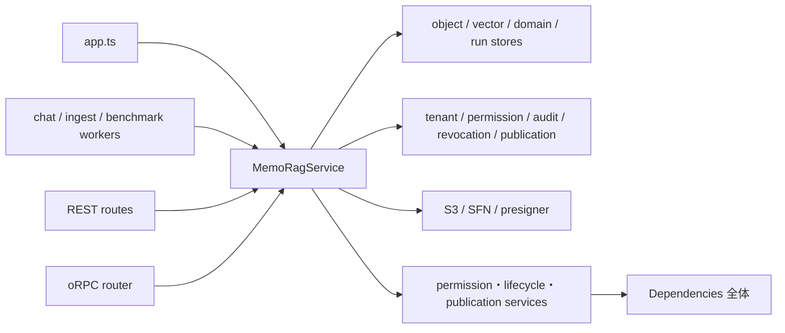

# MemoRagService facade contract と依存分割境界

- ファイル: `docs/3_設計_DES/11_詳細設計_DLD/DES_DLD_012.md`
- 種別: `DES_DLD`
- 作成日: 2026-07-17
- 状態: Draft
- 基準: `origin/main` (`8a427a24`)
- 関連: Issue #359 Phase 4a

## 何を書く場所か

`MemoRagService` を同名 facade のまま段階分割するため、current main の公開 TypeScript contract、consumer、composition root、private/store/AWS/policy 依存と既存 characterization test を固定する。ここでは実装挙動を変更せず、Phase 4b 以降が変更してよい境界と、変更時に明示レビューが必要な contract を定義する。

## 対象と非対象

### 対象

- `apps/api/src/rag/memorag-service.ts`
- route / worker / oRPC の facade consumer
- `MemoRagService` の constructor site
- `Dependencies`、直接 AWS SDK、認可・tenant・audit・compensation policy 依存
- tenant / permission / idempotency / audit / compensation / artifact / error status の既存 test

### 非対象

- facade の公開メソッド名、引数、返却型、error status の変更
- HTTP / oRPC contract、認可、tenant partition、永続化 key/schema の変更
- サブサービス抽出そのもの
- generated docs の再生成

## ベースライン

| 項目 | current main |
|---|---:|
| `memorag-service.ts` | 6,358 行 |
| `memorag-service.test.ts` | 3,840 行 |
| 公開 method | 101 |
| `Dependencies` key | 31 |
| production constructor site | 6 |
| test constructor expression | 52 |
| 明示的な `Pick<MemoRagService, ...>` production consumer | 1 |

公開 method 名と compiler が解決した signature の正本は `apps/api/src/rag/__snapshots__/memorag-service-public-contract.snapshot.json` とする。`memorag-service-contract.test.ts` は `keyof MemoRagService` の method union が snapshot の method 名と完全一致することに加え、TypeScript checker が解決した引数・optionality・返却型を snapshot と比較する。

## 現行 dependency graph

現状は route の `ApiRouteContext.service` と oRPC の `OrpcContext.service` が facade 全体を型依存として持つ。明示的に narrow な production consumer は `benchmark-run-authorization-worker.ts` の `Pick<MemoRagService, "reauthorizeBenchmarkRunExecution">` だけである。Phase 4b 以降は route module または抽出 domain 単位で `Pick` / port を定義し、必要な method だけを受け取る。

## Consumer inventory

| consumer | facade method |
|---|---|
| `chat-run-worker.ts` | `executeChatRun` |
| `chat-run-mark-failed.ts` | `markChatRunFailed` |
| `document-ingest-run-worker.ts` | `executeDocumentIngestRun` |
| `document-ingest-run-mark-failed.ts` | `markDocumentIngestRunFailed` |
| `benchmark-run-authorization-worker.ts` | `reauthorizeBenchmarkRunExecution` |
| `orpc/router.ts` | `chat`, `search`, `startChatRun` |
| `admin-routes.ts` | user/role/audit/alias/usage/cost/export の 22 method |
| `benchmark-routes.ts` | query/search/suite/run/artifact/log の 9 method |
| `benchmark-seed.ts` | `assertDocumentWritable`, `getBenchmarkDocumentManifest`, `getDocumentManifest` |
| `chat-routes.ts` | `chat`, `startChatRun`, `search`, `listChatToolInvocations` |
| `conversation-history-routes.ts` | save/list/delete の 3 method |
| `debug-routes.ts` | list/get/replay/download の 4 method |
| `document-routes.ts` | ingest/document/folder/share/governance/reindex の 27 method |
| `favorite-routes.ts` | save/list/delete の 3 method |
| `question-routes.ts` | create/list/get/answer/resolve/improvement の 7 method |
| `resource-group-routes.ts` | membership get/replace の 2 method |

`memorag-service-contract.test.ts` は上表を source から抽出し、method の追加・削除・consumer 移動を差分として検出する。表にない public method は worker内部、test、または将来 consumer 用であり、「未使用だから削除可能」とは判断しない。

## Constructor inventory

production の constructor site は次の 6 箇所である。

- `apps/api/src/app.ts`
- `apps/api/src/benchmark-run-authorization-worker.ts`
- `apps/api/src/chat-run-worker.ts`
- `apps/api/src/chat-run-mark-failed.ts`
- `apps/api/src/document-ingest-run-worker.ts`
- `apps/api/src/document-ingest-run-mark-failed.ts`

test は 11 ファイル、52 expression で直接 facade を生成する。特に `chat-orchestration/graph.test.ts` の 35 箇所と `search/hybrid-search.test.ts` の 6 箇所は、抽出後も facade contract を通す integration characterization として維持する。constructor site のファイル別件数は contract test に固定し、composition root の増加を無審査で許可しない。

## Private / store / AWS / policy dependency

### Private field と port 群

facade の private field は `constructor(private readonly deps: Dependencies)` の 1 つである。`Dependencies` 31 key は次の群に分かれる。

| 群 | dependency |
|---|---|
| object/vector/model | `objectStore`, `benchmarkArtifactStore`, `memoryVectorStore`, `evidenceVectorStore`, `textModel` |
| usage | `usageEventStore`, `usageAccountingMode`, `usagePricingCatalog` |
| user resource | `questionStore`, `conversationHistoryStore`, `favoriteStore` |
| execution run | `benchmarkRunStore`, `chatRunStore`, `chatRunEventStore`, `documentIngestRunStore`, `documentIngestRunEventStore` |
| document/group policy store | `documentGroupStore`, `folderPolicyStore`, `userGroupStore`, `groupMembershipStore` |
| external gateway | `codeBuildLogReader`, `asyncAgentProviders`, `userDirectory`, `verifiedIdentityProvider` |
| security/audit | `accountRevocationRegistry`, `administrativePrincipalTransferFence`, `resourceUserPrincipalDirectory`, `securityAuditOutbox`, `securityAuditReconciliationOutbox` |
| local/migration seam | `localTestIngestAdmissionContext`, `legacyGlobalDocumentArtifacts` |

service source から `this.deps.<key>` として直接読まれる key は 27。残る `folderPolicyStore`、`administrativePrincipalTransferFence`、`securityAuditReconciliationOutbox`、`legacyGlobalDocumentArtifacts` は `Dependencies` 全体を受け取る helper/service 側で間接利用される。この区別は「直接参照がないので削除可能」という誤判定を避けるために必要である。

### 直接 AWS 依存

facade は port 経由だけではなく、次の AWS module を直接 import する。

- `@aws-sdk/client-s3`: async agent / artifact object の取得・保存
- `@aws-sdk/s3-request-presigner`: debug / benchmark / admin artifact download URL
- `@aws-sdk/client-sfn`: chat / ingest execution start/stop

Phase 4b 以降では domain-specific gateway に隠蔽する候補だが、command、status、key、URL expiry の挙動を変えずに別 PR で抽出する。

### 主要 policy 依存

source-backed inventory は次を policy dependency として扱う。

- authorization: role permission、current worker authorization、resource operation authorization
- tenant: `tenantPartitionId`, `tenantStorageKey`, tenant artifact helper
- document/folder: permission service、lifecycle coordinator
- audit/revocation: security audit outbox、account revocation、cleanup coordinator/repair outbox
- publication: staged publication、reindex compensation repair、source governance approval
- RAG: runtime policy、quality policy、trace sanitizer、derived-record security

contract test は 24 の policy import path と 3 の AWS import path を固定する。単なる file move でも boundary の更新として snapshot と本書を同時に見直す。

## `Dependencies` 全体を渡している既存境界

既存 code には `Dependencies` 全体を受け取る constructor が残る。

| receiver | 現行 site 数 |
|---|---:|
| `StagedPublicationCoordinator` | 8 |
| `DocumentPermissionService` | 7 |
| `FolderPermissionService` | 7 |
| `AdministrativePrincipalTransferService` | 4 |
| `DocumentLifecycleMutationCoordinator` | 2 |
| `FolderLifecycleMutationCoordinator` | 1 |

さらに manifest/vector/search helper へ `this.deps` を渡す function call が 13 種類ある。Phase 4a の test はこの既存集合と件数を上限として固定する。後続抽出では減少を許可するが、新しい subservice へ `Dependencies` 全体を渡す追加は禁止する。各 constructor は実際に使う store / gateway / authorizer の narrow port だけを受け取る。

## Characterization matrix

| 保持する性質 | current main の主な根拠 |
|---|---|
| tenant partition / non-enumeration | `rag/tenant-artifact-partition.test.ts`; `routes/benchmark-tenant-boundary.test.ts`; `memorag-service.test.ts` の managed-user tenant partition |
| permission / current identity | `memorag-service.test.ts` の document group full permission・current worker boundary; `security/account-lifecycle-current-identity.test.ts` |
| idempotency / replay | stable run の ingest usage 1回記録; document ingest replay evidence; alias optimistic concurrency |
| audit | document share common security audit; alias audit; admin export success/failure audit; account lifecycle denied/failed audit |
| compensation / reconciliation | FR-066 ingest cleanup; FR-090 reindex/chat/ingest/async-agent; benchmark artifact cleanup intent |
| artifact key / redaction | tenant artifact partition; debug/benchmark attachment metadata; async-agent sanitized artifact; trace sanitizer |
| error status | provider failed/timeout/not-configured; permission revoked; worker failure/cancel/rejected; cross-tenant non-enumeration |
| RAG trust | `chat-orchestration/graph.test.ts` と既存 API suite。Phase 4a は retrieval/refusal/citation code を変更しない |

Phase 4b 以降は対象 domain の unit test を新 service へ追加した後、上記 facade/integration characterization も同時に通す。二重実行期間を設け、facade 側 test を先に削除しない。

## Narrow port 候補と抽出順

| 候補 domain | 最小 port 候補 | 先に固定する追加観点 |
|---|---|---|
| favorites / history | `FavoriteStore`, `ConversationHistoryStore`, visibility resolver | owner/tenant、inaccessible target、sort |
| benchmark | `BenchmarkRunStore`, artifact store, log reader, execution/auth gateway | non-enumeration、artifact prefix、revocation cleanup |
| async agent | run artifact store, provider registry, selection authorizer | owner、secret redaction、writeback permission |
| document group/governance | group/policy/membership stores、principal directory、audit/cleanup ports | inherited permission、version、audit、revocation |
| ingest/reindex/publication | object/vector/model ports、publication ledger、worker authorizer | idempotency、fence、compensation、current authorization |
| chat/debug | run/event store、RAG orchestrator、trace/artifact ports | refusal/citation、final event、trace redaction |
| admin/account | user directory、identity/revocation/fence、audit/usage ports | deny-first、tenant ledger、compensation |

最初の抽出候補は store-centric で AWS client と cross-domain policy が少ない favorites/history とする。benchmark は既に worker `Pick` があるが、artifact/auth/revocation が結合しているため characterization を揃えてから抽出する。

## Error / compatibility 方針

- facade の同名 method と TypeScript signature を維持する。
- route/worker/oRPC の status mapping と non-enumeration を維持する。
- tenant ID、owner ID、artifact prefix/key、audit operation/result、replay manifest を変えない。
- optional parameter を required にする、`void` を別返却型にする、新 public method を追加する場合も contract snapshot 差分として明示レビューする。
- open PR #387 は `deleteConversationHistory` の返却型変更と `getConversationHistory` 追加を含むため、本書の current-main contract とは一致しない。#387 を取り込む際は、契約変更の妥当性を確認したうえで snapshot と consumer inventory を同時更新する。自動追随はしない。

## テスト観点

| 観点 | 期待 |
|---|---|
| public method | method union と compiler-resolved signature snapshot が完全一致する |
| consumer | route / worker / oRPC の呼出 method が source inventory と一致する |
| Pick | production の明示 `Pick` が inventory と一致し、method が facade public contract に存在する |
| constructor | production/test の constructor file と expression 数が一致する |
| Dependencies | 31 key、private readonly field、27 direct read が一致する |
| narrow dependency | `Dependencies` 全体を渡す既存 receiver/call の集合が増えない |
| AWS / policy | direct import の追加・削除が明示差分になる |
| behavior | API full suite、typecheck、build、root CI が成功する |
| docs | OpenAPI/API code freshness が成功し、generated docs 差分が発生しない |
