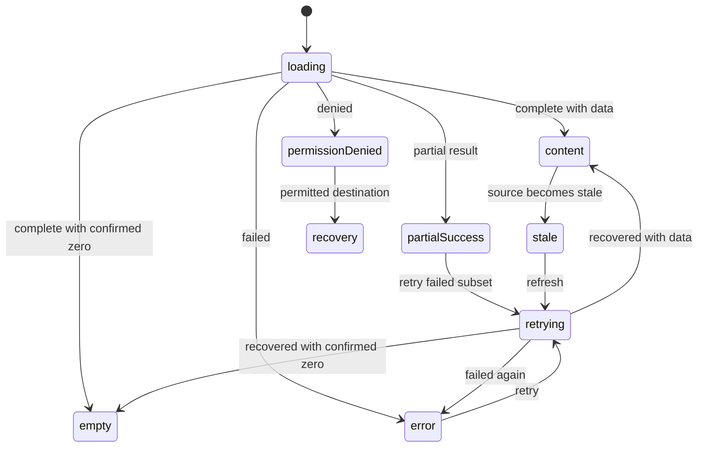

# AppView・UI 状態・検証トレーサビリティ設計

- ファイル: `docs/3_設計_DES/21_UI_UX/DES_UI_UX_001.md`
- 種別: `DES_UI_UX`
- 状態: Draft
- 最終更新: 2026-07-14
- Source: GitHub Issue #345、current production source、PR #341〜#344
- Confidence: confirmed current-state sections; inferred target-design sections are labeled

## 目的

8 `AppView`、利用 persona、主要 job、URL/access condition、正規 requirement/acceptance、production implementation、unit/E2E/manual verification、generated Web inventory を一つの追跡 contract で結ぶ。UI implementation、canonical docs、generated docs、tests、reports の責務を分離しながら、参照切れ、孤立、stale、未検証を pull request 前に検出できるようにする。

本設計は target UI を実装済みと宣言するものではない。`Current` が `partial`、`conflict`、`missing` の項目は linked task が完了するまで未達である。

## 適用要求

- `FR-094`: permission-aware addressable navigation。
- `FR-095`: common asynchronous UI state and recovery contract。
- `FR-096`: high-impact operation clarity and contextual feedback。
- `FR-097`: predictable workspace state restoration。
- `FR-098`: progressive disclosure and user-language context。
- `SQ-016`: cross-screen accessibility/responsive quality。
- `NFR-016`: semantic UI traceability/freshness gate。
- `NFR-017`: vocabulary/token/primitive/data-state consistency。
- `NFR-018`: automated/manual UI release evidence gate。

## 情報源と責務

| Artifact | Authoritative responsibility | 更新方法 | Merge gate |
| --- | --- | --- | --- |
| `apps/web/src/app/types.ts`, `AppRoutes.tsx`, `RailNav.tsx`, feature source | production views, route guards, rendered implementation | code change | typecheck/unit/E2E + semantic trace |
| `docs/1_要求_REQ/` | what must be true, requirement-local AC, source/confidence | authored, one requirement per file | canonical docs validation + semantic trace |
| 本文書 | UI state/navigation/disclosure/test implementation contract | authored design update | canonical docs validation + review |
| `tools/web-inventory/ui-traceability.json` | minimal join metadata: persona/job/URL/REQ/AC/verification/evidence IDs | authored with source/docs/test change | semantic trace validator |
| `docs/generated/web-*`, `docs/generated/web-features/` | source + join metadata projection | `npm run docs:web-inventory` only | freshness check; hand edit prohibited |
| `apps/web/src/**/*.test.*`, `apps/web/e2e/*` | executable behavior evidence with stable verification IDs | test change | unit/E2E gate by required scope |
| `reports/working/` | dated analysis, execution evidence, manual result, residual risk | authored per task/run | referenced from task/PR; not canonical behavior |
| `tasks/todo|do|done/` | incomplete implementation or verification ownership/state | workflow state transition | known failure/unverified required item stays out of done |

`tools/web-inventory/ui-traceability.json` は production behavior または requirement 本文を再定義しない。source の `AppView` set、canonical docs の REQ/AC IDs、test source の verification IDs、repository evidence paths を join する最小 metadata である。

## Persona と主要 job

| Persona ID | 利用者像 | 主要 job | Permission example | 注意 |
| --- | --- | --- | --- | --- |
| `standard-user` | 一般利用者 | 質問、citation 確認、history/favorite、個人設定 | `chat:create`, `chat:read:own` | permission example は固定 role catalog の代替ではない。 |
| `answer-editor` | 回答担当者 | 問い合わせ検索、回答/下書き、公開可能回答 | `answer:edit` and server-defined publish permissions | internal memo を requester へ出さない。 |
| `operator` | 運用担当者 | 許可文書、取り込み・索引、benchmark/debug/usage/cost/audit の操作と観測 | server-defined document/benchmark/observation permissions | effective resource permission を UI role で代替せず、benchmark dataset を通常 RAG scope に混ぜない。 |
| `system-admin` | システム管理者 | user/role/policy/resource/alias governance と監査 | `canSeeAdminSettings` を構成する server-defined permissions | raw trace/ACL/prompt data exposure remains permission-limited. |

## AppView trace contract

| View | Canonical URL / accepted pattern | Current route guard | Personas | Primary job | Requirement / AC | Executable evidence | Current |
| --- | --- | --- | --- | --- | --- | --- | --- |
| `chat` | `/`; `/?view=chat` is normalized to `/` | authenticated shell; submit uses `canCreateChat` | `standard-user`, `answer-editor`, `operator`, `system-admin` | `JOB-UI-CHAT`: ask → processing → answer/refusal → citation/follow-up/escalation | `FR-003`〜`FR-005`, `FR-009`, `FR-042`, `FR-043`, `FR-094`, `FR-095`, `SQ-016`; `AC-FR042-001`, `AC-FR043-003`, `AC-FR094-001`, `AC-FR095-001` | `E2E-VIEW-CHAT-001`, `E2E-UI-NAV-001`, `E2E-UI-ROUTE-001`, planned `E2E-UI-STATE-001` | partial: mobile route/navigation automation exists; full state and manual a11y journey missing |
| `assignee` | `/?view=assignee` | `canAnswerQuestions` | `answer-editor`, `system-admin` | `JOB-UI-ASSIGNEE`: filter/select/answer/resolve | `FR-031`〜`FR-033`, `FR-094`〜`FR-098`, `SQ-016`; `AC-FR031-001`, `AC-FR032-004`, `AC-FR094-003` | `E2E-VIEW-ASSIGNEE-001`, `E2E-UI-NAV-002`, `E2E-UI-ROUTE-002`, planned `E2E-UI-STATE-001` | partial: mobile reachability/denied route automation exists; full handoff/state/manual evidence missing |
| `history` | `/?view=history` | no `AppRoutes` guard; data uses own-history boundary | all signed-in personas | `JOB-UI-HISTORY`: search/select/resume/delete own conversation | `FR-022`, `FR-030`, `FR-044`, `FR-094`, `FR-095`, `FR-097`, `SQ-016`; `AC-FR022-002`, `AC-FR030-001`, `AC-FR094-002` | `E2E-VIEW-HISTORY-001`, `E2E-UI-NAV-001`, `E2E-UI-ROUTE-001` | partial: mobile reachability and browser-history restoration exist; full state journey missing |
| `favorites` | `/?view=favorites` | no `AppRoutes` guard; data uses own-history boundary | all signed-in personas | `JOB-UI-FAVORITES`: inspect and resume favorited own conversation | `FR-028`, `FR-094`, `FR-095`, `FR-097`, `SQ-016`; `AC-FR028-004`, `AC-FR094-002` | `E2E-VIEW-FAVORITES-001`, `E2E-UI-NAV-001`, `E2E-UI-ROUTE-001` | partial: mobile reachability and browser-history restoration exist; favorite resume journey missing |
| `benchmark` | `/?view=benchmark` | `canReadBenchmarkRuns` | `operator`, `system-admin` | `JOB-UI-BENCHMARK`: start/observe/cancel/download authorized run | `FR-010`, `FR-011`, `FR-048`, `FR-094`〜`FR-098`, `SQ-016`; `AC-FR048-001`, `AC-FR096-001` | `E2E-VIEW-BENCHMARK-001`, `E2E-UI-NAV-002`, `E2E-UI-ROUTE-002` | partial: mobile reachability/denied route automation exists; state/manual a11y evidence missing |
| `admin` | `/?view=admin`; section/filter state target TBD by task | `canSeeAdminSettings` composite | `system-admin` | `JOB-UI-ADMIN`: navigate authorized governance/observation section | `FR-024`, `FR-027`, `FR-094`〜`FR-098`, `SQ-016`; `AC-FR024-001`, `AC-FR027-011`, `AC-FR096-001`, `AC-FR097-001` | `E2E-VIEW-ADMIN-001`, `E2E-UI-NAV-002`, `E2E-UI-ROUTE-002` | partial: mobile reachability/non-disclosing denied route exist; #344 remaining task open |
| `documents` | `/documents`; `/documents/groups/:id`; `/documents/:id`; `/documents/reindex-migrations/:id`; `?view=documents&...` accepted and normalized | `canReadDocuments` | `operator`, `system-admin` | `JOB-UI-DOCUMENTS`: find/select/upload/share/manage/ask within effective permission | `FR-001`, `FR-002`, `FR-038`, `FR-064`, `FR-094`〜`FR-098`, `SQ-016`; `AC-FR001-001`, `AC-FR001-008`, `AC-FR094-002`, `AC-FR097-001` | `E2E-VIEW-DOCUMENTS-001`, `E2E-UI-NAV-002`, `E2E-UI-ROUTE-001`, `E2E-UI-ROUTE-002`, planned `E2E-UI-DOCUMENTS-001` | partial: canonical path/query reload and denied route exist; 143-operation IA/full restoration missing |
| `profile` | `/?view=profile` | authenticated shell | all | `JOB-UI-PROFILE`: inspect/update own settings and sign out | `FR-051`, `FR-094`, `FR-095`, `SQ-016`; `AC-FR094-001`, `AC-FR094-002` | `E2E-VIEW-PROFILE-001`, `E2E-UI-NAV-001`, `E2E-UI-NAV-002`, `E2E-UI-ROUTE-001` | partial: <=720px menu reachability is automated; settings persistence and manual a11y remain |

## URL と browser history policy

### Confirmed production behavior

1. `parseAppRoute` reads exact `?view=` values and safe document paths; legacy `?view=chat|documents`、unknown/obsolete/conflicting view、malformed/path-escaping document segment are classified before normalization.
2. Direct user navigation between AppViews uses `pushState` when it creates a meaningful history step.
3. Normalization、permission recovery、document filter/selection serialization use `replaceState` and do not create an extra user-action history step.
4. `popstate` restores view and document URL state without creating a new entry; reload/direct URL are covered by route E2E.
5. Permissions resolve before a protected view renders. Denied views are replaced with canonical `/`、a programmatic permission notice、and the allowed chat region; protected admin requests are absent in E2E evidence.
6. Canonical view URL remains backward-compatible with `?view=`. Documents use `/documents`、`/documents/groups/:id`、`/documents/:id`、or `/documents/reindex-migrations/:id` plus approved query state; this change does not alter CloudFront entrypoint behavior.
7. Route state is limited to existing view/document identifiers and filter values; secrets、raw prompt/chunk text、internal memo are not newly serialized.

## Common state contract



| State | Must expose | Must not do | AT metadata |
| --- | --- | --- | --- |
| `loading` | target, operation, existing content policy | replace all content with indefinite spinner without context | `aria-busy`, polite status where useful |
| `empty` | confirmed zero scope and relevant creation/filter-clear action | represent error/403/not-loaded as zero | normal region semantics; status when transition matters |
| `error` | public-safe reason, target, retry/back/support action | generic top banner only; leak internal detail | `role="alert"` when immediate attention is needed |
| `permissionDenied` | denied action/target category and safe recovery | fetch/render protected content; reveal existence unnecessarily | alert/status based on context; focus recovery target |
| `partialSuccess` | succeeded and failed targets/counts and next action | show all-success or erase successful work | target status + summary live region |
| `stale` | source/as-of, stale reason if public, refresh availability | present stale value as current without cue | described state, refresh control |
| `retrying/recovered` | retry target/progress/result | duplicate mutation or detach result from target | busy + polite/assertive result according to severity |

Displayed values derive from API/props/persisted state/config or an honest explicit state. The contract prohibits demo/fake fallback values in production paths.

## High-impact operation contract

Every delete/share/permission/suspend/disable/publish/cancel/cutover/rollback interaction carries:

| Phase | Required information |
| --- | --- |
| Trigger | action and target-specific accessible name |
| Confirmation | target display identity, impact scope, recoverability/irreversibility, reason requirement |
| Processing | target, duplicate prevention, cancelability when supported |
| Result | target-level success/failure/partial/unknown, safe diagnostic and retry/rollback action |
| Audit | actor/result/reason/version/reference when API exposes it and caller is authorized |
| Focus | initial focus, trap, Escape/cancel, restore to trigger or logical successor |

The UI does not infer success from a dismissed dialog or timeout and does not replace API authorization/audit policy.

## High-density workspace contract

- Primary actions follow the persona/job and current selection.
- Detail/advanced actions use semantic disclosure with `aria-expanded`/`aria-controls` and focus return where relevant.
- Risky actions remain discoverable but separated from common primary actions.
- Search/filter/sort/selection/source/as-of are visible and follow `FR-097` restoration policy.
- Approved display metadata is primary; raw IDs are optional secondary detail.
- Long/many/zero/error cases keep current target and primary recovery visible.
- Permission and critical status are never hidden only to reduce visual density.

## Accessibility and responsive matrix

| Dimension | Required scope | Evidence kind |
| --- | --- | --- |
| Width | 320, 375, 768, 1280 CSS px | mobile/desktop E2E + visual/manual |
| Zoom | 200%, 400% | browser manual or equivalent reflow evidence; not viewport-only claim |
| Input | keyboard, touch, pointer | E2E + manual |
| Screen reader | representative desktop and mobile environments | manual evidence with environment/date |
| Motion | `prefers-reduced-motion` | E2E/component/visual |
| Content | long text/file names, many/zero items, loading/error/permission/partial/stale | deterministic fixtures |
| Contrast/target | WCAG 2.2 relevant ratios and 24px minimum target; 44–48px primary target where practical | token/tool/layout/manual review |
| Browser | Chromium desktop + mobile PR-required target; Firefox/WebKit required/scheduled scope recorded by `NFR-018` task | CI evidence |

Automated accessibility, DOM snapshots, and accessibility tree inspection do not replace keyboard, representative screen-reader, zoom, or real-device evidence.

## Trace manifest schema

`tools/web-inventory/ui-traceability.json` uses this conceptual shape:

```json
{
  "schemaVersion": 1,
  "personas": [{ "id": "standard-user", "label": "一般利用者", "jobContext": "質問と根拠を扱う" }],
  "qualityRequirements": [{
    "id": "NFR-016",
    "acceptanceCriteria": ["AC-NFR016-001"],
    "appliesTo": ["*"]
  }],
  "crossViewVerifications": [{
    "id": "NONUI-UI-TRACE-001",
    "status": "implemented",
    "evidence": ["tools/web-inventory/ui-traceability.test.mjs"]
  }],
  "views": [{
    "view": "chat",
    "canonicalUrl": "/",
    "urlPatterns": ["/", "/?view=chat"],
    "routeKind": "query-state",
    "access": { "session": "authenticated", "guards": [] },
    "personas": ["standard-user"],
    "jobs": [{ "id": "JOB-UI-CHAT", "summary": "質問から追加行動まで" }],
    "requirements": [{ "id": "FR-094", "acceptanceCriteria": ["AC-FR094-002"] }],
    "verifications": [{ "id": "E2E-VIEW-CHAT-001", "status": "implemented", "evidence": ["apps/web/e2e/visual-regression.spec.ts"] }],
    "implementationEvidence": ["apps/web/src/features/chat/components/ChatView.tsx"],
    "implementationStatus": "partial",
    "gapTasks": ["tasks/todo/...md"]
  }]
}
```

## Validator invariants

1. Source `AppView` set and manifest view set are equal; duplicates and unknown values fail.
2. Manifest route guards match source-extracted `AppRoutes` guards.
3. Persona/job references exist and every view has at least one of each.
4. REQ and AC IDs exist in canonical requirement Markdown; an AC must occur in a requirement file, not only the analysis report.
5. Each view has at least one `implemented` executable verification whose ID occurs in the referenced test source.
6. `planned`/`manual` verification has a linked task/evidence path and is not presented as pass.
7. Implementation/test/task paths exist; `done` is rejected when the manifest status or required verification remains incomplete.
8. IDs are unique within their namespace and arrays do not silently duplicate references.
9. Generated Web files are exact projections of source + manifest; orphan generated files fail.
10. Error output includes classification, offending ID, and expected source so the change is actionable.

## PR 間の一時的不整合 policy

| Condition | Allowed? | Required record | Merge blocker |
| --- | --- | --- | --- |
| Same PR changes UI source without canonical/manifest/test sync | no | none; fix in same PR | yes |
| Draft dependent PR temporarily references an unmerged requirement/verification | limited | dependency PR URL/branch, owner, resolution deadline, conflict note | target default-branch PR cannot merge until resolved |
| Generated inventory differs from source/manifest | no | regenerate | yes |
| Required automated check failed | no | failure and repair evidence | yes |
| Required manual evidence not yet run | draft work may continue | exact unverified scope/reason/risk/task | yes for Issue full completion/release claim |
| External environment/owner decision prevents a check | partial only | blocker, attempted alternatives, owner, next action | yes unless requirement explicitly classifies it as scheduled post-merge evidence |

Default resolution deadline is before any involved PR is merged to the default branch. A calendar deadline alone never permits merging a broken canonical trace.

## UI change PR evidence fields

The pull request template records:

- target personas and primary jobs;
- before/after behavior and affected AppViews;
- loading/empty/error/permission/partial/stale/retry coverage;
- high-impact operation target/recovery/result when applicable;
- a11y metadata, keyboard/focus, responsive/zoom/content extremes;
- canonical requirements/design, manifest, generated inventory, and test sync;
- unit/E2E/mobile/visual/automated a11y/manual screen-reader/real-device commands/results;
- skipped/pending/blocked verification with reason and risk.

Checkboxes are checked only for evidence actually obtained.

## Current gaps and task routing

| Gap | Requirement | Task |
| --- | --- | --- |
| mobile navigation automation completed; representative screen reader、400% browser zoom、safe-area/virtual-keyboard real-device evidence remains | `FR-094`, `SQ-016` | `tasks/do/20260714-issue-345-mobile-navigation.md`, `tasks/todo/20260714-issue-345-manual-a11y-evidence.md` |
| unstructured global error/common states | `FR-095` | `tasks/todo/20260714-issue-345-shared-ui-state-contract.md` |
| target/risk/result feedback inconsistent | `FR-096` | `tasks/todo/20260714-issue-345-risky-operation-feedback.md` |
| documents 143-interaction density and state restoration | `FR-097`, `FR-098` | `tasks/todo/20260714-issue-345-document-workspace-context.md` |
| chat/assignee full journey | existing chat/question requirements, `FR-095` | `tasks/todo/20260714-issue-345-chat-assignee-journey.md` |
| admin remaining governance/a11y/scale | `FR-096`〜`FR-098`, `SQ-016` | `tasks/todo/20260714-1011-admin-ui-governance-quality.md` |
| cross-screen a11y/responsive violations | `SQ-016` | `tasks/todo/20260714-issue-345-cross-screen-a11y-responsive.md` |
| wording/token/primitive drift | `NFR-017` | `tasks/todo/20260714-issue-345-ui-language-primitives.md` |
| required axe/mobile/visual/browser gate missing | `NFR-018` | `tasks/todo/20260714-issue-345-ui-automated-quality-gates.md` |
| manual screen-reader/zoom/real-device evidence missing | `SQ-016`, `NFR-018` | `tasks/todo/20260714-issue-345-manual-a11y-evidence.md` |

URL/history/denied-route gap は draft PR #349 と `tasks/done/20260714-issue-345-url-history-routing.md` で自動検証まで解消した。PR #348 依存は production behavior の gap ではなく、default branch merge 前に解消する PR lifecycle blocker として扱う。

## Open decisions

- `OQ-UI-001`: Firefox/WebKit every-PR vs scheduled scope. Proposed default: desktop/mobile Chromium on PR, representative Firefox/WebKit scheduled until measured stable.
- `OQ-UI-002`: representative screen readers. Proposed default: NVDA + current Chrome on Windows and VoiceOver + current Safari on iOS/macOS for primary journeys.
- `OQ-UI-003` resolved 2026-07-14: retain backward-compatible `?view=` for AppView routes and the existing document path family; no CloudFront/deploy routing migration is included.
- `OQ-UI-004`: visual PR-required set. Proposed default: login, chat empty/answer, documents, questions, admin at desktop and mobile; expand after flake/runtime evidence.

No proposed default is recorded as executed evidence until its task produces the required result.
