# AppView・UI 状態・検証トレーサビリティ設計

- ファイル: `docs/3_設計_DES/21_UI_UX/DES_UI_UX_001.md`
- 種別: `DES_UI_UX`
- 状態: Draft
- 最終更新: 2026-07-14
- Source: GitHub Issue #345、current production source、PR #341〜#344
- Confidence: confirmed current-state sections; inferred target-design sections are labeled

## 目的

8 `AppView`、利用 persona、主要 job、URL/access condition、正規 requirement/acceptance、production implementation、unit/E2E/manual verification、generated Web inventory を一つの追跡 contract で結ぶ。UI implementation、canonical docs、generated docs、tests、reports の責務を分離しながら、参照切れ、孤立、stale、未検証を pull request 前に検出できるようにする。

本設計は target UI を実装済みと宣言するものではない。`Current` が `partial`、`conflict`、`missing` の項目は linked task が完了するまで未達である。

## 適用要求

- `FR-094`: permission-aware addressable navigation。
- `FR-095`: common asynchronous UI state and recovery contract。
- `FR-096`: high-impact operation clarity and contextual feedback。
- `FR-097`: predictable workspace state restoration。
- `FR-098`: progressive disclosure and user-language context。
- `SQ-016`: cross-screen accessibility/responsive quality。
- `NFR-016`: semantic UI traceability/freshness gate。
- `NFR-017`: vocabulary/token/primitive/data-state consistency。
- `NFR-018`: automated/manual UI release evidence gate。

## 情報源と責務

| Artifact | Authoritative responsibility | 更新方法 | Merge gate |
| --- | --- | --- | --- |
| `apps/web/src/app/types.ts`, `AppRoutes.tsx`, `RailNav.tsx`, feature source | production views, route guards, rendered implementation | code change | typecheck/unit/E2E + semantic trace |
| `docs/1_要求_REQ/` | what must be true, requirement-local AC, source/confidence | authored, one requirement per file | canonical docs validation + semantic trace |
| 本文書 | UI state/navigation/disclosure/test implementation contract | authored design update | canonical docs validation + review |
| `tools/web-inventory/ui-traceability.json` | minimal join metadata: persona/job/URL/REQ/AC/verification/evidence IDs | authored with source/docs/test change | semantic trace validator |
| `docs/generated/web-*`, `docs/generated/web-features/` | source + join metadata projection | `npm run docs:web-inventory` only | freshness check; hand edit prohibited |
| `apps/web/src/**/*.test.*`, `apps/web/e2e/*` | executable behavior evidence with stable verification IDs | test change | unit/E2E gate by required scope |
| `reports/working/` | dated analysis, execution evidence, manual result, residual risk | authored per task/run | referenced from task/PR; not canonical behavior |
| `tasks/todo|do|done/` | incomplete implementation or verification ownership/state | workflow state transition | known failure/unverified required item stays out of done |

`tools/web-inventory/ui-traceability.json` は production behavior または requirement 本文を再定義しない。source の `AppView` set、canonical docs の REQ/AC IDs、test source の verification IDs、repository evidence paths を join する最小 metadata である。

## Persona と主要 job

| Persona ID | 利用者像 | 主要 job | Permission example | 注意 |
| --- | --- | --- | --- | --- |
| `standard-user` | 一般利用者 | 質問、citation 確認、history/favorite、個人設定 | `chat:create`, `chat:read:own` | permission example は固定 role catalog の代替ではない。 |
| `answer-editor` | 回答担当者 | 問い合わせ検索、回答/下書き、公開可能回答 | `answer:edit` and server-defined publish permissions | internal memo を requester へ出さない。 |
| `operator` | 運用担当者 | 許可文書、取り込み・索引、benchmark/debug/usage/cost/audit の操作と観測 | server-defined document/benchmark/observation permissions | effective resource permission を UI role で代替せず、benchmark dataset を通常 RAG scope に混ぜない。 |
| `system-admin` | システム管理者 | user/role/policy/resource/alias governance と監査 | `canSeeAdminSettings` を構成する server-defined permissions | raw trace/ACL/prompt data exposure remains permission-limited. |

## AppView trace contract

| View | Canonical URL / accepted pattern | Current route guard | Personas | Primary job | Requirement / AC | Executable evidence | Current |
| --- | --- | --- | --- | --- | --- | --- | --- |
| `chat` | `/`; `/?view=chat` is normalized to `/` | authenticated shell; submit uses `canCreateChat` | `standard-user`, `answer-editor`, `operator`, `system-admin` | `JOB-UI-CHAT`: ask → processing → answer/refusal/clarification → citation/follow-up/escalation → targeted ticket result | `FR-003`〜`FR-005`, `FR-009`, `FR-021`, `FR-029`, `FR-042`, `FR-043`, `FR-094`〜`FR-096`, `SQ-016`; `AC-FR042-001`, `AC-FR043-003`, `AC-FR094-001`, `AC-FR095-001` | `E2E-VIEW-CHAT-001`, `E2E-UI-NAV-001`, `E2E-UI-ROUTE-001`, `E2E-UI-QUESTION-001`, `E2E-UI-QUESTION-002` | implemented automated journey: processing/answer/refusal/clarification/citation/escalation and targeted result exist; manual screen-reader/zoom/real-device evidence remains |
| `assignee` | `/?view=assignee` | `canAnswerQuestions` | `answer-editor`, `system-admin` | `JOB-UI-ASSIGNEE`: filter/select/answer/resolve with assignment and next-action context | `FR-031`〜`FR-033`, `FR-094`〜`FR-098`, `SQ-016`; `AC-FR031-001`, `AC-FR032-004`, `AC-FR094-003` | `E2E-VIEW-ASSIGNEE-001`, `E2E-UI-NAV-002`, `E2E-UI-ROUTE-002`, `E2E-UI-QUESTION-001` | implemented automated journey: five ticket states、assignment、answer handoff、input retention and locked terminal state exist; manual screen-reader/zoom/real-device evidence remains |
| `history` | `/?view=history` | no `AppRoutes` guard; data uses own-history boundary | all signed-in personas | `JOB-UI-HISTORY`: search/select/inspect question status/resume/delete own conversation | `FR-022`, `FR-030`, `FR-034`〜`FR-036`, `FR-044`, `FR-094`〜`FR-097`, `SQ-016`; `AC-FR022-002`, `AC-FR030-001`, `AC-FR094-002`, `AC-FR096-001`, `AC-FR096-003` | `E2E-VIEW-HISTORY-001`, `E2E-UI-NAV-001`, `E2E-UI-ROUTE-001`, `E2E-UI-STATE-001`, `E2E-UI-RISK-001`, `E2E-UI-QUESTION-001` | implemented automated journey: targeted ticket status/assignment/next action、many/long/mobile continuity and requester-only redaction exist; manual screen-reader/zoom/real-device evidence remains |
| `favorites` | `/?view=favorites` | no `AppRoutes` guard; data uses own-history boundary | all signed-in personas | `JOB-UI-FAVORITES`: inspect and resume favorited own conversation | `FR-028`, `FR-094`, `FR-095`, `FR-097`, `SQ-016`; `AC-FR028-004`, `AC-FR094-002` | `E2E-VIEW-FAVORITES-001`, `E2E-UI-NAV-001`, `E2E-UI-ROUTE-001` | partial: mobile reachability and browser-history restoration exist; favorite resume journey missing |
| `benchmark` | `/?view=benchmark` | `canReadBenchmarkRuns` | `operator`, `system-admin` | `JOB-UI-BENCHMARK`: start/observe/cancel/download authorized run | `FR-010`, `FR-011`, `FR-048`, `FR-094`〜`FR-098`, `SQ-016`; `AC-FR048-001`, `AC-FR096-001` | `E2E-VIEW-BENCHMARK-001`, `E2E-UI-NAV-002`, `E2E-UI-ROUTE-002`, `E2E-UI-RISK-001` | partial: target-attached start/cancel result, run/suite part state and false-zero prevention exist; manual evidence missing |
| `admin` | `/?view=admin`; `section`, `adminQuery`, `aliasStatus`, `auditAction`, `sort`, `selected` | `canSeeAdminSettings` composite | `system-admin` | `JOB-UI-ADMIN`: source/as-of と対象を確認し、許可された governance/observation 操作を行う | `FR-023`, `FR-024`, `FR-027`, `FR-094`〜`FR-098`, `SQ-016`; `AC-FR023-001`, `AC-FR024-001`, `AC-FR027-011`, `AC-FR096-001`, `AC-FR097-001` | `E2E-VIEW-ADMIN-001`, `E2E-UI-ADMIN-001`, `E2E-UI-NAV-002`, `E2E-UI-ROUTE-002`, `E2E-UI-STATE-001`, `E2E-UI-RISK-001` | implemented automated admin scope: URL 復元、part 単位回復、server-defined alias version/reason/audit、cursor、320〜1280px reflow、axe、非開示 denied route。代表 screen reader、400% zoom、real device と共通 security audit projection は未検証・後続 task。 |
| `documents` | `/documents`; `/documents/groups/:id`; `/documents/:id`; `/documents/reindex-migrations/:id`; `?view=documents&...` accepted and normalized | `canReadDocuments` | `operator`, `system-admin` | `JOB-UI-DOCUMENTS`: find/select/upload/share/manage/ask within effective permission | `FR-001`, `FR-002`, `FR-038`, `FR-064`, `FR-094`〜`FR-098`, `SQ-016`; `AC-FR001-001`, `AC-FR001-008`, `AC-FR094-002`, `AC-FR097-001`〜`005`, `AC-FR098-001`〜`005` | `E2E-VIEW-DOCUMENTS-001`, `E2E-UI-NAV-002`, `E2E-UI-ROUTE-001`, `E2E-UI-ROUTE-002`, `E2E-UI-RISK-001`, `E2E-UI-DOCUMENTS-001` | implemented: authorized current context、page restoration、safe normalization、progressive disclosure、keyboard/axe、many/long/320〜1280px evidence exist; manual screen-reader/zoom/real-device evidence remains cross-screen scope |
| `profile` | `/?view=profile` | authenticated shell | all | `JOB-UI-PROFILE`: inspect/update own settings and sign out | `FR-051`, `FR-094`, `FR-095`, `SQ-016`; `AC-FR094-001`, `AC-FR094-002` | `E2E-VIEW-PROFILE-001`, `E2E-UI-NAV-001`, `E2E-UI-NAV-002`, `E2E-UI-ROUTE-001` | partial: <=720px menu reachability is automated; settings persistence and manual a11y remain |

## Chat-to-human question journey contract

### Confirmed production implementation（2026-07-14）

- chat は現在処理中の対象を示し、最終結果を `answer`、`refusal`、`clarification` として区別する。citation は API が根拠を返したときだけ表示し、0 件を根拠ありのように見せない。
- user/assistant message は Web で安定した `messageId` を持つ。同じ認証済み `requesterUserId` と同じ `messageId` による問い合わせ作成は同一 ticket を返し、再送や二重操作で重複 ticket を作らない。旧履歴は `sourceQuestion` が一意に一致する場合だけ互換参照する。
- requester と assignee は `open`、`in_progress`、`waiting_requester`、`answered`、`resolved` を利用者向けラベル、担当 user/group/department、次の主体と行動に変換して確認する。unknown status や割当を推測しない。
- 問い合わせ作成・回答・解決は対象 ticket/message を伴う `confirmed`、`partial`、`failure`、`unknown` outcome を表示する。refresh 失敗を mutation 失敗と同一視せず partial とし、失敗・不明時は入力を保持して対象確認を促す。
- assignee の「入力を一時保持」は browser 内の一時状態であり保存済み下書きと表示しない。`answered` / `resolved` では回答入力と送信を無効化し、terminal state を新規操作可能に見せない。
- API の route permission、作成者本人境界、非関係者への non-disclosing `404`、requester response からの `internalMemo` 除外を最終認可・開示境界とし、Web role や表示制御で代替しない。
- `E2E-UI-QUESTION-001` は refusal → escalation → assignee answer → requester history → resolve を、`E2E-UI-QUESTION-002` は answer/citation と clarification を Chromium で検証する。代表 screen reader、200%/400% zoom、real device は未検証であり、Issue 全体の manual/cross-screen task に残す。

## URL と browser history policy

### Confirmed production behavior

1. `parseAppRoute` reads exact `?view=` values and safe document paths; legacy `?view=chat|documents`、unknown/obsolete/conflicting view、malformed/path-escaping document segment are classified before normalization.
2. Direct user navigation between AppViews uses `pushState` when it creates a meaningful history step.
3. Normalization、permission recovery、document filter/selection serialization use `replaceState` and do not create an extra user-action history step.
4. `popstate` restores view and document URL state without creating a new entry; reload/direct URL are covered by route E2E.
5. Permissions resolve before a protected view renders. Denied views are replaced with canonical `/`、a programmatic permission notice、and the allowed chat region; protected admin requests are absent in E2E evidence.
6. Canonical view URL remains backward-compatible with `?view=`. Documents use `/documents`、`/documents/groups/:id`、`/documents/:id`、or `/documents/reindex-migrations/:id` plus approved query state; this change does not alter CloudFront entrypoint behavior.
7. Route state is limited to existing view/document identifiers and filter values; secrets、raw prompt/chunk text、internal memo are not newly serialized.

## Common state contract

### Confirmed production implementation（2026-07-14）

- `ResourceState.tsx` owns the discriminated state model, target/source metadata, alert/status/live/busy semantics, focus option, retry/back/support actions, partial summaries, and stale source/as-of disclosure.
- `useResourceStateController.ts` settles endpoint parts independently, maps HTTP 401/403 to permission, retains last confirmed content as stale after refresh failure, ignores superseded requests, and publishes only public-safe failure text while raw detail remains in developer logging.
- `useAppShellState.ts` applies the controller to history、favorites、questions、documents catalog/reindex、benchmark runs/suites、admin endpoint parts、debug runs. Feature adapters hide unconfirmed counts/content and keep successful parts available.
- `E2E-UI-STATE-001` exercises initial loading/500/confirmed-empty recovery、actual HTTP 403、admin partial recovery、source/as-of stale recovery. Primitive/controller/component tests cover all state variants and false-zero rules.

```mermaid
stateDiagram-v2
  [*] --> loading
  loading --> content: complete with data
  loading --> empty: complete with confirmed zero
  loading --> error: failed
  loading --> permissionDenied: denied
  loading --> partialSuccess: partial result
  content --> stale: source becomes stale
  error --> retrying: retry
  permissionDenied --> recovery: permitted destination
  partialSuccess --> retrying: retry failed subset
  stale --> retrying: refresh
  retrying --> recovered: recovered with data or confirmed zero
  retrying --> error: failed again
  retrying --> stale: refresh failed; keep prior content
```



| State | Must expose | Must not do | AT metadata |
| --- | --- | --- | --- |
| `loading` | target, operation, existing content policy | replace all content with indefinite spinner without context | `aria-busy`, polite status where useful |
| `empty` | confirmed zero scope and relevant creation/filter-clear action | represent error/403/not-loaded as zero | normal region semantics; status when transition matters |
| `error` | public-safe reason, target, retry/back/support action | generic top banner only; leak internal detail | `role="alert"` when immediate attention is needed |
| `permissionDenied` | denied action/target category and safe recovery | fetch/render protected content; reveal existence unnecessarily | alert/status based on context; focus recovery target |
| `partialSuccess` | succeeded and failed targets/counts and next action | show all-success or erase successful work | target status + summary live region |
| `stale` | source/as-of, stale reason if public, refresh availability | present stale value as current without cue | described state, refresh control |
| `retrying/recovered` | retry target/progress/result | duplicate mutation or detach result from target | busy + polite/assertive result according to severity |

Displayed values derive from API/props/persisted state/config or an honest explicit state. The contract prohibits demo/fake fallback values in production paths.

## Vocabulary、semantic token、primitive contract

### Confirmed production implementation（2026-07-14）

| Layer | Responsibility | Contract |
| --- | --- | --- |
| domain type | status/mode/permission/action の許可値 | union を source of truth とし、表示層が未知値を推測しない |
| `displayMetadata.ts` | approved 日本語 label、semantic tone、技術値の honest unavailable 表示 | `satisfies Record<DomainUnion, ...>` で値追加時の mapping 漏れを typecheck failure にする |
| `StatusBadge` | status の共通表示 | foreground/background/border token、可視 label、`aria-hidden` marker を同時に使い、色だけに依存しない |
| `Button` / confirmation dialog | primary/secondary/warning/danger intent | native `button`、disabled/busy、focus/Escape/restore contract を維持し、feature 固有の危険色を再定義しない |
| feature adapter | domain value から presentation を選ぶ | raw enum/internal service/error detail を ordinary task の主要語彙へ出さず、ID が操作上必要なら管理・技術詳細と明示する |

Semantic status token は `neutral`、`info`、`success`、`warning`、`danger` の 5 intent とし、各 foreground/background の text contrast を `tools/web-inventory/semantic-ui-contract.test.mjs` で WCAG AA 4.5:1 以上に固定する。marker の形と日本語 label が第二・第三 cue になるため、色の違いだけで意味を伝えない。

Representative migration は benchmark、非同期エージェント、documents/share/reindex、admin user/用語展開、debug を含む。domain 固有の model ID、dataset key、document/user/group ID は値自体を偽の表示名へ変換せず、ordinary label ではなく選択内容または管理・技術詳細として表示する。API が display name を提供しない共有先識別子は制約を明記し、後続の directory/IA 改善範囲とする。

検証は metadata/primitive/feature unit test、semantic source/contrast contract、generated inventory、`E2E-UI-SEMANTIC-001` の representative status/dialog axe を組み合わせる。これは screen reader、400% zoom、real device、Firefox/WebKit、全画面の arbitrary layout/brand color 監査を代替しない。

## High-impact operation contract

Every delete/share/permission/suspend/disable/publish/cancel/cutover/rollback interaction carries:

| Phase | Required information |
| --- | --- |
| Trigger | action and target-specific accessible name |
| Confirmation | target display identity, impact scope, recoverability/irreversibility, reason requirement |
| Processing | target, duplicate prevention, cancelability when supported |
| Result | target-level success/failure/partial/unknown, safe diagnostic and retry/rollback action |
| Audit | actor/result/reason/version/reference when API exposes it and caller is authorized |
| Focus | initial focus, trap, Escape/cancel, restore to trigger or logical successor |

The UI does not infer success from a dismissed dialog or timeout and does not replace API authorization/audit policy.

### Confirmed production implementation（2026-07-14）

- `operationOutcome.ts` classifies confirmed、partial、known failure、unknown and keeps API evidence separate from UI-authored target/impact/recovery metadata. `OperationFeedback.tsx` renders the result with native status/alert semantics and semantic `StatusBadge` intent.
- history delete removes the row only after confirmed API completion and keeps its result across an empty-state transition. documents preserve confirmed mutation evidence when catalog refresh fails. benchmark and admin adapters return operation outcomes instead of closing confirmation dialogs after swallowed errors.
- question create/answer/resolve adapters attach the result to the affected message/ticket, prevent target-local duplicates, retain edited input after failure/unknown, and report successful mutation plus failed refresh as partial instead of false success or false failure.
- duplicate guards are scoped to the affected action/target. timeout/network/abort do not authorize a retry by declaring failure; the result instructs the caller to refresh and inspect the target first.
- document share policy version、folder audit intent、migration/run/user/alias identifiers and version timestamps are shown only when returned by the API. Missing actor/audit data is not fabricated. Existing API authorization、resource capability、server-side reason/version guard and audit persistence remain authoritative.
- component/unit tests cover success、failure、partial、unknown、duplicate and response parsing. `E2E-UI-RISK-001` covers representative delete/share/cancel/publish plus axe. This evidence does not claim exhaustive feature coverage or manual assistive-technology/browser/device validation.

## High-density workspace contract

- Primary actions follow the persona/job and current selection.
- Detail/advanced actions use semantic disclosure with `aria-expanded`/`aria-controls` and focus return where relevant.
- Risky actions remain discoverable but separated from common primary actions.
- Search/filter/sort/selection/source/as-of are visible and follow `FR-097` restoration policy.
- Approved display metadata is primary; raw IDs are optional secondary detail.
- Long/many/zero/error cases keep current target and primary recovery visible.
- Permission and critical status are never hidden only to reduce visual density.

### Documents confirmed implementation（2026-07-14）

- folder/document/migration selection and page change use `pushState`; text/filter/sort/page-size correction and authorized normalization use `replaceState`. `folderQuery`、query/filter/sort、page/pageSize are restored from canonical document URLs.
- current target、selection、result count、source、as-of、active filter are grouped in one visible context region. Catalog confirmation precedes page clamping and authorization-aware normalization, so an unrelated loading transition does not silently discard a valid page.
- each row exposes detail as the ordinary primary action. Technical/quality metadata and management actions use `aria-expanded`/`aria-controls`; share/move and high-impact reindex/delete are separated while consequence and permission boundaries remain visible.
- `E2E-UI-DOCUMENTS-001` verifies reload/back/forward/detail return、protected-value-free normalization、long/many data、320/375/768/1280px overflow、focus/Escape、and axe in Chromium. It does not claim 200%/400% zoom、representative screen reader、or real-device completion.

### Admin confirmed implementation（2026-07-15）

- `section`、検索、alias status、audit action、sort、selection は承認済み query key だけを URL に保存し、reload/back/forward で復元する。別 AppView へ移動すると admin 固有 query は持ち出さない。
- alias list と alias/admin audit list は API の `total`、`nextCursor`、`truncated`、`source`、`asOf` を表示し、client 側の固定 8 件表示や server の無言の末尾切捨てに依存しない。cursor は server が生成する opaque value として扱う。
- alias update/review/draft transition/disable/publish は server response の record/ledger version と必須 reason を送る。成功・拒否・競合・失敗は audit の actor/result/reason/before-after/version と操作結果へ結び付け、client で状態や時刻を合成しない。
- application role は canonical catalog の日本語 display name/description を主表示とし、system preset、権限、raw role ID、resource group を区別する。ユーザーの複数 role は現在値を保持した checkbox と変更前後・理由の確認を経て更新する。
- panel ごとに source/as-of/stale/error/permission/retry を表示し、成功済み mutation 後の refresh 失敗は操作失敗ではなく partial result として再取得を促す。コスト根拠が未提供なら架空の金額・閾値を表示しない。
- user list は server-side search/status/sort と stable cursor/total/version を使い、各 row に server capability blocker、effective permission、projection source/as-of/reconciliation を表示する。mutation pending は row/action 単位に分離する。
- admin audit は共通 security audit の pending/success/denied/conflict/failed、reason、target、policy version、source を表示する。export は閲覧と別 permission、必須 reason、同一 query を使い、signed artifact URL が API から返らない限り download 成功を合成しない。
- `E2E-UI-ADMIN-001` は deterministic な 55 件 fixture で URL 復元、cursor、source/as-of、selection、320/375/768/1280px の page overflow と axe を Chromium で検証する。これは 400% browser zoom、代表 screen reader、touch/real device、共通 security audit projection の tenant 完全性を証明しない。

## Accessibility and responsive matrix

| Dimension | Required scope | Evidence kind |
| --- | --- | --- |
| Width | 320, 375, 768, 1280 CSS px | mobile/desktop E2E + visual/manual |
| Zoom | 200%, 400% | browser manual or equivalent reflow evidence; not viewport-only claim |
| Input | keyboard, touch, pointer | E2E + manual |
| Screen reader | representative desktop and mobile environments | manual evidence with environment/date |
| Motion | `prefers-reduced-motion` | E2E/component/visual |
| Content | long text/file names, many/zero items, loading/error/permission/partial/stale | deterministic fixtures |
| Contrast/target | WCAG 2.2 relevant ratios and 24px minimum target; 44–48px primary target where practical | token/tool/layout/manual review |
| Browser | Chromium desktop + mobile PR-required target; Firefox/WebKit required/scheduled scope recorded by `NFR-018` task | CI evidence |

Automated accessibility, DOM snapshots, and accessibility tree inspection do not replace keyboard, representative screen-reader, zoom, or real-device evidence.

## Trace manifest schema

`tools/web-inventory/ui-traceability.json` uses this conceptual shape:

```json
{
  "schemaVersion": 1,
  "personas": [{ "id": "standard-user", "label": "一般利用者", "jobContext": "質問と根拠を扱う" }],
  "qualityRequirements": [{
    "id": "NFR-016",
    "acceptanceCriteria": ["AC-NFR016-001"],
    "appliesTo": ["*"]
  }],
  "crossViewVerifications": [{
    "id": "NONUI-UI-TRACE-001",
    "status": "implemented",
    "evidence": ["tools/web-inventory/ui-traceability.test.mjs"]
  }],
  "views": [{
    "view": "chat",
    "canonicalUrl": "/",
    "urlPatterns": ["/", "/?view=chat"],
    "routeKind": "query-state",
    "access": { "session": "authenticated", "guards": [] },
    "personas": ["standard-user"],
    "jobs": [{ "id": "JOB-UI-CHAT", "summary": "質問から追加行動まで" }],
    "requirements": [{ "id": "FR-094", "acceptanceCriteria": ["AC-FR094-002"] }],
    "verifications": [{ "id": "E2E-VIEW-CHAT-001", "status": "implemented", "evidence": ["apps/web/e2e/visual-regression.spec.ts"] }],
    "implementationEvidence": ["apps/web/src/features/chat/components/ChatView.tsx"],
    "implementationStatus": "partial",
    "gapTasks": ["tasks/todo/...md"]
  }]
}
```

## Validator invariants

1. Source `AppView` set and manifest view set are equal; duplicates and unknown values fail.
2. Manifest route guards match source-extracted `AppRoutes` guards.
3. Persona/job references exist and every view has at least one of each.
4. REQ and AC IDs exist in canonical requirement Markdown; an AC must occur in a requirement file, not only the analysis report.
5. Each view has at least one `implemented` executable verification whose ID occurs in the referenced test source.
6. `planned`/`manual` verification has a linked task/evidence path and is not presented as pass.
7. Implementation/test/task paths exist; `done` is rejected when the manifest status or required verification remains incomplete.
8. IDs are unique within their namespace and arrays do not silently duplicate references.
9. Generated Web files are exact projections of source + manifest; orphan generated files fail.
10. Error output includes classification, offending ID, and expected source so the change is actionable.

## PR 間の一時的不整合 policy

| Condition | Allowed? | Required record | Merge blocker |
| --- | --- | --- | --- |
| Same PR changes UI source without canonical/manifest/test sync | no | none; fix in same PR | yes |
| Draft dependent PR temporarily references an unmerged requirement/verification | limited | dependency PR URL/branch, owner, resolution deadline, conflict note | target default-branch PR cannot merge until resolved |
| Generated inventory differs from source/manifest | no | regenerate | yes |
| Required automated check failed | no | failure and repair evidence | yes |
| Required manual evidence not yet run | draft work may continue | exact unverified scope/reason/risk/task | yes for Issue full completion/release claim |
| External environment/owner decision prevents a check | partial only | blocker, attempted alternatives, owner, next action | yes unless requirement explicitly classifies it as scheduled post-merge evidence |

Default resolution deadline is before any involved PR is merged to the default branch. A calendar deadline alone never permits merging a broken canonical trace.

## UI change PR evidence fields

The pull request template records:

- target personas and primary jobs;
- before/after behavior and affected AppViews;
- loading/empty/error/permission/partial/stale/retry coverage;
- high-impact operation target/recovery/result when applicable;
- a11y metadata, keyboard/focus, responsive/zoom/content extremes;
- canonical requirements/design, manifest, generated inventory, and test sync;
- unit/E2E/mobile/visual/automated a11y/manual screen-reader/real-device commands/results;
- skipped/pending/blocked verification with reason and risk.

Checkboxes are checked only for evidence actually obtained.

## Current gaps and task routing

| Gap | Requirement | Task |
| --- | --- | --- |
| mobile navigation automation completed; representative screen reader、400% browser zoom、safe-area/virtual-keyboard real-device evidence remains | `FR-094`, `SQ-016` | `tasks/do/20260714-issue-345-mobile-navigation.md`, `tasks/todo/20260714-issue-345-manual-a11y-evidence.md` |
| representative target/risk/result feedback is automated for questions and admin alias operations; manual evidence remains | `FR-096`, `SQ-016`, `NFR-018` | `tasks/done/20260714-issue-345-risky-operation-feedback.md`, `tasks/done/20260714-issue-345-chat-assignee-journey.md`, `tasks/done/20260714-1011-admin-ui-governance-quality.md`, `tasks/todo/20260714-issue-345-manual-a11y-evidence.md` |
| chat/assignee/requester-history automated journey implemented; representative screen-reader/zoom/real-device evidence remains | existing chat/question requirements, `FR-095`, `SQ-016` | `tasks/done/20260714-issue-345-chat-assignee-journey.md`, `tasks/todo/20260714-issue-345-manual-a11y-evidence.md`, `tasks/todo/20260714-issue-345-cross-screen-a11y-responsive.md` |
| admin alias governance/URL/cursor/reflow automation、shared security audit projection、active cutover 前の usage/cost shadow integrity は実装済み。manual a11y は未実施 | `FR-027`, `FR-096`〜`FR-098`, `SQ-016` | `tasks/done/20260714-1011-admin-ui-governance-quality.md`, `tasks/done/20260714-1011-admin-access-audit-state.md`, `tasks/done/20260714-1011-admin-usage-cost-integrity.md`, `tasks/todo/20260714-issue-345-manual-a11y-evidence.md` |
| cross-screen a11y/responsive violations | `SQ-016` | `tasks/todo/20260714-issue-345-cross-screen-a11y-responsive.md` |
| representative wording/token/primitive migration implemented; remaining cross-screen brand/layout color and manual/browser evidence | `NFR-017`, `SQ-016`, `NFR-018` | `tasks/done/20260714-issue-345-ui-language-primitives.md`, `tasks/todo/20260714-issue-345-cross-screen-a11y-responsive.md`, `tasks/do/20260714-issue-345-ui-automated-quality-gates.md`, `tasks/todo/20260714-issue-345-manual-a11y-evidence.md` |
| required axe/mobile/visual/browser gate missing | `NFR-018` | `tasks/do/20260714-issue-345-ui-automated-quality-gates.md` |
| manual screen-reader/zoom/real-device evidence missing | `SQ-016`, `NFR-018` | `tasks/todo/20260714-issue-345-manual-a11y-evidence.md` |

URL/history/denied-route gap は draft PR #349 と `tasks/done/20260714-issue-345-url-history-routing.md` で自動検証まで解消した。PR #348 依存は production behavior の gap ではなく、default branch merge 前に解消する PR lifecycle blocker として扱う。

共通 UI state gap は shared primitive/controller、feature adapter、`E2E-UI-STATE-001` により自動検証範囲を解消した。代表 screen reader、実 browser zoom、real-device は common state 固有の成功として主張せず、manual evidence task と cross-screen task に残す。

documents の操作 hierarchy と state restoration gap は `tasks/done/20260714-issue-345-document-workspace-context.md` と `E2E-UI-DOCUMENTS-001` により自動検証範囲を解消した。代表 screen reader、200%/400% zoom、real-device は documents 固有の成功として主張せず、manual evidence task と cross-screen task に残す。

利用者語彙・semantic status token・status/dialog primitive の代表 gap は `displayMetadata.ts`、`StatusBadge`、共通 `Button` intent、`NONUI-UI-SEMANTIC-001`、`E2E-UI-SEMANTIC-001` により自動検証範囲を解消した。全画面の layout/brand color、ブラウザ横断、manual evidence は上記の後続 task に残す。

高影響操作の代表 gap は shared outcome/feedback、feature adapter、`E2E-UI-RISK-001` により delete/share/cancel/publish の自動検証範囲を解消した。全 feature の exhaustive coverage、代表 screen reader、実 browser zoom、real-device、Firefox/WebKit は上記の後続 task に残す。

chat、assignee、requester history の有人対応 journey gap は `tasks/done/20260714-issue-345-chat-assignee-journey.md`、targeted outcome、stable message identity、five-state presenter、`E2E-UI-QUESTION-001` / `002` により自動検証範囲を解消した。代表 screen reader、200%/400% zoom、real-device、Firefox/WebKit はこの task の成功として主張せず、manual/cross-screen/gate task に残す。

## Open decisions

- `OQ-UI-001`: Firefox/WebKit every-PR vs scheduled scope. Proposed default: desktop/mobile Chromium on PR, representative Firefox/WebKit scheduled until measured stable.
- `OQ-UI-002`: representative screen readers. Proposed default: NVDA + current Chrome on Windows and VoiceOver + current Safari on iOS/macOS for primary journeys.
- `OQ-UI-003` resolved 2026-07-14: retain backward-compatible `?view=` for AppView routes and the existing document path family; no CloudFront/deploy routing migration is included.
- `OQ-UI-004`: visual PR-required set. Proposed default: login, chat empty/answer, documents, questions, admin at desktop and mobile; expand after flake/runtime evidence.

No proposed default is recorded as executed evidence until its task produces the required result.

## Automated UI quality gate（2026-07-16）

- PR required: Chromium で representative full-page axe serious / critical、320 / 375px mobile navigation、deterministic visual regression を実行する。
- Change detection: `apps/web/**`、shared contract、Web inventory、UI canonical docs、dependency / Taskfile / workflow の変更を対象にし、無関係な backend / infra-only PR では高コスト gate を起動しない。
- Failure semantics: test failure、300 pixelsを超える visual mismatch、browser launch failure、missing baseline は非0。OS / browser の anti-aliasing による300 pixels以下の微小差だけを許容し、step に `continue-on-error` を付けず、artifact upload だけを `always()` で実行する。
- Scheduled scope: Firefox / WebKit の `@ui-quality` を週次と手動 dispatch で実行する。scheduled result は PR-required Chromium と別 job / result とし、未実行を pass に変換しない。
- Evidence: Playwright HTML report、test-results、trace、screenshot、video を retention 14日で保存する。
- Exclusion: automation は representative screen reader、実 browser zoom、touch / virtual keyboard、real-device の手動証跡を代替しない。
