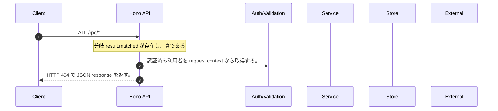

<!-- This file is generated by npm run docs:api-code. Do not edit manually. -->

# ALL /rpc/* シーケンス

## シーケンス図

## 処理順とコード対応

| # | Caller | 境界 | 処理 | コード | 実装位置 |
| ---: | --- | --- | --- | --- | --- |
| 1 | `ALL /rpc/* handler` | Auth | 認証済み利用者を request context から取得する。 | `c.get("user")` | `apps/api/src/app.ts:58 (ALL /rpc/* handler)` |
| 2 | `ALL /rpc/* handler` | HTTP/SSE | HTTP 404 で JSON response を返す。 | `c.json({ error: "oRPC procedure not found" }, 404)` | `apps/api/src/app.ts:63 (ALL /rpc/* handler)` |

## 分岐

| ID | Function | 条件 | 実装位置 |
| --- | --- | --- | --- |
| B001 | `ALL /rpc/* handler` | `result.matched` が存在し、真である | `apps/api/src/app.ts:62 (ALL /rpc/* handler)` |
