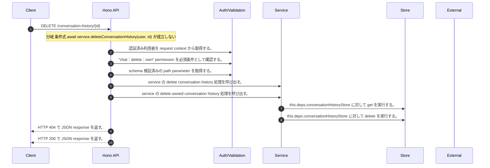

<!-- This file is generated by npm run docs:api-code. Do not edit manually. -->

# DELETE /conversation-history/{id} シーケンス

## シーケンス図

## 処理順とコード対応

| # | Caller | 境界 | 処理 | コード | 実装位置 |
| ---: | --- | --- | --- | --- | --- |
| 1 | `DELETE /conversation-history/{id} handler` | Auth | 認証済み利用者を request context から取得する。 | `c.get("user")` | `apps/api/src/routes/conversation-history-routes.ts:89 (DELETE /conversation-history/{id} handler)` |
| 2 | `DELETE /conversation-history/{id} handler` | Auth | "chat:delete:own" permission を必須条件として確認する。 | `requirePermission(user, "chat:delete:own")` | `apps/api/src/routes/conversation-history-routes.ts:90 (DELETE /conversation-history/{id} handler)` |
| 3 | `DELETE /conversation-history/{id} handler` | Validation | schema 検証済みの path parameter を取得する。 | `validParam<{ id: string }>(c)` | `apps/api/src/routes/conversation-history-routes.ts:91 (DELETE /conversation-history/{id} handler)` |
| 4 | `DELETE /conversation-history/{id} handler` | Service | service の delete conversation history 処理を呼び出す。 | `service.deleteConversationHistory(user, id)` | `apps/api/src/routes/conversation-history-routes.ts:92 (DELETE /conversation-history/{id} handler)` |
| 5 | `MemoRagService.deleteConversationHistory` | Service | service の delete owned conversation history 処理を呼び出す。 | `this.deleteOwnedConversationHistory(subject, id, tenantId)` | `apps/api/src/rag/memorag-service.ts:4148 (MemoRagService.deleteConversationHistory)` |
| 6 | `MemoRagService.deleteOwnedConversationHistory` | Store | `this.deps.conversationHistoryStore` に対して get を実行する。 | `this.deps.conversationHistoryStore.get(ownerKey, id)` | `apps/api/src/rag/memorag-service.ts:5187 (MemoRagService.deleteOwnedConversationHistory)` |
| 7 | `MemoRagService.deleteOwnedConversationHistory` | Store | `this.deps.conversationHistoryStore` に対して delete を実行する。 | `this.deps.conversationHistoryStore.delete(ownerKey, id)` | `apps/api/src/rag/memorag-service.ts:5188 (MemoRagService.deleteOwnedConversationHistory)` |
| 8 | `DELETE /conversation-history/{id} handler` | HTTP/SSE | HTTP 404 で JSON response を返す。 | `c.json({ error: "Conversation history not found" }, 404)` | `apps/api/src/routes/conversation-history-routes.ts:92 (DELETE /conversation-history/{id} handler)` |
| 9 | `DELETE /conversation-history/{id} handler` | HTTP/SSE | HTTP 200 で JSON response を返す。 | `c.json({ id }, 200)` | `apps/api/src/routes/conversation-history-routes.ts:93 (DELETE /conversation-history/{id} handler)` |

## 分岐

| ID | Function | 条件 | 実装位置 |
| --- | --- | --- | --- |
| B001 | `DELETE /conversation-history/{id} handler` | 条件式 `await service.deleteConversationHistory(user, id)` が成立しない | `apps/api/src/routes/conversation-history-routes.ts:92 (DELETE /conversation-history/{id} handler)` |
| B002 | `requirePermission` | 利用者が 指定された permission を持たない | `apps/api/src/authorization.ts:184 (requirePermission)` |
