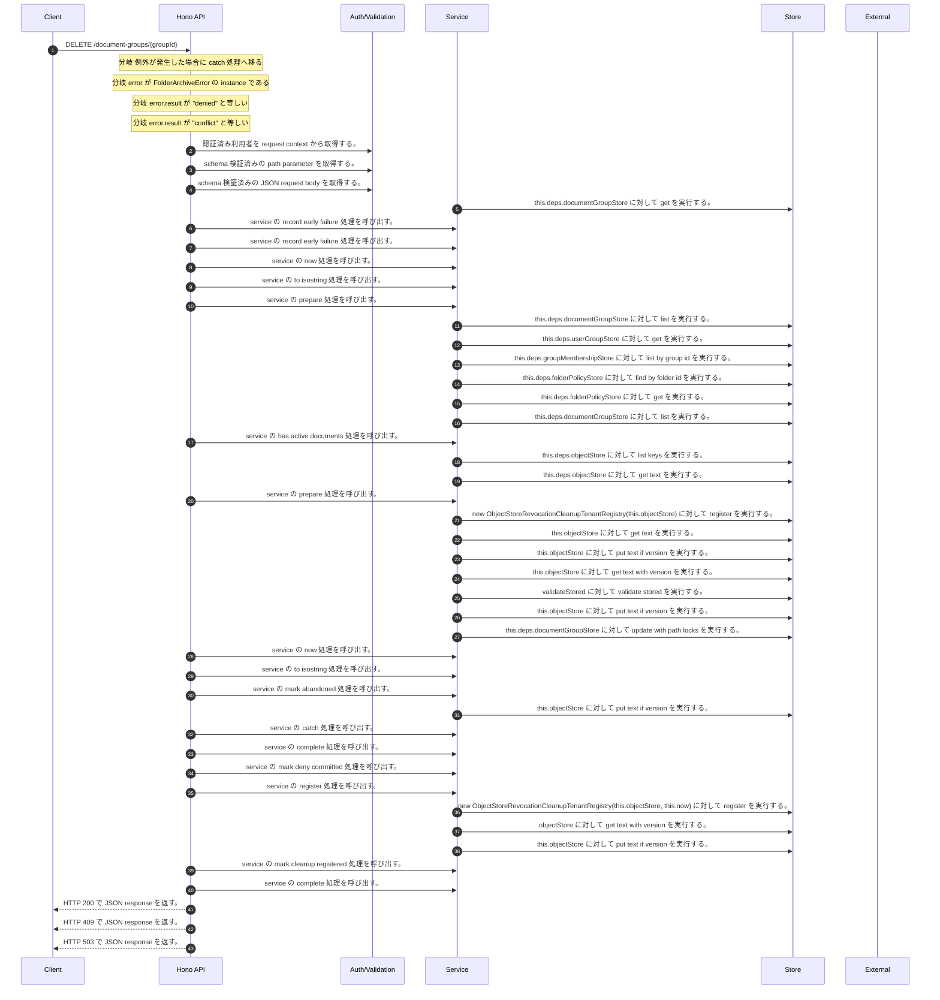

<!-- This file is generated by npm run docs:api-code. Do not edit manually. -->

# DELETE /document-groups/{groupId} シーケンス

## シーケンス図

## 処理順とコード対応

| # | Caller | 境界 | 処理 | コード | 実装位置 |
| ---: | --- | --- | --- | --- | --- |
| 1 | `DELETE /document-groups/{groupId} handler` | Auth | 認証済み利用者を request context から取得する。 | `c.get("user")` | `apps/api/src/routes/document-routes.ts:804 (DELETE /document-groups/{groupId} handler)` |
| 2 | `DELETE /document-groups/{groupId} handler` | Validation | schema 検証済みの path parameter を取得する。 | `validParam<{ groupId: string }>(c)` | `apps/api/src/routes/document-routes.ts:805 (DELETE /document-groups/{groupId} handler)` |
| 3 | `DELETE /document-groups/{groupId} handler` | Validation | schema 検証済みの JSON request body を取得する。 | `validJson<z.infer<typeof ArchiveFolderRequestSchema>>(c)` | `apps/api/src/routes/document-routes.ts:806 (DELETE /document-groups/{groupId} handler)` |
| 4 | `FolderArchiveService.archive` | Store | `this.deps.documentGroupStore` に対して get を実行する。 | `this.deps.documentGroupStore.get(actorTenantId, folderId)` | `apps/api/src/folders/folder-archive-service.ts:88 (FolderArchiveService.archive)` |
| 5 | `FolderArchiveService.archive` | Service | service の record early failure 処理を呼び出す。 | `this.recordEarlyFailure(actor, folderId, input, "failed")` | `apps/api/src/folders/folder-archive-service.ts:90 (FolderArchiveService.archive)` |
| 6 | `FolderArchiveService.archive` | Service | service の record early failure 処理を呼び出す。 | `this.recordEarlyFailure(actor, folderId, input, "denied")` | `apps/api/src/folders/folder-archive-service.ts:94 (FolderArchiveService.archive)` |
| 7 | `FolderArchiveService.archive` | Service | service の now 処理を呼び出す。 | `this.now()` | `apps/api/src/folders/folder-archive-service.ts:97 (FolderArchiveService.archive)` |
| 8 | `FolderArchiveService.archive` | Service | service の to isostring 処理を呼び出す。 | `this.now().toISOString()` | `apps/api/src/folders/folder-archive-service.ts:97 (FolderArchiveService.archive)` |
| 9 | `FolderArchiveService.archive` | Service | service の prepare 処理を呼び出す。 | `this.auditOutbox.prepare({ actorId: actor.userId, tenantId: current.tenantId, targetType: "folder", targetId: folderId, operation: "delete", before: auditFolder(current), proposedAfter: auditFolder(next), reason: input.…` | `apps/api/src/folders/folder-archive-service.ts:98 (FolderArchiveService.archive)` |
| 10 | `FolderPermissionService.resolveEffectiveFolderPermissionDetail` | Store | `this.deps.documentGroupStore` に対して list を実行する。 | `this.deps.documentGroupStore.list(actorTenantId)` | `apps/api/src/folders/folder-permission-service.ts:145 (FolderPermissionService.resolveEffectiveFolderPermissionDetail)` |
| 11 | `FolderPermissionService.resolveUserMembershipPermission` | Store | `this.deps.userGroupStore` に対して get を実行する。 | `this.deps.userGroupStore.get(tenantId, groupId)` | `apps/api/src/folders/folder-permission-service.ts:780 (FolderPermissionService.resolveUserMembershipPermission)` |
| 12 | `FolderPermissionService.resolveUserMembershipPermission` | Store | `this.deps.groupMembershipStore` に対して list by group id を実行する。 | `this.deps.groupMembershipStore.listByGroupId(tenantId, groupId)` | `apps/api/src/folders/folder-permission-service.ts:781 (FolderPermissionService.resolveUserMembershipPermission)` |
| 13 | `FolderPermissionService.resolvePolicyContext` | Store | `this.deps.folderPolicyStore` に対して find by folder id を実行する。 | `this.deps.folderPolicyStore.findByFolderId(folder.tenantId, current.groupId)` | `apps/api/src/folders/folder-permission-service.ts:695 (FolderPermissionService.resolvePolicyContext)` |
| 14 | `FolderPermissionService.resolvePolicyContext` | Store | `this.deps.folderPolicyStore` に対して get を実行する。 | `this.deps.folderPolicyStore.get(folder.tenantId, current.policyId)` | `apps/api/src/folders/folder-permission-service.ts:711 (FolderPermissionService.resolvePolicyContext)` |
| 15 | `FolderArchiveService.archive` | Store | `this.deps.documentGroupStore` に対して list を実行する。 | `this.deps.documentGroupStore.list(current.tenantId)` | `apps/api/src/folders/folder-archive-service.ts:113 (FolderArchiveService.archive)` |
| 16 | `FolderArchiveService.archive` | Service | service の has active documents 処理を呼び出す。 | `this.hasActiveDocuments(current.tenantId, folderId)` | `apps/api/src/folders/folder-archive-service.ts:118 (FolderArchiveService.archive)` |
| 17 | `FolderArchiveService.hasActiveDocuments` | Store | `this.deps.objectStore` に対して list keys を実行する。 | `this.deps.objectStore.listKeys(tenantManifestPrefix(this.deps, tenantId))` | `apps/api/src/folders/folder-archive-service.ts:200 (FolderArchiveService.hasActiveDocuments)` |
| 18 | `FolderArchiveService.hasActiveDocuments` | Store | `this.deps.objectStore` に対して get text を実行する。 | `this.deps.objectStore.getText(key)` | `apps/api/src/folders/folder-archive-service.ts:203 (FolderArchiveService.hasActiveDocuments)` |
| 19 | `FolderArchiveService.archive` | Service | service の prepare 処理を呼び出す。 | `this.cleanupRepairOutbox.prepare({ expectedBeforeDenyVersion: current.updatedAt, cleanupRegistration, preparedAt: next.updatedAt })` | `apps/api/src/folders/folder-archive-service.ts:135 (FolderArchiveService.archive)` |
| 20 | `ObjectStoreRevocationCleanupRepairOutbox.prepare` | Store | `new ObjectStoreRevocationCleanupTenantRegistry(this.objectStore)` に対して register を実行する。 | `new ObjectStoreRevocationCleanupTenantRegistry(this.objectStore).register(registration.tenantId)` | `apps/api/src/rag/_shared/security/revocation-cleanup-repair-outbox.ts:54 (ObjectStoreRevocationCleanupRepairOutbox.prepare)` |
| 21 | `ObjectStoreRevocationCleanupTenantRegistry.read` | Store | `this.objectStore` に対して get text を実行する。 | `this.objectStore.getText(key)` | `apps/api/src/rag/_shared/security/revocation-cleanup-tenant-registry.ts:116 (ObjectStoreRevocationCleanupTenantRegistry.read)` |
| 22 | `ObjectStoreRevocationCleanupTenantRegistry.register` | Store | `this.objectStore` に対して put text if version を実行する。 | `this.objectStore.putTextIfVersion(key, JSON.stringify(record, null, 2), undefined, "application/json")` | `apps/api/src/rag/_shared/security/revocation-cleanup-tenant-registry.ts:41 (ObjectStoreRevocationCleanupTenantRegistry.register)` |
| 23 | `ObjectStoreRevocationCleanupRepairOutbox.read` | Store | `this.objectStore` に対して get text with version を実行する。 | `this.objectStore.getTextWithVersion(key)` | `apps/api/src/rag/_shared/security/revocation-cleanup-repair-outbox.ts:163 (ObjectStoreRevocationCleanupRepairOutbox.read)` |
| 24 | `ObjectStoreRevocationCleanupRepairOutbox.read` | Store | `validateStored` に対して validate stored を実行する。 | `validateStored(value)` | `apps/api/src/rag/_shared/security/revocation-cleanup-repair-outbox.ts:165 (ObjectStoreRevocationCleanupRepairOutbox.read)` |
| 25 | `ObjectStoreRevocationCleanupRepairOutbox.prepare` | Store | `this.objectStore` に対して put text if version を実行する。 | `this.objectStore.putTextIfVersion(key, JSON.stringify(intent, null, 2), undefined, "application/json")` | `apps/api/src/rag/_shared/security/revocation-cleanup-repair-outbox.ts:74 (ObjectStoreRevocationCleanupRepairOutbox.prepare)` |
| 26 | `FolderArchiveService.archive` | Store | `this.deps.documentGroupStore` に対して update with path locks を実行する。 | `this.deps.documentGroupStore.updateWithPathLocks(current.tenantId, [{ current, next }])` | `apps/api/src/folders/folder-archive-service.ts:140 (FolderArchiveService.archive)` |
| 27 | `FolderArchiveService.archive` | Service | service の now 処理を呼び出す。 | `this.now()` | `apps/api/src/folders/folder-archive-service.ts:145 (FolderArchiveService.archive)` |
| 28 | `FolderArchiveService.archive` | Service | service の to isostring 処理を呼び出す。 | `this.now().toISOString()` | `apps/api/src/folders/folder-archive-service.ts:145 (FolderArchiveService.archive)` |
| 29 | `FolderArchiveService.archive` | Service | service の mark abandoned 処理を呼び出す。 | `this.cleanupRepairOutbox.markAbandoned(cleanupRepair, this.now().toISOString())` | `apps/api/src/folders/folder-archive-service.ts:145 (FolderArchiveService.archive)` |
| 30 | `ObjectStoreRevocationCleanupRepairOutbox.transition` | Store | `this.objectStore` に対して put text if version を実行する。 | `this.objectStore.putTextIfVersion(key, JSON.stringify(next, null, 2), stored.version, "application/json")` | `apps/api/src/rag/_shared/security/revocation-cleanup-repair-outbox.ts:152 (ObjectStoreRevocationCleanupRepairOutbox.transition)` |
| 31 | `FolderArchiveService.archive` | Service | service の catch 処理を呼び出す。 | `this.cleanupRepairOutbox.markAbandoned(cleanupRepair, this.now().toISOString()).catch(() => undefined)` | `apps/api/src/folders/folder-archive-service.ts:145 (FolderArchiveService.archive)` |
| 32 | `FolderArchiveService.archive` | Service | service の complete 処理を呼び出す。 | `this.auditOutbox.complete(audit.intentId, current.tenantId, normalized.result, auditFolder(current))` | `apps/api/src/folders/folder-archive-service.ts:148 (FolderArchiveService.archive)` |
| 33 | `FolderArchiveService.archive` | Service | service の mark deny committed 処理を呼び出す。 | `this.cleanupRepairOutbox.markDenyCommitted( cleanupRepair, archived.updatedAt )` | `apps/api/src/folders/folder-archive-service.ts:156 (FolderArchiveService.archive)` |
| 34 | `FolderArchiveService.archive` | Service | service の register 処理を呼び出す。 | `this.cleanupCoordinator.register(committedRepair.cleanupRegistration)` | `apps/api/src/folders/folder-archive-service.ts:160 (FolderArchiveService.archive)` |
| 35 | `ObjectStoreRevocationCleanupCoordinator.register` | Store | `new ObjectStoreRevocationCleanupTenantRegistry(this.objectStore, this.now)` に対して register を実行する。 | `new ObjectStoreRevocationCleanupTenantRegistry(this.objectStore, this.now).register(normalized.tenantId)` | `apps/api/src/rag/_shared/security/revocation-cleanup-coordinator.ts:137 (ObjectStoreRevocationCleanupCoordinator.register)` |
| 36 | `readManifest` | Store | `objectStore` に対して get text with version を実行する。 | `objectStore.getTextWithVersion(key)` | `apps/api/src/rag/_shared/security/revocation-cleanup-coordinator.ts:636 (readManifest)` |
| 37 | `ObjectStoreRevocationCleanupCoordinator.register` | Store | `this.objectStore` に対して put text if version を実行する。 | `this.objectStore.putTextIfVersion(key, JSON.stringify(manifest, null, 2), undefined, "application/json")` | `apps/api/src/rag/_shared/security/revocation-cleanup-coordinator.ts:169 (ObjectStoreRevocationCleanupCoordinator.register)` |
| 38 | `FolderArchiveService.archive` | Service | service の mark cleanup registered 処理を呼び出す。 | `this.cleanupRepairOutbox.markCleanupRegistered(committedRepair, archived.updatedAt)` | `apps/api/src/folders/folder-archive-service.ts:161 (FolderArchiveService.archive)` |
| 39 | `FolderArchiveService.archive` | Service | service の complete 処理を呼び出す。 | `this.auditOutbox.complete(audit.intentId, current.tenantId, "success", auditFolder(archived))` | `apps/api/src/folders/folder-archive-service.ts:169 (FolderArchiveService.archive)` |
| 40 | `DELETE /document-groups/{groupId} handler` | HTTP/SSE | HTTP 200 で JSON response を返す。 | `c.json({ folder }, 200)` | `apps/api/src/routes/document-routes.ts:809 (DELETE /document-groups/{groupId} handler)` |
| 41 | `DELETE /document-groups/{groupId} handler` | HTTP/SSE | HTTP 409 で JSON response を返す。 | `c.json({ error: "Folder archive conflict" }, 409)` | `apps/api/src/routes/document-routes.ts:813 (DELETE /document-groups/{groupId} handler)` |
| 42 | `DELETE /document-groups/{groupId} handler` | HTTP/SSE | HTTP 503 で JSON response を返す。 | `c.json({ error: "Folder archive unavailable" }, 503)` | `apps/api/src/routes/document-routes.ts:815 (DELETE /document-groups/{groupId} handler)` |

## 分岐

| ID | Function | 条件 | 実装位置 |
| --- | --- | --- | --- |
| B001 | `DELETE /document-groups/{groupId} handler` | 例外が発生した場合に catch 処理へ移る | `apps/api/src/routes/document-routes.ts:810 (DELETE /document-groups/{groupId} handler)` |
| B002 | `DELETE /document-groups/{groupId} handler` | `error` が `FolderArchiveError` の instance である | `apps/api/src/routes/document-routes.ts:811 (DELETE /document-groups/{groupId} handler)` |
| B003 | `DELETE /document-groups/{groupId} handler` | `error.result` が `"denied"` と等しい | `apps/api/src/routes/document-routes.ts:812 (DELETE /document-groups/{groupId} handler)` |
| B004 | `DELETE /document-groups/{groupId} handler` | `error.result` が `"conflict"` と等しい | `apps/api/src/routes/document-routes.ts:813 (DELETE /document-groups/{groupId} handler)` |
| B005 | `FolderArchiveService.archive` | canonical の判定結果が真ではない | `apps/api/src/folders/folder-archive-service.ts:83 (FolderArchiveService.archive)` |
| B006 | `FolderArchiveService.archive` | 例外が発生した場合に catch 処理へ移る | `apps/api/src/folders/folder-archive-service.ts:89 (FolderArchiveService.archive)` |
| B007 | `FolderArchiveService.archive` | `current` が存在しない、または偽である、または `current.status` が `"archived"` と等しい、または canonical の判定結果が真ではない | `apps/api/src/folders/folder-archive-service.ts:93 (FolderArchiveService.archive)` |
| B008 | `FolderArchiveService.archive` | `input.expectedVersion` が `current.updatedAt` と異なる | `apps/api/src/folders/folder-archive-service.ts:111 (FolderArchiveService.archive)` |
| B009 | `FolderArchiveService.archive` | `descendantIds.size` が `0` より大きい | `apps/api/src/folders/folder-archive-service.ts:117 (FolderArchiveService.archive)` |
| B010 | `FolderArchiveService.archive` | 条件式 `await this.hasActiveDocuments(current.tenantId, folderId)` が成立する | `apps/api/src/folders/folder-archive-service.ts:118 (FolderArchiveService.archive)` |
| B011 | `FolderArchiveService.archive` | `committed` が存在しない、または偽である | `apps/api/src/folders/folder-archive-service.ts:141 (FolderArchiveService.archive)` |
| B012 | `FolderArchiveService.archive` | 例外が発生した場合に catch 処理へ移る | `apps/api/src/folders/folder-archive-service.ts:143 (FolderArchiveService.archive)` |
| B013 | `FolderArchiveService.archive` | `cleanupRepair` が存在し、真である | `apps/api/src/folders/folder-archive-service.ts:144 (FolderArchiveService.archive)` |
| B014 | `FolderArchiveService.archive` | `cleanupRepair` が存在しない、または偽である | `apps/api/src/folders/folder-archive-service.ts:152 (FolderArchiveService.archive)` |
| B015 | `FolderArchiveService.archive` | `cleanupRepair.cleanupRegistration.authoritativeDenyVersion` が `folderArchiveDenyVersion(archived)` と異なる | `apps/api/src/folders/folder-archive-service.ts:153 (FolderArchiveService.archive)` |
| B016 | `FolderArchiveService.archive` | 例外が発生した場合に catch 処理へ移る | `apps/api/src/folders/folder-archive-service.ts:162 (FolderArchiveService.archive)` |
| B017 | `FolderArchiveService.archive` | 例外が発生した場合に catch 処理へ移る | `apps/api/src/folders/folder-archive-service.ts:170 (FolderArchiveService.archive)` |
