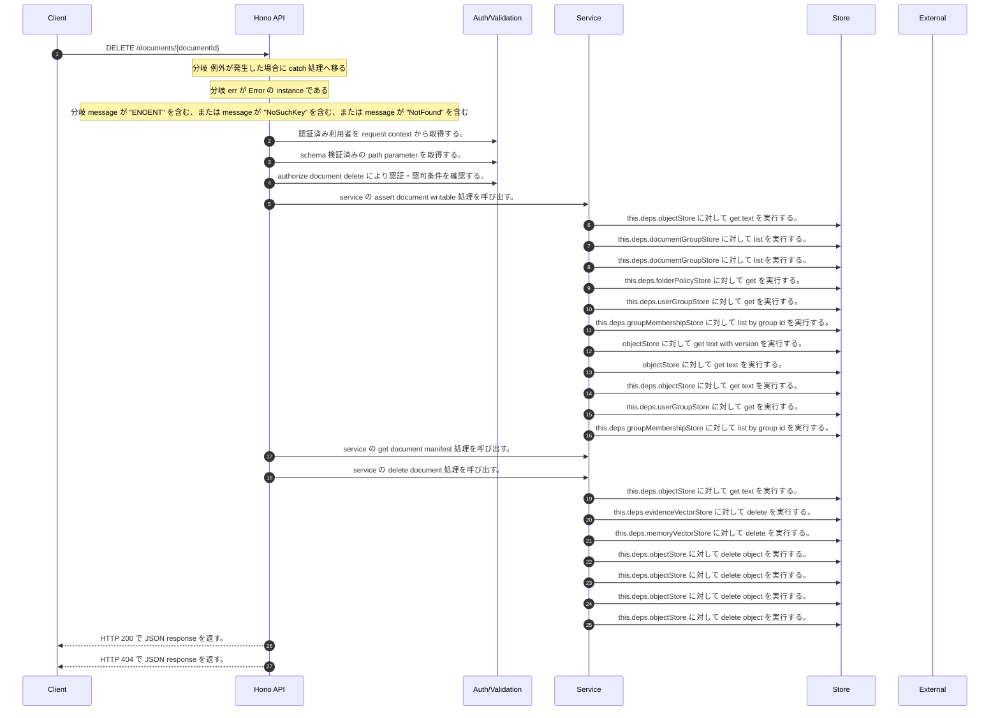

<!-- This file is generated by npm run docs:api-code. Do not edit manually. -->

# DELETE /documents/{documentId} シーケンス

## シーケンス図

## 処理順とコード対応

| # | Caller | 境界 | 処理 | コード | 実装位置 |
| ---: | --- | --- | --- | --- | --- |
| 1 | `DELETE /documents/{documentId} handler` | Auth | 認証済み利用者を request context から取得する。 | `c.get("user")` | `apps/api/src/routes/document-routes.ts:866 (DELETE /documents/{documentId} handler)` |
| 2 | `DELETE /documents/{documentId} handler` | Validation | schema 検証済みの path parameter を取得する。 | `validParam<{ documentId: string }>(c)` | `apps/api/src/routes/document-routes.ts:867 (DELETE /documents/{documentId} handler)` |
| 3 | `DELETE /documents/{documentId} handler` | Auth | authorize document delete により認証・認可条件を確認する。 | `authorizeDocumentDelete(service, user, documentId)` | `apps/api/src/routes/document-routes.ts:869 (DELETE /documents/{documentId} handler)` |
| 4 | `authorizeDocumentDelete` | Service | service の assert document writable 処理を呼び出す。 | `service.assertDocumentWritable(user, documentId)` | `apps/api/src/routes/benchmark-seed.ts:397 (authorizeDocumentDelete)` |
| 5 | `MemoRagService.getManifestByKey` | Store | `this.deps.objectStore` に対して get text を実行する。 | `this.deps.objectStore.getText(key)` | `apps/api/src/rag/memorag-service.ts:1638 (MemoRagService.getManifestByKey)` |
| 6 | `MemoRagService.assertDocumentManifestWritable` | Store | `this.deps.documentGroupStore` に対して list を実行する。 | `this.deps.documentGroupStore.list()` | `apps/api/src/rag/memorag-service.ts:563 (MemoRagService.assertDocumentManifestWritable)` |
| 7 | `FolderPermissionService.resolveEffectiveFolderPermissionDetail` | Store | `this.deps.documentGroupStore` に対して list を実行する。 | `this.deps.documentGroupStore.list()` | `apps/api/src/folders/folder-permission-service.ts:47 (FolderPermissionService.resolveEffectiveFolderPermissionDetail)` |
| 8 | `FolderPermissionService.resolvePolicyContext` | Store | `this.deps.folderPolicyStore` に対して get を実行する。 | `this.deps.folderPolicyStore.get(current.policyId)` | `apps/api/src/folders/folder-permission-service.ts:128 (FolderPermissionService.resolvePolicyContext)` |
| 9 | `FolderPermissionService.resolveUserMembershipPermission` | Store | `this.deps.userGroupStore` に対して get を実行する。 | `this.deps.userGroupStore.get(groupId)` | `apps/api/src/folders/folder-permission-service.ts:166 (FolderPermissionService.resolveUserMembershipPermission)` |
| 10 | `FolderPermissionService.resolveUserMembershipPermission` | Store | `this.deps.groupMembershipStore` に対して list by group id を実行する。 | `this.deps.groupMembershipStore.listByGroupId(groupId)` | `apps/api/src/folders/folder-permission-service.ts:171 (FolderPermissionService.resolveUserMembershipPermission)` |
| 11 | `getTextWithVersion` | Store | `objectStore` に対して get text with version を実行する。 | `objectStore.getTextWithVersion(key)` | `apps/api/src/documents/document-permission-service.ts:418 (getTextWithVersion)` |
| 12 | `getTextWithVersion` | Store | `objectStore` に対して get text を実行する。 | `objectStore.getText(key)` | `apps/api/src/documents/document-permission-service.ts:419 (getTextWithVersion)` |
| 13 | `DocumentPermissionService.loadLegacyDocumentGrants` | Store | `this.deps.objectStore` に対して get text を実行する。 | `this.deps.objectStore.getText(documentShareLegacyLedgerKey)` | `apps/api/src/documents/document-permission-service.ts:193 (DocumentPermissionService.loadLegacyDocumentGrants)` |
| 14 | `DocumentPermissionService.resolveUserMembershipPermission` | Store | `this.deps.userGroupStore` に対して get を実行する。 | `this.deps.userGroupStore.get(groupId)` | `apps/api/src/documents/document-permission-service.ts:287 (DocumentPermissionService.resolveUserMembershipPermission)` |
| 15 | `DocumentPermissionService.resolveUserMembershipPermission` | Store | `this.deps.groupMembershipStore` に対して list by group id を実行する。 | `this.deps.groupMembershipStore.listByGroupId(groupId)` | `apps/api/src/documents/document-permission-service.ts:291 (DocumentPermissionService.resolveUserMembershipPermission)` |
| 16 | `authorizeDocumentDelete` | Service | service の get document manifest 処理を呼び出す。 | `service.getDocumentManifest(documentId)` | `apps/api/src/routes/benchmark-seed.ts:409 (authorizeDocumentDelete)` |
| 17 | `DELETE /documents/{documentId} handler` | Service | service の delete document 処理を呼び出す。 | `service.deleteDocument(documentId)` | `apps/api/src/routes/document-routes.ts:870 (DELETE /documents/{documentId} handler)` |
| 18 | `MemoRagService.deleteDocument` | Store | `this.deps.objectStore` に対して get text を実行する。 | `this.deps.objectStore.getText(manifestKey)` | `apps/api/src/rag/memorag-service.ts:703 (MemoRagService.deleteDocument)` |
| 19 | `MemoRagService.deleteDocument` | Store | `this.deps.evidenceVectorStore` に対して delete を実行する。 | `this.deps.evidenceVectorStore.delete(manifest.evidenceVectorKeys ?? manifest.vectorKeys)` | `apps/api/src/rag/memorag-service.ts:705 (MemoRagService.deleteDocument)` |
| 20 | `MemoRagService.deleteDocument` | Store | `this.deps.memoryVectorStore` に対して delete を実行する。 | `this.deps.memoryVectorStore.delete(manifest.memoryVectorKeys ?? manifest.vectorKeys)` | `apps/api/src/rag/memorag-service.ts:706 (MemoRagService.deleteDocument)` |
| 21 | `MemoRagService.deleteDocument` | Store | `this.deps.objectStore` に対して delete object を実行する。 | `this.deps.objectStore.deleteObject(manifest.sourceObjectKey)` | `apps/api/src/rag/memorag-service.ts:707 (MemoRagService.deleteDocument)` |
| 22 | `MemoRagService.deleteDocument` | Store | `this.deps.objectStore` に対して delete object を実行する。 | `this.deps.objectStore.deleteObject(manifest.structuredBlocksObjectKey)` | `apps/api/src/rag/memorag-service.ts:708 (MemoRagService.deleteDocument)` |
| 23 | `MemoRagService.deleteDocument` | Store | `this.deps.objectStore` に対して delete object を実行する。 | `this.deps.objectStore.deleteObject(manifest.memoryCardsObjectKey)` | `apps/api/src/rag/memorag-service.ts:709 (MemoRagService.deleteDocument)` |
| 24 | `MemoRagService.deleteDocument` | Store | `this.deps.objectStore` に対して delete object を実行する。 | `this.deps.objectStore.deleteObject(manifest.manifestObjectKey)` | `apps/api/src/rag/memorag-service.ts:710 (MemoRagService.deleteDocument)` |
| 25 | `DELETE /documents/{documentId} handler` | HTTP/SSE | HTTP 200 で JSON response を返す。 | `c.json(await service.deleteDocument(documentId), 200)` | `apps/api/src/routes/document-routes.ts:870 (DELETE /documents/{documentId} handler)` |
| 26 | `DELETE /documents/{documentId} handler` | HTTP/SSE | HTTP 404 で JSON response を返す。 | `c.json({ error: "Document not found" }, 404)` | `apps/api/src/routes/document-routes.ts:874 (DELETE /documents/{documentId} handler)` |

## 分岐

| ID | Function | 条件 | 実装位置 |
| --- | --- | --- | --- |
| B001 | `DELETE /documents/{documentId} handler` | 例外が発生した場合に catch 処理へ移る | `apps/api/src/routes/document-routes.ts:871 (DELETE /documents/{documentId} handler)` |
| B002 | `DELETE /documents/{documentId} handler` | `err` が `Error` の instance である | `apps/api/src/routes/document-routes.ts:872 (DELETE /documents/{documentId} handler)` |
| B003 | `DELETE /documents/{documentId} handler` | `message` が "ENOENT" を含む、または `message` が "NoSuchKey" を含む、または `message` が "NotFound" を含む | `apps/api/src/routes/document-routes.ts:873 (DELETE /documents/{documentId} handler)` |
| B004 | `authorizeDocumentDelete` | 利用者が "rag:doc:delete:group" permission を持つ | `apps/api/src/routes/benchmark-seed.ts:395 (authorizeDocumentDelete)` |
| B005 | `authorizeDocumentDelete` | 例外が発生した場合に catch 処理へ移る | `apps/api/src/routes/benchmark-seed.ts:399 (authorizeDocumentDelete)` |
| B006 | `authorizeDocumentDelete` | `err` が `Error` の instance である、かつ starts with の判定結果が真である | `apps/api/src/routes/benchmark-seed.ts:400 (authorizeDocumentDelete)` |
| B007 | `authorizeDocumentDelete` | 利用者が "benchmark:seed_corpus" permission を持たない | `apps/api/src/routes/benchmark-seed.ts:406 (authorizeDocumentDelete)` |
| B008 | `authorizeDocumentDelete` | is benchmark seed document manifest の判定結果が真ではない | `apps/api/src/routes/benchmark-seed.ts:410 (authorizeDocumentDelete)` |
| B009 | `MemoRagService.deleteDocument` | `manifest.structuredBlocksObjectKey` が存在し、真である | `apps/api/src/rag/memorag-service.ts:708 (MemoRagService.deleteDocument)` |
| B010 | `MemoRagService.deleteDocument` | `manifest.memoryCardsObjectKey` が存在し、真である | `apps/api/src/rag/memorag-service.ts:709 (MemoRagService.deleteDocument)` |
