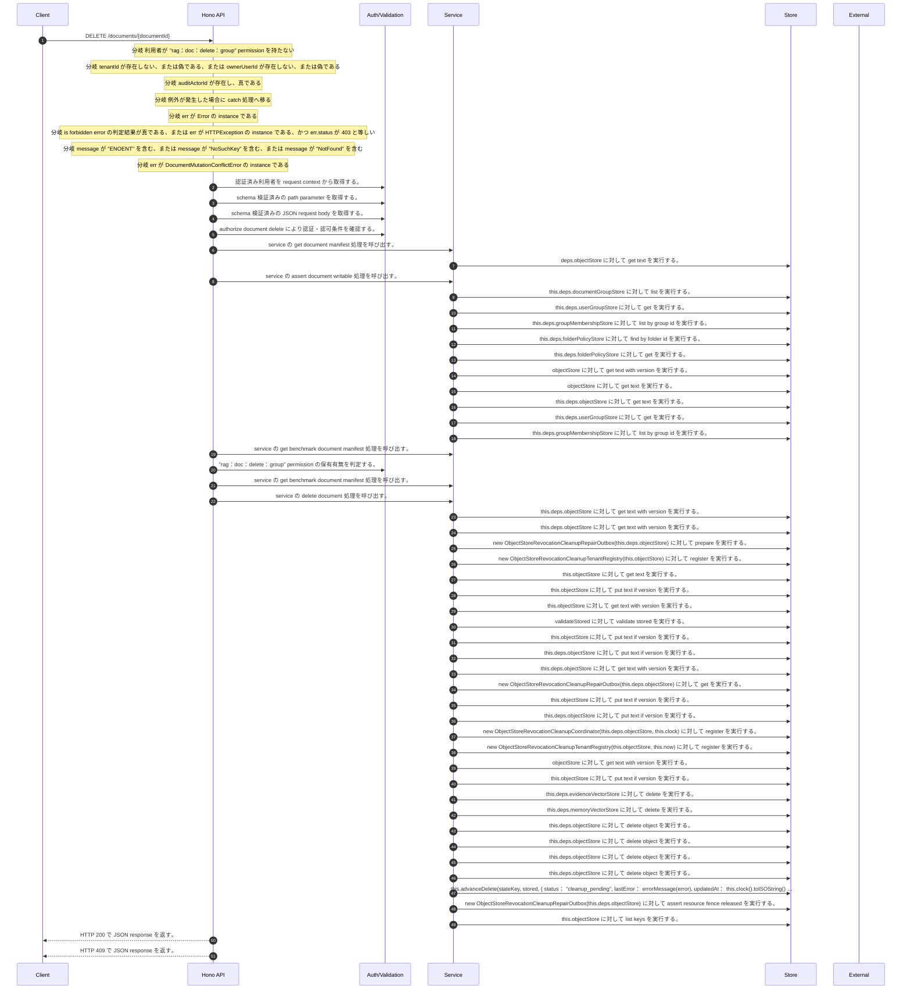

<!-- This file is generated by npm run docs:api-code. Do not edit manually. -->

# DELETE /documents/{documentId} シーケンス

## シーケンス図

## 処理順とコード対応

| # | Caller | 境界 | 処理 | コード | 実装位置 |
| ---: | --- | --- | --- | --- | --- |
| 1 | `DELETE /documents/{documentId} handler` | Auth | 認証済み利用者を request context から取得する。 | `c.get("user")` | `apps/api/src/routes/document-routes.ts:1591 (DELETE /documents/{documentId} handler)` |
| 2 | `DELETE /documents/{documentId} handler` | Validation | schema 検証済みの path parameter を取得する。 | `validParam<{ documentId: string }>(c)` | `apps/api/src/routes/document-routes.ts:1592 (DELETE /documents/{documentId} handler)` |
| 3 | `DELETE /documents/{documentId} handler` | Validation | schema 検証済みの JSON request body を取得する。 | `validJson<z.infer<typeof DeleteDocumentRequestSchema>>(c)` | `apps/api/src/routes/document-routes.ts:1593 (DELETE /documents/{documentId} handler)` |
| 4 | `DELETE /documents/{documentId} handler` | Auth | authorize document delete により認証・認可条件を確認する。 | `authorizeDocumentDelete(service, user, documentId)` | `apps/api/src/routes/document-routes.ts:1595 (DELETE /documents/{documentId} handler)` |
| 5 | `authorizeDocumentDelete` | Service | service の get document manifest 処理を呼び出す。 | `service.getDocumentManifest(documentId, user)` | `apps/api/src/routes/benchmark-seed.ts:399 (authorizeDocumentDelete)` |
| 6 | `readTenantManifest` | Store | `deps.objectStore` に対して get text を実行する。 | `deps.objectStore.getText(key)` | `apps/api/src/rag/_shared/storage/tenant-artifacts.ts:83 (readTenantManifest)` |
| 7 | `authorizeDocumentDelete` | Service | service の assert document writable 処理を呼び出す。 | `service.assertDocumentWritable(user, documentId)` | `apps/api/src/routes/benchmark-seed.ts:401 (authorizeDocumentDelete)` |
| 8 | `FolderPermissionService.resolveEffectiveFolderPermissionDetail` | Store | `this.deps.documentGroupStore` に対して list を実行する。 | `this.deps.documentGroupStore.list(actorTenantId)` | `apps/api/src/folders/folder-permission-service.ts:145 (FolderPermissionService.resolveEffectiveFolderPermissionDetail)` |
| 9 | `FolderPermissionService.resolveUserMembershipPermission` | Store | `this.deps.userGroupStore` に対して get を実行する。 | `this.deps.userGroupStore.get(tenantId, groupId)` | `apps/api/src/folders/folder-permission-service.ts:780 (FolderPermissionService.resolveUserMembershipPermission)` |
| 10 | `FolderPermissionService.resolveUserMembershipPermission` | Store | `this.deps.groupMembershipStore` に対して list by group id を実行する。 | `this.deps.groupMembershipStore.listByGroupId(tenantId, groupId)` | `apps/api/src/folders/folder-permission-service.ts:781 (FolderPermissionService.resolveUserMembershipPermission)` |
| 11 | `FolderPermissionService.resolvePolicyContext` | Store | `this.deps.folderPolicyStore` に対して find by folder id を実行する。 | `this.deps.folderPolicyStore.findByFolderId(folder.tenantId, current.groupId)` | `apps/api/src/folders/folder-permission-service.ts:695 (FolderPermissionService.resolvePolicyContext)` |
| 12 | `FolderPermissionService.resolvePolicyContext` | Store | `this.deps.folderPolicyStore` に対して get を実行する。 | `this.deps.folderPolicyStore.get(folder.tenantId, current.policyId)` | `apps/api/src/folders/folder-permission-service.ts:711 (FolderPermissionService.resolvePolicyContext)` |
| 13 | `getTextWithVersion` | Store | `objectStore` に対して get text with version を実行する。 | `objectStore.getTextWithVersion(key)` | `apps/api/src/documents/document-permission-service.ts:946 (getTextWithVersion)` |
| 14 | `getTextWithVersion` | Store | `objectStore` に対して get text を実行する。 | `objectStore.getText(key)` | `apps/api/src/documents/document-permission-service.ts:947 (getTextWithVersion)` |
| 15 | `DocumentPermissionService.loadLegacyDocumentGrants` | Store | `this.deps.objectStore` に対して get text を実行する。 | `this.deps.objectStore.getText(documentShareLegacyLedgerKey)` | `apps/api/src/documents/document-permission-service.ts:537 (DocumentPermissionService.loadLegacyDocumentGrants)` |
| 16 | `DocumentPermissionService.resolveUserMembershipPermission` | Store | `this.deps.userGroupStore` に対して get を実行する。 | `this.deps.userGroupStore.get(tenantId, groupId)` | `apps/api/src/documents/document-permission-service.ts:683 (DocumentPermissionService.resolveUserMembershipPermission)` |
| 17 | `DocumentPermissionService.resolveUserMembershipPermission` | Store | `this.deps.groupMembershipStore` に対して list by group id を実行する。 | `this.deps.groupMembershipStore.listByGroupId(tenantId, groupId)` | `apps/api/src/documents/document-permission-service.ts:684 (DocumentPermissionService.resolveUserMembershipPermission)` |
| 18 | `authorizeDocumentDelete` | Service | service の get benchmark document manifest 処理を呼び出す。 | `service.getBenchmarkDocumentManifest(documentId)` | `apps/api/src/routes/benchmark-seed.ts:415 (authorizeDocumentDelete)` |
| 19 | `DELETE /documents/{documentId} handler` | Auth | "rag:doc:delete:group" permission の保有有無を判定する。 | `hasPermission(user, "rag:doc:delete:group")` | `apps/api/src/routes/document-routes.ts:1598 (DELETE /documents/{documentId} handler)` |
| 20 | `DELETE /documents/{documentId} handler` | Service | service の get benchmark document manifest 処理を呼び出す。 | `service.getBenchmarkDocumentManifest(documentId)` | `apps/api/src/routes/document-routes.ts:1599 (DELETE /documents/{documentId} handler)` |
| 21 | `DELETE /documents/{documentId} handler` | Service | service の delete document 処理を呼び出す。 | `service.deleteDocument( authorizationActor, documentId, body, auditActorId ? { auditActorId } : undefined )` | `apps/api/src/routes/document-routes.ts:1608 (DELETE /documents/{documentId} handler)` |
| 22 | `DocumentLifecycleMutationCoordinator.readState` | Store | `this.deps.objectStore` に対して get text with version を実行する。 | `this.deps.objectStore.getTextWithVersion(key)` | `apps/api/src/documents/document-lifecycle-mutation-coordinator.ts:965 (DocumentLifecycleMutationCoordinator.readState)` |
| 23 | `DocumentLifecycleMutationCoordinator.readManifest` | Store | `this.deps.objectStore` に対して get text with version を実行する。 | `this.deps.objectStore.getTextWithVersion(key)` | `apps/api/src/documents/document-lifecycle-mutation-coordinator.ts:954 (DocumentLifecycleMutationCoordinator.readManifest)` |
| 24 | `DocumentLifecycleMutationCoordinator.runDeleteStateMachine` | Store | `new ObjectStoreRevocationCleanupRepairOutbox(this.deps.objectStore)` に対して prepare を実行する。 | `new ObjectStoreRevocationCleanupRepairOutbox(this.deps.objectStore).prepare({ expectedBeforeDenyVersion: intent.sourceManifestVersion, cleanupRegistration: documentDeleteCleanupRegistration(intent), preparedAt })` | `apps/api/src/documents/document-lifecycle-mutation-coordinator.ts:570 (DocumentLifecycleMutationCoordinator.runDeleteStateMachine)` |
| 25 | `ObjectStoreRevocationCleanupRepairOutbox.prepare` | Store | `new ObjectStoreRevocationCleanupTenantRegistry(this.objectStore)` に対して register を実行する。 | `new ObjectStoreRevocationCleanupTenantRegistry(this.objectStore).register(registration.tenantId)` | `apps/api/src/rag/_shared/security/revocation-cleanup-repair-outbox.ts:54 (ObjectStoreRevocationCleanupRepairOutbox.prepare)` |
| 26 | `ObjectStoreRevocationCleanupTenantRegistry.read` | Store | `this.objectStore` に対して get text を実行する。 | `this.objectStore.getText(key)` | `apps/api/src/rag/_shared/security/revocation-cleanup-tenant-registry.ts:116 (ObjectStoreRevocationCleanupTenantRegistry.read)` |
| 27 | `ObjectStoreRevocationCleanupTenantRegistry.register` | Store | `this.objectStore` に対して put text if version を実行する。 | `this.objectStore.putTextIfVersion(key, JSON.stringify(record, null, 2), undefined, "application/json")` | `apps/api/src/rag/_shared/security/revocation-cleanup-tenant-registry.ts:41 (ObjectStoreRevocationCleanupTenantRegistry.register)` |
| 28 | `ObjectStoreRevocationCleanupRepairOutbox.read` | Store | `this.objectStore` に対して get text with version を実行する。 | `this.objectStore.getTextWithVersion(key)` | `apps/api/src/rag/_shared/security/revocation-cleanup-repair-outbox.ts:163 (ObjectStoreRevocationCleanupRepairOutbox.read)` |
| 29 | `ObjectStoreRevocationCleanupRepairOutbox.read` | Store | `validateStored` に対して validate stored を実行する。 | `validateStored(value)` | `apps/api/src/rag/_shared/security/revocation-cleanup-repair-outbox.ts:165 (ObjectStoreRevocationCleanupRepairOutbox.read)` |
| 30 | `ObjectStoreRevocationCleanupRepairOutbox.prepare` | Store | `this.objectStore` に対して put text if version を実行する。 | `this.objectStore.putTextIfVersion(key, JSON.stringify(intent, null, 2), undefined, "application/json")` | `apps/api/src/rag/_shared/security/revocation-cleanup-repair-outbox.ts:74 (ObjectStoreRevocationCleanupRepairOutbox.prepare)` |
| 31 | `DocumentLifecycleMutationCoordinator.writeState` | Store | `this.deps.objectStore` に対して put text if version を実行する。 | `this.deps.objectStore.putTextIfVersion(key, JSON.stringify(value, null, 2), expectedVersion, "application/json")` | `apps/api/src/documents/document-lifecycle-mutation-coordinator.ts:974 (DocumentLifecycleMutationCoordinator.writeState)` |
| 32 | `DocumentLifecycleMutationCoordinator.writeState` | Store | `this.deps.objectStore` に対して get text with version を実行する。 | `this.deps.objectStore.getTextWithVersion(key)` | `apps/api/src/documents/document-lifecycle-mutation-coordinator.ts:975 (DocumentLifecycleMutationCoordinator.writeState)` |
| 33 | `DocumentLifecycleMutationCoordinator.runDeleteStateMachine` | Store | `new ObjectStoreRevocationCleanupRepairOutbox(this.deps.objectStore)` に対して get を実行する。 | `new ObjectStoreRevocationCleanupRepairOutbox(this.deps.objectStore).get( intent.tenantId, "document", intent.documentId, intent.operationId )` | `apps/api/src/documents/document-lifecycle-mutation-coordinator.ts:588 (DocumentLifecycleMutationCoordinator.runDeleteStateMachine)` |
| 34 | `ObjectStoreRevocationCleanupRepairOutbox.transition` | Store | `this.objectStore` に対して put text if version を実行する。 | `this.objectStore.putTextIfVersion(key, JSON.stringify(next, null, 2), stored.version, "application/json")` | `apps/api/src/rag/_shared/security/revocation-cleanup-repair-outbox.ts:152 (ObjectStoreRevocationCleanupRepairOutbox.transition)` |
| 35 | `DocumentLifecycleMutationCoordinator.runDeleteStateMachine` | Store | `this.deps.objectStore` に対して put text if version を実行する。 | `this.deps.objectStore.putTextIfVersion( current.value.manifestObjectKey, JSON.stringify(intent.tombstoneManifest, null, 2), intent.sourceManifestVersion, "application/json" )` | `apps/api/src/documents/document-lifecycle-mutation-coordinator.ts:610 (DocumentLifecycleMutationCoordinator.runDeleteStateMachine)` |
| 36 | `DocumentLifecycleMutationCoordinator.registerDocumentDeleteCleanup` | Store | `new ObjectStoreRevocationCleanupCoordinator(this.deps.objectStore, this.clock)         ` に対して register を実行する。 | `new ObjectStoreRevocationCleanupCoordinator(this.deps.objectStore, this.clock) .register(repair.cleanupRegistration)` | `apps/api/src/documents/document-lifecycle-mutation-coordinator.ts:905 (DocumentLifecycleMutationCoordinator.registerDocumentDeleteCleanup)` |
| 37 | `ObjectStoreRevocationCleanupCoordinator.register` | Store | `new ObjectStoreRevocationCleanupTenantRegistry(this.objectStore, this.now)` に対して register を実行する。 | `new ObjectStoreRevocationCleanupTenantRegistry(this.objectStore, this.now).register(normalized.tenantId)` | `apps/api/src/rag/_shared/security/revocation-cleanup-coordinator.ts:137 (ObjectStoreRevocationCleanupCoordinator.register)` |
| 38 | `readManifest` | Store | `objectStore` に対して get text with version を実行する。 | `objectStore.getTextWithVersion(key)` | `apps/api/src/rag/_shared/security/revocation-cleanup-coordinator.ts:636 (readManifest)` |
| 39 | `ObjectStoreRevocationCleanupCoordinator.register` | Store | `this.objectStore` に対して put text if version を実行する。 | `this.objectStore.putTextIfVersion(key, JSON.stringify(manifest, null, 2), undefined, "application/json")` | `apps/api/src/rag/_shared/security/revocation-cleanup-coordinator.ts:169 (ObjectStoreRevocationCleanupCoordinator.register)` |
| 40 | `DocumentLifecycleMutationCoordinator.cleanupDeletedDocument` | Store | `this.deps.evidenceVectorStore` に対して delete を実行する。 | `this.deps.evidenceVectorStore.delete(manifest.evidenceVectorKeys ?? manifest.vectorKeys)` | `apps/api/src/documents/document-lifecycle-mutation-coordinator.ts:880 (DocumentLifecycleMutationCoordinator.cleanupDeletedDocument)` |
| 41 | `DocumentLifecycleMutationCoordinator.cleanupDeletedDocument` | Store | `this.deps.memoryVectorStore` に対して delete を実行する。 | `this.deps.memoryVectorStore.delete(manifest.memoryVectorKeys ?? manifest.vectorKeys)` | `apps/api/src/documents/document-lifecycle-mutation-coordinator.ts:881 (DocumentLifecycleMutationCoordinator.cleanupDeletedDocument)` |
| 42 | `DocumentLifecycleMutationCoordinator.cleanupDeletedDocument` | Store | `this.deps.objectStore` に対して delete object を実行する。 | `this.deps.objectStore.deleteObject(manifest.sourceObjectKey)` | `apps/api/src/documents/document-lifecycle-mutation-coordinator.ts:882 (DocumentLifecycleMutationCoordinator.cleanupDeletedDocument)` |
| 43 | `DocumentLifecycleMutationCoordinator.cleanupDeletedDocument` | Store | `this.deps.objectStore` に対して delete object を実行する。 | `this.deps.objectStore.deleteObject(manifest.structuredBlocksObjectKey)` | `apps/api/src/documents/document-lifecycle-mutation-coordinator.ts:883 (DocumentLifecycleMutationCoordinator.cleanupDeletedDocument)` |
| 44 | `DocumentLifecycleMutationCoordinator.cleanupDeletedDocument` | Store | `this.deps.objectStore` に対して delete object を実行する。 | `this.deps.objectStore.deleteObject(manifest.memoryCardsObjectKey)` | `apps/api/src/documents/document-lifecycle-mutation-coordinator.ts:884 (DocumentLifecycleMutationCoordinator.cleanupDeletedDocument)` |
| 45 | `DocumentLifecycleMutationCoordinator.cleanupDeletedDocument` | Store | `this.deps.objectStore` に対して delete object を実行する。 | `this.deps.objectStore.deleteObject(documentShareGrantKey(authoritativeTenantId(manifest), manifest.documentId))` | `apps/api/src/documents/document-lifecycle-mutation-coordinator.ts:885 (DocumentLifecycleMutationCoordinator.cleanupDeletedDocument)` |
| 46 | `DocumentLifecycleMutationCoordinator.runDeleteStateMachine` | Store | `this.advanceDelete(stateKey, stored, {             status: "cleanup_pending",             lastError: errorMessage(error),             updatedAt: this.clock().toISOString()           })` に対して catch を実行する。 | `this.advanceDelete(stateKey, stored, { status: "cleanup_pending", lastError: errorMessage(error), updatedAt: this.clock().toISOString() }).catch(() => undefined)` | `apps/api/src/documents/document-lifecycle-mutation-coordinator.ts:638 (DocumentLifecycleMutationCoordinator.runDeleteStateMachine)` |
| 47 | `DocumentLifecycleMutationCoordinator.deleteDocument` | Store | `new ObjectStoreRevocationCleanupRepairOutbox(this.deps.objectStore)         ` に対して assert resource fence released を実行する。 | `new ObjectStoreRevocationCleanupRepairOutbox(this.deps.objectStore) .assertResourceFenceReleased(tenantId, "document", documentId)` | `apps/api/src/documents/document-lifecycle-mutation-coordinator.ts:369 (DocumentLifecycleMutationCoordinator.deleteDocument)` |
| 48 | `ObjectStoreRevocationCleanupRepairOutbox.assertResourceFenceReleased` | Store | `this.objectStore` に対して list keys を実行する。 | `this.objectStore.listKeys(prefix)` | `apps/api/src/rag/_shared/security/revocation-cleanup-repair-outbox.ts:109 (ObjectStoreRevocationCleanupRepairOutbox.assertResourceFenceReleased)` |
| 49 | `DELETE /documents/{documentId} handler` | HTTP/SSE | HTTP 200 で JSON response を返す。 | `c.json(await service.deleteDocument( authorizationActor, documentId, body, auditActorId ? { auditActorId } : undefined ), 200)` | `apps/api/src/routes/document-routes.ts:1608 (DELETE /documents/{documentId} handler)` |
| 50 | `DELETE /documents/{documentId} handler` | HTTP/SSE | HTTP 409 で JSON response を返す。 | `c.json({ error: err.message }, 409)` | `apps/api/src/routes/document-routes.ts:1618 (DELETE /documents/{documentId} handler)` |

## 分岐

| ID | Function | 条件 | 実装位置 |
| --- | --- | --- | --- |
| B001 | `DELETE /documents/{documentId} handler` | 利用者が "rag:doc:delete:group" permission を持たない | `apps/api/src/routes/document-routes.ts:1598 (DELETE /documents/{documentId} handler)` |
| B002 | `DELETE /documents/{documentId} handler` | `tenantId` が存在しない、または偽である、または `ownerUserId` が存在しない、または偽である | `apps/api/src/routes/document-routes.ts:1602 (DELETE /documents/{documentId} handler)` |
| B003 | `DELETE /documents/{documentId} handler` | `auditActorId` が存在し、真である | `apps/api/src/routes/document-routes.ts:1612 (DELETE /documents/{documentId} handler)` |
| B004 | `DELETE /documents/{documentId} handler` | 例外が発生した場合に catch 処理へ移る | `apps/api/src/routes/document-routes.ts:1614 (DELETE /documents/{documentId} handler)` |
| B005 | `DELETE /documents/{documentId} handler` | `err` が `Error` の instance である | `apps/api/src/routes/document-routes.ts:1615 (DELETE /documents/{documentId} handler)` |
| B006 | `DELETE /documents/{documentId} handler` | is forbidden error の判定結果が真である、または `err` が `HTTPException` の instance である、かつ `err.status` が `403` と等しい | `apps/api/src/routes/document-routes.ts:1616 (DELETE /documents/{documentId} handler)` |
| B007 | `DELETE /documents/{documentId} handler` | `message` が "ENOENT" を含む、または `message` が "NoSuchKey" を含む、または `message` が "NotFound" を含む | `apps/api/src/routes/document-routes.ts:1617 (DELETE /documents/{documentId} handler)` |
| B008 | `DELETE /documents/{documentId} handler` | `err` が `DocumentMutationConflictError` の instance である | `apps/api/src/routes/document-routes.ts:1618 (DELETE /documents/{documentId} handler)` |
| B009 | `authorizeDocumentDelete` | 利用者が "rag:doc:delete:group" permission を持つ | `apps/api/src/routes/benchmark-seed.ts:398 (authorizeDocumentDelete)` |
| B010 | `authorizeDocumentDelete` | is document deletion tombstone の判定結果が真である | `apps/api/src/routes/benchmark-seed.ts:399 (authorizeDocumentDelete)` |
| B011 | `authorizeDocumentDelete` | 例外が発生した場合に catch 処理へ移る | `apps/api/src/routes/benchmark-seed.ts:403 (authorizeDocumentDelete)` |
| B012 | `authorizeDocumentDelete` | `err` が `Error` の instance である、かつ starts with の判定結果が真である | `apps/api/src/routes/benchmark-seed.ts:404 (authorizeDocumentDelete)` |
| B013 | `authorizeDocumentDelete` | 利用者が "benchmark:seed_corpus" permission を持たない | `apps/api/src/routes/benchmark-seed.ts:410 (authorizeDocumentDelete)` |
| B014 | `authorizeDocumentDelete` | 例外が発生した場合に catch 処理へ移る | `apps/api/src/routes/benchmark-seed.ts:416 (authorizeDocumentDelete)` |
| B015 | `authorizeDocumentDelete` | is benchmark seed document manifest の判定結果が真ではない、かつ 「`deletionRetry` が存在し、真である、かつ is benchmark seed document identity の判定結果が真である」ではない | `apps/api/src/routes/benchmark-seed.ts:420 (authorizeDocumentDelete)` |
| B016 | `MemoRagService.getBenchmarkDocumentManifest` | `tenantId` が存在しない、または偽である | `apps/api/src/rag/memorag-service.ts:949 (MemoRagService.getBenchmarkDocumentManifest)` |
| B017 | `stringValue` | `typeof value` が `"string"` と等しい | `apps/api/src/routes/document-routes.ts:450 (stringValue)` |
