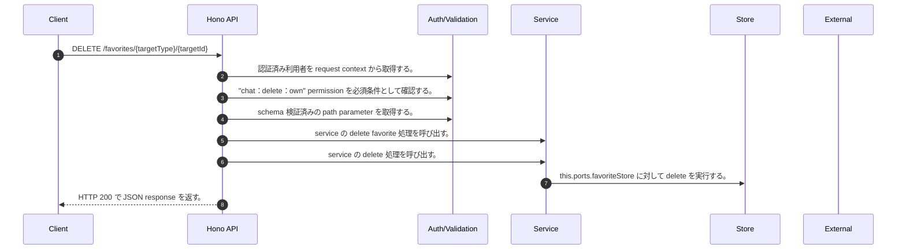

<!-- This file is generated by npm run docs:api-code. Do not edit manually. -->

# DELETE /favorites/{targetType}/{targetId} シーケンス

## シーケンス図

## 処理順とコード対応

| # | Caller | 境界 | 処理 | コード | 実装位置 |
| ---: | --- | --- | --- | --- | --- |
| 1 | `DELETE /favorites/{targetType}/{targetId} handler` | Auth | 認証済み利用者を request context から取得する。 | `c.get("user")` | `apps/api/src/routes/favorite-routes.ts:63 (DELETE /favorites/{targetType}/{targetId} handler)` |
| 2 | `DELETE /favorites/{targetType}/{targetId} handler` | Auth | "chat:delete:own" permission を必須条件として確認する。 | `requirePermission(user, "chat:delete:own")` | `apps/api/src/routes/favorite-routes.ts:64 (DELETE /favorites/{targetType}/{targetId} handler)` |
| 3 | `DELETE /favorites/{targetType}/{targetId} handler` | Validation | schema 検証済みの path parameter を取得する。 | `validParam<z.infer<typeof FavoriteTargetTypeParamSchema>>(c)` | `apps/api/src/routes/favorite-routes.ts:65 (DELETE /favorites/{targetType}/{targetId} handler)` |
| 4 | `DELETE /favorites/{targetType}/{targetId} handler` | Service | service の delete favorite 処理を呼び出す。 | `service.deleteFavorite(user, targetType, targetId)` | `apps/api/src/routes/favorite-routes.ts:66 (DELETE /favorites/{targetType}/{targetId} handler)` |
| 5 | `MemoRagService.deleteFavorite` | Service | service の delete 処理を呼び出す。 | `this.favoriteService.delete(subject, targetType, targetId, tenantId)` | `apps/api/src/rag/memorag-service.ts:4184 (MemoRagService.deleteFavorite)` |
| 6 | `FavoriteService.delete` | Store | `this.ports.favoriteStore` に対して delete を実行する。 | `this.ports.favoriteStore.delete(this.ports.ownerKey(subject, tenantId), targetType, targetId)` | `apps/api/src/favorites/favorite-service.ts:37 (FavoriteService.delete)` |
| 7 | `DELETE /favorites/{targetType}/{targetId} handler` | HTTP/SSE | HTTP 200 で JSON response を返す。 | `c.json({ targetType, targetId }, 200)` | `apps/api/src/routes/favorite-routes.ts:67 (DELETE /favorites/{targetType}/{targetId} handler)` |

## 分岐

| ID | Function | 条件 | 実装位置 |
| --- | --- | --- | --- |
| B001 | `requirePermission` | 利用者が 指定された permission を持たない | `apps/api/src/authorization.ts:184 (requirePermission)` |
