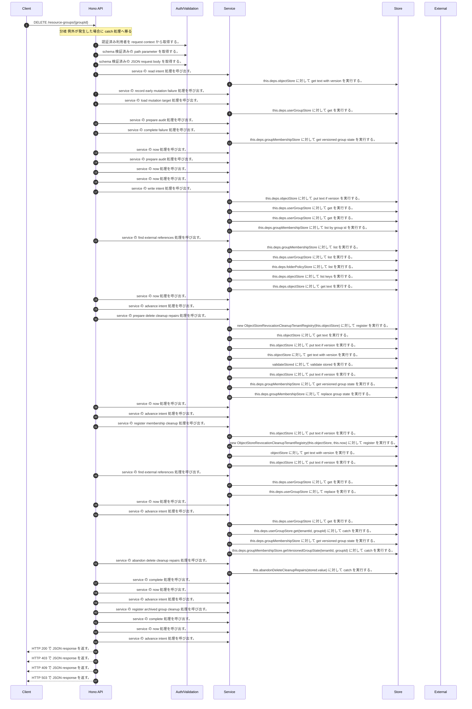

<!-- This file is generated by npm run docs:api-code. Do not edit manually. -->

# DELETE /resource-groups/{groupId} シーケンス

## シーケンス図

## 処理順とコード対応

| # | Caller | 境界 | 処理 | コード | 実装位置 |
| ---: | --- | --- | --- | --- | --- |
| 1 | `DELETE /resource-groups/{groupId} handler` | Auth | 認証済み利用者を request context から取得する。 | `c.get("user")` | `apps/api/src/routes/resource-group-routes.ts:200 (DELETE /resource-groups/{groupId} handler)` |
| 2 | `DELETE /resource-groups/{groupId} handler` | Validation | schema 検証済みの path parameter を取得する。 | `validParam<{ groupId: string }>(c)` | `apps/api/src/routes/resource-group-routes.ts:201 (DELETE /resource-groups/{groupId} handler)` |
| 3 | `DELETE /resource-groups/{groupId} handler` | Validation | schema 検証済みの JSON request body を取得する。 | `validJson<DeleteResourceGroupInput>(c)` | `apps/api/src/routes/resource-group-routes.ts:202 (DELETE /resource-groups/{groupId} handler)` |
| 4 | `ResourceGroupLifecycleService.delete` | Service | service の read intent 処理を呼び出す。 | `this.readIntent<DeleteLifecycleIntent>(key)` | `apps/api/src/security/resource-group-lifecycle-service.ts:286 (ResourceGroupLifecycleService.delete)` |
| 5 | `ResourceGroupLifecycleService.readIntent` | Store | `this.deps.objectStore` に対して get text with version を実行する。 | `this.deps.objectStore.getTextWithVersion(key)` | `apps/api/src/security/resource-group-lifecycle-service.ts:649 (ResourceGroupLifecycleService.readIntent)` |
| 6 | `ResourceGroupLifecycleService.delete` | Service | service の record early mutation failure 処理を呼び出す。 | `this.recordEarlyMutationFailure(actor, groupId, "delete", input.reason, "denied")` | `apps/api/src/security/resource-group-lifecycle-service.ts:289 (ResourceGroupLifecycleService.delete)` |
| 7 | `ResourceGroupLifecycleService.delete` | Service | service の load mutation target 処理を呼び出す。 | `this.loadMutationTarget(actor, groupId, "delete", input.reason)` | `apps/api/src/security/resource-group-lifecycle-service.ts:296 (ResourceGroupLifecycleService.delete)` |
| 8 | `ResourceGroupLifecycleService.loadMutationTarget` | Store | `this.deps.userGroupStore` に対して get を実行する。 | `this.deps.userGroupStore.get(tenantId, groupId)` | `apps/api/src/security/resource-group-lifecycle-service.ts:576 (ResourceGroupLifecycleService.loadMutationTarget)` |
| 9 | `ResourceGroupLifecycleService.delete` | Service | service の prepare audit 処理を呼び出す。 | `this.prepareAudit(actor, tenantId, groupId, "delete", group, group, input.reason)` | `apps/api/src/security/resource-group-lifecycle-service.ts:298 (ResourceGroupLifecycleService.delete)` |
| 10 | `ResourceGroupLifecycleService.delete` | Service | service の complete failure 処理を呼び出す。 | `this.completeFailure(audit, "conflict", group)` | `apps/api/src/security/resource-group-lifecycle-service.ts:299 (ResourceGroupLifecycleService.delete)` |
| 11 | `ResourceGroupLifecycleService.delete` | Store | `this.deps.groupMembershipStore` に対して get versioned group state を実行する。 | `this.deps.groupMembershipStore.getVersionedGroupState(tenantId, groupId)` | `apps/api/src/security/resource-group-lifecycle-service.ts:302 (ResourceGroupLifecycleService.delete)` |
| 12 | `ResourceGroupLifecycleService.delete` | Service | service の now 処理を呼び出す。 | `this.now()` | `apps/api/src/security/resource-group-lifecycle-service.ts:303 (ResourceGroupLifecycleService.delete)` |
| 13 | `ResourceGroupLifecycleService.delete` | Service | service の prepare audit 処理を呼び出す。 | `this.prepareAudit(actor, tenantId, groupId, "delete", group, archivedGroup, input.reason)` | `apps/api/src/security/resource-group-lifecycle-service.ts:304 (ResourceGroupLifecycleService.delete)` |
| 14 | `ResourceGroupLifecycleService.delete` | Service | service の now 処理を呼び出す。 | `this.now()` | `apps/api/src/security/resource-group-lifecycle-service.ts:317 (ResourceGroupLifecycleService.delete)` |
| 15 | `ResourceGroupLifecycleService.delete` | Service | service の now 処理を呼び出す。 | `this.now()` | `apps/api/src/security/resource-group-lifecycle-service.ts:318 (ResourceGroupLifecycleService.delete)` |
| 16 | `ResourceGroupLifecycleService.delete` | Service | service の write intent 処理を呼び出す。 | `this.writeIntent(key, intent)` | `apps/api/src/security/resource-group-lifecycle-service.ts:320 (ResourceGroupLifecycleService.delete)` |
| 17 | `ResourceGroupLifecycleService.writeIntent` | Store | `this.deps.objectStore` に対して put text if version を実行する。 | `this.deps.objectStore.putTextIfVersion( key, JSON.stringify(value, null, 2), expectedVersion, "application/json" )` | `apps/api/src/security/resource-group-lifecycle-service.ts:666 (ResourceGroupLifecycleService.writeIntent)` |
| 18 | `ResourceGroupLifecycleService.delete` | Store | `this.deps.userGroupStore` に対して get を実行する。 | `this.deps.userGroupStore.get(tenantId, groupId)` | `apps/api/src/security/resource-group-lifecycle-service.ts:326 (ResourceGroupLifecycleService.delete)` |
| 19 | `ResourceGroupLifecycleService.resolveNestedMembershipPermission` | Store | `this.deps.userGroupStore` に対して get を実行する。 | `this.deps.userGroupStore.get(tenantId, groupId)` | `apps/api/src/security/resource-group-lifecycle-service.ts:502 (ResourceGroupLifecycleService.resolveNestedMembershipPermission)` |
| 20 | `ResourceGroupLifecycleService.resolveNestedMembershipPermission` | Store | `this.deps.groupMembershipStore` に対して list by group id を実行する。 | `this.deps.groupMembershipStore.listByGroupId(tenantId, groupId)` | `apps/api/src/security/resource-group-lifecycle-service.ts:507 (ResourceGroupLifecycleService.resolveNestedMembershipPermission)` |
| 21 | `ResourceGroupLifecycleService.delete` | Service | service の find external references 処理を呼び出す。 | `this.findExternalReferences(currentGroup)` | `apps/api/src/security/resource-group-lifecycle-service.ts:331 (ResourceGroupLifecycleService.delete)` |
| 22 | `ResourceGroupLifecycleService.findExternalReferences` | Store | `this.deps.groupMembershipStore` に対して list を実行する。 | `this.deps.groupMembershipStore.list(tenantId)` | `apps/api/src/security/resource-group-lifecycle-service.ts:523 (ResourceGroupLifecycleService.findExternalReferences)` |
| 23 | `ResourceGroupLifecycleService.findExternalReferences` | Store | `this.deps.userGroupStore` に対して list を実行する。 | `this.deps.userGroupStore.list(tenantId)` | `apps/api/src/security/resource-group-lifecycle-service.ts:524 (ResourceGroupLifecycleService.findExternalReferences)` |
| 24 | `ResourceGroupLifecycleService.findExternalReferences` | Store | `this.deps.folderPolicyStore` に対して list を実行する。 | `this.deps.folderPolicyStore.list(tenantId)` | `apps/api/src/security/resource-group-lifecycle-service.ts:525 (ResourceGroupLifecycleService.findExternalReferences)` |
| 25 | `ResourceGroupLifecycleService.findExternalReferences` | Store | `this.deps.objectStore` に対して list keys を実行する。 | `this.deps.objectStore.listKeys(\`documents/share-grants/${encodeURIComponent(tenantId)}/\`)` | `apps/api/src/security/resource-group-lifecycle-service.ts:526 (ResourceGroupLifecycleService.findExternalReferences)` |
| 26 | `ResourceGroupLifecycleService.findExternalReferences` | Store | `this.deps.objectStore` に対して get text を実行する。 | `this.deps.objectStore.getText(key)` | `apps/api/src/security/resource-group-lifecycle-service.ts:546 (ResourceGroupLifecycleService.findExternalReferences)` |
| 27 | `ResourceGroupLifecycleService.delete` | Service | service の now 処理を呼び出す。 | `this.now()` | `apps/api/src/security/resource-group-lifecycle-service.ts:352 (ResourceGroupLifecycleService.delete)` |
| 28 | `ResourceGroupLifecycleService.delete` | Service | service の advance intent 処理を呼び出す。 | `this.advanceIntent(key, stored, { status: "authorized", permission: permission.permission, administrativePrincipal: permission.administrativePrincipal, updatedAt: this.now() })` | `apps/api/src/security/resource-group-lifecycle-service.ts:348 (ResourceGroupLifecycleService.delete)` |
| 29 | `ResourceGroupLifecycleService.delete` | Service | service の prepare delete cleanup repairs 処理を呼び出す。 | `this.prepareDeleteCleanupRepairs(stored.value)` | `apps/api/src/security/resource-group-lifecycle-service.ts:371 (ResourceGroupLifecycleService.delete)` |
| 30 | `ObjectStoreRevocationCleanupRepairOutbox.prepare` | Store | `new ObjectStoreRevocationCleanupTenantRegistry(this.objectStore)` に対して register を実行する。 | `new ObjectStoreRevocationCleanupTenantRegistry(this.objectStore).register(registration.tenantId)` | `apps/api/src/rag/_shared/security/revocation-cleanup-repair-outbox.ts:54 (ObjectStoreRevocationCleanupRepairOutbox.prepare)` |
| 31 | `ObjectStoreRevocationCleanupTenantRegistry.read` | Store | `this.objectStore` に対して get text を実行する。 | `this.objectStore.getText(key)` | `apps/api/src/rag/_shared/security/revocation-cleanup-tenant-registry.ts:116 (ObjectStoreRevocationCleanupTenantRegistry.read)` |
| 32 | `ObjectStoreRevocationCleanupTenantRegistry.register` | Store | `this.objectStore` に対して put text if version を実行する。 | `this.objectStore.putTextIfVersion(key, JSON.stringify(record, null, 2), undefined, "application/json")` | `apps/api/src/rag/_shared/security/revocation-cleanup-tenant-registry.ts:41 (ObjectStoreRevocationCleanupTenantRegistry.register)` |
| 33 | `ObjectStoreRevocationCleanupRepairOutbox.read` | Store | `this.objectStore` に対して get text with version を実行する。 | `this.objectStore.getTextWithVersion(key)` | `apps/api/src/rag/_shared/security/revocation-cleanup-repair-outbox.ts:163 (ObjectStoreRevocationCleanupRepairOutbox.read)` |
| 34 | `ObjectStoreRevocationCleanupRepairOutbox.read` | Store | `validateStored` に対して validate stored を実行する。 | `validateStored(value)` | `apps/api/src/rag/_shared/security/revocation-cleanup-repair-outbox.ts:165 (ObjectStoreRevocationCleanupRepairOutbox.read)` |
| 35 | `ObjectStoreRevocationCleanupRepairOutbox.prepare` | Store | `this.objectStore` に対して put text if version を実行する。 | `this.objectStore.putTextIfVersion(key, JSON.stringify(intent, null, 2), undefined, "application/json")` | `apps/api/src/rag/_shared/security/revocation-cleanup-repair-outbox.ts:74 (ObjectStoreRevocationCleanupRepairOutbox.prepare)` |
| 36 | `ResourceGroupLifecycleService.delete` | Store | `this.deps.groupMembershipStore` に対して get versioned group state を実行する。 | `this.deps.groupMembershipStore.getVersionedGroupState(tenantId, groupId)` | `apps/api/src/security/resource-group-lifecycle-service.ts:372 (ResourceGroupLifecycleService.delete)` |
| 37 | `ResourceGroupLifecycleService.delete` | Store | `this.deps.groupMembershipStore` に対して replace group state を実行する。 | `this.deps.groupMembershipStore.replaceGroupState(tenantId, groupId, [], ownState.version)` | `apps/api/src/security/resource-group-lifecycle-service.ts:377 (ResourceGroupLifecycleService.delete)` |
| 38 | `ResourceGroupLifecycleService.delete` | Service | service の now 処理を呼び出す。 | `this.now()` | `apps/api/src/security/resource-group-lifecycle-service.ts:379 (ResourceGroupLifecycleService.delete)` |
| 39 | `ResourceGroupLifecycleService.delete` | Service | service の advance intent 処理を呼び出す。 | `this.advanceIntent(key, stored, { status: "memberships_cleared", updatedAt: this.now() })` | `apps/api/src/security/resource-group-lifecycle-service.ts:379 (ResourceGroupLifecycleService.delete)` |
| 40 | `ResourceGroupLifecycleService.delete` | Service | service の register membership cleanup 処理を呼び出す。 | `this.registerMembershipCleanup(stored.value)` | `apps/api/src/security/resource-group-lifecycle-service.ts:383 (ResourceGroupLifecycleService.delete)` |
| 41 | `ObjectStoreRevocationCleanupRepairOutbox.transition` | Store | `this.objectStore` に対して put text if version を実行する。 | `this.objectStore.putTextIfVersion(key, JSON.stringify(next, null, 2), stored.version, "application/json")` | `apps/api/src/rag/_shared/security/revocation-cleanup-repair-outbox.ts:152 (ObjectStoreRevocationCleanupRepairOutbox.transition)` |
| 42 | `ObjectStoreRevocationCleanupCoordinator.register` | Store | `new ObjectStoreRevocationCleanupTenantRegistry(this.objectStore, this.now)` に対して register を実行する。 | `new ObjectStoreRevocationCleanupTenantRegistry(this.objectStore, this.now).register(normalized.tenantId)` | `apps/api/src/rag/_shared/security/revocation-cleanup-coordinator.ts:137 (ObjectStoreRevocationCleanupCoordinator.register)` |
| 43 | `readManifest` | Store | `objectStore` に対して get text with version を実行する。 | `objectStore.getTextWithVersion(key)` | `apps/api/src/rag/_shared/security/revocation-cleanup-coordinator.ts:636 (readManifest)` |
| 44 | `ObjectStoreRevocationCleanupCoordinator.register` | Store | `this.objectStore` に対して put text if version を実行する。 | `this.objectStore.putTextIfVersion(key, JSON.stringify(manifest, null, 2), undefined, "application/json")` | `apps/api/src/rag/_shared/security/revocation-cleanup-coordinator.ts:169 (ObjectStoreRevocationCleanupCoordinator.register)` |
| 45 | `ResourceGroupLifecycleService.delete` | Service | service の find external references 処理を呼び出す。 | `this.findExternalReferences(stored.value.group)` | `apps/api/src/security/resource-group-lifecycle-service.ts:384 (ResourceGroupLifecycleService.delete)` |
| 46 | `ResourceGroupLifecycleService.delete` | Store | `this.deps.userGroupStore` に対して get を実行する。 | `this.deps.userGroupStore.get(tenantId, groupId)` | `apps/api/src/security/resource-group-lifecycle-service.ts:387 (ResourceGroupLifecycleService.delete)` |
| 47 | `ResourceGroupLifecycleService.delete` | Store | `this.deps.userGroupStore` に対して replace を実行する。 | `this.deps.userGroupStore.replace(stored.value.archivedGroup, stored.value.group.updatedAt)` | `apps/api/src/security/resource-group-lifecycle-service.ts:389 (ResourceGroupLifecycleService.delete)` |
| 48 | `ResourceGroupLifecycleService.delete` | Service | service の now 処理を呼び出す。 | `this.now()` | `apps/api/src/security/resource-group-lifecycle-service.ts:393 (ResourceGroupLifecycleService.delete)` |
| 49 | `ResourceGroupLifecycleService.delete` | Service | service の advance intent 処理を呼び出す。 | `this.advanceIntent(key, stored, { status: "group_archived", updatedAt: this.now() })` | `apps/api/src/security/resource-group-lifecycle-service.ts:393 (ResourceGroupLifecycleService.delete)` |
| 50 | `ResourceGroupLifecycleService.delete` | Store | `this.deps.userGroupStore` に対して get を実行する。 | `this.deps.userGroupStore.get(tenantId, groupId)` | `apps/api/src/security/resource-group-lifecycle-service.ts:397 (ResourceGroupLifecycleService.delete)` |
| 51 | `ResourceGroupLifecycleService.delete` | Store | `this.deps.userGroupStore.get(tenantId, groupId)` に対して catch を実行する。 | `this.deps.userGroupStore.get(tenantId, groupId).catch(() => undefined)` | `apps/api/src/security/resource-group-lifecycle-service.ts:397 (ResourceGroupLifecycleService.delete)` |
| 52 | `ResourceGroupLifecycleService.delete` | Store | `this.deps.groupMembershipStore` に対して get versioned group state を実行する。 | `this.deps.groupMembershipStore.getVersionedGroupState(tenantId, groupId)` | `apps/api/src/security/resource-group-lifecycle-service.ts:398 (ResourceGroupLifecycleService.delete)` |
| 53 | `ResourceGroupLifecycleService.delete` | Store | `this.deps.groupMembershipStore.getVersionedGroupState(tenantId, groupId)` に対して catch を実行する。 | `this.deps.groupMembershipStore.getVersionedGroupState(tenantId, groupId).catch(() => undefined)` | `apps/api/src/security/resource-group-lifecycle-service.ts:398 (ResourceGroupLifecycleService.delete)` |
| 54 | `ResourceGroupLifecycleService.delete` | Service | service の abandon delete cleanup repairs 処理を呼び出す。 | `this.abandonDeleteCleanupRepairs(stored.value)` | `apps/api/src/security/resource-group-lifecycle-service.ts:401 (ResourceGroupLifecycleService.delete)` |
| 55 | `ResourceGroupLifecycleService.delete` | Store | `this.abandonDeleteCleanupRepairs(stored.value)` に対して catch を実行する。 | `this.abandonDeleteCleanupRepairs(stored.value).catch(() => undefined)` | `apps/api/src/security/resource-group-lifecycle-service.ts:401 (ResourceGroupLifecycleService.delete)` |
| 56 | `ResourceGroupLifecycleService.delete` | Service | service の complete 処理を呼び出す。 | `this.deps.auditOutbox.complete( stored.value.auditIntentId, tenantId, normalized.result, auditGroup(stored.value.group) )` | `apps/api/src/security/resource-group-lifecycle-service.ts:402 (ResourceGroupLifecycleService.delete)` |
| 57 | `ResourceGroupLifecycleService.delete` | Service | service の now 処理を呼び出す。 | `this.now()` | `apps/api/src/security/resource-group-lifecycle-service.ts:408 (ResourceGroupLifecycleService.delete)` |
| 58 | `ResourceGroupLifecycleService.delete` | Service | service の advance intent 処理を呼び出す。 | `this.advanceIntent(key, stored, { status: "failed", updatedAt: this.now() })` | `apps/api/src/security/resource-group-lifecycle-service.ts:408 (ResourceGroupLifecycleService.delete)` |
| 59 | `ResourceGroupLifecycleService.delete` | Service | service の register archived group cleanup 処理を呼び出す。 | `this.registerArchivedGroupCleanup(stored.value)` | `apps/api/src/security/resource-group-lifecycle-service.ts:413 (ResourceGroupLifecycleService.delete)` |
| 60 | `ResourceGroupLifecycleService.delete` | Service | service の complete 処理を呼び出す。 | `this.deps.auditOutbox.complete( stored.value.auditIntentId, tenantId, "success", auditGroup(stored.value.archivedGroup) )` | `apps/api/src/security/resource-group-lifecycle-service.ts:414 (ResourceGroupLifecycleService.delete)` |
| 61 | `ResourceGroupLifecycleService.delete` | Service | service の now 処理を呼び出す。 | `this.now()` | `apps/api/src/security/resource-group-lifecycle-service.ts:420 (ResourceGroupLifecycleService.delete)` |
| 62 | `ResourceGroupLifecycleService.delete` | Service | service の advance intent 処理を呼び出す。 | `this.advanceIntent(key, stored, { status: "completed", updatedAt: this.now() })` | `apps/api/src/security/resource-group-lifecycle-service.ts:420 (ResourceGroupLifecycleService.delete)` |
| 63 | `DELETE /resource-groups/{groupId} handler` | HTTP/SSE | HTTP 200 で JSON response を返す。 | `c.json(await lifecycleService(deps).delete(actor, groupId, body), 200)` | `apps/api/src/routes/resource-group-routes.ts:204 (DELETE /resource-groups/{groupId} handler)` |
| 64 | `resourceGroupMutationError` | HTTP/SSE | HTTP 403 で JSON response を返す。 | `c.json({ error: "Forbidden" }, 403)` | `apps/api/src/routes/resource-group-routes.ts:385 (resourceGroupMutationError)` |
| 65 | `resourceGroupMutationError` | HTTP/SSE | HTTP 409 で JSON response を返す。 | `c.json({ error: "Resource group conflict" }, 409)` | `apps/api/src/routes/resource-group-routes.ts:387 (resourceGroupMutationError)` |
| 66 | `resourceGroupMutationError` | HTTP/SSE | HTTP 503 で JSON response を返す。 | `c.json({ error: "Resource group lifecycle unavailable" }, 503)` | `apps/api/src/routes/resource-group-routes.ts:389 (resourceGroupMutationError)` |

## 分岐

| ID | Function | 条件 | 実装位置 |
| --- | --- | --- | --- |
| B001 | `DELETE /resource-groups/{groupId} handler` | 例外が発生した場合に catch 処理へ移る | `apps/api/src/routes/resource-group-routes.ts:205 (DELETE /resource-groups/{groupId} handler)` |
| B002 | `lifecycleService` | `deps.securityAuditOutbox` が存在しない、または偽である | `apps/api/src/routes/resource-group-routes.ts:364 (lifecycleService)` |
| B003 | `ResourceGroupLifecycleService.delete` | `stored` が存在し、真である | `apps/api/src/security/resource-group-lifecycle-service.ts:287 (ResourceGroupLifecycleService.delete)` |
| B004 | `ResourceGroupLifecycleService.delete` | `stored.value.fingerprint` が `fingerprint` と異なる、または `stored.value.actorId` が `actor.userId` と異なる | `apps/api/src/security/resource-group-lifecycle-service.ts:288 (ResourceGroupLifecycleService.delete)` |
| B005 | `ResourceGroupLifecycleService.delete` | `stored.value.status` が `"failed"` と等しい | `apps/api/src/security/resource-group-lifecycle-service.ts:292 (ResourceGroupLifecycleService.delete)` |
| B006 | `ResourceGroupLifecycleService.delete` | `input.expectedVersion` が `group.updatedAt` と異なる | `apps/api/src/security/resource-group-lifecycle-service.ts:297 (ResourceGroupLifecycleService.delete)` |
| B007 | `ResourceGroupLifecycleService.delete` | `stored.value.status` が `"completed"` と等しい | `apps/api/src/security/resource-group-lifecycle-service.ts:323 (ResourceGroupLifecycleService.delete)` |
| B008 | `ResourceGroupLifecycleService.delete` | `stored.value.permission` が存在しない、または偽である | `apps/api/src/security/resource-group-lifecycle-service.ts:325 (ResourceGroupLifecycleService.delete)` |
| B009 | `ResourceGroupLifecycleService.delete` | `currentGroup` が存在しない、または偽である、または same group identity の判定結果が真ではない、または `currentGroup.status` が `"active"` と異なる | `apps/api/src/security/resource-group-lifecycle-service.ts:327 (ResourceGroupLifecycleService.delete)` |
| B010 | `ResourceGroupLifecycleService.delete` | `(await this.findExternalReferences(currentGroup)).length` が `0` より大きい | `apps/api/src/security/resource-group-lifecycle-service.ts:331 (ResourceGroupLifecycleService.delete)` |
| B011 | `ResourceGroupLifecycleService.delete` | `permission.permission` が `"none"` と等しい | `apps/api/src/security/resource-group-lifecycle-service.ts:347 (ResourceGroupLifecycleService.delete)` |
| B012 | `ResourceGroupLifecycleService.delete` | `stored.value.status` が `"authorized"` と等しい、または `stored.value.status` が `"prepared"` と等しい | `apps/api/src/security/resource-group-lifecycle-service.ts:370 (ResourceGroupLifecycleService.delete)` |
| B013 | `ResourceGroupLifecycleService.delete` | `ownState.memberships.length` が `0` より大きい | `apps/api/src/security/resource-group-lifecycle-service.ts:373 (ResourceGroupLifecycleService.delete)` |
| B014 | `ResourceGroupLifecycleService.delete` | same membership state の判定結果が真ではない | `apps/api/src/security/resource-group-lifecycle-service.ts:374 (ResourceGroupLifecycleService.delete)` |
| B015 | `ResourceGroupLifecycleService.delete` | `stored.value.status` が `"memberships_cleared"` と等しい | `apps/api/src/security/resource-group-lifecycle-service.ts:382 (ResourceGroupLifecycleService.delete)` |
| B016 | `ResourceGroupLifecycleService.delete` | `(await this.findExternalReferences(stored.value.group)).length` が `0` より大きい | `apps/api/src/security/resource-group-lifecycle-service.ts:384 (ResourceGroupLifecycleService.delete)` |
| B017 | `ResourceGroupLifecycleService.delete` | `currentGroup?.status` が `"active"` と等しい、かつ same group identity の判定結果が真である | `apps/api/src/security/resource-group-lifecycle-service.ts:388 (ResourceGroupLifecycleService.delete)` |
| B018 | `ResourceGroupLifecycleService.delete` | `currentGroup` が存在しない、または偽である、または `currentGroup.status` が `"archived"` と異なる、または same group identity の判定結果が真ではない | `apps/api/src/security/resource-group-lifecycle-service.ts:390 (ResourceGroupLifecycleService.delete)` |
| B019 | `ResourceGroupLifecycleService.delete` | 例外が発生した場合に catch 処理へ移る | `apps/api/src/security/resource-group-lifecycle-service.ts:395 (ResourceGroupLifecycleService.delete)` |
| B020 | `ResourceGroupLifecycleService.delete` | `partial` が存在しない、または偽である | `apps/api/src/security/resource-group-lifecycle-service.ts:400 (ResourceGroupLifecycleService.delete)` |
| B021 | `ResourceGroupLifecycleService.delete` | `stored.value.status` が `"completed"` と異なる | `apps/api/src/security/resource-group-lifecycle-service.ts:412 (ResourceGroupLifecycleService.delete)` |
| B022 | `resourceGroupMutationError` | `error` が `ResourceGroupLifecycleError` の instance である | `apps/api/src/routes/resource-group-routes.ts:381 (resourceGroupMutationError)` |
| B023 | `resourceGroupMutationError` | `error.result` が `"denied"` と等しい | `apps/api/src/routes/resource-group-routes.ts:382 (resourceGroupMutationError)` |
| B024 | `resourceGroupMutationError` | `hideDenied` が存在し、真である | `apps/api/src/routes/resource-group-routes.ts:383 (resourceGroupMutationError)` |
| B025 | `resourceGroupMutationError` | `error.result` が `"conflict"` と等しい | `apps/api/src/routes/resource-group-routes.ts:387 (resourceGroupMutationError)` |
