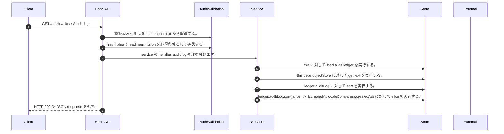

<!-- This file is generated by npm run docs:api-code. Do not edit manually. -->

# GET /admin/aliases/audit-log シーケンス

## シーケンス図

## 処理順とコード対応

| # | Caller | 境界 | 処理 | コード | 実装位置 |
| ---: | --- | --- | --- | --- | --- |
| 1 | `GET /admin/aliases/audit-log handler` | Auth | 認証済み利用者を request context から取得する。 | `c.get("user")` | `apps/api/src/routes/admin-routes.ts:464 (GET /admin/aliases/audit-log handler)` |
| 2 | `GET /admin/aliases/audit-log handler` | Auth | "rag:alias:read" permission を必須条件として確認する。 | `requirePermission(c.get("user"), "rag:alias:read")` | `apps/api/src/routes/admin-routes.ts:464 (GET /admin/aliases/audit-log handler)` |
| 3 | `GET /admin/aliases/audit-log handler` | Service | service の list alias audit log 処理を呼び出す。 | `service.listAliasAuditLog()` | `apps/api/src/routes/admin-routes.ts:465 (GET /admin/aliases/audit-log handler)` |
| 4 | `MemoRagService.listAliasAuditLog` | Store | `this` に対して load alias ledger を実行する。 | `this.loadAliasLedger()` | `apps/api/src/rag/memorag-service.ts:1316 (MemoRagService.listAliasAuditLog)` |
| 5 | `MemoRagService.loadAliasLedger` | Store | `this.deps.objectStore` に対して get text を実行する。 | `this.deps.objectStore.getText(aliasLedgerKey)` | `apps/api/src/rag/memorag-service.ts:2979 (MemoRagService.loadAliasLedger)` |
| 6 | `MemoRagService.listAliasAuditLog` | Store | `ledger.auditLog` に対して sort を実行する。 | `ledger.auditLog.sort((a, b) => b.createdAt.localeCompare(a.createdAt))` | `apps/api/src/rag/memorag-service.ts:1317 (MemoRagService.listAliasAuditLog)` |
| 7 | `MemoRagService.listAliasAuditLog` | Store | `ledger.auditLog.sort((a, b) => b.createdAt.localeCompare(a.createdAt))` に対して slice を実行する。 | `ledger.auditLog.sort((a, b) => b.createdAt.localeCompare(a.createdAt)).slice(0, 200)` | `apps/api/src/rag/memorag-service.ts:1317 (MemoRagService.listAliasAuditLog)` |
| 8 | `GET /admin/aliases/audit-log handler` | HTTP/SSE | HTTP 200 で JSON response を返す。 | `c.json({ auditLog: await service.listAliasAuditLog() }, 200)` | `apps/api/src/routes/admin-routes.ts:465 (GET /admin/aliases/audit-log handler)` |

## 分岐

| ID | Function | 条件 | 実装位置 |
| --- | --- | --- | --- |
| B001 | `requirePermission` | 利用者が 指定された permission を持たない | `apps/api/src/authorization.ts:184 (requirePermission)` |
