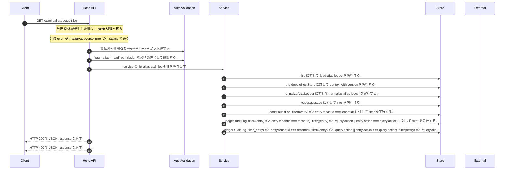

<!-- This file is generated by npm run docs:api-code. Do not edit manually. -->

# GET /admin/aliases/audit-log シーケンス

## シーケンス図

## 処理順とコード対応

| # | Caller | 境界 | 処理 | コード | 実装位置 |
| ---: | --- | --- | --- | --- | --- |
| 1 | `GET /admin/aliases/audit-log handler` | Auth | 認証済み利用者を request context から取得する。 | `c.get("user")` | `apps/api/src/routes/admin-routes.ts:584 (GET /admin/aliases/audit-log handler)` |
| 2 | `GET /admin/aliases/audit-log handler` | Auth | "rag:alias:read" permission を必須条件として確認する。 | `requirePermission(actor, "rag:alias:read")` | `apps/api/src/routes/admin-routes.ts:585 (GET /admin/aliases/audit-log handler)` |
| 3 | `GET /admin/aliases/audit-log handler` | Service | service の list alias audit log 処理を呼び出す。 | `service.listAliasAuditLog(actor, query)` | `apps/api/src/routes/admin-routes.ts:588 (GET /admin/aliases/audit-log handler)` |
| 4 | `MemoRagService.listAliasAuditLog` | Store | `this` に対して load alias ledger を実行する。 | `this.loadAliasLedger()` | `apps/api/src/rag/memorag-service.ts:1713 (MemoRagService.listAliasAuditLog)` |
| 5 | `MemoRagService.loadAliasLedger` | Store | `this.deps.objectStore` に対して get text with version を実行する。 | `this.deps.objectStore.getTextWithVersion(aliasLedgerKey)` | `apps/api/src/rag/memorag-service.ts:3640 (MemoRagService.loadAliasLedger)` |
| 6 | `MemoRagService.loadAliasLedger` | Store | `normalizeAliasLedger` に対して normalize alias ledger を実行する。 | `normalizeAliasLedger(raw)` | `apps/api/src/rag/memorag-service.ts:3644 (MemoRagService.loadAliasLedger)` |
| 7 | `MemoRagService.listAliasAuditLog` | Store | `ledger.auditLog       ` に対して filter を実行する。 | `ledger.auditLog .filter((entry) => entry.tenantId === tenantId)` | `apps/api/src/rag/memorag-service.ts:1716 (MemoRagService.listAliasAuditLog)` |
| 8 | `MemoRagService.listAliasAuditLog` | Store | `ledger.auditLog       .filter((entry) => entry.tenantId === tenantId)       ` に対して filter を実行する。 | `ledger.auditLog .filter((entry) => entry.tenantId === tenantId) .filter((entry) => !query.action \|\| entry.action === query.action)` | `apps/api/src/rag/memorag-service.ts:1716 (MemoRagService.listAliasAuditLog)` |
| 9 | `MemoRagService.listAliasAuditLog` | Store | `ledger.auditLog       .filter((entry) => entry.tenantId === tenantId)       .filter((entry) => !query.action \|\| entry.action === query.action)       ` に対して filter を実行する。 | `ledger.auditLog .filter((entry) => entry.tenantId === tenantId) .filter((entry) => !query.action \|\| entry.action === query.action) .filter((entry) => !query.aliasId \|\| entry.aliasId === query.aliasId)` | `apps/api/src/rag/memorag-service.ts:1716 (MemoRagService.listAliasAuditLog)` |
| 10 | `MemoRagService.listAliasAuditLog` | Store | `ledger.auditLog       .filter((entry) => entry.tenantId === tenantId)       .filter((entry) => !query.action \|\| entry.action === query.action)       .filter((entry) => !query.aliasId \|\| entry.aliasId === query.aliasId)       ` に対して filter を実行する。 | `ledger.auditLog .filter((entry) => entry.tenantId === tenantId) .filter((entry) => !query.action \|\| entry.action === query.action) .filter((entry) => !query.aliasId \|\| entry.aliasId === query.aliasId) .filter((entry) =>…` | `apps/api/src/rag/memorag-service.ts:1716 (MemoRagService.listAliasAuditLog)` |
| 11 | `GET /admin/aliases/audit-log handler` | HTTP/SSE | HTTP 200 で JSON response を返す。 | `c.json(await service.listAliasAuditLog(actor, query), 200)` | `apps/api/src/routes/admin-routes.ts:588 (GET /admin/aliases/audit-log handler)` |
| 12 | `GET /admin/aliases/audit-log handler` | HTTP/SSE | HTTP 400 で JSON response を返す。 | `c.json({ error: error.message }, 400)` | `apps/api/src/routes/admin-routes.ts:590 (GET /admin/aliases/audit-log handler)` |

## 分岐

| ID | Function | 条件 | 実装位置 |
| --- | --- | --- | --- |
| B001 | `GET /admin/aliases/audit-log handler` | 例外が発生した場合に catch 処理へ移る | `apps/api/src/routes/admin-routes.ts:589 (GET /admin/aliases/audit-log handler)` |
| B002 | `GET /admin/aliases/audit-log handler` | `error` が `InvalidPageCursorError` の instance である | `apps/api/src/routes/admin-routes.ts:590 (GET /admin/aliases/audit-log handler)` |
| B003 | `requirePermission` | 利用者が 指定された permission を持たない | `apps/api/src/authorization.ts:184 (requirePermission)` |
