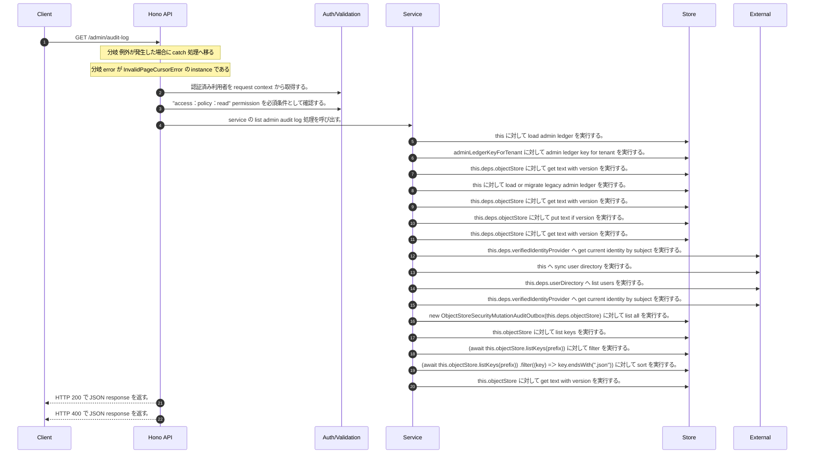

<!-- This file is generated by npm run docs:api-code. Do not edit manually. -->

# GET /admin/audit-log シーケンス

## シーケンス図

## 処理順とコード対応

| # | Caller | 境界 | 処理 | コード | 実装位置 |
| ---: | --- | --- | --- | --- | --- |
| 1 | `GET /admin/audit-log handler` | Auth | 認証済み利用者を request context から取得する。 | `c.get("user")` | `apps/api/src/routes/admin-routes.ts:191 (GET /admin/audit-log handler)` |
| 2 | `GET /admin/audit-log handler` | Auth | "access:policy:read" permission を必須条件として確認する。 | `requirePermission(user, "access:policy:read")` | `apps/api/src/routes/admin-routes.ts:192 (GET /admin/audit-log handler)` |
| 3 | `GET /admin/audit-log handler` | Service | service の list admin audit log 処理を呼び出す。 | `service.listAdminAuditLog(user, query)` | `apps/api/src/routes/admin-routes.ts:195 (GET /admin/audit-log handler)` |
| 4 | `MemoRagService.listAdminAuditLog` | Store | `this` に対して load admin ledger を実行する。 | `this.loadAdminLedger(actor)` | `apps/api/src/rag/memorag-service.ts:2136 (MemoRagService.listAdminAuditLog)` |
| 5 | `MemoRagService.loadAdminLedger` | Store | `adminLedgerKeyForTenant` に対して admin ledger key for tenant を実行する。 | `adminLedgerKeyForTenant(tenantId)` | `apps/api/src/rag/memorag-service.ts:3491 (MemoRagService.loadAdminLedger)` |
| 6 | `MemoRagService.loadAdminLedger` | Store | `this.deps.objectStore` に対して get text with version を実行する。 | `this.deps.objectStore.getTextWithVersion(storageKey)` | `apps/api/src/rag/memorag-service.ts:3493 (MemoRagService.loadAdminLedger)` |
| 7 | `MemoRagService.loadAdminLedger` | Store | `this` に対して load or migrate legacy admin ledger を実行する。 | `this.loadOrMigrateLegacyAdminLedger(tenantId, storageKey)` | `apps/api/src/rag/memorag-service.ts:3498 (MemoRagService.loadAdminLedger)` |
| 8 | `MemoRagService.loadOrMigrateLegacyAdminLedger` | Store | `this.deps.objectStore` に対して get text with version を実行する。 | `this.deps.objectStore.getTextWithVersion(legacyAdminLedgerKey)` | `apps/api/src/rag/memorag-service.ts:3560 (MemoRagService.loadOrMigrateLegacyAdminLedger)` |
| 9 | `MemoRagService.loadOrMigrateLegacyAdminLedger` | Store | `this.deps.objectStore` に対して put text if version を実行する。 | `this.deps.objectStore.putTextIfVersion(storageKey, serialized, undefined, "application/json")` | `apps/api/src/rag/memorag-service.ts:3574 (MemoRagService.loadOrMigrateLegacyAdminLedger)` |
| 10 | `MemoRagService.loadOrMigrateLegacyAdminLedger` | Store | `this.deps.objectStore` に対して get text with version を実行する。 | `this.deps.objectStore.getTextWithVersion(storageKey)` | `apps/api/src/rag/memorag-service.ts:3578 (MemoRagService.loadOrMigrateLegacyAdminLedger)` |
| 11 | `MemoRagService.loadAdminLedger` | External | `this.deps.verifiedIdentityProvider` へ get current identity by subject を実行する。 | `this.deps.verifiedIdentityProvider.getCurrentIdentityBySubject(actor.userId)` | `apps/api/src/rag/memorag-service.ts:3505 (MemoRagService.loadAdminLedger)` |
| 12 | `MemoRagService.loadAdminLedger` | External | `this` へ sync user directory を実行する。 | `this.syncUserDirectory(db, authoritativeActorTenantId(actor))` | `apps/api/src/rag/memorag-service.ts:3547 (MemoRagService.loadAdminLedger)` |
| 13 | `MemoRagService.syncUserDirectory` | External | `this.deps.userDirectory` へ list users を実行する。 | `this.deps.userDirectory.listUsers()` | `apps/api/src/rag/memorag-service.ts:3585 (MemoRagService.syncUserDirectory)` |
| 14 | `MemoRagService.syncUserDirectory` | External | `this.deps.verifiedIdentityProvider` へ get current identity by subject を実行する。 | `this.deps.verifiedIdentityProvider.getCurrentIdentityBySubject(directoryUser.userId)` | `apps/api/src/rag/memorag-service.ts:3590 (MemoRagService.syncUserDirectory)` |
| 15 | `MemoRagService.listAdminAuditLog` | Store | `new ObjectStoreSecurityMutationAuditOutbox(this.deps.objectStore)` に対して list all を実行する。 | `new ObjectStoreSecurityMutationAuditOutbox(this.deps.objectStore).listAll(tenantId)` | `apps/api/src/rag/memorag-service.ts:2139 (MemoRagService.listAdminAuditLog)` |
| 16 | `ObjectStoreSecurityMutationAuditOutbox.listAll` | Store | `this.objectStore` に対して list keys を実行する。 | `this.objectStore.listKeys(prefix)` | `apps/api/src/security/security-mutation-audit-outbox.ts:188 (ObjectStoreSecurityMutationAuditOutbox.listAll)` |
| 17 | `ObjectStoreSecurityMutationAuditOutbox.listAll` | Store | `(await this.objectStore.listKeys(prefix))       ` に対して filter を実行する。 | `(await this.objectStore.listKeys(prefix)) .filter((key) => key.endsWith(".json"))` | `apps/api/src/security/security-mutation-audit-outbox.ts:188 (ObjectStoreSecurityMutationAuditOutbox.listAll)` |
| 18 | `ObjectStoreSecurityMutationAuditOutbox.listAll` | Store | `(await this.objectStore.listKeys(prefix))       .filter((key) => key.endsWith(".json"))       ` に対して sort を実行する。 | `(await this.objectStore.listKeys(prefix)) .filter((key) => key.endsWith(".json")) .sort()` | `apps/api/src/security/security-mutation-audit-outbox.ts:188 (ObjectStoreSecurityMutationAuditOutbox.listAll)` |
| 19 | `ObjectStoreSecurityMutationAuditOutbox.listAll` | Store | `this.objectStore` に対して get text with version を実行する。 | `this.objectStore.getTextWithVersion(key)` | `apps/api/src/security/security-mutation-audit-outbox.ts:192 (ObjectStoreSecurityMutationAuditOutbox.listAll)` |
| 20 | `GET /admin/audit-log handler` | HTTP/SSE | HTTP 200 で JSON response を返す。 | `c.json(await service.listAdminAuditLog(user, query), 200)` | `apps/api/src/routes/admin-routes.ts:195 (GET /admin/audit-log handler)` |
| 21 | `GET /admin/audit-log handler` | HTTP/SSE | HTTP 400 で JSON response を返す。 | `c.json({ error: error.message }, 400)` | `apps/api/src/routes/admin-routes.ts:197 (GET /admin/audit-log handler)` |

## 分岐

| ID | Function | 条件 | 実装位置 |
| --- | --- | --- | --- |
| B001 | `GET /admin/audit-log handler` | 例外が発生した場合に catch 処理へ移る | `apps/api/src/routes/admin-routes.ts:196 (GET /admin/audit-log handler)` |
| B002 | `GET /admin/audit-log handler` | `error` が `InvalidPageCursorError` の instance である | `apps/api/src/routes/admin-routes.ts:197 (GET /admin/audit-log handler)` |
| B003 | `requirePermission` | 利用者が 指定された permission を持たない | `apps/api/src/authorization.ts:184 (requirePermission)` |
| B004 | `MemoRagService.listAdminAuditLog` | `intent.status` が `"completed"` と等しい | `apps/api/src/rag/memorag-service.ts:2147 (MemoRagService.listAdminAuditLog)` |
