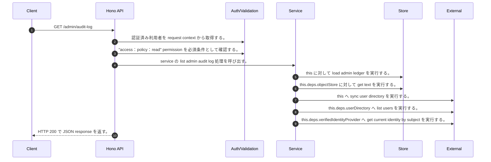

<!-- This file is generated by npm run docs:api-code. Do not edit manually. -->

# GET /admin/audit-log シーケンス

## シーケンス図

## 処理順とコード対応

| # | Caller | 境界 | 処理 | コード | 実装位置 |
| ---: | --- | --- | --- | --- | --- |
| 1 | `GET /admin/audit-log handler` | Auth | 認証済み利用者を request context から取得する。 | `c.get("user")` | `apps/api/src/routes/admin-routes.ts:168 (GET /admin/audit-log handler)` |
| 2 | `GET /admin/audit-log handler` | Auth | "access:policy:read" permission を必須条件として確認する。 | `requirePermission(user, "access:policy:read")` | `apps/api/src/routes/admin-routes.ts:169 (GET /admin/audit-log handler)` |
| 3 | `GET /admin/audit-log handler` | Service | service の list admin audit log 処理を呼び出す。 | `service.listAdminAuditLog(user)` | `apps/api/src/routes/admin-routes.ts:170 (GET /admin/audit-log handler)` |
| 4 | `MemoRagService.listAdminAuditLog` | Store | `this` に対して load admin ledger を実行する。 | `this.loadAdminLedger(actor)` | `apps/api/src/rag/memorag-service.ts:1626 (MemoRagService.listAdminAuditLog)` |
| 5 | `MemoRagService.loadAdminLedger` | Store | `this.deps.objectStore` に対して get text を実行する。 | `this.deps.objectStore.getText(adminLedgerKey)` | `apps/api/src/rag/memorag-service.ts:2864 (MemoRagService.loadAdminLedger)` |
| 6 | `MemoRagService.loadAdminLedger` | External | `this` へ sync user directory を実行する。 | `this.syncUserDirectory(db)` | `apps/api/src/rag/memorag-service.ts:2905 (MemoRagService.loadAdminLedger)` |
| 7 | `MemoRagService.syncUserDirectory` | External | `this.deps.userDirectory` へ list users を実行する。 | `this.deps.userDirectory.listUsers()` | `apps/api/src/rag/memorag-service.ts:2912 (MemoRagService.syncUserDirectory)` |
| 8 | `MemoRagService.syncUserDirectory` | External | `this.deps.verifiedIdentityProvider` へ get current identity by subject を実行する。 | `this.deps.verifiedIdentityProvider.getCurrentIdentityBySubject(directoryUser.userId)` | `apps/api/src/rag/memorag-service.ts:2917 (MemoRagService.syncUserDirectory)` |
| 9 | `GET /admin/audit-log handler` | HTTP/SSE | HTTP 200 で JSON response を返す。 | `c.json({ auditLog: await service.listAdminAuditLog(user) }, 200)` | `apps/api/src/routes/admin-routes.ts:170 (GET /admin/audit-log handler)` |

## 分岐

| ID | Function | 条件 | 実装位置 |
| --- | --- | --- | --- |
| B001 | `requirePermission` | 利用者が 指定された permission を持たない | `apps/api/src/authorization.ts:184 (requirePermission)` |
