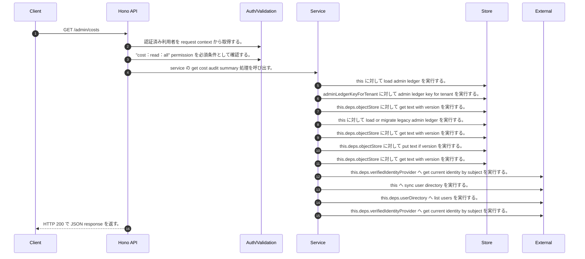

<!-- This file is generated by npm run docs:api-code. Do not edit manually. -->

# GET /admin/costs シーケンス

## シーケンス図

## 処理順とコード対応

| # | Caller | 境界 | 処理 | コード | 実装位置 |
| ---: | --- | --- | --- | --- | --- |
| 1 | `GET /admin/costs handler` | Auth | 認証済み利用者を request context から取得する。 | `c.get("user")` | `apps/api/src/routes/admin-routes.ts:643 (GET /admin/costs handler)` |
| 2 | `GET /admin/costs handler` | Auth | "cost:read:all" permission を必須条件として確認する。 | `requirePermission(user, "cost:read:all")` | `apps/api/src/routes/admin-routes.ts:644 (GET /admin/costs handler)` |
| 3 | `GET /admin/costs handler` | Service | service の get cost audit summary 処理を呼び出す。 | `service.getCostAuditSummary(user)` | `apps/api/src/routes/admin-routes.ts:645 (GET /admin/costs handler)` |
| 4 | `MemoRagService.getCostAuditSummary` | Store | `this` に対して load admin ledger を実行する。 | `this.loadAdminLedger(actor, { syncUserDirectory: false })` | `apps/api/src/rag/memorag-service.ts:2117 (MemoRagService.getCostAuditSummary)` |
| 5 | `MemoRagService.loadAdminLedger` | Store | `adminLedgerKeyForTenant` に対して admin ledger key for tenant を実行する。 | `adminLedgerKeyForTenant(tenantId)` | `apps/api/src/rag/memorag-service.ts:3315 (MemoRagService.loadAdminLedger)` |
| 6 | `MemoRagService.loadAdminLedger` | Store | `this.deps.objectStore` に対して get text with version を実行する。 | `this.deps.objectStore.getTextWithVersion(storageKey)` | `apps/api/src/rag/memorag-service.ts:3317 (MemoRagService.loadAdminLedger)` |
| 7 | `MemoRagService.loadAdminLedger` | Store | `this` に対して load or migrate legacy admin ledger を実行する。 | `this.loadOrMigrateLegacyAdminLedger(tenantId, storageKey)` | `apps/api/src/rag/memorag-service.ts:3322 (MemoRagService.loadAdminLedger)` |
| 8 | `MemoRagService.loadOrMigrateLegacyAdminLedger` | Store | `this.deps.objectStore` に対して get text with version を実行する。 | `this.deps.objectStore.getTextWithVersion(legacyAdminLedgerKey)` | `apps/api/src/rag/memorag-service.ts:3384 (MemoRagService.loadOrMigrateLegacyAdminLedger)` |
| 9 | `MemoRagService.loadOrMigrateLegacyAdminLedger` | Store | `this.deps.objectStore` に対して put text if version を実行する。 | `this.deps.objectStore.putTextIfVersion(storageKey, serialized, undefined, "application/json")` | `apps/api/src/rag/memorag-service.ts:3398 (MemoRagService.loadOrMigrateLegacyAdminLedger)` |
| 10 | `MemoRagService.loadOrMigrateLegacyAdminLedger` | Store | `this.deps.objectStore` に対して get text with version を実行する。 | `this.deps.objectStore.getTextWithVersion(storageKey)` | `apps/api/src/rag/memorag-service.ts:3402 (MemoRagService.loadOrMigrateLegacyAdminLedger)` |
| 11 | `MemoRagService.loadAdminLedger` | External | `this.deps.verifiedIdentityProvider` へ get current identity by subject を実行する。 | `this.deps.verifiedIdentityProvider.getCurrentIdentityBySubject(actor.userId)` | `apps/api/src/rag/memorag-service.ts:3329 (MemoRagService.loadAdminLedger)` |
| 12 | `MemoRagService.loadAdminLedger` | External | `this` へ sync user directory を実行する。 | `this.syncUserDirectory(db, authoritativeActorTenantId(actor))` | `apps/api/src/rag/memorag-service.ts:3371 (MemoRagService.loadAdminLedger)` |
| 13 | `MemoRagService.syncUserDirectory` | External | `this.deps.userDirectory` へ list users を実行する。 | `this.deps.userDirectory.listUsers()` | `apps/api/src/rag/memorag-service.ts:3409 (MemoRagService.syncUserDirectory)` |
| 14 | `MemoRagService.syncUserDirectory` | External | `this.deps.verifiedIdentityProvider` へ get current identity by subject を実行する。 | `this.deps.verifiedIdentityProvider.getCurrentIdentityBySubject(directoryUser.userId)` | `apps/api/src/rag/memorag-service.ts:3414 (MemoRagService.syncUserDirectory)` |
| 15 | `GET /admin/costs handler` | HTTP/SSE | HTTP 200 で JSON response を返す。 | `c.json(await service.getCostAuditSummary(user), 200)` | `apps/api/src/routes/admin-routes.ts:645 (GET /admin/costs handler)` |

## 分岐

| ID | Function | 条件 | 実装位置 |
| --- | --- | --- | --- |
| B001 | `requirePermission` | 利用者が 指定された permission を持たない | `apps/api/src/authorization.ts:184 (requirePermission)` |
