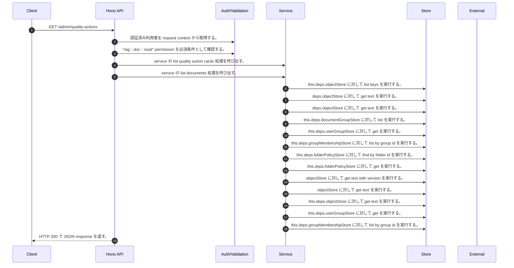

<!-- This file is generated by npm run docs:api-code. Do not edit manually. -->

# GET /admin/quality-actions シーケンス

## シーケンス図

## 処理順とコード対応

| # | Caller | 境界 | 処理 | コード | 実装位置 |
| ---: | --- | --- | --- | --- | --- |
| 1 | `GET /admin/quality-actions handler` | Auth | 認証済み利用者を request context から取得する。 | `c.get("user")` | `apps/api/src/routes/admin-routes.ts:680 (GET /admin/quality-actions handler)` |
| 2 | `GET /admin/quality-actions handler` | Auth | "rag:doc:read" permission を必須条件として確認する。 | `requirePermission(user, "rag:doc:read")` | `apps/api/src/routes/admin-routes.ts:681 (GET /admin/quality-actions handler)` |
| 3 | `GET /admin/quality-actions handler` | Service | service の list quality action cards 処理を呼び出す。 | `service.listQualityActionCards(user)` | `apps/api/src/routes/admin-routes.ts:682 (GET /admin/quality-actions handler)` |
| 4 | `MemoRagService.listQualityActionCards` | Service | service の list documents 処理を呼び出す。 | `this.listDocuments(actor)` | `apps/api/src/rag/memorag-service.ts:2213 (MemoRagService.listQualityActionCards)` |
| 5 | `MemoRagService.listDocuments` | Store | `this.deps.objectStore` に対して list keys を実行する。 | `this.deps.objectStore.listKeys(tenantManifestPrefix(this.deps, tenantId))` | `apps/api/src/rag/memorag-service.ts:903 (MemoRagService.listDocuments)` |
| 6 | `readTenantManifestByKey` | Store | `deps.objectStore` に対して get text を実行する。 | `deps.objectStore.getText(key)` | `apps/api/src/rag/_shared/storage/tenant-artifacts.ts:93 (readTenantManifestByKey)` |
| 7 | `loadPublicationPointer` | Store | `deps.objectStore` に対して get text を実行する。 | `deps.objectStore.getText(key)` | `apps/api/src/rag/_shared/publication/staged-publication-coordinator.ts:1809 (loadPublicationPointer)` |
| 8 | `FolderPermissionService.resolveEffectiveFolderPermissionDetail` | Store | `this.deps.documentGroupStore` に対して list を実行する。 | `this.deps.documentGroupStore.list(actorTenantId)` | `apps/api/src/folders/folder-permission-service.ts:145 (FolderPermissionService.resolveEffectiveFolderPermissionDetail)` |
| 9 | `FolderPermissionService.resolveUserMembershipPermission` | Store | `this.deps.userGroupStore` に対して get を実行する。 | `this.deps.userGroupStore.get(tenantId, groupId)` | `apps/api/src/folders/folder-permission-service.ts:780 (FolderPermissionService.resolveUserMembershipPermission)` |
| 10 | `FolderPermissionService.resolveUserMembershipPermission` | Store | `this.deps.groupMembershipStore` に対して list by group id を実行する。 | `this.deps.groupMembershipStore.listByGroupId(tenantId, groupId)` | `apps/api/src/folders/folder-permission-service.ts:781 (FolderPermissionService.resolveUserMembershipPermission)` |
| 11 | `FolderPermissionService.resolvePolicyContext` | Store | `this.deps.folderPolicyStore` に対して find by folder id を実行する。 | `this.deps.folderPolicyStore.findByFolderId(folder.tenantId, current.groupId)` | `apps/api/src/folders/folder-permission-service.ts:695 (FolderPermissionService.resolvePolicyContext)` |
| 12 | `FolderPermissionService.resolvePolicyContext` | Store | `this.deps.folderPolicyStore` に対して get を実行する。 | `this.deps.folderPolicyStore.get(folder.tenantId, current.policyId)` | `apps/api/src/folders/folder-permission-service.ts:711 (FolderPermissionService.resolvePolicyContext)` |
| 13 | `getTextWithVersion` | Store | `objectStore` に対して get text with version を実行する。 | `objectStore.getTextWithVersion(key)` | `apps/api/src/documents/document-permission-service.ts:962 (getTextWithVersion)` |
| 14 | `getTextWithVersion` | Store | `objectStore` に対して get text を実行する。 | `objectStore.getText(key)` | `apps/api/src/documents/document-permission-service.ts:963 (getTextWithVersion)` |
| 15 | `DocumentPermissionService.loadLegacyDocumentGrants` | Store | `this.deps.objectStore` に対して get text を実行する。 | `this.deps.objectStore.getText(documentShareLegacyLedgerKey)` | `apps/api/src/documents/document-permission-service.ts:528 (DocumentPermissionService.loadLegacyDocumentGrants)` |
| 16 | `DocumentPermissionService.resolveUserMembershipPermission` | Store | `this.deps.userGroupStore` に対して get を実行する。 | `this.deps.userGroupStore.get(tenantId, groupId)` | `apps/api/src/documents/document-permission-service.ts:674 (DocumentPermissionService.resolveUserMembershipPermission)` |
| 17 | `DocumentPermissionService.resolveUserMembershipPermission` | Store | `this.deps.groupMembershipStore` に対して list by group id を実行する。 | `this.deps.groupMembershipStore.listByGroupId(tenantId, groupId)` | `apps/api/src/documents/document-permission-service.ts:675 (DocumentPermissionService.resolveUserMembershipPermission)` |
| 18 | `GET /admin/quality-actions handler` | HTTP/SSE | HTTP 200 で JSON response を返す。 | `c.json({ actions: await service.listQualityActionCards(user) }, 200)` | `apps/api/src/routes/admin-routes.ts:682 (GET /admin/quality-actions handler)` |

## 分岐

| ID | Function | 条件 | 実装位置 |
| --- | --- | --- | --- |
| B001 | `requirePermission` | 利用者が 指定された permission を持たない | `apps/api/src/authorization.ts:185 (requirePermission)` |
