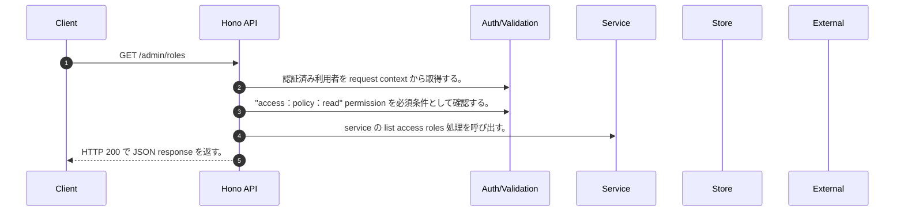

<!-- This file is generated by npm run docs:api-code. Do not edit manually. -->

# GET /admin/roles シーケンス

## シーケンス図

## 処理順とコード対応

| # | Caller | 境界 | 処理 | コード | 実装位置 |
| ---: | --- | --- | --- | --- | --- |
| 1 | `GET /admin/roles handler` | Auth | 認証済み利用者を request context から取得する。 | `c.get("user")` | `apps/api/src/routes/admin-routes.ts:335 (GET /admin/roles handler)` |
| 2 | `GET /admin/roles handler` | Auth | "access:policy:read" permission を必須条件として確認する。 | `requirePermission(c.get("user"), "access:policy:read")` | `apps/api/src/routes/admin-routes.ts:335 (GET /admin/roles handler)` |
| 3 | `GET /admin/roles handler` | Service | service の list access roles 処理を呼び出す。 | `service.listAccessRoles()` | `apps/api/src/routes/admin-routes.ts:337 (GET /admin/roles handler)` |
| 4 | `GET /admin/roles handler` | HTTP/SSE | HTTP 200 で JSON response を返す。 | `c.json({ roles: service.listAccessRoles(), catalogVersion: ROLE_CATALOG_VERSION, source: "canonical-application-role-catalog", asOf: new Date().toISOString() }, 200)` | `apps/api/src/routes/admin-routes.ts:336 (GET /admin/roles handler)` |

## 分岐

| ID | Function | 条件 | 実装位置 |
| --- | --- | --- | --- |
| B001 | `requirePermission` | 利用者が 指定された permission を持たない | `apps/api/src/authorization.ts:184 (requirePermission)` |
