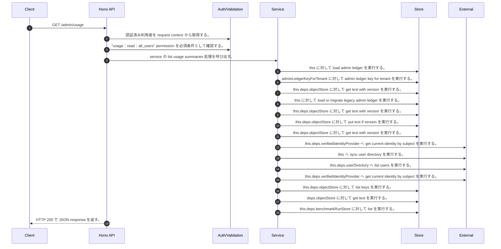

<!-- This file is generated by npm run docs:api-code. Do not edit manually. -->

# GET /admin/usage シーケンス

## シーケンス図

## 処理順とコード対応

| # | Caller | 境界 | 処理 | コード | 実装位置 |
| ---: | --- | --- | --- | --- | --- |
| 1 | `GET /admin/usage handler` | Auth | 認証済み利用者を request context から取得する。 | `c.get("user")` | `apps/api/src/routes/admin-routes.ts:627 (GET /admin/usage handler)` |
| 2 | `GET /admin/usage handler` | Auth | "usage:read:all_users" permission を必須条件として確認する。 | `requirePermission(user, "usage:read:all_users")` | `apps/api/src/routes/admin-routes.ts:628 (GET /admin/usage handler)` |
| 3 | `GET /admin/usage handler` | Service | service の list usage summaries 処理を呼び出す。 | `service.listUsageSummaries(user)` | `apps/api/src/routes/admin-routes.ts:629 (GET /admin/usage handler)` |
| 4 | `MemoRagService.listUsageSummaries` | Store | `this` に対して load admin ledger を実行する。 | `this.loadAdminLedger(actor, { syncUserDirectory: true })` | `apps/api/src/rag/memorag-service.ts:2081 (MemoRagService.listUsageSummaries)` |
| 5 | `MemoRagService.loadAdminLedger` | Store | `adminLedgerKeyForTenant` に対して admin ledger key for tenant を実行する。 | `adminLedgerKeyForTenant(tenantId)` | `apps/api/src/rag/memorag-service.ts:3315 (MemoRagService.loadAdminLedger)` |
| 6 | `MemoRagService.loadAdminLedger` | Store | `this.deps.objectStore` に対して get text with version を実行する。 | `this.deps.objectStore.getTextWithVersion(storageKey)` | `apps/api/src/rag/memorag-service.ts:3317 (MemoRagService.loadAdminLedger)` |
| 7 | `MemoRagService.loadAdminLedger` | Store | `this` に対して load or migrate legacy admin ledger を実行する。 | `this.loadOrMigrateLegacyAdminLedger(tenantId, storageKey)` | `apps/api/src/rag/memorag-service.ts:3322 (MemoRagService.loadAdminLedger)` |
| 8 | `MemoRagService.loadOrMigrateLegacyAdminLedger` | Store | `this.deps.objectStore` に対して get text with version を実行する。 | `this.deps.objectStore.getTextWithVersion(legacyAdminLedgerKey)` | `apps/api/src/rag/memorag-service.ts:3384 (MemoRagService.loadOrMigrateLegacyAdminLedger)` |
| 9 | `MemoRagService.loadOrMigrateLegacyAdminLedger` | Store | `this.deps.objectStore` に対して put text if version を実行する。 | `this.deps.objectStore.putTextIfVersion(storageKey, serialized, undefined, "application/json")` | `apps/api/src/rag/memorag-service.ts:3398 (MemoRagService.loadOrMigrateLegacyAdminLedger)` |
| 10 | `MemoRagService.loadOrMigrateLegacyAdminLedger` | Store | `this.deps.objectStore` に対して get text with version を実行する。 | `this.deps.objectStore.getTextWithVersion(storageKey)` | `apps/api/src/rag/memorag-service.ts:3402 (MemoRagService.loadOrMigrateLegacyAdminLedger)` |
| 11 | `MemoRagService.loadAdminLedger` | External | `this.deps.verifiedIdentityProvider` へ get current identity by subject を実行する。 | `this.deps.verifiedIdentityProvider.getCurrentIdentityBySubject(actor.userId)` | `apps/api/src/rag/memorag-service.ts:3329 (MemoRagService.loadAdminLedger)` |
| 12 | `MemoRagService.loadAdminLedger` | External | `this` へ sync user directory を実行する。 | `this.syncUserDirectory(db, authoritativeActorTenantId(actor))` | `apps/api/src/rag/memorag-service.ts:3371 (MemoRagService.loadAdminLedger)` |
| 13 | `MemoRagService.syncUserDirectory` | External | `this.deps.userDirectory` へ list users を実行する。 | `this.deps.userDirectory.listUsers()` | `apps/api/src/rag/memorag-service.ts:3409 (MemoRagService.syncUserDirectory)` |
| 14 | `MemoRagService.syncUserDirectory` | External | `this.deps.verifiedIdentityProvider` へ get current identity by subject を実行する。 | `this.deps.verifiedIdentityProvider.getCurrentIdentityBySubject(directoryUser.userId)` | `apps/api/src/rag/memorag-service.ts:3414 (MemoRagService.syncUserDirectory)` |
| 15 | `MemoRagService.listUsageSummaries` | Store | `this.deps.objectStore` に対して list keys を実行する。 | `this.deps.objectStore.listKeys(tenantManifestPrefix(this.deps, tenantId))` | `apps/api/src/rag/memorag-service.ts:2083 (MemoRagService.listUsageSummaries)` |
| 16 | `readTenantManifestByKey` | Store | `deps.objectStore` に対して get text を実行する。 | `deps.objectStore.getText(key)` | `apps/api/src/rag/_shared/storage/tenant-artifacts.ts:93 (readTenantManifestByKey)` |
| 17 | `MemoRagService.listUsageSummaries` | Store | `this.deps.benchmarkRunStore` に対して list を実行する。 | `this.deps.benchmarkRunStore.list(tenantId)` | `apps/api/src/rag/memorag-service.ts:2088 (MemoRagService.listUsageSummaries)` |
| 18 | `GET /admin/usage handler` | HTTP/SSE | HTTP 200 で JSON response を返す。 | `c.json({ users: await service.listUsageSummaries(user) }, 200)` | `apps/api/src/routes/admin-routes.ts:629 (GET /admin/usage handler)` |

## 分岐

| ID | Function | 条件 | 実装位置 |
| --- | --- | --- | --- |
| B001 | `requirePermission` | 利用者が 指定された permission を持たない | `apps/api/src/authorization.ts:184 (requirePermission)` |
