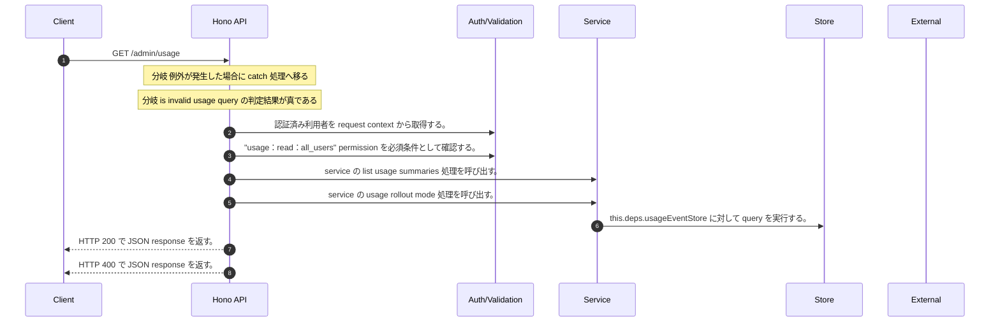

<!-- This file is generated by npm run docs:api-code. Do not edit manually. -->

# GET /admin/usage シーケンス

## シーケンス図

## 処理順とコード対応

| # | Caller | 境界 | 処理 | コード | 実装位置 |
| ---: | --- | --- | --- | --- | --- |
| 1 | `GET /admin/usage handler` | Auth | 認証済み利用者を request context から取得する。 | `c.get("user")` | `apps/api/src/routes/admin-routes.ts:630 (GET /admin/usage handler)` |
| 2 | `GET /admin/usage handler` | Auth | "usage:read:all_users" permission を必須条件として確認する。 | `requirePermission(user, "usage:read:all_users")` | `apps/api/src/routes/admin-routes.ts:631 (GET /admin/usage handler)` |
| 3 | `GET /admin/usage handler` | Service | service の list usage summaries 処理を呼び出す。 | `service.listUsageSummaries(user, validQuery<z.infer<typeof UsageQuerySchema>>(c))` | `apps/api/src/routes/admin-routes.ts:633 (GET /admin/usage handler)` |
| 4 | `MemoRagService.listUsageSummaries` | Service | service の usage rollout mode 処理を呼び出す。 | `this.usageRolloutMode()` | `apps/api/src/rag/memorag-service.ts:2263 (MemoRagService.listUsageSummaries)` |
| 5 | `MemoRagService.listUsageSummaries` | Store | `this.deps.usageEventStore` に対して query を実行する。 | `this.deps.usageEventStore.query(tenantId, normalized)` | `apps/api/src/rag/memorag-service.ts:2265 (MemoRagService.listUsageSummaries)` |
| 6 | `GET /admin/usage handler` | HTTP/SSE | HTTP 200 で JSON response を返す。 | `c.json(await service.listUsageSummaries(user, validQuery<z.infer<typeof UsageQuerySchema>>(c)), 200)` | `apps/api/src/routes/admin-routes.ts:633 (GET /admin/usage handler)` |
| 7 | `GET /admin/usage handler` | HTTP/SSE | HTTP 400 で JSON response を返す。 | `c.json({ error: "Invalid usage query or cursor" }, 400)` | `apps/api/src/routes/admin-routes.ts:635 (GET /admin/usage handler)` |

## 分岐

| ID | Function | 条件 | 実装位置 |
| --- | --- | --- | --- |
| B001 | `GET /admin/usage handler` | 例外が発生した場合に catch 処理へ移る | `apps/api/src/routes/admin-routes.ts:634 (GET /admin/usage handler)` |
| B002 | `GET /admin/usage handler` | is invalid usage query の判定結果が真である | `apps/api/src/routes/admin-routes.ts:635 (GET /admin/usage handler)` |
| B003 | `requirePermission` | 利用者が 指定された permission を持たない | `apps/api/src/authorization.ts:184 (requirePermission)` |
| B004 | `MemoRagService.listUsageSummaries` | `rolloutMode` が `"active"` と等しい、かつ `this.deps.usageEventStore` が存在し、真である | `apps/api/src/rag/memorag-service.ts:2264 (MemoRagService.listUsageSummaries)` |
