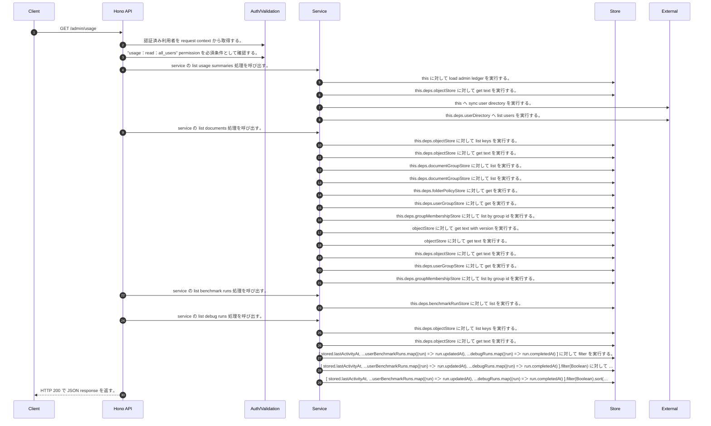

<!-- This file is generated by npm run docs:api-code. Do not edit manually. -->

# GET /admin/usage シーケンス

## シーケンス図

## 処理順とコード対応

| # | Caller | 境界 | 処理 | コード | 実装位置 |
| ---: | --- | --- | --- | --- | --- |
| 1 | `GET /admin/usage handler` | Auth | 認証済み利用者を request context から取得する。 | `c.get("user")` | `apps/api/src/routes/admin-routes.ts:410 (GET /admin/usage handler)` |
| 2 | `GET /admin/usage handler` | Auth | "usage:read:all_users" permission を必須条件として確認する。 | `requirePermission(user, "usage:read:all_users")` | `apps/api/src/routes/admin-routes.ts:411 (GET /admin/usage handler)` |
| 3 | `GET /admin/usage handler` | Service | service の list usage summaries 処理を呼び出す。 | `service.listUsageSummaries(user)` | `apps/api/src/routes/admin-routes.ts:412 (GET /admin/usage handler)` |
| 4 | `MemoRagService.listUsageSummaries` | Store | `this` に対して load admin ledger を実行する。 | `this.loadAdminLedger(actor, { syncUserDirectory: true })` | `apps/api/src/rag/memorag-service.ts:917 (MemoRagService.listUsageSummaries)` |
| 5 | `MemoRagService.loadAdminLedger` | Store | `this.deps.objectStore` に対して get text を実行する。 | `this.deps.objectStore.getText(adminLedgerKey)` | `apps/api/src/rag/memorag-service.ts:1515 (MemoRagService.loadAdminLedger)` |
| 6 | `MemoRagService.loadAdminLedger` | External | `this` へ sync user directory を実行する。 | `this.syncUserDirectory(db)` | `apps/api/src/rag/memorag-service.ts:1556 (MemoRagService.loadAdminLedger)` |
| 7 | `MemoRagService.syncUserDirectory` | External | `this.deps.userDirectory` へ list users を実行する。 | `this.deps.userDirectory.listUsers()` | `apps/api/src/rag/memorag-service.ts:1563 (MemoRagService.syncUserDirectory)` |
| 8 | `MemoRagService.listUsageSummaries` | Service | service の list documents 処理を呼び出す。 | `this.listDocuments()` | `apps/api/src/rag/memorag-service.ts:918 (MemoRagService.listUsageSummaries)` |
| 9 | `MemoRagService.listDocuments` | Store | `this.deps.objectStore` に対して list keys を実行する。 | `this.deps.objectStore.listKeys("manifests/")` | `apps/api/src/rag/memorag-service.ts:359 (MemoRagService.listDocuments)` |
| 10 | `MemoRagService.getManifestByKey` | Store | `this.deps.objectStore` に対して get text を実行する。 | `this.deps.objectStore.getText(key)` | `apps/api/src/rag/memorag-service.ts:1638 (MemoRagService.getManifestByKey)` |
| 11 | `MemoRagService.listDocuments` | Store | `this.deps.documentGroupStore` に対して list を実行する。 | `this.deps.documentGroupStore.list()` | `apps/api/src/rag/memorag-service.ts:371 (MemoRagService.listDocuments)` |
| 12 | `FolderPermissionService.resolveEffectiveFolderPermissionDetail` | Store | `this.deps.documentGroupStore` に対して list を実行する。 | `this.deps.documentGroupStore.list()` | `apps/api/src/folders/folder-permission-service.ts:47 (FolderPermissionService.resolveEffectiveFolderPermissionDetail)` |
| 13 | `FolderPermissionService.resolvePolicyContext` | Store | `this.deps.folderPolicyStore` に対して get を実行する。 | `this.deps.folderPolicyStore.get(current.policyId)` | `apps/api/src/folders/folder-permission-service.ts:128 (FolderPermissionService.resolvePolicyContext)` |
| 14 | `FolderPermissionService.resolveUserMembershipPermission` | Store | `this.deps.userGroupStore` に対して get を実行する。 | `this.deps.userGroupStore.get(groupId)` | `apps/api/src/folders/folder-permission-service.ts:166 (FolderPermissionService.resolveUserMembershipPermission)` |
| 15 | `FolderPermissionService.resolveUserMembershipPermission` | Store | `this.deps.groupMembershipStore` に対して list by group id を実行する。 | `this.deps.groupMembershipStore.listByGroupId(groupId)` | `apps/api/src/folders/folder-permission-service.ts:171 (FolderPermissionService.resolveUserMembershipPermission)` |
| 16 | `getTextWithVersion` | Store | `objectStore` に対して get text with version を実行する。 | `objectStore.getTextWithVersion(key)` | `apps/api/src/documents/document-permission-service.ts:418 (getTextWithVersion)` |
| 17 | `getTextWithVersion` | Store | `objectStore` に対して get text を実行する。 | `objectStore.getText(key)` | `apps/api/src/documents/document-permission-service.ts:419 (getTextWithVersion)` |
| 18 | `DocumentPermissionService.loadLegacyDocumentGrants` | Store | `this.deps.objectStore` に対して get text を実行する。 | `this.deps.objectStore.getText(documentShareLegacyLedgerKey)` | `apps/api/src/documents/document-permission-service.ts:193 (DocumentPermissionService.loadLegacyDocumentGrants)` |
| 19 | `DocumentPermissionService.resolveUserMembershipPermission` | Store | `this.deps.userGroupStore` に対して get を実行する。 | `this.deps.userGroupStore.get(groupId)` | `apps/api/src/documents/document-permission-service.ts:287 (DocumentPermissionService.resolveUserMembershipPermission)` |
| 20 | `DocumentPermissionService.resolveUserMembershipPermission` | Store | `this.deps.groupMembershipStore` に対して list by group id を実行する。 | `this.deps.groupMembershipStore.listByGroupId(groupId)` | `apps/api/src/documents/document-permission-service.ts:291 (DocumentPermissionService.resolveUserMembershipPermission)` |
| 21 | `MemoRagService.listUsageSummaries` | Service | service の list benchmark runs 処理を呼び出す。 | `this.listBenchmarkRuns()` | `apps/api/src/rag/memorag-service.ts:919 (MemoRagService.listUsageSummaries)` |
| 22 | `MemoRagService.listBenchmarkRuns` | Store | `this.deps.benchmarkRunStore` に対して list を実行する。 | `this.deps.benchmarkRunStore.list()` | `apps/api/src/rag/memorag-service.ts:2249 (MemoRagService.listBenchmarkRuns)` |
| 23 | `MemoRagService.listUsageSummaries` | Service | service の list debug runs 処理を呼び出す。 | `this.listDebugRuns()` | `apps/api/src/rag/memorag-service.ts:920 (MemoRagService.listUsageSummaries)` |
| 24 | `MemoRagService.listDebugRuns` | Store | `this.deps.objectStore` に対して list keys を実行する。 | `this.deps.objectStore.listKeys("debug-runs/")` | `apps/api/src/rag/memorag-service.ts:1035 (MemoRagService.listDebugRuns)` |
| 25 | `MemoRagService.listDebugRuns` | Store | `this.deps.objectStore` に対して get text を実行する。 | `this.deps.objectStore.getText(key)` | `apps/api/src/rag/memorag-service.ts:1039 (MemoRagService.listDebugRuns)` |
| 26 | `MemoRagService.listUsageSummaries` | Store | `[           stored.lastActivityAt,           ...userBenchmarkRuns.map((run) => run.updatedAt),           ...debugRuns.map((run) => run.completedAt)         ]` に対して filter を実行する。 | `[ stored.lastActivityAt, ...userBenchmarkRuns.map((run) => run.updatedAt), ...debugRuns.map((run) => run.completedAt) ].filter(Boolean)` | `apps/api/src/rag/memorag-service.ts:927 (MemoRagService.listUsageSummaries)` |
| 27 | `MemoRagService.listUsageSummaries` | Store | `[           stored.lastActivityAt,           ...userBenchmarkRuns.map((run) => run.updatedAt),           ...debugRuns.map((run) => run.completedAt)         ].filter(Boolean)` に対して sort を実行する。 | `[ stored.lastActivityAt, ...userBenchmarkRuns.map((run) => run.updatedAt), ...debugRuns.map((run) => run.completedAt) ].filter(Boolean).sort()` | `apps/api/src/rag/memorag-service.ts:927 (MemoRagService.listUsageSummaries)` |
| 28 | `MemoRagService.listUsageSummaries` | Store | `[           stored.lastActivityAt,           ...userBenchmarkRuns.map((run) => run.updatedAt),           ...debugRuns.map((run) => run.completedAt)         ].filter(Boolean).sort()` に対して at を実行する。 | `[ stored.lastActivityAt, ...userBenchmarkRuns.map((run) => run.updatedAt), ...debugRuns.map((run) => run.completedAt) ].filter(Boolean).sort().at(-1)` | `apps/api/src/rag/memorag-service.ts:927 (MemoRagService.listUsageSummaries)` |
| 29 | `GET /admin/usage handler` | HTTP/SSE | HTTP 200 で JSON response を返す。 | `c.json({ users: await service.listUsageSummaries(user) }, 200)` | `apps/api/src/routes/admin-routes.ts:412 (GET /admin/usage handler)` |

## 分岐

| ID | Function | 条件 | 実装位置 |
| --- | --- | --- | --- |
| B001 | `requirePermission` | 利用者が 指定された permission を持たない | `apps/api/src/authorization.ts:267 (requirePermission)` |
| B002 | `MemoRagService.listUsageSummaries` | `user.groups` が "RAG_GROUP_MANAGER" を含む、または `user.groups` が "SYSTEM_ADMIN" を含む | `apps/api/src/rag/memorag-service.ts:939 (MemoRagService.listUsageSummaries)` |
| B003 | `MemoRagService.listUsageSummaries` | `user.groups` が "SYSTEM_ADMIN" を含む | `apps/api/src/rag/memorag-service.ts:941 (MemoRagService.listUsageSummaries)` |
