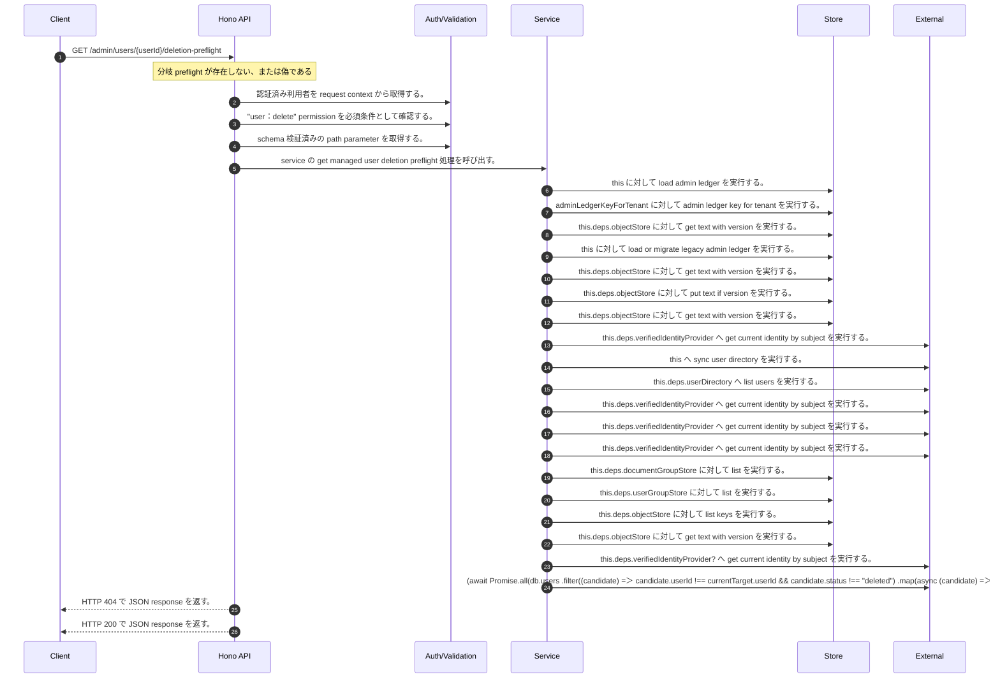

<!-- This file is generated by npm run docs:api-code. Do not edit manually. -->

# GET /admin/users/{userId}/deletion-preflight シーケンス

## シーケンス図

## 処理順とコード対応

| # | Caller | 境界 | 処理 | コード | 実装位置 |
| ---: | --- | --- | --- | --- | --- |
| 1 | `GET /admin/users/{userId}/deletion-preflight handler` | Auth | 認証済み利用者を request context から取得する。 | `c.get("user")` | `apps/api/src/routes/admin-routes.ts:168 (GET /admin/users/{userId}/deletion-preflight handler)` |
| 2 | `GET /admin/users/{userId}/deletion-preflight handler` | Auth | "user:delete" permission を必須条件として確認する。 | `requirePermission(actor, "user:delete")` | `apps/api/src/routes/admin-routes.ts:169 (GET /admin/users/{userId}/deletion-preflight handler)` |
| 3 | `GET /admin/users/{userId}/deletion-preflight handler` | Validation | schema 検証済みの path parameter を取得する。 | `validParam<{ userId: string }>(c)` | `apps/api/src/routes/admin-routes.ts:170 (GET /admin/users/{userId}/deletion-preflight handler)` |
| 4 | `GET /admin/users/{userId}/deletion-preflight handler` | Service | service の get managed user deletion preflight 処理を呼び出す。 | `service.getManagedUserDeletionPreflight(actor, userId)` | `apps/api/src/routes/admin-routes.ts:171 (GET /admin/users/{userId}/deletion-preflight handler)` |
| 5 | `MemoRagService.getManagedUserDeletionPreflight` | Store | `this` に対して load admin ledger を実行する。 | `this.loadAdminLedger(actor, { syncUserDirectory: true })` | `apps/api/src/rag/memorag-service.ts:1658 (MemoRagService.getManagedUserDeletionPreflight)` |
| 6 | `MemoRagService.loadAdminLedger` | Store | `adminLedgerKeyForTenant` に対して admin ledger key for tenant を実行する。 | `adminLedgerKeyForTenant(tenantId)` | `apps/api/src/rag/memorag-service.ts:3315 (MemoRagService.loadAdminLedger)` |
| 7 | `MemoRagService.loadAdminLedger` | Store | `this.deps.objectStore` に対して get text with version を実行する。 | `this.deps.objectStore.getTextWithVersion(storageKey)` | `apps/api/src/rag/memorag-service.ts:3317 (MemoRagService.loadAdminLedger)` |
| 8 | `MemoRagService.loadAdminLedger` | Store | `this` に対して load or migrate legacy admin ledger を実行する。 | `this.loadOrMigrateLegacyAdminLedger(tenantId, storageKey)` | `apps/api/src/rag/memorag-service.ts:3322 (MemoRagService.loadAdminLedger)` |
| 9 | `MemoRagService.loadOrMigrateLegacyAdminLedger` | Store | `this.deps.objectStore` に対して get text with version を実行する。 | `this.deps.objectStore.getTextWithVersion(legacyAdminLedgerKey)` | `apps/api/src/rag/memorag-service.ts:3384 (MemoRagService.loadOrMigrateLegacyAdminLedger)` |
| 10 | `MemoRagService.loadOrMigrateLegacyAdminLedger` | Store | `this.deps.objectStore` に対して put text if version を実行する。 | `this.deps.objectStore.putTextIfVersion(storageKey, serialized, undefined, "application/json")` | `apps/api/src/rag/memorag-service.ts:3398 (MemoRagService.loadOrMigrateLegacyAdminLedger)` |
| 11 | `MemoRagService.loadOrMigrateLegacyAdminLedger` | Store | `this.deps.objectStore` に対して get text with version を実行する。 | `this.deps.objectStore.getTextWithVersion(storageKey)` | `apps/api/src/rag/memorag-service.ts:3402 (MemoRagService.loadOrMigrateLegacyAdminLedger)` |
| 12 | `MemoRagService.loadAdminLedger` | External | `this.deps.verifiedIdentityProvider` へ get current identity by subject を実行する。 | `this.deps.verifiedIdentityProvider.getCurrentIdentityBySubject(actor.userId)` | `apps/api/src/rag/memorag-service.ts:3329 (MemoRagService.loadAdminLedger)` |
| 13 | `MemoRagService.loadAdminLedger` | External | `this` へ sync user directory を実行する。 | `this.syncUserDirectory(db, authoritativeActorTenantId(actor))` | `apps/api/src/rag/memorag-service.ts:3371 (MemoRagService.loadAdminLedger)` |
| 14 | `MemoRagService.syncUserDirectory` | External | `this.deps.userDirectory` へ list users を実行する。 | `this.deps.userDirectory.listUsers()` | `apps/api/src/rag/memorag-service.ts:3409 (MemoRagService.syncUserDirectory)` |
| 15 | `MemoRagService.syncUserDirectory` | External | `this.deps.verifiedIdentityProvider` へ get current identity by subject を実行する。 | `this.deps.verifiedIdentityProvider.getCurrentIdentityBySubject(directoryUser.userId)` | `apps/api/src/rag/memorag-service.ts:3414 (MemoRagService.syncUserDirectory)` |
| 16 | `MemoRagService.getManagedUserDeletionPreflight` | External | `this.deps.verifiedIdentityProvider` へ get current identity by subject を実行する。 | `this.deps.verifiedIdentityProvider.getCurrentIdentityBySubject(actor.userId)` | `apps/api/src/rag/memorag-service.ts:1665 (MemoRagService.getManagedUserDeletionPreflight)` |
| 17 | `MemoRagService.getManagedUserDeletionPreflight` | External | `this.deps.verifiedIdentityProvider` へ get current identity by subject を実行する。 | `this.deps.verifiedIdentityProvider.getCurrentIdentityBySubject(userId)` | `apps/api/src/rag/memorag-service.ts:1666 (MemoRagService.getManagedUserDeletionPreflight)` |
| 18 | `AdministrativePrincipalTransferService.inventory` | Store | `this.deps.documentGroupStore` に対して list を実行する。 | `this.deps.documentGroupStore.list(tenantId)` | `apps/api/src/security/administrative-principal-transfer-service.ts:529 (AdministrativePrincipalTransferService.inventory)` |
| 19 | `AdministrativePrincipalTransferService.inventory` | Store | `this.deps.userGroupStore` に対して list を実行する。 | `this.deps.userGroupStore.list(tenantId)` | `apps/api/src/security/administrative-principal-transfer-service.ts:530 (AdministrativePrincipalTransferService.inventory)` |
| 20 | `AdministrativePrincipalTransferService.inventory` | Store | `this.deps.objectStore` に対して list keys を実行する。 | `this.deps.objectStore.listKeys(tenantManifestPrefix(this.deps, tenantId))` | `apps/api/src/security/administrative-principal-transfer-service.ts:531 (AdministrativePrincipalTransferService.inventory)` |
| 21 | `AdministrativePrincipalTransferService.inventory` | Store | `this.deps.objectStore` に対して get text with version を実行する。 | `this.deps.objectStore.getTextWithVersion(key)` | `apps/api/src/security/administrative-principal-transfer-service.ts:537 (AdministrativePrincipalTransferService.inventory)` |
| 22 | `MemoRagService.getManagedUserDeletionPreflight` | External | `this.deps.verifiedIdentityProvider?` へ get current identity by subject を実行する。 | `this.deps.verifiedIdentityProvider?.getCurrentIdentityBySubject(candidate.userId)` | `apps/api/src/rag/memorag-service.ts:1696 (MemoRagService.getManagedUserDeletionPreflight)` |
| 23 | `MemoRagService.getManagedUserDeletionPreflight` | External | `(await Promise.all(db.users           .filter((candidate) => candidate.userId !== currentTarget.userId && candidate.status !== "deleted")           .map(async (candidate) => ({             candidate,             identity: await this.deps.verifiedIdentityProvider?.getCurrentIdentityBySubject(candidate.userId)           }))))           ` へ filter を実行する。 | `(await Promise.all(db.users .filter((candidate) => candidate.userId !== currentTarget.userId && candidate.status !== "deleted") .map(async (candidate) => ({ candidate, identity: await this.deps.verifiedIdentityProvider?…` | `apps/api/src/rag/memorag-service.ts:1692 (MemoRagService.getManagedUserDeletionPreflight)` |
| 24 | `GET /admin/users/{userId}/deletion-preflight handler` | HTTP/SSE | HTTP 404 で JSON response を返す。 | `c.json({ error: "User not found" }, 404)` | `apps/api/src/routes/admin-routes.ts:172 (GET /admin/users/{userId}/deletion-preflight handler)` |
| 25 | `GET /admin/users/{userId}/deletion-preflight handler` | HTTP/SSE | HTTP 200 で JSON response を返す。 | `c.json(preflight, 200)` | `apps/api/src/routes/admin-routes.ts:173 (GET /admin/users/{userId}/deletion-preflight handler)` |

## 分岐

| ID | Function | 条件 | 実装位置 |
| --- | --- | --- | --- |
| B001 | `GET /admin/users/{userId}/deletion-preflight handler` | `preflight` が存在しない、または偽である | `apps/api/src/routes/admin-routes.ts:172 (GET /admin/users/{userId}/deletion-preflight handler)` |
| B002 | `requirePermission` | 利用者が 指定された permission を持たない | `apps/api/src/authorization.ts:184 (requirePermission)` |
| B003 | `MemoRagService.getManagedUserDeletionPreflight` | `target` が存在しない、または偽である | `apps/api/src/rag/memorag-service.ts:1660 (MemoRagService.getManagedUserDeletionPreflight)` |
| B004 | `MemoRagService.getManagedUserDeletionPreflight` | `this.deps.verifiedIdentityProvider` が存在し、真である、かつ `this.deps.userDirectory` が存在し、真である | `apps/api/src/rag/memorag-service.ts:1663 (MemoRagService.getManagedUserDeletionPreflight)` |
| B005 | `MemoRagService.getManagedUserDeletionPreflight` | `currentActor` が存在しない、または偽である、または `currentTarget` が存在しない、または偽である、または `currentActor.accountStatus` が `"active"` と異なる、または `currentActor.tenantId` が `currentTarget.tenantId` と異なる、または `actor.tenantId` が `currentActor.tenantId` と異なる、または `currentActor.userId` が `currentTarget.userId` と等しい | `apps/api/src/rag/memorag-service.ts:1669 (MemoRagService.getManagedUserDeletionPreflight)` |
| B006 | `MemoRagService.getManagedUserDeletionPreflight` | `ownedResources.total` が `0` と等しい | `apps/api/src/rag/memorag-service.ts:1690 (MemoRagService.getManagedUserDeletionPreflight)` |
| B007 | `MemoRagService.getManagedUserDeletionPreflight` | `config.authEnabled` が存在し、真である | `apps/api/src/rag/memorag-service.ts:1721 (MemoRagService.getManagedUserDeletionPreflight)` |
| B008 | `MemoRagService.getManagedUserDeletionPreflight` | `ownedResources.total` が `0` と等しい | `apps/api/src/rag/memorag-service.ts:1732 (MemoRagService.getManagedUserDeletionPreflight)` |
