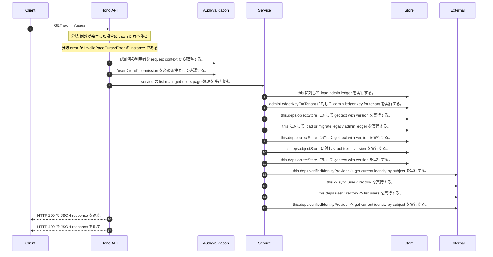

<!-- This file is generated by npm run docs:api-code. Do not edit manually. -->

# GET /admin/users シーケンス

## シーケンス図

## 処理順とコード対応

| # | Caller | 境界 | 処理 | コード | 実装位置 |
| ---: | --- | --- | --- | --- | --- |
| 1 | `GET /admin/users handler` | Auth | 認証済み利用者を request context から取得する。 | `c.get("user")` | `apps/api/src/routes/admin-routes.ts:140 (GET /admin/users handler)` |
| 2 | `GET /admin/users handler` | Auth | "user:read" permission を必須条件として確認する。 | `requirePermission(user, "user:read")` | `apps/api/src/routes/admin-routes.ts:141 (GET /admin/users handler)` |
| 3 | `GET /admin/users handler` | Service | service の list managed users page 処理を呼び出す。 | `service.listManagedUsersPage(user, query)` | `apps/api/src/routes/admin-routes.ts:144 (GET /admin/users handler)` |
| 4 | `MemoRagService.listManagedUsersPage` | Store | `this` に対して load admin ledger を実行する。 | `this.loadAdminLedger(actor, { syncUserDirectory: true })` | `apps/api/src/rag/memorag-service.ts:1794 (MemoRagService.listManagedUsersPage)` |
| 5 | `MemoRagService.loadAdminLedger` | Store | `adminLedgerKeyForTenant` に対して admin ledger key for tenant を実行する。 | `adminLedgerKeyForTenant(tenantId)` | `apps/api/src/rag/memorag-service.ts:3503 (MemoRagService.loadAdminLedger)` |
| 6 | `MemoRagService.loadAdminLedger` | Store | `this.deps.objectStore` に対して get text with version を実行する。 | `this.deps.objectStore.getTextWithVersion(storageKey)` | `apps/api/src/rag/memorag-service.ts:3505 (MemoRagService.loadAdminLedger)` |
| 7 | `MemoRagService.loadAdminLedger` | Store | `this` に対して load or migrate legacy admin ledger を実行する。 | `this.loadOrMigrateLegacyAdminLedger(tenantId, storageKey)` | `apps/api/src/rag/memorag-service.ts:3510 (MemoRagService.loadAdminLedger)` |
| 8 | `MemoRagService.loadOrMigrateLegacyAdminLedger` | Store | `this.deps.objectStore` に対して get text with version を実行する。 | `this.deps.objectStore.getTextWithVersion(legacyAdminLedgerKey)` | `apps/api/src/rag/memorag-service.ts:3572 (MemoRagService.loadOrMigrateLegacyAdminLedger)` |
| 9 | `MemoRagService.loadOrMigrateLegacyAdminLedger` | Store | `this.deps.objectStore` に対して put text if version を実行する。 | `this.deps.objectStore.putTextIfVersion(storageKey, serialized, undefined, "application/json")` | `apps/api/src/rag/memorag-service.ts:3586 (MemoRagService.loadOrMigrateLegacyAdminLedger)` |
| 10 | `MemoRagService.loadOrMigrateLegacyAdminLedger` | Store | `this.deps.objectStore` に対して get text with version を実行する。 | `this.deps.objectStore.getTextWithVersion(storageKey)` | `apps/api/src/rag/memorag-service.ts:3590 (MemoRagService.loadOrMigrateLegacyAdminLedger)` |
| 11 | `MemoRagService.loadAdminLedger` | External | `this.deps.verifiedIdentityProvider` へ get current identity by subject を実行する。 | `this.deps.verifiedIdentityProvider.getCurrentIdentityBySubject(actor.userId)` | `apps/api/src/rag/memorag-service.ts:3517 (MemoRagService.loadAdminLedger)` |
| 12 | `MemoRagService.loadAdminLedger` | External | `this` へ sync user directory を実行する。 | `this.syncUserDirectory(db, authoritativeActorTenantId(actor))` | `apps/api/src/rag/memorag-service.ts:3559 (MemoRagService.loadAdminLedger)` |
| 13 | `MemoRagService.syncUserDirectory` | External | `this.deps.userDirectory` へ list users を実行する。 | `this.deps.userDirectory.listUsers()` | `apps/api/src/rag/memorag-service.ts:3597 (MemoRagService.syncUserDirectory)` |
| 14 | `MemoRagService.syncUserDirectory` | External | `this.deps.verifiedIdentityProvider` へ get current identity by subject を実行する。 | `this.deps.verifiedIdentityProvider.getCurrentIdentityBySubject(directoryUser.userId)` | `apps/api/src/rag/memorag-service.ts:3602 (MemoRagService.syncUserDirectory)` |
| 15 | `GET /admin/users handler` | HTTP/SSE | HTTP 200 で JSON response を返す。 | `c.json(await service.listManagedUsersPage(user, query), 200)` | `apps/api/src/routes/admin-routes.ts:144 (GET /admin/users handler)` |
| 16 | `GET /admin/users handler` | HTTP/SSE | HTTP 400 で JSON response を返す。 | `c.json({ error: error.message }, 400)` | `apps/api/src/routes/admin-routes.ts:146 (GET /admin/users handler)` |

## 分岐

| ID | Function | 条件 | 実装位置 |
| --- | --- | --- | --- |
| B001 | `GET /admin/users handler` | 例外が発生した場合に catch 処理へ移る | `apps/api/src/routes/admin-routes.ts:145 (GET /admin/users handler)` |
| B002 | `GET /admin/users handler` | `error` が `InvalidPageCursorError` の instance である | `apps/api/src/routes/admin-routes.ts:146 (GET /admin/users handler)` |
| B003 | `requirePermission` | 利用者が 指定された permission を持たない | `apps/api/src/authorization.ts:184 (requirePermission)` |
| B004 | `MemoRagService.listManagedUsersPage` | `this.deps.verifiedIdentityProvider` が存在し、真である | `apps/api/src/rag/memorag-service.ts:1801 (MemoRagService.listManagedUsersPage)` |
| B005 | `MemoRagService.listManagedUsersPage` | `actor.userId` が `user.userId` と等しい | `apps/api/src/rag/memorag-service.ts:1808 (MemoRagService.listManagedUsersPage)` |
| B006 | `MemoRagService.listManagedUsersPage` | `user.status` が `"active"` と異なる | `apps/api/src/rag/memorag-service.ts:1809 (MemoRagService.listManagedUsersPage)` |
| B007 | `MemoRagService.listManagedUsersPage` | `user.groups` が "SYSTEM_ADMIN" を含む、かつ `activeRecoveryPrincipals.length` が `1` 以下である | `apps/api/src/rag/memorag-service.ts:1810 (MemoRagService.listManagedUsersPage)` |
| B008 | `MemoRagService.listManagedUsersPage` | `query.sort` が `"updatedDesc"` と等しい | `apps/api/src/rag/memorag-service.ts:1824 (MemoRagService.listManagedUsersPage)` |
| B009 | `MemoRagService.listManagedUsersPage` | `sort` が `"updatedDesc"` と等しい | `apps/api/src/rag/memorag-service.ts:1833 (MemoRagService.listManagedUsersPage)` |
| B010 | `MemoRagService.listManagedUsersPage` | `sort` が `"updatedDesc"` と等しい | `apps/api/src/rag/memorag-service.ts:1834 (MemoRagService.listManagedUsersPage)` |
