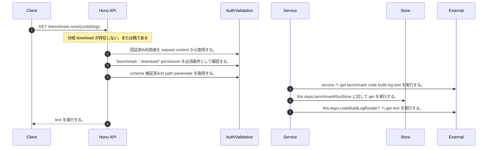

<!-- This file is generated by npm run docs:api-code. Do not edit manually. -->

# GET /benchmark-runs/{runId}/logs シーケンス

## シーケンス図

## 処理順とコード対応

| # | Caller | 境界 | 処理 | コード | 実装位置 |
| ---: | --- | --- | --- | --- | --- |
| 1 | `GET /benchmark-runs/{runId}/logs handler` | Auth | 認証済み利用者を request context から取得する。 | `c.get("user")` | `apps/api/src/routes/benchmark-routes.ts:241 (GET /benchmark-runs/{runId}/logs handler)` |
| 2 | `GET /benchmark-runs/{runId}/logs handler` | Auth | "benchmark:download" permission を必須条件として確認する。 | `requirePermission(actor, "benchmark:download")` | `apps/api/src/routes/benchmark-routes.ts:242 (GET /benchmark-runs/{runId}/logs handler)` |
| 3 | `GET /benchmark-runs/{runId}/logs handler` | Validation | schema 検証済みの path parameter を取得する。 | `validParam<{ runId: string }>(c)` | `apps/api/src/routes/benchmark-routes.ts:243 (GET /benchmark-runs/{runId}/logs handler)` |
| 4 | `GET /benchmark-runs/{runId}/logs handler` | External | `service` へ get benchmark code build log text を実行する。 | `service.getBenchmarkCodeBuildLogText(actor, runId)` | `apps/api/src/routes/benchmark-routes.ts:244 (GET /benchmark-runs/{runId}/logs handler)` |
| 5 | `MemoRagService.getBenchmarkCodeBuildLogText` | Store | `this.deps.benchmarkRunStore` に対して get を実行する。 | `this.deps.benchmarkRunStore.get(authoritativeActorTenantId(actor), runId)` | `apps/api/src/rag/memorag-service.ts:4774 (MemoRagService.getBenchmarkCodeBuildLogText)` |
| 6 | `MemoRagService.getBenchmarkCodeBuildLogText` | External | `this.deps.codeBuildLogReader?` へ get text を実行する。 | `this.deps.codeBuildLogReader?.getText({ buildId: run.codeBuildBuildId, logGroupName: run.codeBuildLogGroupName, logStreamName: run.codeBuildLogStreamName })` | `apps/api/src/rag/memorag-service.ts:4777 (MemoRagService.getBenchmarkCodeBuildLogText)` |
| 7 | `GET /benchmark-runs/{runId}/logs handler` | HTTP/SSE | text を実行する。 | `c.text(download.text, 200, { "Content-Type": "text/plain; charset=utf-8", "Content-Disposition": download.contentDisposition })` | `apps/api/src/routes/benchmark-routes.ts:246 (GET /benchmark-runs/{runId}/logs handler)` |

## 分岐

| ID | Function | 条件 | 実装位置 |
| --- | --- | --- | --- |
| B001 | `GET /benchmark-runs/{runId}/logs handler` | `download` が存在しない、または偽である | `apps/api/src/routes/benchmark-routes.ts:245 (GET /benchmark-runs/{runId}/logs handler)` |
| B002 | `requirePermission` | 利用者が 指定された permission を持たない | `apps/api/src/authorization.ts:184 (requirePermission)` |
| B003 | `MemoRagService.getBenchmarkCodeBuildLogText` | `run` が存在しない、または偽である | `apps/api/src/rag/memorag-service.ts:4775 (MemoRagService.getBenchmarkCodeBuildLogText)` |
| B004 | `MemoRagService.getBenchmarkCodeBuildLogText` | `text` が `undefined` と等しい | `apps/api/src/rag/memorag-service.ts:4782 (MemoRagService.getBenchmarkCodeBuildLogText)` |
