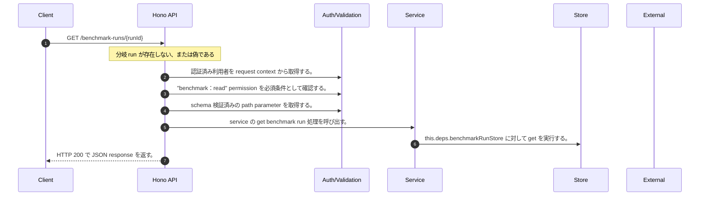

<!-- This file is generated by npm run docs:api-code. Do not edit manually. -->

# GET /benchmark-runs/{runId} シーケンス

## シーケンス図

## 処理順とコード対応

| # | Caller | 境界 | 処理 | コード | 実装位置 |
| ---: | --- | --- | --- | --- | --- |
| 1 | `GET /benchmark-runs/{runId} handler` | Auth | 認証済み利用者を request context から取得する。 | `c.get("user")` | `apps/api/src/routes/benchmark-routes.ts:164 (GET /benchmark-runs/{runId} handler)` |
| 2 | `GET /benchmark-runs/{runId} handler` | Auth | "benchmark:read" permission を必須条件として確認する。 | `requirePermission(actor, "benchmark:read")` | `apps/api/src/routes/benchmark-routes.ts:165 (GET /benchmark-runs/{runId} handler)` |
| 3 | `GET /benchmark-runs/{runId} handler` | Validation | schema 検証済みの path parameter を取得する。 | `validParam<{ runId: string }>(c)` | `apps/api/src/routes/benchmark-routes.ts:166 (GET /benchmark-runs/{runId} handler)` |
| 4 | `GET /benchmark-runs/{runId} handler` | Service | service の get benchmark run 処理を呼び出す。 | `service.getBenchmarkRun(actor, runId)` | `apps/api/src/routes/benchmark-routes.ts:167 (GET /benchmark-runs/{runId} handler)` |
| 5 | `MemoRagService.getBenchmarkRun` | Store | `this.deps.benchmarkRunStore` に対して get を実行する。 | `this.deps.benchmarkRunStore.get(authoritativeActorTenantId(actor), runId)` | `apps/api/src/rag/memorag-service.ts:4385 (MemoRagService.getBenchmarkRun)` |
| 6 | `GET /benchmark-runs/{runId} handler` | HTTP/SSE | HTTP 200 で JSON response を返す。 | `c.json(run, 200)` | `apps/api/src/routes/benchmark-routes.ts:169 (GET /benchmark-runs/{runId} handler)` |

## 分岐

| ID | Function | 条件 | 実装位置 |
| --- | --- | --- | --- |
| B001 | `GET /benchmark-runs/{runId} handler` | `run` が存在しない、または偽である | `apps/api/src/routes/benchmark-routes.ts:168 (GET /benchmark-runs/{runId} handler)` |
| B002 | `requirePermission` | 利用者が 指定された permission を持たない | `apps/api/src/authorization.ts:184 (requirePermission)` |
