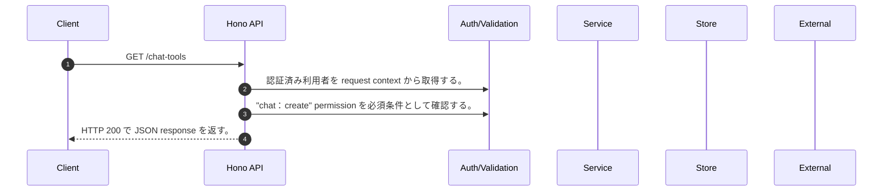

<!-- This file is generated by npm run docs:api-code. Do not edit manually. -->

# GET /chat-tools シーケンス

## シーケンス図

## 処理順とコード対応

| # | Caller | 境界 | 処理 | コード | 実装位置 |
| ---: | --- | --- | --- | --- | --- |
| 1 | `GET /chat-tools handler` | Auth | 認証済み利用者を request context から取得する。 | `c.get("user")` | `apps/api/src/routes/chat-routes.ts:167 (GET /chat-tools handler)` |
| 2 | `GET /chat-tools handler` | Auth | "chat:create" permission を必須条件として確認する。 | `requirePermission(c.get("user"), "chat:create")` | `apps/api/src/routes/chat-routes.ts:167 (GET /chat-tools handler)` |
| 3 | `GET /chat-tools handler` | HTTP/SSE | HTTP 200 で JSON response を返す。 | `c.json({ registryVersion: CHAT_TOOL_REGISTRY_VERSION, tools: CHAT_TOOL_DEFINITIONS }, 200)` | `apps/api/src/routes/chat-routes.ts:168 (GET /chat-tools handler)` |

## 分岐

| ID | Function | 条件 | 実装位置 |
| --- | --- | --- | --- |
| B001 | `requirePermission` | 利用者が 指定された permission を持たない | `apps/api/src/authorization.ts:184 (requirePermission)` |
