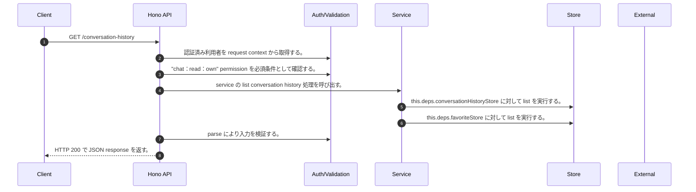

<!-- This file is generated by npm run docs:api-code. Do not edit manually. -->

# GET /conversation-history シーケンス

## シーケンス図

## 処理順とコード対応

| # | Caller | 境界 | 処理 | コード | 実装位置 |
| ---: | --- | --- | --- | --- | --- |
| 1 | `GET /conversation-history handler` | Auth | 認証済み利用者を request context から取得する。 | `c.get("user")` | `apps/api/src/routes/conversation-history-routes.ts:22 (GET /conversation-history handler)` |
| 2 | `GET /conversation-history handler` | Auth | "chat:read:own" permission を必須条件として確認する。 | `requirePermission(user, "chat:read:own")` | `apps/api/src/routes/conversation-history-routes.ts:23 (GET /conversation-history handler)` |
| 3 | `GET /conversation-history handler` | Service | service の list conversation history 処理を呼び出す。 | `service.listConversationHistory(user)` | `apps/api/src/routes/conversation-history-routes.ts:24 (GET /conversation-history handler)` |
| 4 | `MemoRagService.listConversationHistory` | Store | `this.deps.conversationHistoryStore` に対して list を実行する。 | `this.deps.conversationHistoryStore.list(ownerKey)` | `apps/api/src/rag/memorag-service.ts:4228 (MemoRagService.listConversationHistory)` |
| 5 | `MemoRagService.listConversationHistory` | Store | `this.deps.favoriteStore` に対して list を実行する。 | `this.deps.favoriteStore.list(ownerKey)` | `apps/api/src/rag/memorag-service.ts:4229 (MemoRagService.listConversationHistory)` |
| 6 | `GET /conversation-history handler` | Validation | parse により入力を検証する。 | `ConversationHistoryItemSchema.parse(item)` | `apps/api/src/routes/conversation-history-routes.ts:24 (GET /conversation-history handler)` |
| 7 | `GET /conversation-history handler` | HTTP/SSE | HTTP 200 で JSON response を返す。 | `c.json({ history }, 200)` | `apps/api/src/routes/conversation-history-routes.ts:25 (GET /conversation-history handler)` |

## 分岐

| ID | Function | 条件 | 実装位置 |
| --- | --- | --- | --- |
| B001 | `requirePermission` | 利用者が 指定された permission を持たない | `apps/api/src/authorization.ts:184 (requirePermission)` |
