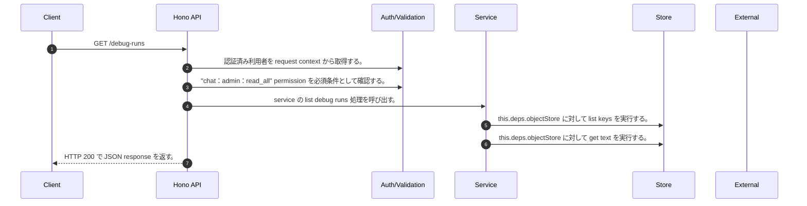

<!-- This file is generated by npm run docs:api-code. Do not edit manually. -->

# GET /debug-runs シーケンス

## シーケンス図

## 処理順とコード対応

| # | Caller | 境界 | 処理 | コード | 実装位置 |
| ---: | --- | --- | --- | --- | --- |
| 1 | `GET /debug-runs handler` | Auth | 認証済み利用者を request context から取得する。 | `c.get("user")` | `apps/api/src/routes/debug-routes.ts:45 (GET /debug-runs handler)` |
| 2 | `GET /debug-runs handler` | Auth | "chat:admin:read_all" permission を必須条件として確認する。 | `requirePermission(user, "chat:admin:read_all")` | `apps/api/src/routes/debug-routes.ts:46 (GET /debug-runs handler)` |
| 3 | `GET /debug-runs handler` | Service | service の list debug runs 処理を呼び出す。 | `service.listDebugRuns(user)` | `apps/api/src/routes/debug-routes.ts:47 (GET /debug-runs handler)` |
| 4 | `MemoRagService.listDebugRuns` | Store | `this.deps.objectStore` に対して list keys を実行する。 | `this.deps.objectStore.listKeys(prefix)` | `apps/api/src/rag/memorag-service.ts:2240 (MemoRagService.listDebugRuns)` |
| 5 | `MemoRagService.listDebugRuns` | Store | `this.deps.objectStore` に対して get text を実行する。 | `this.deps.objectStore.getText(key)` | `apps/api/src/rag/memorag-service.ts:2244 (MemoRagService.listDebugRuns)` |
| 6 | `GET /debug-runs handler` | HTTP/SSE | HTTP 200 で JSON response を返す。 | `c.json({ debugRuns: await service.listDebugRuns(user) }, 200)` | `apps/api/src/routes/debug-routes.ts:47 (GET /debug-runs handler)` |

## 分岐

| ID | Function | 条件 | 実装位置 |
| --- | --- | --- | --- |
| B001 | `requirePermission` | 利用者が 指定された permission を持たない | `apps/api/src/authorization.ts:184 (requirePermission)` |
