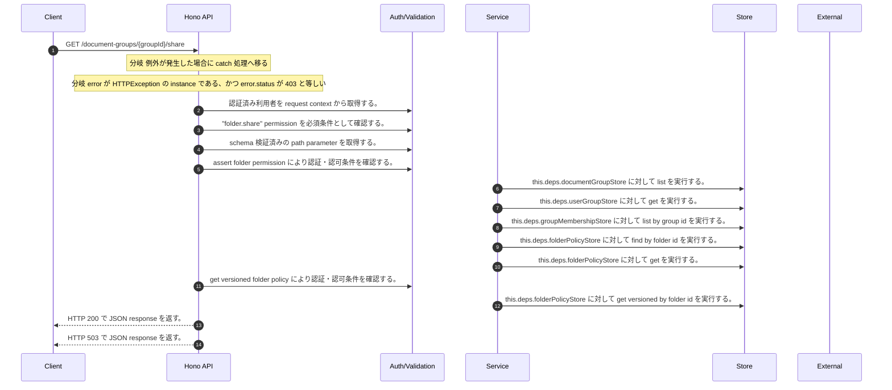

<!-- This file is generated by npm run docs:api-code. Do not edit manually. -->

# GET /document-groups/{groupId}/share シーケンス

## シーケンス図

## 処理順とコード対応

| # | Caller | 境界 | 処理 | コード | 実装位置 |
| ---: | --- | --- | --- | --- | --- |
| 1 | `GET /document-groups/{groupId}/share handler` | Auth | 認証済み利用者を request context から取得する。 | `c.get("user")` | `apps/api/src/routes/document-routes.ts:634 (GET /document-groups/{groupId}/share handler)` |
| 2 | `GET /document-groups/{groupId}/share handler` | Auth | "folder.share" permission を必須条件として確認する。 | `requirePermission(user, "folder.share")` | `apps/api/src/routes/document-routes.ts:635 (GET /document-groups/{groupId}/share handler)` |
| 3 | `GET /document-groups/{groupId}/share handler` | Validation | schema 検証済みの path parameter を取得する。 | `validParam<{ groupId: string }>(c)` | `apps/api/src/routes/document-routes.ts:636 (GET /document-groups/{groupId}/share handler)` |
| 4 | `GET /document-groups/{groupId}/share handler` | Auth | assert folder permission により認証・認可条件を確認する。 | `permissions.assertFolderPermission(user, groupId, "full")` | `apps/api/src/routes/document-routes.ts:639 (GET /document-groups/{groupId}/share handler)` |
| 5 | `FolderPermissionService.resolveEffectiveFolderPermissionDetail` | Store | `this.deps.documentGroupStore` に対して list を実行する。 | `this.deps.documentGroupStore.list(actorTenantId)` | `apps/api/src/folders/folder-permission-service.ts:145 (FolderPermissionService.resolveEffectiveFolderPermissionDetail)` |
| 6 | `FolderPermissionService.resolveUserMembershipPermission` | Store | `this.deps.userGroupStore` に対して get を実行する。 | `this.deps.userGroupStore.get(tenantId, groupId)` | `apps/api/src/folders/folder-permission-service.ts:780 (FolderPermissionService.resolveUserMembershipPermission)` |
| 7 | `FolderPermissionService.resolveUserMembershipPermission` | Store | `this.deps.groupMembershipStore` に対して list by group id を実行する。 | `this.deps.groupMembershipStore.listByGroupId(tenantId, groupId)` | `apps/api/src/folders/folder-permission-service.ts:781 (FolderPermissionService.resolveUserMembershipPermission)` |
| 8 | `FolderPermissionService.resolvePolicyContext` | Store | `this.deps.folderPolicyStore` に対して find by folder id を実行する。 | `this.deps.folderPolicyStore.findByFolderId(folder.tenantId, current.groupId)` | `apps/api/src/folders/folder-permission-service.ts:695 (FolderPermissionService.resolvePolicyContext)` |
| 9 | `FolderPermissionService.resolvePolicyContext` | Store | `this.deps.folderPolicyStore` に対して get を実行する。 | `this.deps.folderPolicyStore.get(folder.tenantId, current.policyId)` | `apps/api/src/folders/folder-permission-service.ts:711 (FolderPermissionService.resolvePolicyContext)` |
| 10 | `GET /document-groups/{groupId}/share handler` | Auth | get versioned folder policy により認証・認可条件を確認する。 | `permissions.getVersionedFolderPolicy(uploadTenantId(user, "document"), groupId)` | `apps/api/src/routes/document-routes.ts:640 (GET /document-groups/{groupId}/share handler)` |
| 11 | `FolderPermissionService.getVersionedFolderPolicy` | Store | `this.deps.folderPolicyStore` に対して get versioned by folder id を実行する。 | `this.deps.folderPolicyStore.getVersionedByFolderId(tenantId, folderId)` | `apps/api/src/folders/folder-permission-service.ts:294 (FolderPermissionService.getVersionedFolderPolicy)` |
| 12 | `GET /document-groups/{groupId}/share handler` | HTTP/SSE | HTTP 200 で JSON response を返す。 | `c.json({ policy: state.policy ?? null, version: state.version }, 200)` | `apps/api/src/routes/document-routes.ts:641 (GET /document-groups/{groupId}/share handler)` |
| 13 | `GET /document-groups/{groupId}/share handler` | HTTP/SSE | HTTP 503 で JSON response を返す。 | `c.json({ error: "Folder sharing is unavailable" }, 503)` | `apps/api/src/routes/document-routes.ts:644 (GET /document-groups/{groupId}/share handler)` |

## 分岐

| ID | Function | 条件 | 実装位置 |
| --- | --- | --- | --- |
| B001 | `GET /document-groups/{groupId}/share handler` | 例外が発生した場合に catch 処理へ移る | `apps/api/src/routes/document-routes.ts:642 (GET /document-groups/{groupId}/share handler)` |
| B002 | `GET /document-groups/{groupId}/share handler` | `error` が `HTTPException` の instance である、かつ `error.status` が `403` と等しい | `apps/api/src/routes/document-routes.ts:643 (GET /document-groups/{groupId}/share handler)` |
| B003 | `requirePermission` | 利用者が 指定された permission を持たない | `apps/api/src/authorization.ts:185 (requirePermission)` |
| B004 | `FolderPermissionService.assertFolderPermission` | folder permission satisfies の判定結果が真ではない | `apps/api/src/folders/folder-permission-service.ts:258 (FolderPermissionService.assertFolderPermission)` |
| B005 | `uploadTenantId` | `purpose` が `"benchmarkSeed"` と等しい | `apps/api/src/routes/document-routes.ts:156 (uploadTenantId)` |
| B006 | `uploadTenantId` | `config.benchmarkEvaluationEnabled` が存在しない、または偽である、または trim の判定結果が真ではない | `apps/api/src/routes/document-routes.ts:157 (uploadTenantId)` |
| B007 | `uploadTenantId` | `config.authEnabled` が存在しない、または偽である | `apps/api/src/routes/document-routes.ts:162 (uploadTenantId)` |
| B008 | `uploadTenantId` | `tenantId` が存在しない、または偽である | `apps/api/src/routes/document-routes.ts:163 (uploadTenantId)` |
