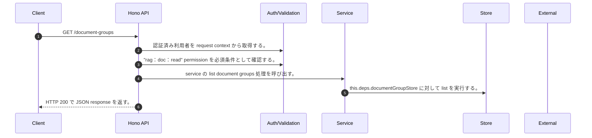

<!-- This file is generated by npm run docs:api-code. Do not edit manually. -->

# GET /document-groups シーケンス

## シーケンス図

## 処理順とコード対応

| # | Caller | 境界 | 処理 | コード | 実装位置 |
| ---: | --- | --- | --- | --- | --- |
| 1 | `GET /document-groups handler` | Auth | 認証済み利用者を request context から取得する。 | `c.get("user")` | `apps/api/src/routes/document-routes.ts:227 (GET /document-groups handler)` |
| 2 | `GET /document-groups handler` | Auth | "rag:doc:read" permission を必須条件として確認する。 | `requirePermission(user, "rag:doc:read")` | `apps/api/src/routes/document-routes.ts:228 (GET /document-groups handler)` |
| 3 | `GET /document-groups handler` | Service | service の list document groups 処理を呼び出す。 | `service.listDocumentGroups(user)` | `apps/api/src/routes/document-routes.ts:229 (GET /document-groups handler)` |
| 4 | `MemoRagService.listDocumentGroups` | Store | `this.deps.documentGroupStore` に対して list を実行する。 | `this.deps.documentGroupStore.list()` | `apps/api/src/rag/memorag-service.ts:419 (MemoRagService.listDocumentGroups)` |
| 5 | `GET /document-groups handler` | HTTP/SSE | HTTP 200 で JSON response を返す。 | `c.json({ groups: await service.listDocumentGroups(user) }, 200)` | `apps/api/src/routes/document-routes.ts:229 (GET /document-groups handler)` |

## 分岐

| ID | Function | 条件 | 実装位置 |
| --- | --- | --- | --- |
| B001 | `requirePermission` | 利用者が 指定された permission を持たない | `apps/api/src/authorization.ts:267 (requirePermission)` |
