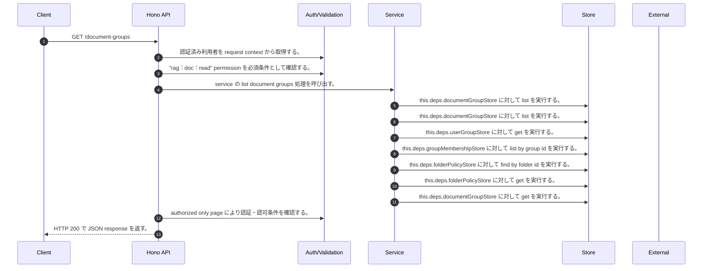

<!-- This file is generated by npm run docs:api-code. Do not edit manually. -->

# GET /document-groups シーケンス

## シーケンス図

## 処理順とコード対応

| # | Caller | 境界 | 処理 | コード | 実装位置 |
| ---: | --- | --- | --- | --- | --- |
| 1 | `GET /document-groups handler` | Auth | 認証済み利用者を request context から取得する。 | `c.get("user")` | `apps/api/src/routes/document-routes.ts:521 (GET /document-groups handler)` |
| 2 | `GET /document-groups handler` | Auth | "rag:doc:read" permission を必須条件として確認する。 | `requirePermission(user, "rag:doc:read")` | `apps/api/src/routes/document-routes.ts:522 (GET /document-groups handler)` |
| 3 | `GET /document-groups handler` | Service | service の list document groups 処理を呼び出す。 | `service.listDocumentGroups(user)` | `apps/api/src/routes/document-routes.ts:525 (GET /document-groups handler)` |
| 4 | `MemoRagService.listDocumentGroups` | Store | `this.deps.documentGroupStore` に対して list を実行する。 | `this.deps.documentGroupStore.list(authoritativeActorTenantId(user))` | `apps/api/src/rag/memorag-service.ts:870 (MemoRagService.listDocumentGroups)` |
| 5 | `FolderPermissionService.resolveEffectiveFolderPermissionDetail` | Store | `this.deps.documentGroupStore` に対して list を実行する。 | `this.deps.documentGroupStore.list(actorTenantId)` | `apps/api/src/folders/folder-permission-service.ts:145 (FolderPermissionService.resolveEffectiveFolderPermissionDetail)` |
| 6 | `FolderPermissionService.resolveUserMembershipPermission` | Store | `this.deps.userGroupStore` に対して get を実行する。 | `this.deps.userGroupStore.get(tenantId, groupId)` | `apps/api/src/folders/folder-permission-service.ts:780 (FolderPermissionService.resolveUserMembershipPermission)` |
| 7 | `FolderPermissionService.resolveUserMembershipPermission` | Store | `this.deps.groupMembershipStore` に対して list by group id を実行する。 | `this.deps.groupMembershipStore.listByGroupId(tenantId, groupId)` | `apps/api/src/folders/folder-permission-service.ts:781 (FolderPermissionService.resolveUserMembershipPermission)` |
| 8 | `FolderPermissionService.resolvePolicyContext` | Store | `this.deps.folderPolicyStore` に対して find by folder id を実行する。 | `this.deps.folderPolicyStore.findByFolderId(folder.tenantId, current.groupId)` | `apps/api/src/folders/folder-permission-service.ts:695 (FolderPermissionService.resolvePolicyContext)` |
| 9 | `FolderPermissionService.resolvePolicyContext` | Store | `this.deps.folderPolicyStore` に対して get を実行する。 | `this.deps.folderPolicyStore.get(folder.tenantId, current.policyId)` | `apps/api/src/folders/folder-permission-service.ts:711 (FolderPermissionService.resolvePolicyContext)` |
| 10 | `FolderPermissionService.assertFolderOperation` | Store | `this.deps.documentGroupStore` に対して get を実行する。 | `this.deps.documentGroupStore.get(actorTenantId, folderId)` | `apps/api/src/folders/folder-permission-service.ts:110 (FolderPermissionService.assertFolderOperation)` |
| 11 | `GET /document-groups handler` | Auth | authorized only page により認証・認可条件を確認する。 | `authorizedOnlyPage({ candidates: await service.listDocumentGroups(user), authorized: () => true, project: documentGroupListItem, offset: decodeCollectionCursor(query.cursor), limit: query.limit })` | `apps/api/src/routes/document-routes.ts:524 (GET /document-groups handler)` |
| 12 | `GET /document-groups handler` | HTTP/SSE | HTTP 200 で JSON response を返す。 | `c.json({ groups: page.items, count: page.count, nextCursor: page.nextCursor, responseProfileVersion: page.responseProfileVersion }, 200)` | `apps/api/src/routes/document-routes.ts:531 (GET /document-groups handler)` |

## 分岐

| ID | Function | 条件 | 実装位置 |
| --- | --- | --- | --- |
| B001 | `requirePermission` | 利用者が 指定された permission を持たない | `apps/api/src/authorization.ts:184 (requirePermission)` |
| B002 | `MemoRagService.listDocumentGroups` | `detail.permission` が `"none"` と異なる | `apps/api/src/rag/memorag-service.ts:874 (MemoRagService.listDocumentGroups)` |
| B003 | `MemoRagService.listDocumentGroups` | 例外が発生した場合に catch 処理へ移る | `apps/api/src/rag/memorag-service.ts:877 (MemoRagService.listDocumentGroups)` |
| B004 | `MemoRagService.listDocumentGroups` | `error` が `ResourceOperationAuthorizationError` の instance である | `apps/api/src/rag/memorag-service.ts:878 (MemoRagService.listDocumentGroups)` |
| B005 | `decodeCollectionCursor` | `cursor` が存在しない、または偽である | `apps/api/src/routes/document-routes.ts:279 (decodeCollectionCursor)` |
| B006 | `decodeCollectionCursor` | test の判定結果が真ではない | `apps/api/src/routes/document-routes.ts:283 (decodeCollectionCursor)` |
| B007 | `decodeCollectionCursor` | `Buffer.from(decoded, "utf-8").toString("base64url")` が `normalized` と異なる | `apps/api/src/routes/document-routes.ts:284 (decodeCollectionCursor)` |
| B008 | `decodeCollectionCursor` | is safe integer の判定結果が真ではない | `apps/api/src/routes/document-routes.ts:286 (decodeCollectionCursor)` |
| B009 | `decodeCollectionCursor` | 例外が発生した場合に catch 処理へ移る | `apps/api/src/routes/document-routes.ts:288 (decodeCollectionCursor)` |
| B010 | `authorizedOnlyPage` | `nextOffset` が `authorized.length` より小さい | `apps/api/src/security/public-resource-response.ts:71 (authorizedOnlyPage)` |
