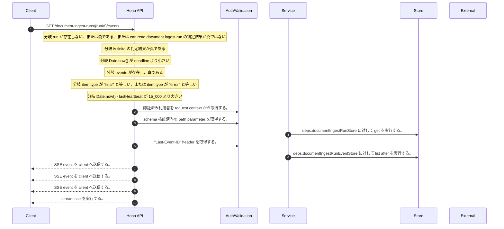

<!-- This file is generated by npm run docs:api-code. Do not edit manually. -->

# GET /document-ingest-runs/{runId}/events シーケンス

## シーケンス図

## 処理順とコード対応

| # | Caller | 境界 | 処理 | コード | 実装位置 |
| ---: | --- | --- | --- | --- | --- |
| 1 | `GET /document-ingest-runs/{runId}/events handler` | Auth | 認証済み利用者を request context から取得する。 | `c.get("user")` | `apps/api/src/routes/document-routes.ts:1232 (GET /document-ingest-runs/{runId}/events handler)` |
| 2 | `GET /document-ingest-runs/{runId}/events handler` | Validation | schema 検証済みの path parameter を取得する。 | `c.req.param("runId")` | `apps/api/src/routes/document-routes.ts:1233 (GET /document-ingest-runs/{runId}/events handler)` |
| 3 | `GET /document-ingest-runs/{runId}/events handler` | Store | `deps.documentIngestRunStore` に対して get を実行する。 | `deps.documentIngestRunStore.get(tenantId, runId)` | `apps/api/src/routes/document-routes.ts:1235 (GET /document-ingest-runs/{runId}/events handler)` |
| 4 | `GET /document-ingest-runs/{runId}/events handler` | Validation | "Last-Event-ID" header を取得する。 | `c.req.header("Last-Event-ID")` | `apps/api/src/routes/document-routes.ts:1239 (GET /document-ingest-runs/{runId}/events handler)` |
| 5 | `GET /document-ingest-runs/{runId}/events handler` | Store | `deps.documentIngestRunEventStore` に対して list after を実行する。 | `deps.documentIngestRunEventStore.listAfter(tenantId, runId, afterSeq)` | `apps/api/src/routes/document-routes.ts:1245 (GET /document-ingest-runs/{runId}/events handler)` |
| 6 | `GET /document-ingest-runs/{runId}/events handler` | HTTP/SSE | SSE event を client へ送信する。 | `stream.writeSSE({ id: String(item.seq), event: item.type, data: JSON.stringify(eventPayload(item)) })` | `apps/api/src/routes/document-routes.ts:1247 (GET /document-ingest-runs/{runId}/events handler)` |
| 7 | `GET /document-ingest-runs/{runId}/events handler` | HTTP/SSE | SSE event を client へ送信する。 | `stream.writeSSE({ event: "heartbeat", data: JSON.stringify({ ts: new Date().toISOString(), nextSeq: afterSeq + 1 }) })` | `apps/api/src/routes/document-routes.ts:1257 (GET /document-ingest-runs/{runId}/events handler)` |
| 8 | `GET /document-ingest-runs/{runId}/events handler` | HTTP/SSE | SSE event を client へ送信する。 | `stream.writeSSE({ event: "timeout", data: JSON.stringify({ message: "stream timeout. reconnect with Last-Event-ID.", nextSeq: afterSeq + 1 }) })` | `apps/api/src/routes/document-routes.ts:1267 (GET /document-ingest-runs/{runId}/events handler)` |
| 9 | `GET /document-ingest-runs/{runId}/events handler` | HTTP/SSE | stream sse を実行する。 | `streamSSE(c, async (stream) => { const lastEventId = Number(c.req.header("Last-Event-ID") ?? 0) let afterSeq = Number.isFinite(lastEventId) ? lastEventId : 0 const deadline = Date.now() + 14 * 60 * 1000 let lastHeartbea…` | `apps/api/src/routes/document-routes.ts:1238 (GET /document-ingest-runs/{runId}/events handler)` |

## 分岐

| ID | Function | 条件 | 実装位置 |
| --- | --- | --- | --- |
| B001 | `GET /document-ingest-runs/{runId}/events handler` | `run` が存在しない、または偽である、または can read document ingest run の判定結果が真ではない | `apps/api/src/routes/document-routes.ts:1236 (GET /document-ingest-runs/{runId}/events handler)` |
| B002 | `GET /document-ingest-runs/{runId}/events handler` | is finite の判定結果が真である | `apps/api/src/routes/document-routes.ts:1240 (GET /document-ingest-runs/{runId}/events handler)` |
| B003 | `GET /document-ingest-runs/{runId}/events handler` | `Date.now()` が `deadline` より小さい | `apps/api/src/routes/document-routes.ts:1244 (GET /document-ingest-runs/{runId}/events handler)` |
| B004 | `GET /document-ingest-runs/{runId}/events handler` | `events` が存在し、真である | `apps/api/src/routes/document-routes.ts:1246 (GET /document-ingest-runs/{runId}/events handler)` |
| B005 | `GET /document-ingest-runs/{runId}/events handler` | `item.type` が `"final"` と等しい、または `item.type` が `"error"` と等しい | `apps/api/src/routes/document-routes.ts:1253 (GET /document-ingest-runs/{runId}/events handler)` |
| B006 | `GET /document-ingest-runs/{runId}/events handler` | `Date.now() - lastHeartbeat` が `15_000` より大きい | `apps/api/src/routes/document-routes.ts:1256 (GET /document-ingest-runs/{runId}/events handler)` |
| B007 | `uploadTenantId` | `purpose` が `"benchmarkSeed"` と等しい | `apps/api/src/routes/document-routes.ts:156 (uploadTenantId)` |
| B008 | `uploadTenantId` | `config.benchmarkEvaluationEnabled` が存在しない、または偽である、または trim の判定結果が真ではない | `apps/api/src/routes/document-routes.ts:157 (uploadTenantId)` |
| B009 | `uploadTenantId` | `config.authEnabled` が存在しない、または偽である | `apps/api/src/routes/document-routes.ts:162 (uploadTenantId)` |
| B010 | `uploadTenantId` | `tenantId` が存在しない、または偽である | `apps/api/src/routes/document-routes.ts:163 (uploadTenantId)` |
| B011 | `canReadDocumentIngestRun` | 利用者が "chat:read:own" permission を持つ、かつ can read owned run の判定結果が真である | `apps/api/src/routes/document-routes.ts:97 (canReadDocumentIngestRun)` |
| B012 | `eventPayload` | `item.stage` が `undefined` と異なる | `apps/api/src/chat-run-events-stream.ts:139 (eventPayload)` |
| B013 | `eventPayload` | `item.message` が `undefined` と異なる | `apps/api/src/chat-run-events-stream.ts:140 (eventPayload)` |
| B014 | `eventPayload` | `item.data` が存在し、真である、かつ `typeof item.data` が `"object"` と等しい、かつ is array の判定結果が真ではない | `apps/api/src/chat-run-events-stream.ts:142 (eventPayload)` |
| B015 | `eventPayload` | `item.data` が `undefined` と等しい | `apps/api/src/chat-run-events-stream.ts:146 (eventPayload)` |
