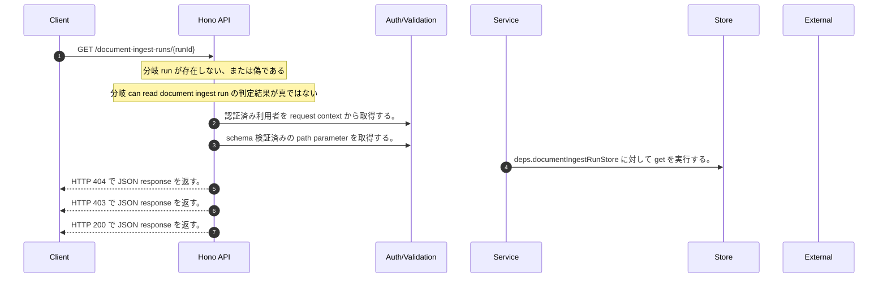

<!-- This file is generated by npm run docs:api-code. Do not edit manually. -->

# GET /document-ingest-runs/{runId} シーケンス

## シーケンス図

## 処理順とコード対応

| # | Caller | 境界 | 処理 | コード | 実装位置 |
| ---: | --- | --- | --- | --- | --- |
| 1 | `GET /document-ingest-runs/{runId} handler` | Auth | 認証済み利用者を request context から取得する。 | `c.get("user")` | `apps/api/src/routes/document-routes.ts:615 (GET /document-ingest-runs/{runId} handler)` |
| 2 | `GET /document-ingest-runs/{runId} handler` | Validation | schema 検証済みの path parameter を取得する。 | `c.req.param("runId")` | `apps/api/src/routes/document-routes.ts:616 (GET /document-ingest-runs/{runId} handler)` |
| 3 | `GET /document-ingest-runs/{runId} handler` | Store | `deps.documentIngestRunStore` に対して get を実行する。 | `deps.documentIngestRunStore.get(runId)` | `apps/api/src/routes/document-routes.ts:617 (GET /document-ingest-runs/{runId} handler)` |
| 4 | `GET /document-ingest-runs/{runId} handler` | HTTP/SSE | HTTP 404 で JSON response を返す。 | `c.json({ error: "Document ingest run not found" }, 404)` | `apps/api/src/routes/document-routes.ts:618 (GET /document-ingest-runs/{runId} handler)` |
| 5 | `GET /document-ingest-runs/{runId} handler` | HTTP/SSE | HTTP 403 で JSON response を返す。 | `c.json({ error: "Forbidden" }, 403)` | `apps/api/src/routes/document-routes.ts:619 (GET /document-ingest-runs/{runId} handler)` |
| 6 | `GET /document-ingest-runs/{runId} handler` | HTTP/SSE | HTTP 200 で JSON response を返す。 | `c.json(run, 200)` | `apps/api/src/routes/document-routes.ts:620 (GET /document-ingest-runs/{runId} handler)` |

## 分岐

| ID | Function | 条件 | 実装位置 |
| --- | --- | --- | --- |
| B001 | `GET /document-ingest-runs/{runId} handler` | `run` が存在しない、または偽である | `apps/api/src/routes/document-routes.ts:618 (GET /document-ingest-runs/{runId} handler)` |
| B002 | `GET /document-ingest-runs/{runId} handler` | can read document ingest run の判定結果が真ではない | `apps/api/src/routes/document-routes.ts:619 (GET /document-ingest-runs/{runId} handler)` |
| B003 | `canReadDocumentIngestRun` | 利用者が "chat:read:own" permission を持つ、かつ can read owned run の判定結果が真である | `apps/api/src/routes/document-routes.ts:56 (canReadDocumentIngestRun)` |
