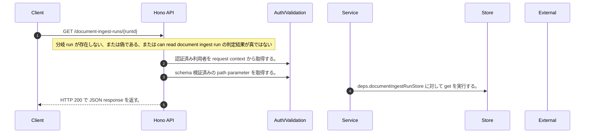

<!-- This file is generated by npm run docs:api-code. Do not edit manually. -->

# GET /document-ingest-runs/{runId} シーケンス

## シーケンス図

## 処理順とコード対応

| # | Caller | 境界 | 処理 | コード | 実装位置 |
| ---: | --- | --- | --- | --- | --- |
| 1 | `GET /document-ingest-runs/{runId} handler` | Auth | 認証済み利用者を request context から取得する。 | `c.get("user")` | `apps/api/src/routes/document-routes.ts:1208 (GET /document-ingest-runs/{runId} handler)` |
| 2 | `GET /document-ingest-runs/{runId} handler` | Validation | schema 検証済みの path parameter を取得する。 | `c.req.param("runId")` | `apps/api/src/routes/document-routes.ts:1209 (GET /document-ingest-runs/{runId} handler)` |
| 3 | `GET /document-ingest-runs/{runId} handler` | Store | `deps.documentIngestRunStore` に対して get を実行する。 | `deps.documentIngestRunStore.get(tenantId, runId)` | `apps/api/src/routes/document-routes.ts:1211 (GET /document-ingest-runs/{runId} handler)` |
| 4 | `GET /document-ingest-runs/{runId} handler` | HTTP/SSE | HTTP 200 で JSON response を返す。 | `c.json(publicDocumentIngestRun(run), 200)` | `apps/api/src/routes/document-routes.ts:1213 (GET /document-ingest-runs/{runId} handler)` |

## 分岐

| ID | Function | 条件 | 実装位置 |
| --- | --- | --- | --- |
| B001 | `GET /document-ingest-runs/{runId} handler` | `run` が存在しない、または偽である、または can read document ingest run の判定結果が真ではない | `apps/api/src/routes/document-routes.ts:1212 (GET /document-ingest-runs/{runId} handler)` |
| B002 | `uploadTenantId` | `purpose` が `"benchmarkSeed"` と等しい | `apps/api/src/routes/document-routes.ts:156 (uploadTenantId)` |
| B003 | `uploadTenantId` | `config.benchmarkEvaluationEnabled` が存在しない、または偽である、または trim の判定結果が真ではない | `apps/api/src/routes/document-routes.ts:157 (uploadTenantId)` |
| B004 | `uploadTenantId` | `config.authEnabled` が存在しない、または偽である | `apps/api/src/routes/document-routes.ts:162 (uploadTenantId)` |
| B005 | `uploadTenantId` | `tenantId` が存在しない、または偽である | `apps/api/src/routes/document-routes.ts:163 (uploadTenantId)` |
| B006 | `canReadDocumentIngestRun` | 利用者が "chat:read:own" permission を持つ、かつ can read owned run の判定結果が真である | `apps/api/src/routes/document-routes.ts:97 (canReadDocumentIngestRun)` |
