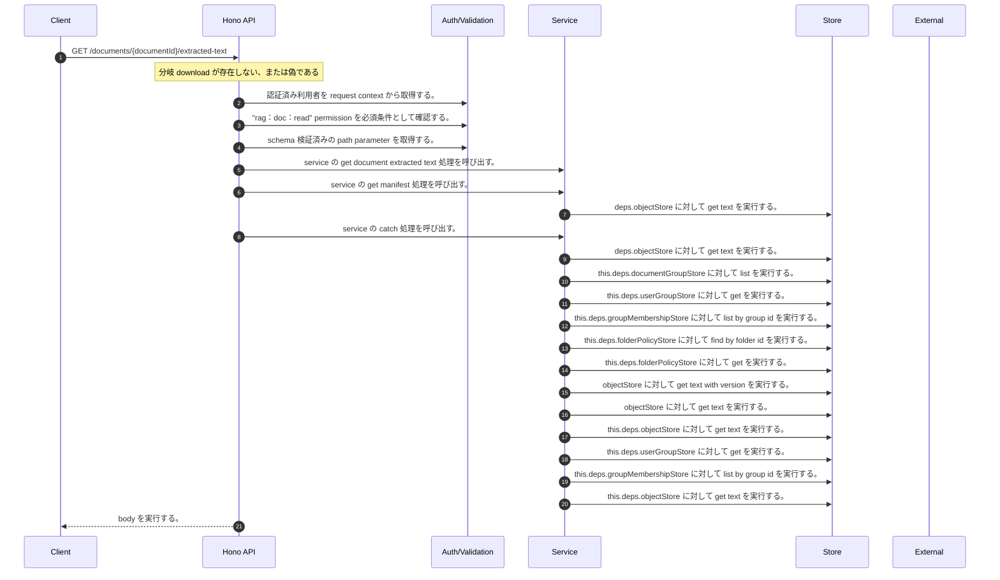

<!-- This file is generated by npm run docs:api-code. Do not edit manually. -->

# GET /documents/{documentId}/extracted-text シーケンス

## シーケンス図

## 処理順とコード対応

| # | Caller | 境界 | 処理 | コード | 実装位置 |
| ---: | --- | --- | --- | --- | --- |
| 1 | `GET /documents/{documentId}/extracted-text handler` | Auth | 認証済み利用者を request context から取得する。 | `c.get("user")` | `apps/api/src/routes/document-routes.ts:1517 (GET /documents/{documentId}/extracted-text handler)` |
| 2 | `GET /documents/{documentId}/extracted-text handler` | Auth | "rag:doc:read" permission を必須条件として確認する。 | `requirePermission(user, "rag:doc:read")` | `apps/api/src/routes/document-routes.ts:1518 (GET /documents/{documentId}/extracted-text handler)` |
| 3 | `GET /documents/{documentId}/extracted-text handler` | Validation | schema 検証済みの path parameter を取得する。 | `validParam<{ documentId: string }>(c)` | `apps/api/src/routes/document-routes.ts:1519 (GET /documents/{documentId}/extracted-text handler)` |
| 4 | `GET /documents/{documentId}/extracted-text handler` | Service | service の get document extracted text 処理を呼び出す。 | `service.getDocumentExtractedText(user, documentId)` | `apps/api/src/routes/document-routes.ts:1520 (GET /documents/{documentId}/extracted-text handler)` |
| 5 | `MemoRagService.getDocumentExtractedText` | Service | service の get manifest 処理を呼び出す。 | `this.getManifest(documentId, authoritativeActorTenantId(user))` | `apps/api/src/rag/memorag-service.ts:995 (MemoRagService.getDocumentExtractedText)` |
| 6 | `readTenantManifest` | Store | `deps.objectStore` に対して get text を実行する。 | `deps.objectStore.getText(key)` | `apps/api/src/rag/_shared/storage/tenant-artifacts.ts:83 (readTenantManifest)` |
| 7 | `MemoRagService.getDocumentExtractedText` | Service | service の catch 処理を呼び出す。 | `this.getManifest(documentId, authoritativeActorTenantId(user)).catch((error: unknown) => { if (isMissingObjectError(error)) return undefined throw error })` | `apps/api/src/rag/memorag-service.ts:995 (MemoRagService.getDocumentExtractedText)` |
| 8 | `loadPublicationPointer` | Store | `deps.objectStore` に対して get text を実行する。 | `deps.objectStore.getText(key)` | `apps/api/src/rag/_shared/publication/staged-publication-coordinator.ts:1809 (loadPublicationPointer)` |
| 9 | `FolderPermissionService.resolveEffectiveFolderPermissionDetail` | Store | `this.deps.documentGroupStore` に対して list を実行する。 | `this.deps.documentGroupStore.list(actorTenantId)` | `apps/api/src/folders/folder-permission-service.ts:145 (FolderPermissionService.resolveEffectiveFolderPermissionDetail)` |
| 10 | `FolderPermissionService.resolveUserMembershipPermission` | Store | `this.deps.userGroupStore` に対して get を実行する。 | `this.deps.userGroupStore.get(tenantId, groupId)` | `apps/api/src/folders/folder-permission-service.ts:780 (FolderPermissionService.resolveUserMembershipPermission)` |
| 11 | `FolderPermissionService.resolveUserMembershipPermission` | Store | `this.deps.groupMembershipStore` に対して list by group id を実行する。 | `this.deps.groupMembershipStore.listByGroupId(tenantId, groupId)` | `apps/api/src/folders/folder-permission-service.ts:781 (FolderPermissionService.resolveUserMembershipPermission)` |
| 12 | `FolderPermissionService.resolvePolicyContext` | Store | `this.deps.folderPolicyStore` に対して find by folder id を実行する。 | `this.deps.folderPolicyStore.findByFolderId(folder.tenantId, current.groupId)` | `apps/api/src/folders/folder-permission-service.ts:695 (FolderPermissionService.resolvePolicyContext)` |
| 13 | `FolderPermissionService.resolvePolicyContext` | Store | `this.deps.folderPolicyStore` に対して get を実行する。 | `this.deps.folderPolicyStore.get(folder.tenantId, current.policyId)` | `apps/api/src/folders/folder-permission-service.ts:711 (FolderPermissionService.resolvePolicyContext)` |
| 14 | `getTextWithVersion` | Store | `objectStore` に対して get text with version を実行する。 | `objectStore.getTextWithVersion(key)` | `apps/api/src/documents/document-permission-service.ts:955 (getTextWithVersion)` |
| 15 | `getTextWithVersion` | Store | `objectStore` に対して get text を実行する。 | `objectStore.getText(key)` | `apps/api/src/documents/document-permission-service.ts:956 (getTextWithVersion)` |
| 16 | `DocumentPermissionService.loadLegacyDocumentGrants` | Store | `this.deps.objectStore` に対して get text を実行する。 | `this.deps.objectStore.getText(documentShareLegacyLedgerKey)` | `apps/api/src/documents/document-permission-service.ts:533 (DocumentPermissionService.loadLegacyDocumentGrants)` |
| 17 | `DocumentPermissionService.resolveUserMembershipPermission` | Store | `this.deps.userGroupStore` に対して get を実行する。 | `this.deps.userGroupStore.get(tenantId, groupId)` | `apps/api/src/documents/document-permission-service.ts:679 (DocumentPermissionService.resolveUserMembershipPermission)` |
| 18 | `DocumentPermissionService.resolveUserMembershipPermission` | Store | `this.deps.groupMembershipStore` に対して list by group id を実行する。 | `this.deps.groupMembershipStore.listByGroupId(tenantId, groupId)` | `apps/api/src/documents/document-permission-service.ts:680 (DocumentPermissionService.resolveUserMembershipPermission)` |
| 19 | `MemoRagService.getDocumentExtractedText` | Store | `this.deps.objectStore` に対して get text を実行する。 | `this.deps.objectStore.getText(manifest.sourceObjectKey)` | `apps/api/src/rag/memorag-service.ts:1013 (MemoRagService.getDocumentExtractedText)` |
| 20 | `GET /documents/{documentId}/extracted-text handler` | HTTP/SSE | body を実行する。 | `c.body(download.text, 200)` | `apps/api/src/routes/document-routes.ts:1527 (GET /documents/{documentId}/extracted-text handler)` |

## 分岐

| ID | Function | 条件 | 実装位置 |
| --- | --- | --- | --- |
| B001 | `GET /documents/{documentId}/extracted-text handler` | `download` が存在しない、または偽である | `apps/api/src/routes/document-routes.ts:1521 (GET /documents/{documentId}/extracted-text handler)` |
| B002 | `requirePermission` | 利用者が 指定された permission を持たない | `apps/api/src/authorization.ts:185 (requirePermission)` |
| B003 | `MemoRagService.getDocumentExtractedText` | is missing object error の判定結果が真である | `apps/api/src/rag/memorag-service.ts:996 (MemoRagService.getDocumentExtractedText)` |
| B004 | `MemoRagService.getDocumentExtractedText` | `manifest` が存在しない、または偽である | `apps/api/src/rag/memorag-service.ts:999 (MemoRagService.getDocumentExtractedText)` |
| B005 | `MemoRagService.getDocumentExtractedText` | 条件式 `await isManifestCurrentPublication(this.deps, manifest, publicationSnapshot)` が成立しない | `apps/api/src/rag/memorag-service.ts:1001 (MemoRagService.getDocumentExtractedText)` |
| B006 | `MemoRagService.getDocumentExtractedText` | `(manifest.lifecycleStatus ?? stringValue(manifest.metadata?.lifecycleStatus) ?? "active")` が `"active"` と異なる | `apps/api/src/rag/memorag-service.ts:1002 (MemoRagService.getDocumentExtractedText)` |
| B007 | `MemoRagService.getDocumentExtractedText` | `permission` が `"readOnly"` と異なる、かつ `permission` が `"full"` と異なる | `apps/api/src/rag/memorag-service.ts:1005 (MemoRagService.getDocumentExtractedText)` |
| B008 | `MemoRagService.getDocumentExtractedText` | 例外が発生した場合に catch 処理へ移る | `apps/api/src/rag/memorag-service.ts:1008 (MemoRagService.getDocumentExtractedText)` |
| B009 | `MemoRagService.getDocumentExtractedText` | `error` が `ResourceOperationAuthorizationError` の instance である | `apps/api/src/rag/memorag-service.ts:1009 (MemoRagService.getDocumentExtractedText)` |
