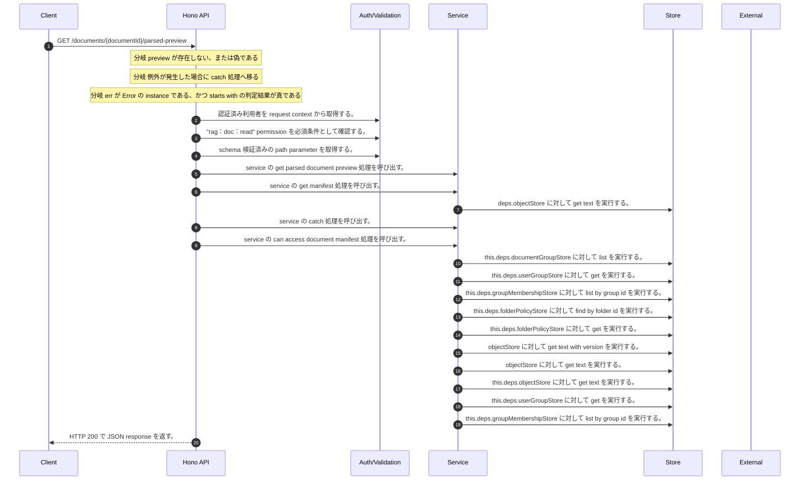

<!-- This file is generated by npm run docs:api-code. Do not edit manually. -->

# GET /documents/{documentId}/parsed-preview シーケンス

## シーケンス図

## 処理順とコード対応

| # | Caller | 境界 | 処理 | コード | 実装位置 |
| ---: | --- | --- | --- | --- | --- |
| 1 | `GET /documents/{documentId}/parsed-preview handler` | Auth | 認証済み利用者を request context から取得する。 | `c.get("user")` | `apps/api/src/routes/document-routes.ts:1553 (GET /documents/{documentId}/parsed-preview handler)` |
| 2 | `GET /documents/{documentId}/parsed-preview handler` | Auth | "rag:doc:read" permission を必須条件として確認する。 | `requirePermission(user, "rag:doc:read")` | `apps/api/src/routes/document-routes.ts:1554 (GET /documents/{documentId}/parsed-preview handler)` |
| 3 | `GET /documents/{documentId}/parsed-preview handler` | Validation | schema 検証済みの path parameter を取得する。 | `validParam<{ documentId: string }>(c)` | `apps/api/src/routes/document-routes.ts:1555 (GET /documents/{documentId}/parsed-preview handler)` |
| 4 | `GET /documents/{documentId}/parsed-preview handler` | Service | service の get parsed document preview 処理を呼び出す。 | `service.getParsedDocumentPreview(user, documentId)` | `apps/api/src/routes/document-routes.ts:1557 (GET /documents/{documentId}/parsed-preview handler)` |
| 5 | `MemoRagService.getParsedDocumentPreview` | Service | service の get manifest 処理を呼び出す。 | `this.getManifest(documentId, authoritativeActorTenantId(user))` | `apps/api/src/rag/memorag-service.ts:1035 (MemoRagService.getParsedDocumentPreview)` |
| 6 | `readTenantManifest` | Store | `deps.objectStore` に対して get text を実行する。 | `deps.objectStore.getText(key)` | `apps/api/src/rag/_shared/storage/tenant-artifacts.ts:83 (readTenantManifest)` |
| 7 | `MemoRagService.getParsedDocumentPreview` | Service | service の catch 処理を呼び出す。 | `this.getManifest(documentId, authoritativeActorTenantId(user)).catch((error: unknown) => { if (isMissingObjectError(error)) return undefined throw error })` | `apps/api/src/rag/memorag-service.ts:1035 (MemoRagService.getParsedDocumentPreview)` |
| 8 | `MemoRagService.getParsedDocumentPreview` | Service | service の can access document manifest 処理を呼び出す。 | `this.canAccessDocumentManifest(user, manifest)` | `apps/api/src/rag/memorag-service.ts:1040 (MemoRagService.getParsedDocumentPreview)` |
| 9 | `FolderPermissionService.resolveEffectiveFolderPermissionDetail` | Store | `this.deps.documentGroupStore` に対して list を実行する。 | `this.deps.documentGroupStore.list(actorTenantId)` | `apps/api/src/folders/folder-permission-service.ts:145 (FolderPermissionService.resolveEffectiveFolderPermissionDetail)` |
| 10 | `FolderPermissionService.resolveUserMembershipPermission` | Store | `this.deps.userGroupStore` に対して get を実行する。 | `this.deps.userGroupStore.get(tenantId, groupId)` | `apps/api/src/folders/folder-permission-service.ts:780 (FolderPermissionService.resolveUserMembershipPermission)` |
| 11 | `FolderPermissionService.resolveUserMembershipPermission` | Store | `this.deps.groupMembershipStore` に対して list by group id を実行する。 | `this.deps.groupMembershipStore.listByGroupId(tenantId, groupId)` | `apps/api/src/folders/folder-permission-service.ts:781 (FolderPermissionService.resolveUserMembershipPermission)` |
| 12 | `FolderPermissionService.resolvePolicyContext` | Store | `this.deps.folderPolicyStore` に対して find by folder id を実行する。 | `this.deps.folderPolicyStore.findByFolderId(folder.tenantId, current.groupId)` | `apps/api/src/folders/folder-permission-service.ts:695 (FolderPermissionService.resolvePolicyContext)` |
| 13 | `FolderPermissionService.resolvePolicyContext` | Store | `this.deps.folderPolicyStore` に対して get を実行する。 | `this.deps.folderPolicyStore.get(folder.tenantId, current.policyId)` | `apps/api/src/folders/folder-permission-service.ts:711 (FolderPermissionService.resolvePolicyContext)` |
| 14 | `getTextWithVersion` | Store | `objectStore` に対して get text with version を実行する。 | `objectStore.getTextWithVersion(key)` | `apps/api/src/documents/document-permission-service.ts:946 (getTextWithVersion)` |
| 15 | `getTextWithVersion` | Store | `objectStore` に対して get text を実行する。 | `objectStore.getText(key)` | `apps/api/src/documents/document-permission-service.ts:947 (getTextWithVersion)` |
| 16 | `DocumentPermissionService.loadLegacyDocumentGrants` | Store | `this.deps.objectStore` に対して get text を実行する。 | `this.deps.objectStore.getText(documentShareLegacyLedgerKey)` | `apps/api/src/documents/document-permission-service.ts:537 (DocumentPermissionService.loadLegacyDocumentGrants)` |
| 17 | `DocumentPermissionService.resolveUserMembershipPermission` | Store | `this.deps.userGroupStore` に対して get を実行する。 | `this.deps.userGroupStore.get(tenantId, groupId)` | `apps/api/src/documents/document-permission-service.ts:683 (DocumentPermissionService.resolveUserMembershipPermission)` |
| 18 | `DocumentPermissionService.resolveUserMembershipPermission` | Store | `this.deps.groupMembershipStore` に対して list by group id を実行する。 | `this.deps.groupMembershipStore.listByGroupId(tenantId, groupId)` | `apps/api/src/documents/document-permission-service.ts:684 (DocumentPermissionService.resolveUserMembershipPermission)` |
| 19 | `GET /documents/{documentId}/parsed-preview handler` | HTTP/SSE | HTTP 200 で JSON response を返す。 | `c.json(preview, 200)` | `apps/api/src/routes/document-routes.ts:1559 (GET /documents/{documentId}/parsed-preview handler)` |

## 分岐

| ID | Function | 条件 | 実装位置 |
| --- | --- | --- | --- |
| B001 | `GET /documents/{documentId}/parsed-preview handler` | `preview` が存在しない、または偽である | `apps/api/src/routes/document-routes.ts:1558 (GET /documents/{documentId}/parsed-preview handler)` |
| B002 | `GET /documents/{documentId}/parsed-preview handler` | 例外が発生した場合に catch 処理へ移る | `apps/api/src/routes/document-routes.ts:1560 (GET /documents/{documentId}/parsed-preview handler)` |
| B003 | `GET /documents/{documentId}/parsed-preview handler` | `err` が `Error` の instance である、かつ starts with の判定結果が真である | `apps/api/src/routes/document-routes.ts:1561 (GET /documents/{documentId}/parsed-preview handler)` |
| B004 | `requirePermission` | 利用者が 指定された permission を持たない | `apps/api/src/authorization.ts:184 (requirePermission)` |
| B005 | `MemoRagService.getParsedDocumentPreview` | is missing object error の判定結果が真である | `apps/api/src/rag/memorag-service.ts:1036 (MemoRagService.getParsedDocumentPreview)` |
| B006 | `MemoRagService.getParsedDocumentPreview` | `manifest` が存在しない、または偽である | `apps/api/src/rag/memorag-service.ts:1039 (MemoRagService.getParsedDocumentPreview)` |
| B007 | `MemoRagService.getParsedDocumentPreview` | 条件式 `await this.canAccessDocumentManifest(user, manifest)` が成立しない | `apps/api/src/rag/memorag-service.ts:1040 (MemoRagService.getParsedDocumentPreview)` |
