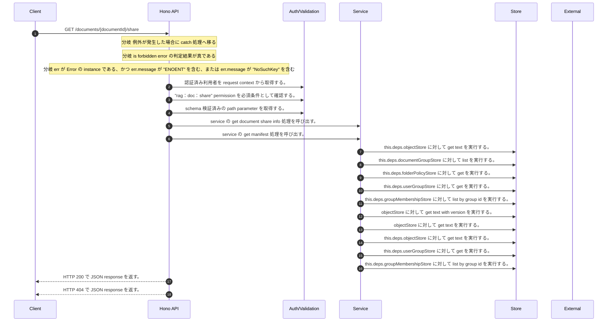

<!-- This file is generated by npm run docs:api-code. Do not edit manually. -->

# GET /documents/{documentId}/share シーケンス

## シーケンス図

## 処理順とコード対応

| # | Caller | 境界 | 処理 | コード | 実装位置 |
| ---: | --- | --- | --- | --- | --- |
| 1 | `GET /documents/{documentId}/share handler` | Auth | 認証済み利用者を request context から取得する。 | `c.get("user")` | `apps/api/src/routes/document-routes.ts:338 (GET /documents/{documentId}/share handler)` |
| 2 | `GET /documents/{documentId}/share handler` | Auth | "rag:doc:share" permission を必須条件として確認する。 | `requirePermission(user, "rag:doc:share")` | `apps/api/src/routes/document-routes.ts:339 (GET /documents/{documentId}/share handler)` |
| 3 | `GET /documents/{documentId}/share handler` | Validation | schema 検証済みの path parameter を取得する。 | `validParam<{ documentId: string }>(c)` | `apps/api/src/routes/document-routes.ts:340 (GET /documents/{documentId}/share handler)` |
| 4 | `GET /documents/{documentId}/share handler` | Service | service の get document share info 処理を呼び出す。 | `service.getDocumentShareInfo(user, documentId)` | `apps/api/src/routes/document-routes.ts:342 (GET /documents/{documentId}/share handler)` |
| 5 | `MemoRagService.getDocumentShareInfo` | Service | service の get manifest 処理を呼び出す。 | `this.getManifest(documentId)` | `apps/api/src/rag/memorag-service.ts:570 (MemoRagService.getDocumentShareInfo)` |
| 6 | `MemoRagService.getManifestByKey` | Store | `this.deps.objectStore` に対して get text を実行する。 | `this.deps.objectStore.getText(key)` | `apps/api/src/rag/memorag-service.ts:1638 (MemoRagService.getManifestByKey)` |
| 7 | `FolderPermissionService.resolveEffectiveFolderPermissionDetail` | Store | `this.deps.documentGroupStore` に対して list を実行する。 | `this.deps.documentGroupStore.list()` | `apps/api/src/folders/folder-permission-service.ts:47 (FolderPermissionService.resolveEffectiveFolderPermissionDetail)` |
| 8 | `FolderPermissionService.resolvePolicyContext` | Store | `this.deps.folderPolicyStore` に対して get を実行する。 | `this.deps.folderPolicyStore.get(current.policyId)` | `apps/api/src/folders/folder-permission-service.ts:128 (FolderPermissionService.resolvePolicyContext)` |
| 9 | `FolderPermissionService.resolveUserMembershipPermission` | Store | `this.deps.userGroupStore` に対して get を実行する。 | `this.deps.userGroupStore.get(groupId)` | `apps/api/src/folders/folder-permission-service.ts:166 (FolderPermissionService.resolveUserMembershipPermission)` |
| 10 | `FolderPermissionService.resolveUserMembershipPermission` | Store | `this.deps.groupMembershipStore` に対して list by group id を実行する。 | `this.deps.groupMembershipStore.listByGroupId(groupId)` | `apps/api/src/folders/folder-permission-service.ts:171 (FolderPermissionService.resolveUserMembershipPermission)` |
| 11 | `getTextWithVersion` | Store | `objectStore` に対して get text with version を実行する。 | `objectStore.getTextWithVersion(key)` | `apps/api/src/documents/document-permission-service.ts:418 (getTextWithVersion)` |
| 12 | `getTextWithVersion` | Store | `objectStore` に対して get text を実行する。 | `objectStore.getText(key)` | `apps/api/src/documents/document-permission-service.ts:419 (getTextWithVersion)` |
| 13 | `DocumentPermissionService.loadLegacyDocumentGrants` | Store | `this.deps.objectStore` に対して get text を実行する。 | `this.deps.objectStore.getText(documentShareLegacyLedgerKey)` | `apps/api/src/documents/document-permission-service.ts:193 (DocumentPermissionService.loadLegacyDocumentGrants)` |
| 14 | `DocumentPermissionService.resolveUserMembershipPermission` | Store | `this.deps.userGroupStore` に対して get を実行する。 | `this.deps.userGroupStore.get(groupId)` | `apps/api/src/documents/document-permission-service.ts:287 (DocumentPermissionService.resolveUserMembershipPermission)` |
| 15 | `DocumentPermissionService.resolveUserMembershipPermission` | Store | `this.deps.groupMembershipStore` に対して list by group id を実行する。 | `this.deps.groupMembershipStore.listByGroupId(groupId)` | `apps/api/src/documents/document-permission-service.ts:291 (DocumentPermissionService.resolveUserMembershipPermission)` |
| 16 | `GET /documents/{documentId}/share handler` | HTTP/SSE | HTTP 200 で JSON response を返す。 | `c.json(await service.getDocumentShareInfo(user, documentId), 200)` | `apps/api/src/routes/document-routes.ts:342 (GET /documents/{documentId}/share handler)` |
| 17 | `GET /documents/{documentId}/share handler` | HTTP/SSE | HTTP 404 で JSON response を返す。 | `c.json({ error: "Document not found" }, 404)` | `apps/api/src/routes/document-routes.ts:345 (GET /documents/{documentId}/share handler)` |

## 分岐

| ID | Function | 条件 | 実装位置 |
| --- | --- | --- | --- |
| B001 | `GET /documents/{documentId}/share handler` | 例外が発生した場合に catch 処理へ移る | `apps/api/src/routes/document-routes.ts:343 (GET /documents/{documentId}/share handler)` |
| B002 | `GET /documents/{documentId}/share handler` | is forbidden error の判定結果が真である | `apps/api/src/routes/document-routes.ts:344 (GET /documents/{documentId}/share handler)` |
| B003 | `GET /documents/{documentId}/share handler` | `err` が `Error` の instance である、かつ `err.message` が "ENOENT" を含む、または `err.message` が "NoSuchKey" を含む | `apps/api/src/routes/document-routes.ts:345 (GET /documents/{documentId}/share handler)` |
| B004 | `requirePermission` | 利用者が 指定された permission を持たない | `apps/api/src/authorization.ts:267 (requirePermission)` |
| B005 | `MemoRagService.getDocumentShareInfo` | can share document の判定結果が真ではない | `apps/api/src/rag/memorag-service.ts:573 (MemoRagService.getDocumentShareInfo)` |
