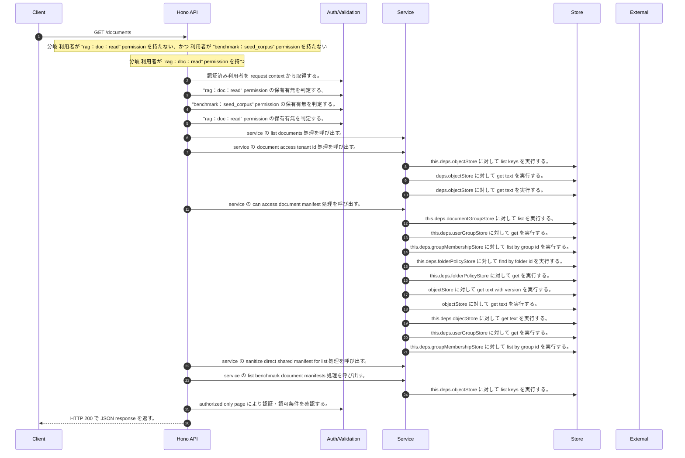

<!-- This file is generated by npm run docs:api-code. Do not edit manually. -->

# GET /documents シーケンス

## シーケンス図

## 処理順とコード対応

| # | Caller | 境界 | 処理 | コード | 実装位置 |
| ---: | --- | --- | --- | --- | --- |
| 1 | `GET /documents handler` | Auth | 認証済み利用者を request context から取得する。 | `c.get("user")` | `apps/api/src/routes/document-routes.ts:836 (GET /documents handler)` |
| 2 | `GET /documents handler` | Auth | "rag:doc:read" permission の保有有無を判定する。 | `hasPermission(user, "rag:doc:read")` | `apps/api/src/routes/document-routes.ts:837 (GET /documents handler)` |
| 3 | `GET /documents handler` | Auth | "benchmark:seed_corpus" permission の保有有無を判定する。 | `hasPermission(user, "benchmark:seed_corpus")` | `apps/api/src/routes/document-routes.ts:837 (GET /documents handler)` |
| 4 | `GET /documents handler` | Auth | "rag:doc:read" permission の保有有無を判定する。 | `hasPermission(user, "rag:doc:read")` | `apps/api/src/routes/document-routes.ts:841 (GET /documents handler)` |
| 5 | `GET /documents handler` | Service | service の list documents 処理を呼び出す。 | `service.listDocuments(user)` | `apps/api/src/routes/document-routes.ts:842 (GET /documents handler)` |
| 6 | `MemoRagService.listDocuments` | Service | service の document access tenant id 処理を呼び出す。 | `this.documentAccessTenantId(user)` | `apps/api/src/rag/memorag-service.ts:923 (MemoRagService.listDocuments)` |
| 7 | `MemoRagService.listDocuments` | Store | `this.deps.objectStore` に対して list keys を実行する。 | `this.deps.objectStore.listKeys(tenantManifestPrefix(this.deps, tenantId))` | `apps/api/src/rag/memorag-service.ts:924 (MemoRagService.listDocuments)` |
| 8 | `readTenantManifestByKey` | Store | `deps.objectStore` に対して get text を実行する。 | `deps.objectStore.getText(key)` | `apps/api/src/rag/_shared/storage/tenant-artifacts.ts:93 (readTenantManifestByKey)` |
| 9 | `loadPublicationPointer` | Store | `deps.objectStore` に対して get text を実行する。 | `deps.objectStore.getText(key)` | `apps/api/src/rag/_shared/publication/staged-publication-coordinator.ts:1809 (loadPublicationPointer)` |
| 10 | `MemoRagService.listDocuments` | Service | service の can access document manifest 処理を呼び出す。 | `this.canAccessDocumentManifest(user, manifest)` | `apps/api/src/rag/memorag-service.ts:944 (MemoRagService.listDocuments)` |
| 11 | `FolderPermissionService.resolveEffectiveFolderPermissionDetail` | Store | `this.deps.documentGroupStore` に対して list を実行する。 | `this.deps.documentGroupStore.list(actorTenantId)` | `apps/api/src/folders/folder-permission-service.ts:145 (FolderPermissionService.resolveEffectiveFolderPermissionDetail)` |
| 12 | `FolderPermissionService.resolveUserMembershipPermission` | Store | `this.deps.userGroupStore` に対して get を実行する。 | `this.deps.userGroupStore.get(tenantId, groupId)` | `apps/api/src/folders/folder-permission-service.ts:780 (FolderPermissionService.resolveUserMembershipPermission)` |
| 13 | `FolderPermissionService.resolveUserMembershipPermission` | Store | `this.deps.groupMembershipStore` に対して list by group id を実行する。 | `this.deps.groupMembershipStore.listByGroupId(tenantId, groupId)` | `apps/api/src/folders/folder-permission-service.ts:781 (FolderPermissionService.resolveUserMembershipPermission)` |
| 14 | `FolderPermissionService.resolvePolicyContext` | Store | `this.deps.folderPolicyStore` に対して find by folder id を実行する。 | `this.deps.folderPolicyStore.findByFolderId(folder.tenantId, current.groupId)` | `apps/api/src/folders/folder-permission-service.ts:695 (FolderPermissionService.resolvePolicyContext)` |
| 15 | `FolderPermissionService.resolvePolicyContext` | Store | `this.deps.folderPolicyStore` に対して get を実行する。 | `this.deps.folderPolicyStore.get(folder.tenantId, current.policyId)` | `apps/api/src/folders/folder-permission-service.ts:711 (FolderPermissionService.resolvePolicyContext)` |
| 16 | `getTextWithVersion` | Store | `objectStore` に対して get text with version を実行する。 | `objectStore.getTextWithVersion(key)` | `apps/api/src/documents/document-permission-service.ts:946 (getTextWithVersion)` |
| 17 | `getTextWithVersion` | Store | `objectStore` に対して get text を実行する。 | `objectStore.getText(key)` | `apps/api/src/documents/document-permission-service.ts:947 (getTextWithVersion)` |
| 18 | `DocumentPermissionService.loadLegacyDocumentGrants` | Store | `this.deps.objectStore` に対して get text を実行する。 | `this.deps.objectStore.getText(documentShareLegacyLedgerKey)` | `apps/api/src/documents/document-permission-service.ts:537 (DocumentPermissionService.loadLegacyDocumentGrants)` |
| 19 | `DocumentPermissionService.resolveUserMembershipPermission` | Store | `this.deps.userGroupStore` に対して get を実行する。 | `this.deps.userGroupStore.get(tenantId, groupId)` | `apps/api/src/documents/document-permission-service.ts:683 (DocumentPermissionService.resolveUserMembershipPermission)` |
| 20 | `DocumentPermissionService.resolveUserMembershipPermission` | Store | `this.deps.groupMembershipStore` に対して list by group id を実行する。 | `this.deps.groupMembershipStore.listByGroupId(tenantId, groupId)` | `apps/api/src/documents/document-permission-service.ts:684 (DocumentPermissionService.resolveUserMembershipPermission)` |
| 21 | `MemoRagService.listDocuments` | Service | service の sanitize direct shared manifest for list 処理を呼び出す。 | `this.sanitizeDirectSharedManifestForList(user, manifest)` | `apps/api/src/rag/memorag-service.ts:953 (MemoRagService.listDocuments)` |
| 22 | `GET /documents handler` | Service | service の list benchmark document manifests 処理を呼び出す。 | `service.listBenchmarkDocumentManifests()` | `apps/api/src/routes/document-routes.ts:843 (GET /documents handler)` |
| 23 | `MemoRagService.listBenchmarkDocumentManifests` | Store | `this.deps.objectStore` に対して list keys を実行する。 | `this.deps.objectStore.listKeys(tenantManifestPrefix(this.deps, tenantId))` | `apps/api/src/rag/memorag-service.ts:979 (MemoRagService.listBenchmarkDocumentManifests)` |
| 24 | `GET /documents handler` | Auth | authorized only page により認証・認可条件を確認する。 | `authorizedOnlyPage({ candidates, authorized: () => true, project: documentListItemSummary, offset: decodeCollectionCursor(query.cursor), limit: query.limit })` | `apps/api/src/routes/document-routes.ts:856 (GET /documents handler)` |
| 25 | `GET /documents handler` | HTTP/SSE | HTTP 200 で JSON response を返す。 | `c.json({ documents: page.items, count: page.count, nextCursor: page.nextCursor, responseProfileVersion: page.responseProfileVersion }, 200)` | `apps/api/src/routes/document-routes.ts:863 (GET /documents handler)` |

## 分岐

| ID | Function | 条件 | 実装位置 |
| --- | --- | --- | --- |
| B001 | `GET /documents handler` | 利用者が "rag:doc:read" permission を持たない、かつ 利用者が "benchmark:seed_corpus" permission を持たない | `apps/api/src/routes/document-routes.ts:837 (GET /documents handler)` |
| B002 | `GET /documents handler` | 利用者が "rag:doc:read" permission を持つ | `apps/api/src/routes/document-routes.ts:841 (GET /documents handler)` |
| B003 | `MemoRagService.listDocuments` | is missing object error の判定結果が真である | `apps/api/src/rag/memorag-service.ts:929 (MemoRagService.listDocuments)` |
| B004 | `MemoRagService.listDocuments` | `user` が存在し、真である | `apps/api/src/rag/memorag-service.ts:943 (MemoRagService.listDocuments)` |
| B005 | `MemoRagService.listDocuments` | `user` が存在し、真である | `apps/api/src/rag/memorag-service.ts:946 (MemoRagService.listDocuments)` |
| B006 | `MemoRagService.listDocuments` | `user` が存在しない、または偽である、または `permissionService` が存在しない、または偽である | `apps/api/src/rag/memorag-service.ts:951 (MemoRagService.listDocuments)` |
| B007 | `MemoRagService.listBenchmarkDocumentManifests` | `config.benchmarkEvaluationEnabled` が存在しない、または偽である、または `tenantId` が存在しない、または偽である | `apps/api/src/rag/memorag-service.ts:976 (MemoRagService.listBenchmarkDocumentManifests)` |
| B008 | `MemoRagService.listBenchmarkDocumentManifests` | is missing object error の判定結果が真である | `apps/api/src/rag/memorag-service.ts:983 (MemoRagService.listBenchmarkDocumentManifests)` |
| B009 | `decodeCollectionCursor` | `cursor` が存在しない、または偽である | `apps/api/src/routes/document-routes.ts:279 (decodeCollectionCursor)` |
| B010 | `decodeCollectionCursor` | test の判定結果が真ではない | `apps/api/src/routes/document-routes.ts:283 (decodeCollectionCursor)` |
| B011 | `decodeCollectionCursor` | `Buffer.from(decoded, "utf-8").toString("base64url")` が `normalized` と異なる | `apps/api/src/routes/document-routes.ts:284 (decodeCollectionCursor)` |
| B012 | `decodeCollectionCursor` | is safe integer の判定結果が真ではない | `apps/api/src/routes/document-routes.ts:286 (decodeCollectionCursor)` |
| B013 | `decodeCollectionCursor` | 例外が発生した場合に catch 処理へ移る | `apps/api/src/routes/document-routes.ts:288 (decodeCollectionCursor)` |
| B014 | `authorizedOnlyPage` | `nextOffset` が `authorized.length` より小さい | `apps/api/src/security/public-resource-response.ts:71 (authorizedOnlyPage)` |
