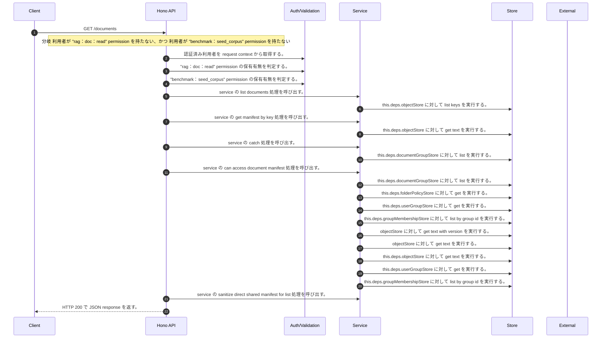

<!-- This file is generated by npm run docs:api-code. Do not edit manually. -->

# GET /documents シーケンス

## シーケンス図

## 処理順とコード対応

| # | Caller | 境界 | 処理 | コード | 実装位置 |
| ---: | --- | --- | --- | --- | --- |
| 1 | `GET /documents handler` | Auth | 認証済み利用者を request context から取得する。 | `c.get("user")` | `apps/api/src/routes/document-routes.ts:314 (GET /documents handler)` |
| 2 | `GET /documents handler` | Auth | "rag:doc:read" permission の保有有無を判定する。 | `hasPermission(user, "rag:doc:read")` | `apps/api/src/routes/document-routes.ts:315 (GET /documents handler)` |
| 3 | `GET /documents handler` | Auth | "benchmark:seed_corpus" permission の保有有無を判定する。 | `hasPermission(user, "benchmark:seed_corpus")` | `apps/api/src/routes/document-routes.ts:315 (GET /documents handler)` |
| 4 | `GET /documents handler` | Service | service の list documents 処理を呼び出す。 | `service.listDocuments(user)` | `apps/api/src/routes/document-routes.ts:318 (GET /documents handler)` |
| 5 | `MemoRagService.listDocuments` | Store | `this.deps.objectStore` に対して list keys を実行する。 | `this.deps.objectStore.listKeys("manifests/")` | `apps/api/src/rag/memorag-service.ts:359 (MemoRagService.listDocuments)` |
| 6 | `MemoRagService.listDocuments` | Service | service の get manifest by key 処理を呼び出す。 | `this.getManifestByKey(key)` | `apps/api/src/rag/memorag-service.ts:363 (MemoRagService.listDocuments)` |
| 7 | `MemoRagService.getManifestByKey` | Store | `this.deps.objectStore` に対して get text を実行する。 | `this.deps.objectStore.getText(key)` | `apps/api/src/rag/memorag-service.ts:1638 (MemoRagService.getManifestByKey)` |
| 8 | `MemoRagService.listDocuments` | Service | service の catch 処理を呼び出す。 | `this.getManifestByKey(key).catch((error: unknown) => { if (isMissingObjectError(error)) { console.warn("Skipping missing document manifest listed by object store", { key, error }) return undefined } throw error })` | `apps/api/src/rag/memorag-service.ts:363 (MemoRagService.listDocuments)` |
| 9 | `MemoRagService.listDocuments` | Store | `this.deps.documentGroupStore` に対して list を実行する。 | `this.deps.documentGroupStore.list()` | `apps/api/src/rag/memorag-service.ts:371 (MemoRagService.listDocuments)` |
| 10 | `MemoRagService.listDocuments` | Service | service の can access document manifest 処理を呼び出す。 | `this.canAccessDocumentManifest(user, manifest, documentGroups)` | `apps/api/src/rag/memorag-service.ts:377 (MemoRagService.listDocuments)` |
| 11 | `FolderPermissionService.resolveEffectiveFolderPermissionDetail` | Store | `this.deps.documentGroupStore` に対して list を実行する。 | `this.deps.documentGroupStore.list()` | `apps/api/src/folders/folder-permission-service.ts:47 (FolderPermissionService.resolveEffectiveFolderPermissionDetail)` |
| 12 | `FolderPermissionService.resolvePolicyContext` | Store | `this.deps.folderPolicyStore` に対して get を実行する。 | `this.deps.folderPolicyStore.get(current.policyId)` | `apps/api/src/folders/folder-permission-service.ts:128 (FolderPermissionService.resolvePolicyContext)` |
| 13 | `FolderPermissionService.resolveUserMembershipPermission` | Store | `this.deps.userGroupStore` に対して get を実行する。 | `this.deps.userGroupStore.get(groupId)` | `apps/api/src/folders/folder-permission-service.ts:166 (FolderPermissionService.resolveUserMembershipPermission)` |
| 14 | `FolderPermissionService.resolveUserMembershipPermission` | Store | `this.deps.groupMembershipStore` に対して list by group id を実行する。 | `this.deps.groupMembershipStore.listByGroupId(groupId)` | `apps/api/src/folders/folder-permission-service.ts:171 (FolderPermissionService.resolveUserMembershipPermission)` |
| 15 | `getTextWithVersion` | Store | `objectStore` に対して get text with version を実行する。 | `objectStore.getTextWithVersion(key)` | `apps/api/src/documents/document-permission-service.ts:418 (getTextWithVersion)` |
| 16 | `getTextWithVersion` | Store | `objectStore` に対して get text を実行する。 | `objectStore.getText(key)` | `apps/api/src/documents/document-permission-service.ts:419 (getTextWithVersion)` |
| 17 | `DocumentPermissionService.loadLegacyDocumentGrants` | Store | `this.deps.objectStore` に対して get text を実行する。 | `this.deps.objectStore.getText(documentShareLegacyLedgerKey)` | `apps/api/src/documents/document-permission-service.ts:193 (DocumentPermissionService.loadLegacyDocumentGrants)` |
| 18 | `DocumentPermissionService.resolveUserMembershipPermission` | Store | `this.deps.userGroupStore` に対して get を実行する。 | `this.deps.userGroupStore.get(groupId)` | `apps/api/src/documents/document-permission-service.ts:287 (DocumentPermissionService.resolveUserMembershipPermission)` |
| 19 | `DocumentPermissionService.resolveUserMembershipPermission` | Store | `this.deps.groupMembershipStore` に対して list by group id を実行する。 | `this.deps.groupMembershipStore.listByGroupId(groupId)` | `apps/api/src/documents/document-permission-service.ts:291 (DocumentPermissionService.resolveUserMembershipPermission)` |
| 20 | `MemoRagService.listDocuments` | Service | service の sanitize direct shared manifest for list 処理を呼び出す。 | `this.sanitizeDirectSharedManifestForList(user, manifest, documentGroups)` | `apps/api/src/rag/memorag-service.ts:386 (MemoRagService.listDocuments)` |
| 21 | `GET /documents handler` | HTTP/SSE | HTTP 200 で JSON response を返す。 | `c.json({ documents }, 200)` | `apps/api/src/routes/document-routes.ts:319 (GET /documents handler)` |

## 分岐

| ID | Function | 条件 | 実装位置 |
| --- | --- | --- | --- |
| B001 | `GET /documents handler` | 利用者が "rag:doc:read" permission を持たない、かつ 利用者が "benchmark:seed_corpus" permission を持たない | `apps/api/src/routes/document-routes.ts:315 (GET /documents handler)` |
| B002 | `MemoRagService.listDocuments` | is missing object error の判定結果が真である | `apps/api/src/rag/memorag-service.ts:364 (MemoRagService.listDocuments)` |
| B003 | `MemoRagService.listDocuments` | `user` が存在し、真である | `apps/api/src/rag/memorag-service.ts:371 (MemoRagService.listDocuments)` |
| B004 | `MemoRagService.listDocuments` | `user` が存在し、真である | `apps/api/src/rag/memorag-service.ts:376 (MemoRagService.listDocuments)` |
| B005 | `MemoRagService.listDocuments` | `user` が存在し、真である | `apps/api/src/rag/memorag-service.ts:379 (MemoRagService.listDocuments)` |
| B006 | `MemoRagService.listDocuments` | `user` が存在しない、または偽である、または `permissionService` が存在しない、または偽である | `apps/api/src/rag/memorag-service.ts:384 (MemoRagService.listDocuments)` |
