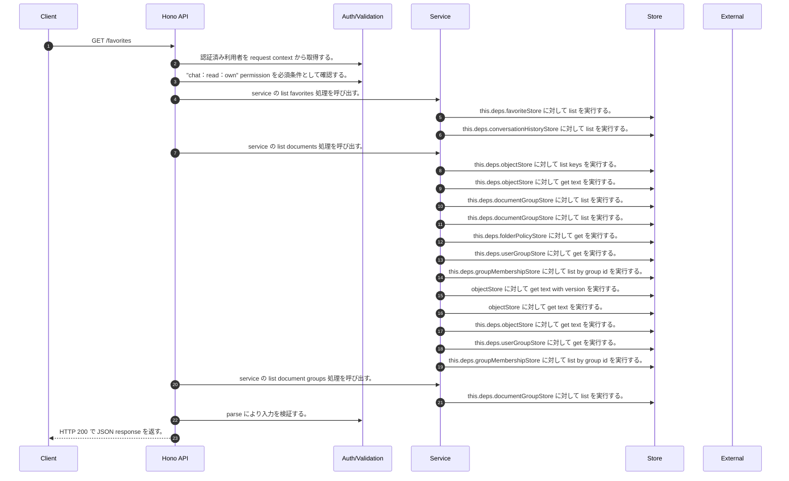

<!-- This file is generated by npm run docs:api-code. Do not edit manually. -->

# GET /favorites シーケンス

## シーケンス図

## 処理順とコード対応

| # | Caller | 境界 | 処理 | コード | 実装位置 |
| ---: | --- | --- | --- | --- | --- |
| 1 | `GET /favorites handler` | Auth | 認証済み利用者を request context から取得する。 | `c.get("user")` | `apps/api/src/routes/favorite-routes.ts:19 (GET /favorites handler)` |
| 2 | `GET /favorites handler` | Auth | "chat:read:own" permission を必須条件として確認する。 | `requirePermission(user, "chat:read:own")` | `apps/api/src/routes/favorite-routes.ts:20 (GET /favorites handler)` |
| 3 | `GET /favorites handler` | Service | service の list favorites 処理を呼び出す。 | `service.listFavorites(user)` | `apps/api/src/routes/favorite-routes.ts:21 (GET /favorites handler)` |
| 4 | `MemoRagService.listFavorites` | Store | `this.deps.favoriteStore` に対して list を実行する。 | `this.deps.favoriteStore.list(user.userId)` | `apps/api/src/rag/memorag-service.ts:1851 (MemoRagService.listFavorites)` |
| 5 | `MemoRagService.listFavorites` | Store | `this.deps.conversationHistoryStore` に対して list を実行する。 | `this.deps.conversationHistoryStore.list(user.userId)` | `apps/api/src/rag/memorag-service.ts:1852 (MemoRagService.listFavorites)` |
| 6 | `MemoRagService.listFavorites` | Service | service の list documents 処理を呼び出す。 | `this.listDocuments(user)` | `apps/api/src/rag/memorag-service.ts:1855 (MemoRagService.listFavorites)` |
| 7 | `MemoRagService.listDocuments` | Store | `this.deps.objectStore` に対して list keys を実行する。 | `this.deps.objectStore.listKeys("manifests/")` | `apps/api/src/rag/memorag-service.ts:359 (MemoRagService.listDocuments)` |
| 8 | `MemoRagService.getManifestByKey` | Store | `this.deps.objectStore` に対して get text を実行する。 | `this.deps.objectStore.getText(key)` | `apps/api/src/rag/memorag-service.ts:1638 (MemoRagService.getManifestByKey)` |
| 9 | `MemoRagService.listDocuments` | Store | `this.deps.documentGroupStore` に対して list を実行する。 | `this.deps.documentGroupStore.list()` | `apps/api/src/rag/memorag-service.ts:371 (MemoRagService.listDocuments)` |
| 10 | `FolderPermissionService.resolveEffectiveFolderPermissionDetail` | Store | `this.deps.documentGroupStore` に対して list を実行する。 | `this.deps.documentGroupStore.list()` | `apps/api/src/folders/folder-permission-service.ts:47 (FolderPermissionService.resolveEffectiveFolderPermissionDetail)` |
| 11 | `FolderPermissionService.resolvePolicyContext` | Store | `this.deps.folderPolicyStore` に対して get を実行する。 | `this.deps.folderPolicyStore.get(current.policyId)` | `apps/api/src/folders/folder-permission-service.ts:128 (FolderPermissionService.resolvePolicyContext)` |
| 12 | `FolderPermissionService.resolveUserMembershipPermission` | Store | `this.deps.userGroupStore` に対して get を実行する。 | `this.deps.userGroupStore.get(groupId)` | `apps/api/src/folders/folder-permission-service.ts:166 (FolderPermissionService.resolveUserMembershipPermission)` |
| 13 | `FolderPermissionService.resolveUserMembershipPermission` | Store | `this.deps.groupMembershipStore` に対して list by group id を実行する。 | `this.deps.groupMembershipStore.listByGroupId(groupId)` | `apps/api/src/folders/folder-permission-service.ts:171 (FolderPermissionService.resolveUserMembershipPermission)` |
| 14 | `getTextWithVersion` | Store | `objectStore` に対して get text with version を実行する。 | `objectStore.getTextWithVersion(key)` | `apps/api/src/documents/document-permission-service.ts:418 (getTextWithVersion)` |
| 15 | `getTextWithVersion` | Store | `objectStore` に対して get text を実行する。 | `objectStore.getText(key)` | `apps/api/src/documents/document-permission-service.ts:419 (getTextWithVersion)` |
| 16 | `DocumentPermissionService.loadLegacyDocumentGrants` | Store | `this.deps.objectStore` に対して get text を実行する。 | `this.deps.objectStore.getText(documentShareLegacyLedgerKey)` | `apps/api/src/documents/document-permission-service.ts:193 (DocumentPermissionService.loadLegacyDocumentGrants)` |
| 17 | `DocumentPermissionService.resolveUserMembershipPermission` | Store | `this.deps.userGroupStore` に対して get を実行する。 | `this.deps.userGroupStore.get(groupId)` | `apps/api/src/documents/document-permission-service.ts:287 (DocumentPermissionService.resolveUserMembershipPermission)` |
| 18 | `DocumentPermissionService.resolveUserMembershipPermission` | Store | `this.deps.groupMembershipStore` に対して list by group id を実行する。 | `this.deps.groupMembershipStore.listByGroupId(groupId)` | `apps/api/src/documents/document-permission-service.ts:291 (DocumentPermissionService.resolveUserMembershipPermission)` |
| 19 | `MemoRagService.listFavorites` | Service | service の list document groups 処理を呼び出す。 | `this.listDocumentGroups(user)` | `apps/api/src/rag/memorag-service.ts:1856 (MemoRagService.listFavorites)` |
| 20 | `MemoRagService.listDocumentGroups` | Store | `this.deps.documentGroupStore` に対して list を実行する。 | `this.deps.documentGroupStore.list()` | `apps/api/src/rag/memorag-service.ts:419 (MemoRagService.listDocumentGroups)` |
| 21 | `GET /favorites handler` | Validation | parse により入力を検証する。 | `FavoriteSchema.parse(favorite)` | `apps/api/src/routes/favorite-routes.ts:21 (GET /favorites handler)` |
| 22 | `GET /favorites handler` | HTTP/SSE | HTTP 200 で JSON response を返す。 | `c.json({ favorites: (await service.listFavorites(user)).map((favorite) => FavoriteSchema.parse(favorite)) }, 200)` | `apps/api/src/routes/favorite-routes.ts:21 (GET /favorites handler)` |

## 分岐

| ID | Function | 条件 | 実装位置 |
| --- | --- | --- | --- |
| B001 | `requirePermission` | 利用者が 指定された permission を持たない | `apps/api/src/authorization.ts:267 (requirePermission)` |
| B002 | `MemoRagService.listFavorites` | `favorite.targetType` が `"chatSession"` と等しい | `apps/api/src/rag/memorag-service.ts:1858 (MemoRagService.listFavorites)` |
| B003 | `MemoRagService.listFavorites` | `favorite.targetType` が `"document"` と等しい | `apps/api/src/rag/memorag-service.ts:1861 (MemoRagService.listFavorites)` |
| B004 | `MemoRagService.listFavorites` | `favorite.targetType` が `"folder"` と等しい | `apps/api/src/rag/memorag-service.ts:1865 (MemoRagService.listFavorites)` |
