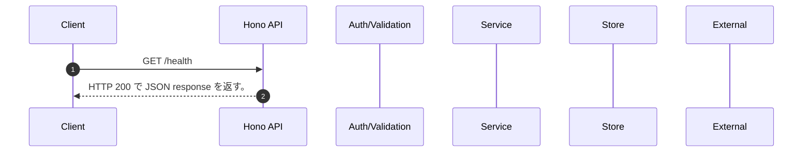

<!-- This file is generated by npm run docs:api-code. Do not edit manually. -->

# GET /health シーケンス

## シーケンス図

## 処理順とコード対応

| # | Caller | 境界 | 処理 | コード | 実装位置 |
| ---: | --- | --- | --- | --- | --- |
| 1 | `GET /health handler` | HTTP/SSE | HTTP 200 で JSON response を返す。 | `c.json({ ok: true, service: "memorag-bedrock-mvp", timestamp: new Date().toISOString() }, 200)` | `apps/api/src/routes/system-routes.ts:16 (GET /health handler)` |

## 分岐

_handler と直下関数に明示分岐なし_
