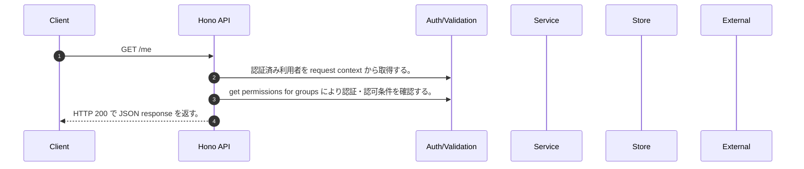

<!-- This file is generated by npm run docs:api-code. Do not edit manually. -->

# GET /me シーケンス

## シーケンス図

## 処理順とコード対応

| # | Caller | 境界 | 処理 | コード | 実装位置 |
| ---: | --- | --- | --- | --- | --- |
| 1 | `GET /me handler` | Auth | 認証済み利用者を request context から取得する。 | `c.get("user")` | `apps/api/src/routes/system-routes.ts:33 (GET /me handler)` |
| 2 | `GET /me handler` | Auth | get permissions for groups により認証・認可条件を確認する。 | `getPermissionsForGroups(user.cognitoGroups)` | `apps/api/src/routes/system-routes.ts:39 (GET /me handler)` |
| 3 | `GET /me handler` | HTTP/SSE | HTTP 200 で JSON response を返す。 | `c.json({ user: { userId: user.userId, email: user.email, groups: user.cognitoGroups, permissions: getPermissionsForGroups(user.cognitoGroups) } }, 200)` | `apps/api/src/routes/system-routes.ts:34 (GET /me handler)` |

## 分岐

| ID | Function | 条件 | 実装位置 |
| --- | --- | --- | --- |
| B001 | `getPermissionsForGroups` | `groups` が存在し、真である | `apps/api/src/authorization.ts:109 (getPermissionsForGroups)` |
| B002 | `getPermissionsForGroups` | `rolePermissions[group as Role]` が `[]` の条件を満たす | `apps/api/src/authorization.ts:110 (getPermissionsForGroups)` |
