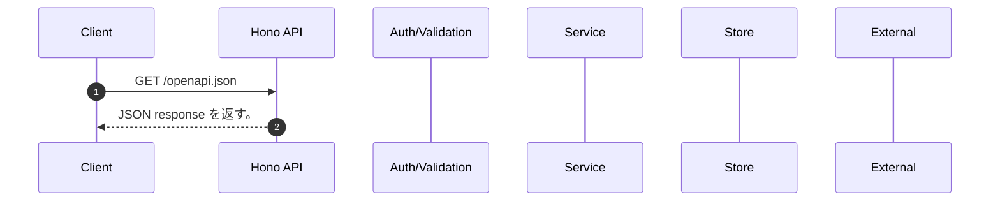

<!-- This file is generated by npm run docs:api-code. Do not edit manually. -->

# GET /openapi.json シーケンス

## シーケンス図

## 処理順とコード対応

| # | Caller | 境界 | 処理 | コード | 実装位置 |
| ---: | --- | --- | --- | --- | --- |
| 1 | `GET /openapi.json handler` | HTTP/SSE |  JSON response を返す。 | `c.json(enrichOpenApiDocument(app.getOpenAPIDocument(openApiConfig) as OpenApiDocument))` | `apps/api/src/app.ts:74 (GET /openapi.json handler)` |

## 分岐

| ID | Function | 条件 | 実装位置 |
| --- | --- | --- | --- |
| B001 | `enrichOpenApiDocument` | entries の判定結果が真である | `apps/api/src/openapi-doc-quality.ts:593 (enrichOpenApiDocument)` |
| B002 | `enrichOpenApiDocument` | entries の判定結果が真である | `apps/api/src/openapi-doc-quality.ts:597 (enrichOpenApiDocument)` |
| B003 | `enrichOpenApiDocument` | entries の判定結果が真である | `apps/api/src/openapi-doc-quality.ts:598 (enrichOpenApiDocument)` |
| B004 | `enrichOpenApiDocument` | is http method の判定結果が真ではない | `apps/api/src/openapi-doc-quality.ts:599 (enrichOpenApiDocument)` |
| B005 | `enrichOpenApiDocument` | `docs` が存在し、真である | `apps/api/src/openapi-doc-quality.ts:601 (enrichOpenApiDocument)` |
| B006 | `enrichOpenApiDocument` | `lifecycle` が存在し、真である | `apps/api/src/openapi-doc-quality.ts:606 (enrichOpenApiDocument)` |
| B007 | `enrichOpenApiDocument` | requires authorization の判定結果が真である | `apps/api/src/openapi-doc-quality.ts:607 (enrichOpenApiDocument)` |
| B008 | `enrichOpenApiDocument` | `operation.parameters` が `[]` の条件を満たす | `apps/api/src/openapi-doc-quality.ts:613 (enrichOpenApiDocument)` |
| B009 | `enrichOpenApiDocument` | `parameter.description` が存在し、真である、かつ has japanese の判定結果が真である | `apps/api/src/openapi-doc-quality.ts:614 (enrichOpenApiDocument)` |
| B010 | `enrichOpenApiDocument` | `parameter.schema` が存在し、真である | `apps/api/src/openapi-doc-quality.ts:617 (enrichOpenApiDocument)` |
| B011 | `enrichOpenApiDocument` | `operation.requestBody` が存在し、真である | `apps/api/src/openapi-doc-quality.ts:619 (enrichOpenApiDocument)` |
| B012 | `enrichOpenApiDocument` | values の判定結果が真である | `apps/api/src/openapi-doc-quality.ts:621 (enrichOpenApiDocument)` |
| B013 | `enrichOpenApiDocument` | `media.schema` が存在し、真である | `apps/api/src/openapi-doc-quality.ts:622 (enrichOpenApiDocument)` |
| B014 | `enrichOpenApiDocument` | entries の判定結果が真である | `apps/api/src/openapi-doc-quality.ts:625 (enrichOpenApiDocument)` |
| B015 | `enrichOpenApiDocument` | values の判定結果が真である | `apps/api/src/openapi-doc-quality.ts:627 (enrichOpenApiDocument)` |
| B016 | `enrichOpenApiDocument` | `media.schema` が存在し、真である | `apps/api/src/openapi-doc-quality.ts:628 (enrichOpenApiDocument)` |
