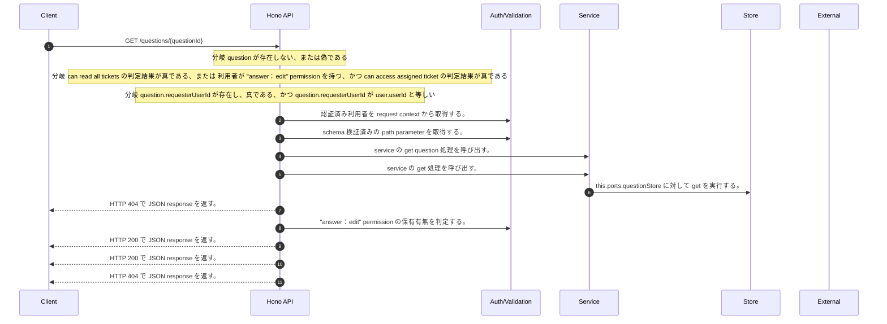

<!-- This file is generated by npm run docs:api-code. Do not edit manually. -->

# GET /questions/{questionId} シーケンス

## シーケンス図

## 処理順とコード対応

| # | Caller | 境界 | 処理 | コード | 実装位置 |
| ---: | --- | --- | --- | --- | --- |
| 1 | `GET /questions/{questionId} handler` | Auth | 認証済み利用者を request context から取得する。 | `c.get("user")` | `apps/api/src/routes/question-routes.ts:83 (GET /questions/{questionId} handler)` |
| 2 | `GET /questions/{questionId} handler` | Validation | schema 検証済みの path parameter を取得する。 | `validParam<{ questionId: string }>(c)` | `apps/api/src/routes/question-routes.ts:84 (GET /questions/{questionId} handler)` |
| 3 | `GET /questions/{questionId} handler` | Service | service の get question 処理を呼び出す。 | `service.getQuestion(questionId)` | `apps/api/src/routes/question-routes.ts:85 (GET /questions/{questionId} handler)` |
| 4 | `MemoRagService.getQuestion` | Service | service の get 処理を呼び出す。 | `this.questionService.get(questionId)` | `apps/api/src/rag/memorag-service.ts:3201 (MemoRagService.getQuestion)` |
| 5 | `QuestionService.get` | Store | `this.ports.questionStore` に対して get を実行する。 | `this.ports.questionStore.get(questionId)` | `apps/api/src/questions/question-service.ts:58 (QuestionService.get)` |
| 6 | `GET /questions/{questionId} handler` | HTTP/SSE | HTTP 404 で JSON response を返す。 | `c.json({ error: "Question not found" }, 404)` | `apps/api/src/routes/question-routes.ts:86 (GET /questions/{questionId} handler)` |
| 7 | `GET /questions/{questionId} handler` | Auth | "answer:edit" permission の保有有無を判定する。 | `hasPermission(user, "answer:edit")` | `apps/api/src/routes/question-routes.ts:87 (GET /questions/{questionId} handler)` |
| 8 | `GET /questions/{questionId} handler` | HTTP/SSE | HTTP 200 で JSON response を返す。 | `c.json(question, 200)` | `apps/api/src/routes/question-routes.ts:87 (GET /questions/{questionId} handler)` |
| 9 | `GET /questions/{questionId} handler` | HTTP/SSE | HTTP 200 で JSON response を返す。 | `c.json(requesterVisibleQuestion(question), 200)` | `apps/api/src/routes/question-routes.ts:88 (GET /questions/{questionId} handler)` |
| 10 | `GET /questions/{questionId} handler` | HTTP/SSE | HTTP 404 で JSON response を返す。 | `c.json({ error: "Question not found" }, 404)` | `apps/api/src/routes/question-routes.ts:89 (GET /questions/{questionId} handler)` |

## 分岐

| ID | Function | 条件 | 実装位置 |
| --- | --- | --- | --- |
| B001 | `GET /questions/{questionId} handler` | `question` が存在しない、または偽である | `apps/api/src/routes/question-routes.ts:86 (GET /questions/{questionId} handler)` |
| B002 | `GET /questions/{questionId} handler` | can read all tickets の判定結果が真である、または 利用者が "answer:edit" permission を持つ、かつ can access assigned ticket の判定結果が真である | `apps/api/src/routes/question-routes.ts:87 (GET /questions/{questionId} handler)` |
| B003 | `GET /questions/{questionId} handler` | `question.requesterUserId` が存在し、真である、かつ `question.requesterUserId` が `user.userId` と等しい | `apps/api/src/routes/question-routes.ts:88 (GET /questions/{questionId} handler)` |
| B004 | `canAccessAssignedTicket` | 利用者が "answer:edit" permission を持たない | `apps/api/src/routes/question-routes.ts:198 (canAccessAssignedTicket)` |
| B005 | `canAccessAssignedTicket` | `question.assigneeUserId` が `user.userId` と等しい | `apps/api/src/routes/question-routes.ts:199 (canAccessAssignedTicket)` |
