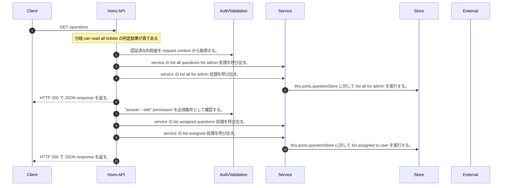

<!-- This file is generated by npm run docs:api-code. Do not edit manually. -->

# GET /questions シーケンス

## シーケンス図

## 処理順とコード対応

| # | Caller | 境界 | 処理 | コード | 実装位置 |
| ---: | --- | --- | --- | --- | --- |
| 1 | `GET /questions handler` | Auth | 認証済み利用者を request context から取得する。 | `c.get("user")` | `apps/api/src/routes/question-routes.ts:62 (GET /questions handler)` |
| 2 | `GET /questions handler` | Service | service の list all questions for admin 処理を呼び出す。 | `service.listAllQuestionsForAdmin()` | `apps/api/src/routes/question-routes.ts:63 (GET /questions handler)` |
| 3 | `MemoRagService.listAllQuestionsForAdmin` | Service | service の list all for admin 処理を呼び出す。 | `this.questionService.listAllForAdmin()` | `apps/api/src/rag/memorag-service.ts:3213 (MemoRagService.listAllQuestionsForAdmin)` |
| 4 | `QuestionService.listAllForAdmin` | Store | `this.ports.questionStore` に対して list all for admin を実行する。 | `this.ports.questionStore.listAllForAdmin()` | `apps/api/src/questions/question-service.ts:54 (QuestionService.listAllForAdmin)` |
| 5 | `GET /questions handler` | HTTP/SSE | HTTP 200 で JSON response を返す。 | `c.json({ questions: await service.listAllQuestionsForAdmin() }, 200)` | `apps/api/src/routes/question-routes.ts:63 (GET /questions handler)` |
| 6 | `GET /questions handler` | Auth | "answer:edit" permission を必須条件として確認する。 | `requirePermission(user, "answer:edit")` | `apps/api/src/routes/question-routes.ts:64 (GET /questions handler)` |
| 7 | `GET /questions handler` | Service | service の list assigned questions 処理を呼び出す。 | `service.listAssignedQuestions(user.userId, supportGroupIds(user))` | `apps/api/src/routes/question-routes.ts:65 (GET /questions handler)` |
| 8 | `MemoRagService.listAssignedQuestions` | Service | service の list assigned 処理を呼び出す。 | `this.questionService.listAssigned(userId, groupIds)` | `apps/api/src/rag/memorag-service.ts:3205 (MemoRagService.listAssignedQuestions)` |
| 9 | `QuestionService.listAssigned` | Store | `this.ports.questionStore` に対して list assigned to user を実行する。 | `this.ports.questionStore.listAssignedToUser(userId, groupIds)` | `apps/api/src/questions/question-service.ts:46 (QuestionService.listAssigned)` |
| 10 | `GET /questions handler` | HTTP/SSE | HTTP 200 で JSON response を返す。 | `c.json({ questions: await service.listAssignedQuestions(user.userId, supportGroupIds(user)) }, 200)` | `apps/api/src/routes/question-routes.ts:65 (GET /questions handler)` |

## 分岐

| ID | Function | 条件 | 実装位置 |
| --- | --- | --- | --- |
| B001 | `GET /questions handler` | can read all tickets の判定結果が真である | `apps/api/src/routes/question-routes.ts:63 (GET /questions handler)` |
| B002 | `requirePermission` | 利用者が 指定された permission を持たない | `apps/api/src/authorization.ts:184 (requirePermission)` |
