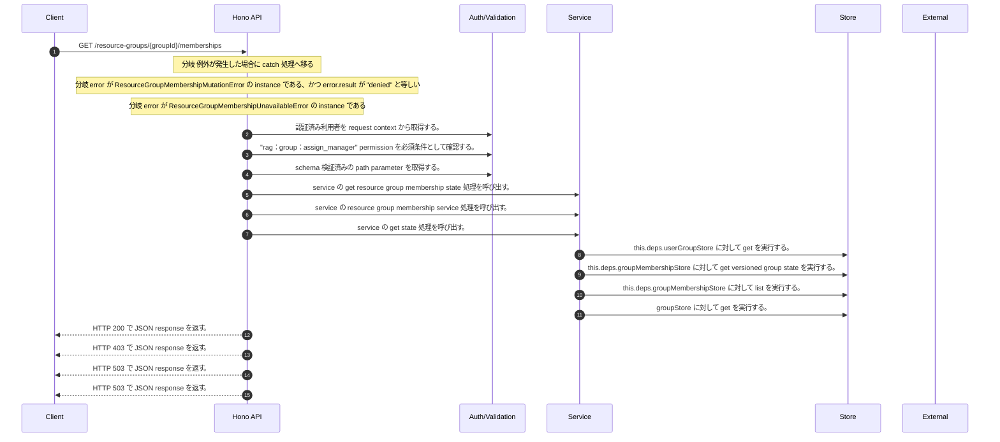

<!-- This file is generated by npm run docs:api-code. Do not edit manually. -->

# GET /resource-groups/{groupId}/memberships シーケンス

## シーケンス図

## 処理順とコード対応

| # | Caller | 境界 | 処理 | コード | 実装位置 |
| ---: | --- | --- | --- | --- | --- |
| 1 | `GET /resource-groups/{groupId}/memberships handler` | Auth | 認証済み利用者を request context から取得する。 | `c.get("user")` | `apps/api/src/routes/resource-group-routes.ts:298 (GET /resource-groups/{groupId}/memberships handler)` |
| 2 | `GET /resource-groups/{groupId}/memberships handler` | Auth | "rag:group:assign_manager" permission を必須条件として確認する。 | `requirePermission(actor, "rag:group:assign_manager")` | `apps/api/src/routes/resource-group-routes.ts:299 (GET /resource-groups/{groupId}/memberships handler)` |
| 3 | `GET /resource-groups/{groupId}/memberships handler` | Validation | schema 検証済みの path parameter を取得する。 | `validParam<{ groupId: string }>(c)` | `apps/api/src/routes/resource-group-routes.ts:300 (GET /resource-groups/{groupId}/memberships handler)` |
| 4 | `GET /resource-groups/{groupId}/memberships handler` | Service | service の get resource group membership state 処理を呼び出す。 | `service.getResourceGroupMembershipState(actor, groupId)` | `apps/api/src/routes/resource-group-routes.ts:302 (GET /resource-groups/{groupId}/memberships handler)` |
| 5 | `MemoRagService.getResourceGroupMembershipState` | Service | service の resource group membership service 処理を呼び出す。 | `this.resourceGroupMembershipService()` | `apps/api/src/rag/memorag-service.ts:446 (MemoRagService.getResourceGroupMembershipState)` |
| 6 | `MemoRagService.getResourceGroupMembershipState` | Service | service の get state 処理を呼び出す。 | `this.resourceGroupMembershipService().getState(actor, groupId)` | `apps/api/src/rag/memorag-service.ts:446 (MemoRagService.getResourceGroupMembershipState)` |
| 7 | `ResourceGroupMembershipService.getState` | Store | `this.deps.userGroupStore` に対して get を実行する。 | `this.deps.userGroupStore.get(actorTenantId, groupId)` | `apps/api/src/security/resource-group-membership-service.ts:104 (ResourceGroupMembershipService.getState)` |
| 8 | `ResourceGroupMembershipService.getState` | Store | `this.deps.groupMembershipStore` に対して get versioned group state を実行する。 | `this.deps.groupMembershipStore.getVersionedGroupState(targetGroup.tenantId, groupId)` | `apps/api/src/security/resource-group-membership-service.ts:108 (ResourceGroupMembershipService.getState)` |
| 9 | `ResourceGroupMembershipService.authorizeTargetManagement` | Store | `this.deps.groupMembershipStore` に対して list を実行する。 | `this.deps.groupMembershipStore.list(targetGroup.tenantId)` | `apps/api/src/security/resource-group-membership-service.ts:436 (ResourceGroupMembershipService.authorizeTargetManagement)` |
| 10 | `resolveActorGroupPermission` | Store | `groupStore` に対して get を実行する。 | `groupStore.get(actorTenantId, groupId)` | `apps/api/src/security/resource-group-membership-service.ts:557 (resolveActorGroupPermission)` |
| 11 | `GET /resource-groups/{groupId}/memberships handler` | HTTP/SSE | HTTP 200 で JSON response を返す。 | `c.json(publicMembershipState(groupId, state), 200)` | `apps/api/src/routes/resource-group-routes.ts:303 (GET /resource-groups/{groupId}/memberships handler)` |
| 12 | `GET /resource-groups/{groupId}/memberships handler` | HTTP/SSE | HTTP 403 で JSON response を返す。 | `c.json({ error: "Forbidden" }, 403)` | `apps/api/src/routes/resource-group-routes.ts:306 (GET /resource-groups/{groupId}/memberships handler)` |
| 13 | `GET /resource-groups/{groupId}/memberships handler` | HTTP/SSE | HTTP 503 で JSON response を返す。 | `c.json({ error: "Resource group membership unavailable" }, 503)` | `apps/api/src/routes/resource-group-routes.ts:309 (GET /resource-groups/{groupId}/memberships handler)` |
| 14 | `GET /resource-groups/{groupId}/memberships handler` | HTTP/SSE | HTTP 503 で JSON response を返す。 | `c.json({ error: "Resource group membership unavailable" }, 503)` | `apps/api/src/routes/resource-group-routes.ts:311 (GET /resource-groups/{groupId}/memberships handler)` |

## 分岐

| ID | Function | 条件 | 実装位置 |
| --- | --- | --- | --- |
| B001 | `GET /resource-groups/{groupId}/memberships handler` | 例外が発生した場合に catch 処理へ移る | `apps/api/src/routes/resource-group-routes.ts:304 (GET /resource-groups/{groupId}/memberships handler)` |
| B002 | `GET /resource-groups/{groupId}/memberships handler` | `error` が `ResourceGroupMembershipMutationError` の instance である、かつ `error.result` が `"denied"` と等しい | `apps/api/src/routes/resource-group-routes.ts:305 (GET /resource-groups/{groupId}/memberships handler)` |
| B003 | `GET /resource-groups/{groupId}/memberships handler` | `error` が `ResourceGroupMembershipUnavailableError` の instance である | `apps/api/src/routes/resource-group-routes.ts:308 (GET /resource-groups/{groupId}/memberships handler)` |
| B004 | `requirePermission` | 利用者が 指定された permission を持たない | `apps/api/src/authorization.ts:185 (requirePermission)` |
