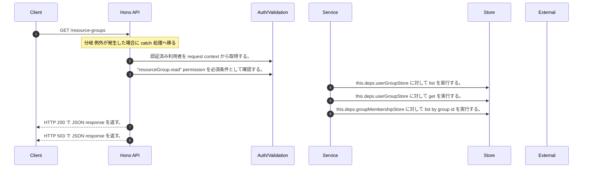

<!-- This file is generated by npm run docs:api-code. Do not edit manually. -->

# GET /resource-groups シーケンス

## シーケンス図

## 処理順とコード対応

| # | Caller | 境界 | 処理 | コード | 実装位置 |
| ---: | --- | --- | --- | --- | --- |
| 1 | `GET /resource-groups handler` | Auth | 認証済み利用者を request context から取得する。 | `c.get("user")` | `apps/api/src/routes/resource-group-routes.ts:63 (GET /resource-groups handler)` |
| 2 | `GET /resource-groups handler` | Auth | "resourceGroup.read" permission を必須条件として確認する。 | `requirePermission(actor, "resourceGroup.read")` | `apps/api/src/routes/resource-group-routes.ts:64 (GET /resource-groups handler)` |
| 3 | `ResourceGroupLifecycleService.list` | Store | `this.deps.userGroupStore` に対して list を実行する。 | `this.deps.userGroupStore.list(tenantId)` | `apps/api/src/security/resource-group-lifecycle-service.ts:119 (ResourceGroupLifecycleService.list)` |
| 4 | `ResourceGroupLifecycleService.resolveNestedMembershipPermission` | Store | `this.deps.userGroupStore` に対して get を実行する。 | `this.deps.userGroupStore.get(tenantId, groupId)` | `apps/api/src/security/resource-group-lifecycle-service.ts:502 (ResourceGroupLifecycleService.resolveNestedMembershipPermission)` |
| 5 | `ResourceGroupLifecycleService.resolveNestedMembershipPermission` | Store | `this.deps.groupMembershipStore` に対して list by group id を実行する。 | `this.deps.groupMembershipStore.listByGroupId(tenantId, groupId)` | `apps/api/src/security/resource-group-lifecycle-service.ts:507 (ResourceGroupLifecycleService.resolveNestedMembershipPermission)` |
| 6 | `GET /resource-groups handler` | HTTP/SSE | HTTP 200 で JSON response を返す。 | `c.json({ resourceGroups, count: resourceGroups.length }, 200)` | `apps/api/src/routes/resource-group-routes.ts:67 (GET /resource-groups handler)` |
| 7 | `GET /resource-groups handler` | HTTP/SSE | HTTP 503 で JSON response を返す。 | `c.json({ error: "Resource group lifecycle unavailable" }, 503)` | `apps/api/src/routes/resource-group-routes.ts:69 (GET /resource-groups handler)` |

## 分岐

| ID | Function | 条件 | 実装位置 |
| --- | --- | --- | --- |
| B001 | `GET /resource-groups handler` | 例外が発生した場合に catch 処理へ移る | `apps/api/src/routes/resource-group-routes.ts:68 (GET /resource-groups handler)` |
| B002 | `requirePermission` | 利用者が 指定された permission を持たない | `apps/api/src/authorization.ts:185 (requirePermission)` |
| B003 | `lifecycleService` | `deps.securityAuditOutbox` が存在しない、または偽である | `apps/api/src/routes/resource-group-routes.ts:364 (lifecycleService)` |
| B004 | `ResourceGroupLifecycleService.list` | 例外が発生した場合に catch 処理へ移る | `apps/api/src/security/resource-group-lifecycle-service.ts:124 (ResourceGroupLifecycleService.list)` |
| B005 | `ResourceGroupLifecycleService.list` | `error` が `ResourceGroupLifecycleError` の instance である、かつ `error.result` が `"denied"` と等しい | `apps/api/src/security/resource-group-lifecycle-service.ts:125 (ResourceGroupLifecycleService.list)` |
